# Linear Search

## Description

Linear search is a simple search algorithm that finds the position of a target value within a list. It sequentially checks each element of the list until a match is found or the whole list has been searched.

## Visual Representation

```mermaid
graph TD
    A[Start: Array and Target] --> B[Set index = 0]
    B --> C[Compare array[index] with target]
    C --> D{Found match?}
    D -->|Yes| E[Return index]
    D -->|No| F{End of array?}
    F -->|No| G[Increment index]
    G --> C
    F -->|Yes| H[Return -1]

    style A fill:#e1f5fe
    style E fill:#c8e6c9
    style H fill:#ffcdd2
```



```mermaid
graph LR
    subgraph "Array: [10, 20, 30, 40, 50]"
        A1[10] --> A2[20] --> A3[30] --> A4[40] --> A5[50]
    end

    subgraph "Search for 30"
        B1[Step 1: Check 10] --> B2[Step 2: Check 20] --> B3[Step 3: Check 30 ✓]
    end

    A1 -.->|Compare| B1
    A2 -.->|Compare| B2
    A3 -.->|Found!| B3

    style A3 fill:#c8e6c9
    style B3 fill:#c8e6c9
```

This implementation provides:

- `SearchInt(arr []int, target int) int` - Search for integers
- `SearchString(arr []string, target string) int` - Search for strings
- `SearchFloat64(arr []float64, target float64) int` - Search for float64 values
- `SearchGeneric[T comparable](arr []T, target T) int` - Generic search for any comparable type

All functions return the index of the target element if found, or -1 if not found.

## Algorithm

1. Start from the first element of the array
2. Compare each element with the target value
3. If a match is found, return the index
4. If the end of the array is reached without finding the target, return -1

## Complexity

- **Time Complexity**:
  - Best case: O(1) - element found at first position
  - Average case: O(n/2) - element found in middle
  - Worst case: O(n) - element not found or at last position
- **Space Complexity**: O(1) - only uses constant extra space

## Usage

### Basic Usage

```bash
make run NAME=0001-linear-search
```

### In Code

```go
package main

import (
    "fmt"
    linear_search "github.com/celj/dsa/0001-linear-search"
)

func main() {
    // Search for integers
    numbers := []int{10, 20, 30, 40, 50}
    index := linear_search.SearchInt(numbers, 30)
    if index != -1 {
        fmt.Printf("Found 30 at index %d\n", index)
    }

    // Search for strings
    fruits := []string{"apple", "banana", "cherry"}
    index = linear_search.SearchString(fruits, "banana")
    if index != -1 {
        fmt.Printf("Found banana at index %d\n", index)
    }

    // Generic search
    colors := []string{"red", "green", "blue"}
    index = linear_search.SearchGeneric(colors, "blue")
    if index != -1 {
        fmt.Printf("Found blue at index %d\n", index)
    }
}
```

## Testing

Run the comprehensive test suite:

```bash
make test NAME=0001-linear-search
```

The test suite includes:

- Unit tests for all data types (int, string, float64)
- Edge cases (empty arrays, single elements)
- Generic function testing
- Benchmarks for different array sizes
- Performance comparison tests

## Benchmarks

The implementation includes benchmarks for:

- Small arrays (5 elements)
- Medium arrays (1,000 elements)
- Large arrays (100,000 elements)
- String searches
- Generic type searches

## When to Use

**Advantages:**

- Simple to implement and understand
- Works on unsorted data
- No additional memory requirements
- Good for small datasets

**Disadvantages:**

- Inefficient for large datasets
- Always requires checking elements sequentially
- Not suitable when fast lookups are critical

**Best Use Cases:**

- Small arrays (< 100 elements)
- Unsorted data
- When simplicity is preferred over performance
- One-time searches on small datasets

**Consider Alternatives When:**

- Searching large sorted arrays (use binary search)
- Frequent searches on the same data (use hash tables)
- Performance is critical (use more efficient algorithms)
