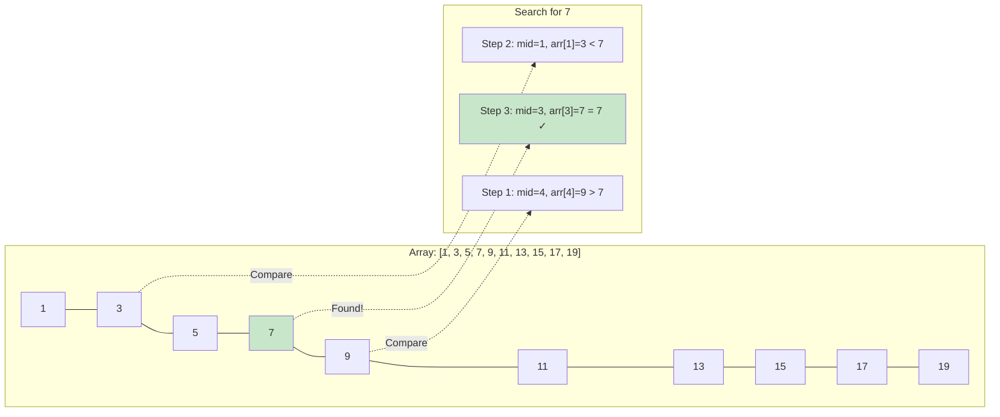
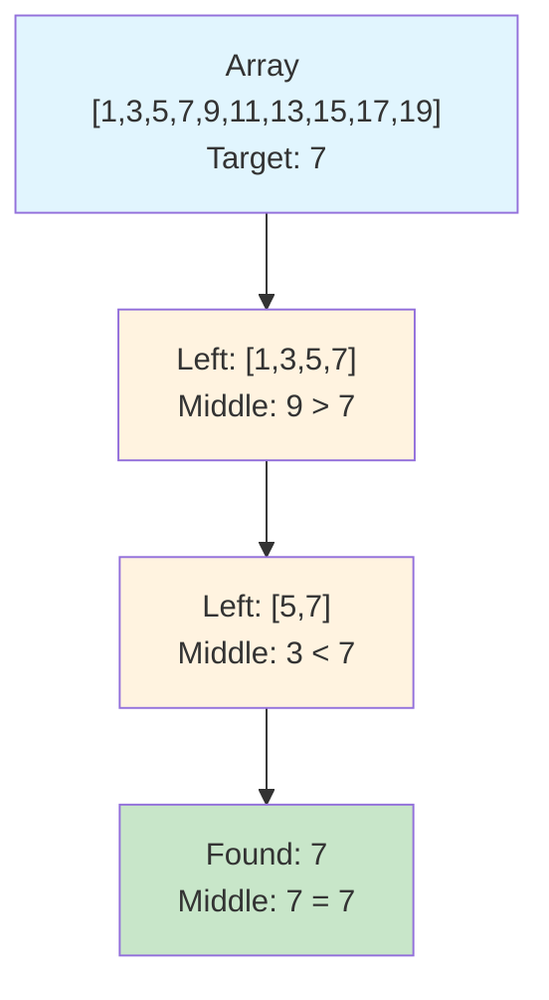
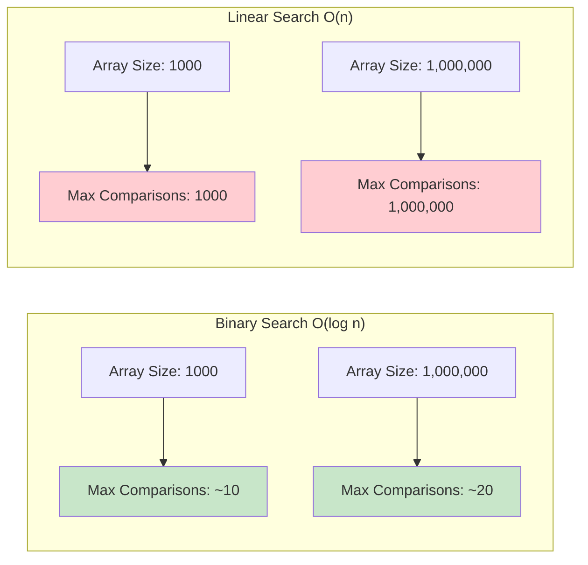

# Binary Search

## Description

Binary search is an efficient search algorithm that finds the position of a target value within a sorted list. It uses a divide-and-conquer approach by repeatedly dividing the search interval in half and comparing the target with the middle element.

This implementation provides:

- `SearchInt(arr []int, target int) int` - Search for integers in sorted arrays
- `SearchString(arr []string, target string) int` - Search for strings in sorted arrays
- `SearchFloat64(arr []float64, target float64) int` - Search for float64 values in sorted arrays
- `SearchGeneric[T comparable](arr []T, target T, less func(T, T) bool) int` - Generic search for any comparable type with custom comparison function

All functions return the index of the target element if found, or -1 if not found.

**Important**: Binary search only works on sorted arrays. The array must be sorted in ascending order before using these functions.

## Visual Representation

### Algorithm Flow

```mermaid
graph TD
    A[Start: Sorted Array and Target] --> B[Set left = 0, right = length-1]
    B --> C[Calculate middle = (left + right) / 2]
    C --> D{array[middle] == target?}
    D -->|Yes| E[Return middle]
    D -->|No| F{array[middle] < target?}
    F -->|Yes| G[Set left = middle + 1]
    F -->|No| H[Set right = middle - 1]
    G --> I{left <= right?}
    H --> I
    I -->|Yes| C
    I -->|No| J[Return -1]

    style A fill:#e1f5fe
    style E fill:#c8e6c9
    style J fill:#ffcdd2
```

### Search Process Example



### Divide and Conquer Visualization



### Binary vs Linear Search Comparison



Binary search is a highly efficient search algorithm that works on sorted arrays by repeatedly dividing the search interval in half.

## Algorithm

1. Initialize two pointers: `left` at the start (0) and `right` at the end (length-1) of the array
2. While `left <= right`:
   - Calculate the middle index: `mid = left + (right - left) / 2`
   - If the element at `mid` equals the target, return `mid`
   - If the element at `mid` is less than the target, search the right half: `left = mid + 1`
   - If the element at `mid` is greater than the target, search the left half: `right = mid - 1`
3. If the loop ends without finding the target, return -1

## Complexity

- **Time Complexity**:
  - Best case: O(1) - element found at middle position on first comparison
  - Average case: O(log n) - element found after log₂(n) comparisons
  - Worst case: O(log n) - element not found or at edge after log₂(n) comparisons
- **Space Complexity**: O(1) - only uses constant extra space (iterative implementation)

## Usage

### Basic Usage

```bash
make run NAME=0002-binary-search
```

### In Code

```go
package main

import (
    "fmt"
    binary_search "github.com/celj/dsa/0002-binary-search"
)

func main() {
    // Search for integers (array must be sorted)
    numbers := []int{10, 20, 30, 40, 50}
    index := binary_search.SearchInt(numbers, 30)
    if index != -1 {
        fmt.Printf("Found 30 at index %d\n", index)
    }

    // Search for strings (array must be sorted)
    fruits := []string{"apple", "banana", "cherry"}
    index = binary_search.SearchString(fruits, "banana")
    if index != -1 {
        fmt.Printf("Found banana at index %d\n", index)
    }

    // Generic search with custom comparison
    colors := []string{"blue", "green", "red"}
    stringLess := func(a, b string) bool { return a < b }
    index = binary_search.SearchGeneric(colors, "green", stringLess)
    if index != -1 {
        fmt.Printf("Found green at index %d\n", index)
    }
}
```

## Testing

Run the comprehensive test suite:

```bash
make test NAME=0002-binary-search
```

The test suite includes:

- Unit tests for all data types (int, string, float64)
- Edge cases (empty arrays, single elements, element not found)
- Generic function testing with custom comparison functions
- Benchmarks for different array sizes (small, medium, large, very large)
- Performance comparison tests
- Tests for elements at beginning, middle, and end of arrays
- Tests for elements not in the array (too small, too large, in between existing elements)

## Benchmarks

The implementation includes benchmarks for:

- Small arrays (5 elements)
- Medium arrays (1,000 elements)
- Large arrays (100,000 elements)
- Very large arrays (1,000,000 elements)
- String searches
- Generic type searches

Binary search shows its efficiency advantage over linear search as array size increases:

- For 1,000 elements: ~10 comparisons vs ~500 (linear search)
- For 100,000 elements: ~17 comparisons vs ~50,000 (linear search)
- For 1,000,000 elements: ~20 comparisons vs ~500,000 (linear search)

## When to Use

**Advantages:**

- Very efficient for large datasets: O(log n) time complexity
- Predictable performance
- No additional memory requirements
- Much faster than linear search for sorted data

**Requirements:**

- **Data must be sorted** - this is mandatory for binary search to work correctly
- Random access to elements (works with arrays/slices, not linked lists)

**Best Use Cases:**

- Large sorted arrays (> 100 elements where efficiency matters)
- Frequent searches on the same sorted dataset
- When you need guaranteed logarithmic search time
- Dictionary/phone book style lookups
- Database index searches

**Consider Alternatives When:**

- Data is not sorted and sorting cost is prohibitive
- Very small arrays (< 10 elements) where linear search might be simpler
- Data changes frequently (insertion/deletion overhead)
- Memory is extremely constrained and sorting overhead is too high

**vs Linear Search:**

- Binary search: O(log n) time, requires sorted data
- Linear search: O(n) time, works with any data order

**vs Hash Tables:**

- Binary search: O(log n) time, O(1) space, maintains order
- Hash tables: O(1) average time, O(n) space, no order preservation
