# Two Crystal Ball Problem

## Description

The Two Crystal Ball Problem is a classic algorithm problem: Given two identical crystal balls and a building with N floors, determine the highest floor from which a crystal ball can be dropped without breaking, using the minimum number of drops in the worst-case scenario.

## Visual Representation

### Problem Setup

```mermaid
graph TD
    subgraph "Building with N Floors"
        F10[Floor 10 - Safe]
        F9[Floor 9 - Safe]
        F8[Floor 8 - Safe]
        F7[Floor 7 - CRITICAL FLOOR]
        F6[Floor 6 - Safe]
        F5[Floor 5 - Safe]
        F4[Floor 4 - Safe]
        F3[Floor 3 - Safe]
        F2[Floor 2 - Safe]
        F1[Floor 1 - Safe]
    end

    subgraph "Crystal Balls"
        B1[Ball 1]
        B2[Ball 2]
    end

    subgraph "Rules"
        R1["Balls break at floor > critical"]
        R2["Balls don't break at floor ≤ critical"]
        R3["Once broken, ball is unusable"]
        R4["Find highest safe floor"]
    end

    style F7 fill:#ffcdd2
    style F6 fill:#c8e6c9
    style B1 fill:#e1f5fe
    style B2 fill:#e1f5fe
```



### Naive vs Optimal Strategy

```mermaid
graph LR
    subgraph "Naive Approach: Linear Search"
        A1["Drop from floor 1"] --> A2["Drop from floor 2"]
        A2 --> A3["Drop from floor 3"]
        A3 --> A4["...continue until break"]
        A4 --> A5["Worst case: N drops"]
    end

    subgraph "Optimal Strategy: √N Algorithm"
        B1["Jump by √N intervals"] --> B2["Find breaking interval"]
        B2 --> B3["Linear search in interval"]
        B3 --> B4["Worst case: 2√N drops"]
    end

    style A5 fill:#ffcdd2
    style B4 fill:#c8e6c9
```



### Square Root Algorithm Visualization

```mermaid
graph TD
    A[Start with intervals of size √N] --> B[Drop Ball 1 at floor √N]
    B --> C{Ball breaks?}
    C -->|No| D[Move to floor 2√N]
    C -->|Yes| E[Ball 1 broke, use Ball 2]
    D --> F[Drop Ball 1 again]
    F --> G{Ball breaks?}
    G -->|No| H[Continue jumping by √N]
    G -->|Yes| I[Use Ball 2 for linear search]
    E --> I
    I --> J[Linear search from last safe floor]
    J --> K[Find critical floor]

    style A fill:#e1f5fe
    style K fill:#c8e6c9
```



### Example: 100-Floor Building

```mermaid
graph LR
    subgraph "Phase 1: Jump by 10 floors"
        A[Floor 10] --> B[Floor 20] --> C[Floor 30] --> D[Floor 40] --> E[Floor 50]
        E --> F[Floor 60] --> G[Floor 70] --> H["Floor 80 💥 BREAK!"]
    end

    subgraph "Phase 2: Linear search 71-79"
        I[Floor 71] --> J[Floor 72] --> K[Floor 73] --> L[Floor 74] --> M[Floor 75]
        M --> N[Floor 76] --> O["Floor 77 💥 BREAK!"]
    end

    subgraph "Result"
        P["Critical floor found: 76"]
        Q["Total drops: 8 + 7 = 15"]
        R["Optimal for worst case: 2√100 = 20"]
    end

    style H fill:#ffcdd2
    style O fill:#ffcdd2
    style P fill:#c8e6c9
```



### Algorithm Steps


### Complexity Analysis

```mermaid
graph TD
    A[Two Crystal Ball Algorithm] --> B[Time Complexity]
    A --> C[Space Complexity]

    B --> B1["Worst case: O(√N)"]
    B --> B2["Best case: O(√N)"]
    B --> B3["Average case: O(√N)"]

    C --> C1["Space: O(1)"]
    C --> C2["Only need constant variables"]

    D[Comparison with other approaches] --> E["Linear: O(N)"]
    D --> F["Binary search: Not applicable"]
    D --> G["Optimal: O(√N)"]

    style B1 fill:#c8e6c9
    style G fill:#c8e6c9
```



### Why √N is Optimal


### Variations and Extensions


### Implementation Strategy


The Two Crystal Ball Problem is a classic algorithm problem: Given two identical crystal balls and a building with N floors, determine the highest floor from which a crystal ball can be dropped without breaking.

**Problem Setup:**

- You have a building with `n` floors
- You have exactly 2 crystal balls
- There exists a critical floor `k` where:
  - Dropping from floor `k` or higher will break the ball
  - Dropping from floor `k-1` or lower will not break the ball
- Goal: Find floor `k` with minimum worst-case number of drops

**Optimal Strategy:**
The naive approach of trying each floor sequentially would take O(n) drops in the worst case. The optimal strategy uses a square root approach:

1. **First Ball**: Drop at intervals of √n (floors √n, 2√n, 3√n, ...)
2. **Second Ball**: When the first ball breaks, linearly search from the last safe floor

This gives a worst-case complexity of O(√n) drops.

**Example with 100 floors:**

- Drop first ball at floors: 10, 20, 30, 40, 50, 60, 70, 80, 90, 100
- If it breaks at floor 50, use second ball to test floors: 41, 42, 43, 44, 45, 46, 47, 48, 49
- Maximum drops: 10 (first ball) + 9 (second ball) = 19 drops

## Algorithm Implementation

The algorithm takes a boolean array where `true` indicates the ball will break at that floor:

```go
func TwoCrystalBalls(breaks []bool) int {
    jumpAmount := √n

    // Phase 1: Find the interval where breaking occurs
    for i := jumpAmount; i < n; i += jumpAmount {
        if breaks[i] {
            break
        }
    }

    // Phase 2: Linear search within the interval
    for j := i - jumpAmount; j <= i; j++ {
        if breaks[j] {
            return j
        }
    }

    return -1 // No breaking floor found
}
```

## Complexity

- **Time Complexity**: O(√n)
  - First phase: O(√n) drops to find the interval
  - Second phase: O(√n) drops to find exact floor within interval
  - Total: O(√n) + O(√n) = O(√n)
- **Space Complexity**: O(1) - only uses a constant amount of extra space

## Comparison with Other Approaches

| Approach          | Worst Case Drops | Best Case Drops  | Average Case     |
| ----------------- | ---------------- | ---------------- | ---------------- |
| Linear Search     | O(n)             | O(1)             | O(n/2)           |
| Binary Search     | Not applicable\* | Not applicable\* | Not applicable\* |
| Two Crystal Balls | O(√n)            | O(√n)            | O(√n)            |

\*Binary search cannot be used because once a ball breaks, you cannot continue using it.

## Usage

```bash
make run NAME=two-crystal-ball-problem
```

**Example Output:**

```
Running: 0003-two-crystal-ball-problem
----------------------------------------
Running 0003-two-crystal-ball-problem...
Result: map[breaking_floor:7 breaks_array:[false false false false false false false true true true] description:First floor where crystal ball breaks]
```

## Testing

```bash
make test NAME=two-crystal-ball-problem
```

**Test Coverage:**

- Edge cases: empty arrays, single elements, no breaks
- Boundary conditions: breaks at first/last floor
- Various array sizes: 10, 100, 1000, 10000 floors
- Performance benchmarks for different input sizes

## Real-World Applications

This problem models scenarios where:

- **Testing has a cost**: Each test/experiment consumes resources
- **Limited resources**: You have a fixed number of attempts
- **Monotonic property**: Once the threshold is reached, all higher values also trigger the condition

Examples:

- **Load testing**: Finding the breaking point of a system
- **Drug dosage**: Finding the minimum effective dose
- **Quality control**: Testing product failure thresholds
- **Network testing**: Finding bandwidth limits
