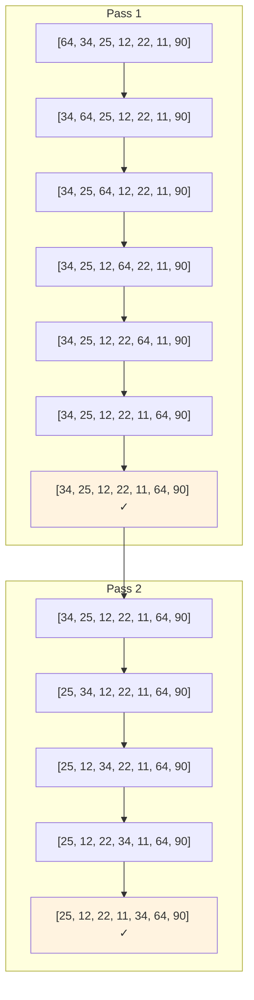
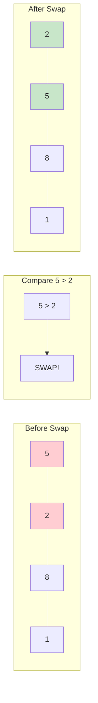
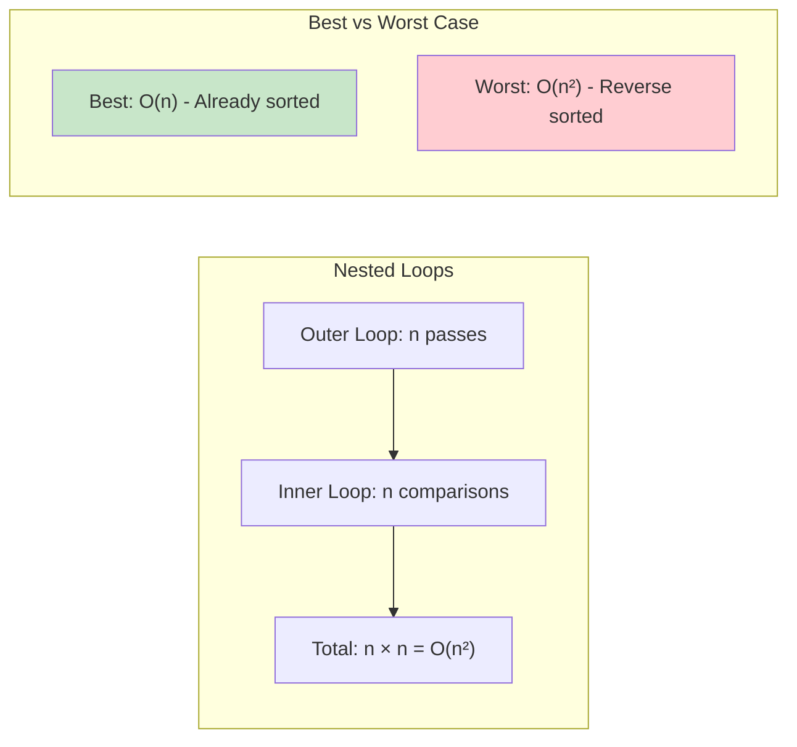

# Bubble Sort

## Description

Bubble Sort is one of the simplest sorting algorithms that works by repeatedly stepping through the list, comparing adjacent elements and swapping them if they are in the wrong order. The pass through the list is repeated until the list is sorted.

**Algorithm Steps:**

1. Compare the first two adjacent elements
2. If they are in the wrong order, swap them
3. Continue comparing and swapping adjacent pairs throughout the array
4. After each complete pass, the largest element "bubbles up" to its correct position
5. Repeat until no more swaps are needed

**Key Characteristics:**

- **Stable**: Equal elements maintain their relative order
- **In-place**: Only requires O(1) extra memory space
- **Adaptive**: Performs better on partially sorted arrays
- **Simple**: Easy to understand and implement
- **Inefficient**: Poor performance on large datasets

**Optimization - Early Termination:**
The algorithm includes an optimization that stops early if no swaps are made during a pass, indicating the array is already sorted. This improves best-case performance from O(n²) to O(n).

## Visual Representation

### Algorithm Flow

```mermaid
graph TD
    A[Start: Array] --> B[Set i = 0]
    B --> C[Set j = 0]
    C --> D{j < length - i - 1?}
    D -->|No| E[Increment i]
    D -->|Yes| F{arr[j] > arr[j+1]?}
    F -->|Yes| G[Swap arr[j] and arr[j+1]]
    F -->|No| H[Increment j]
    G --> H
    H --> D
    E --> I{i < length - 1?}
    I -->|Yes| C
    I -->|No| J[Array Sorted]

    style A fill:#e1f5fe
    style J fill:#c8e6c9
```

### Bubble Sort Process Example



### Bubble Animation



### Time Complexity Visualization



## Algorithm Implementation

```go
func BubbleSort(arr []int) []int {
    n := len(arr)
    result := make([]int, n)
    copy(result, arr)

    for i := 0; i < n-1; i++ {
        swapped := false
        for j := 0; j < n-i-1; j++ {
            if result[j] > result[j+1] {
                result[j], result[j+1] = result[j+1], result[j]
                swapped = true
            }
        }
        if !swapped {
            break // Array is already sorted
        }
    }

    return result
}
```

## Complexity

- **Time Complexity**:
  - **Best Case**: O(n) - when the array is already sorted (with early termination optimization)
  - **Average Case**: O(n²) - random order
  - **Worst Case**: O(n²) - when the array is reverse sorted
- **Space Complexity**: O(1) - only uses a constant amount of extra space for the in-place version

## Available Functions

The implementation provides multiple variants:

1. **`BubbleSort(arr []int) []int`** - Returns a new sorted array without modifying the original
2. **`BubbleSortInPlace(arr []int)`** - Sorts the array in-place, modifying the original
3. **`BubbleSortStrings(arr []string) []string`** - Sorts string arrays
4. **`BubbleSortFloat64(arr []float64) []float64`** - Sorts float64 arrays
5. **`BubbleSortWithSteps(arr []int) ([]int, [][]int)`** - Returns both result and intermediate steps

## Performance Comparison

| Array Size | Sorted | Random | Reverse Sorted |
| ---------- | ------ | ------ | -------------- |
| 10         | O(n)   | O(n²)  | O(n²)          |
| 100        | O(n)   | O(n²)  | O(n²)          |
| 1000       | O(n)   | O(n²)  | O(n²)          |

**When to Use:**

- **Educational purposes**: Great for learning sorting concepts
- **Small datasets**: Acceptable performance for very small arrays (< 10 elements)
- **Nearly sorted data**: Performs well with the early termination optimization
- **Simplicity is key**: When implementation simplicity is more important than efficiency

**When NOT to Use:**

- **Large datasets**: Quadratic time complexity makes it impractical
- **Production systems**: Many better alternatives available (quicksort, mergesort, etc.)
- **Performance-critical applications**: Too slow for most real-world use cases

## Usage

```bash
make run NAME=bubble-sort
```

**Example Output:**

```
Running: 0004-bubble-sort
----------------------------------------
Running 0004-bubble-sort...
Result: map[algorithm:Bubble Sort original_array:[64 34 25 12 22 11 90] original_floats:[3.14 2.71 1.41 0.57] original_strings:[banana apple cherry date] sorted_array:[11 12 22 25 34 64 90] sorted_floats:[0.57 1.41 2.71 3.14] sorted_strings:[apple banana cherry date] space_complexity:O(1) time_complexity:O(n²) average/worst, O(n) best]
```

## Testing

```bash
make test NAME=bubble-sort
```

**Test Coverage:**

- **Edge Cases**: Empty arrays, single elements, two elements
- **Data Variations**: Already sorted, reverse sorted, random order, duplicates
- **Data Types**: Integers, strings, floating-point numbers
- **Negative Numbers**: Mixed positive/negative values
- **In-place vs Copy**: Both variants tested
- **Step Tracking**: Verification of intermediate sorting steps
- **Performance Benchmarks**: Different array sizes and scenarios

## Comparison with Other Sorting Algorithms

| Algorithm      | Best Case  | Average Case | Worst Case | Space    | Stable |
| -------------- | ---------- | ------------ | ---------- | -------- | ------ |
| Bubble Sort    | O(n)       | O(n²)        | O(n²)      | O(1)     | Yes    |
| Selection Sort | O(n²)      | O(n²)        | O(n²)      | O(1)     | No     |
| Insertion Sort | O(n)       | O(n²)        | O(n²)      | O(1)     | Yes    |
| Quick Sort     | O(n log n) | O(n log n)   | O(n²)      | O(log n) | No     |
| Merge Sort     | O(n log n) | O(n log n)   | O(n log n) | O(n)     | Yes    |

## Real-World Applications

While bubble sort is rarely used in production due to its poor performance, it's valuable for:

- **Educational purposes**: Teaching sorting concepts and algorithm analysis
- **Code interviews**: Demonstrating basic algorithmic thinking
- **Embedded systems**: Simple implementation for very small datasets
- **Debugging**: Easy to trace through manually for verification
- **Cocktail party algorithm**: Bidirectional bubble sort variant for specific use cases
