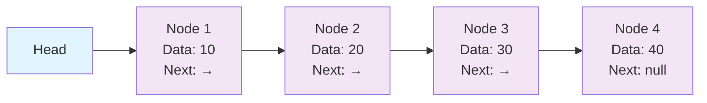
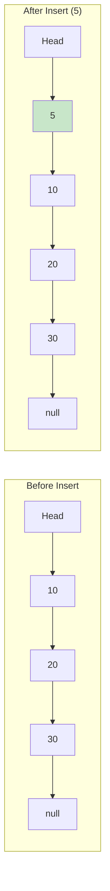
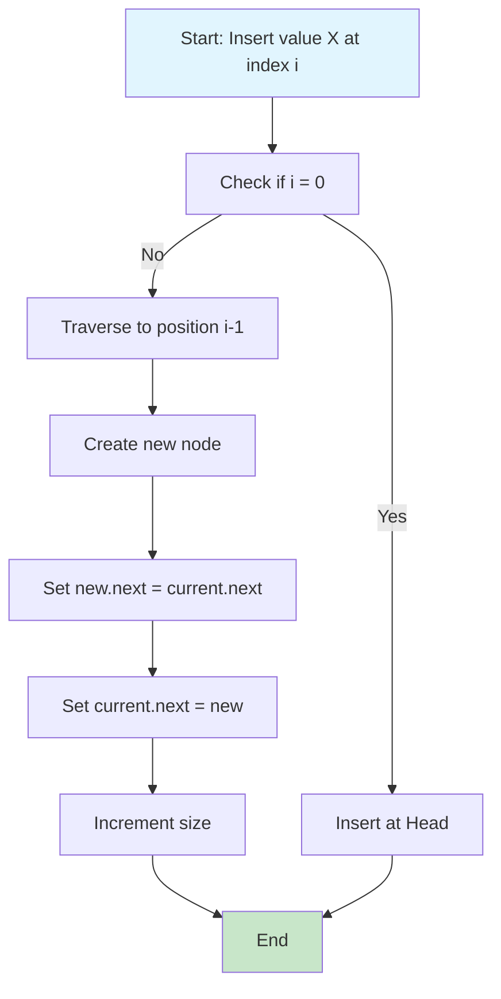
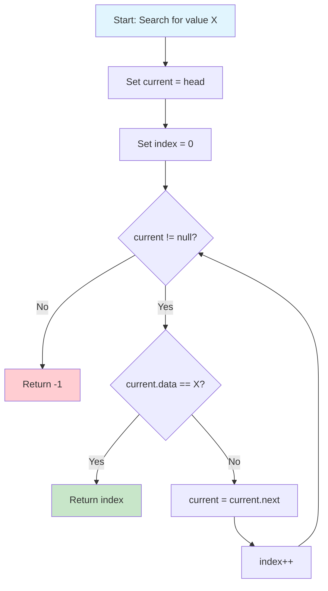

# Single Linked List

## Description

A Single Linked List (also called Singly Linked List) is a linear data structure where elements are stored in nodes, and each node contains data and a reference (or link) to the next node in the sequence. Unlike arrays, linked lists don't store elements in contiguous memory locations.

## Visual Representation

### Basic Structure



### Insert at Head Operation



### Insert at Index Operation



### Search Operation



**Structure:**

```
[Data|Next] -> [Data|Next] -> [Data|Next] -> null
    Node         Node         Node
```

**Key Characteristics:**

- **Dynamic Size**: Can grow or shrink during runtime
- **Sequential Access**: Elements accessed sequentially from head
- **Memory Efficient**: Only allocates memory as needed
- **No Random Access**: Cannot directly access elements by index
- **Flexible Insertion/Deletion**: Easy to insert/delete at any position

**Node Structure:**

```go
type Node struct {
    Data int
    Next *Node
}
```

**LinkedList Structure:**

```go
type LinkedList struct {
    Head *Node
    size int
}
```

## Operations

### Insertion Operations

- **`InsertAtHead(data int)`** - Add element at the beginning
- **`InsertAtTail(data int)`** - Add element at the end
- **`InsertAtIndex(index int, data int)`** - Add element at specific position

### Deletion Operations

- **`DeleteByValue(data int) bool`** - Remove first occurrence of value
- **`DeleteAtIndex(index int) error`** - Remove element at specific position

### Search Operations

- **`Search(data int) int`** - Find index of first occurrence (-1 if not found)
- **`GetAt(index int) (int, error)`** - Get element at specific index
- **`Contains(data int) bool`** - Check if element exists

### Utility Operations

- **`Size() int`** - Get number of elements
- **`IsEmpty() bool`** - Check if list is empty
- **`Clear()`** - Remove all elements
- **`Display() string`** - Get string representation
- **`ToSlice() []int`** - Convert to slice
- **`Reverse()`** - Reverse the list in-place
- **`GetMiddle() (int, error)`** - Find middle element (Floyd's algorithm)

## Complexity

| Operation       | Time Complexity | Space Complexity | Notes                     |
| --------------- | --------------- | ---------------- | ------------------------- |
| Insert at Head  | O(1)            | O(1)             | Always constant time      |
| Insert at Tail  | O(n)            | O(1)             | Must traverse to end      |
| Insert at Index | O(n)            | O(1)             | Depends on position       |
| Delete by Value | O(n)            | O(1)             | May need to search        |
| Delete at Index | O(n)            | O(1)             | Depends on position       |
| Search          | O(n)            | O(1)             | Linear search required    |
| Access by Index | O(n)            | O(1)             | Sequential traversal      |
| Get Size        | O(1)            | O(1)             | Maintained as field       |
| Reverse         | O(n)            | O(1)             | Single pass with pointers |
| Get Middle      | O(n)            | O(1)             | Two-pointer technique     |

## Advantages vs Arrays

| Aspect             | Linked List    | Array           |
| ------------------ | -------------- | --------------- |
| Memory Usage       | Dynamic        | Fixed           |
| Insertion/Deletion | O(1) at head   | O(n) (shifting) |
| Random Access      | O(n)           | O(1)            |
| Memory Overhead    | Extra pointers | None            |
| Cache Performance  | Poor           | Excellent       |

## Usage

```bash
make run NAME=linked-list
```

**Example Output:**

```
Running: 0005-linked-list
----------------------------------------
Running 0005-linked-list...
Result: map[after_delete_20:[10 25 30 40] contains_30:true data_structure:Single Linked List display:[40 -> 30 -> 25 -> 10] middle_element:25 operations:Insert, Delete, Search, Reverse original_list:[20 10 25 30 40] reversed_list:[40 30 25 10] search_25_index:2 size:4]
```

## Testing

```bash
make test NAME=linked-list
```

**Test Coverage:**

- **Basic Operations**: All CRUD operations thoroughly tested
- **Edge Cases**: Empty list, single element, boundary conditions
- **Error Handling**: Invalid indices, operations on empty list
- **Algorithms**: Reverse, middle element finding, search
- **Utility Functions**: Display, conversion, size tracking
- **Performance Benchmarks**: All major operations benchmarked

## Common Use Cases

**When to Use Linked Lists:**

- **Dynamic size requirements**: Don't know size in advance
- **Frequent insertions/deletions**: Especially at the beginning
- **Memory constraints**: Only allocate what you need
- **Implementation of other data structures**: Stacks, queues, graphs

**When NOT to Use:**

- **Need random access**: Frequent access by index
- **Memory is limited**: Extra pointer overhead
- **Cache performance critical**: Poor spatial locality
- **Simple, small datasets**: Arrays are often better

## Real-World Applications

1. **Undo Functionality**: Browser history, text editor undo
2. **Music Playlist**: Next song functionality
3. **Image Viewer**: Next/previous image navigation
4. **Implementation of other data structures**:
   - Stack (push/pop at head)
   - Queue (insert at tail, remove from head)
   - Hash table collision resolution
5. **Memory Management**: Free block lists in allocators
6. **Polynomials**: Representing sparse polynomials
7. **File Systems**: Directory structures, file allocation

## Algorithm Insights

**Reverse Algorithm:**
Uses three pointers (prev, current, next) to reverse links in a single pass:

```
prev = null, current = head
while current != null:
    next = current.next
    current.next = prev
    prev = current
    current = next
head = prev
```

**Middle Element (Floyd's Tortoise and Hare):**
Uses two pointers moving at different speeds:

- Slow pointer moves one step at a time
- Fast pointer moves two steps at a time
- When fast reaches end, slow is at middle

**Why O(n) for Tail Insertion:**
Unlike arrays, we don't maintain a tail pointer, so we must traverse from head to find the last node. This could be optimized to O(1) by maintaining both head and tail pointers.

## Performance Tips

1. **Keep a tail pointer** for O(1) tail insertions
2. **Use size counter** instead of counting nodes each time
3. **Consider doubly linked lists** if you need backwards traversal
4. **Batch operations** when possible to reduce traversals
5. **Use iterative algorithms** over recursive to avoid stack overflow
