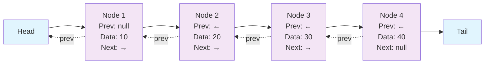
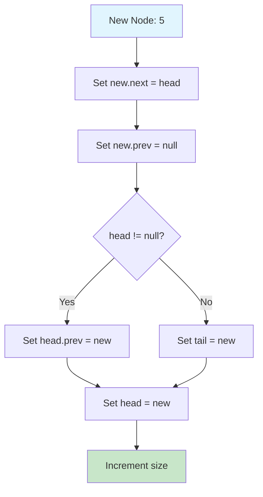
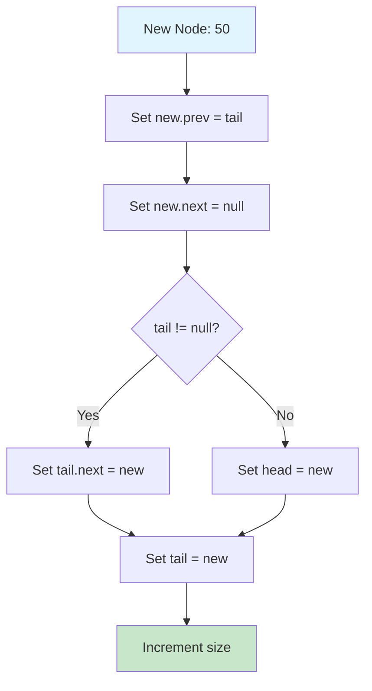
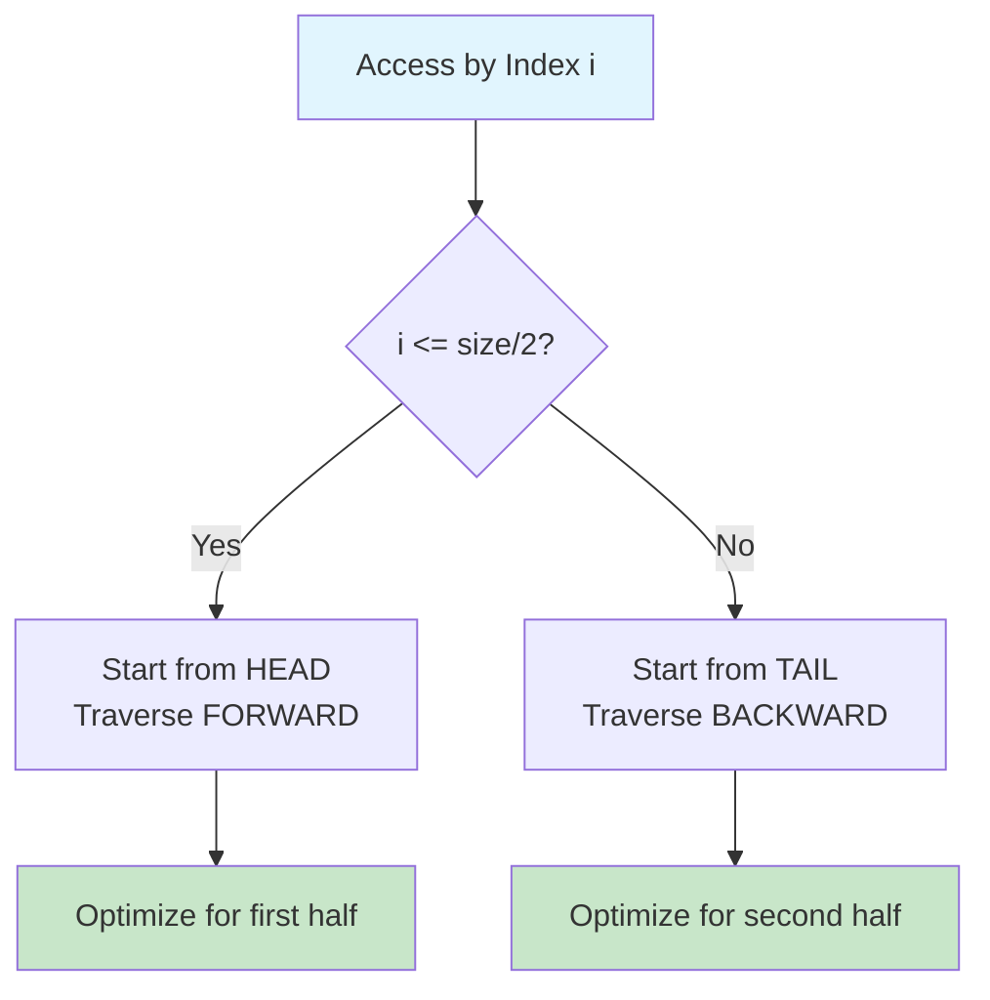
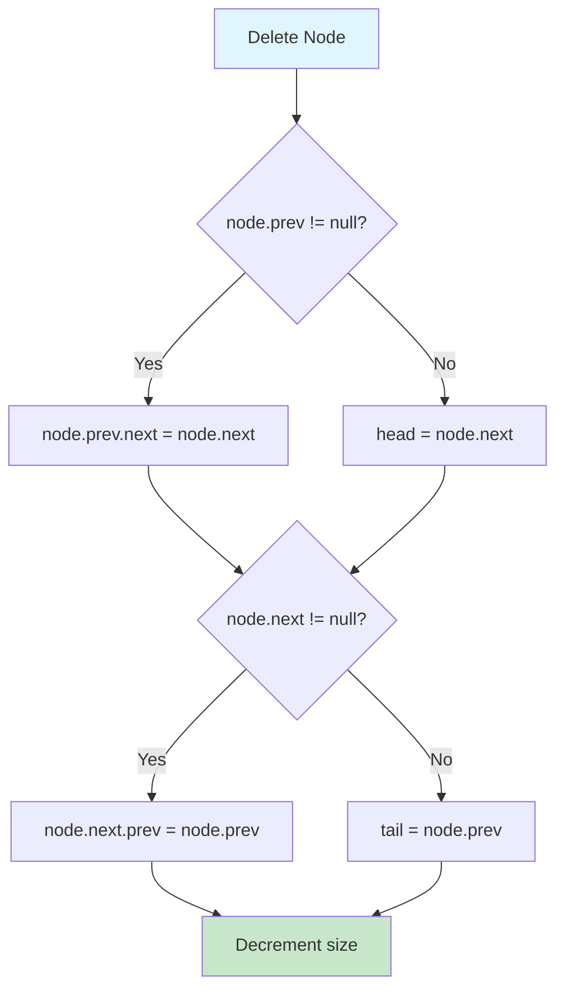
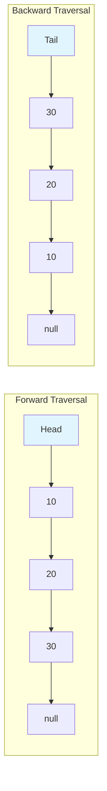

# Doubly Linked List

## Description

A Doubly Linked List is a linear data structure where each node contains data and two pointers: one pointing to the next node and another pointing to the previous node. This bidirectional linkage allows for efficient traversal in both directions and optimized operations compared to singly linked lists.

**Structure:**

```
null <- [Prev|Data|Next] <-> [Prev|Data|Next] <-> [Prev|Data|Next] -> null
           Node                 Node                 Node
           Head                                      Tail
```

**Key Characteristics:**

- **Bidirectional Traversal**: Can traverse forward and backward
- **Tail Pointer**: Maintains both head and tail references for O(1) operations
- **Optimized Access**: Can start from either end for faster access
- **Extra Memory**: Requires additional pointer per node
- **Flexible Operations**: Easy insertion/deletion at both ends

**Node Structure:**

```go
type Node struct {
    Data int
    Next *Node
    Prev *Node
}
```

**DoublyLinkedList Structure:**

```go
type DoublyLinkedList struct {
    Head *Node
    Tail *Node
    size int
}
```

## API Interface Alignment

This implementation closely follows modern linked list interface patterns:

- **`Length() int`** - Get number of elements
- **`InsertAt(data int, index int) error`** - Insert at specific position
- **`Remove(data int) (int, bool)`** - Remove by value, returns removed value
- **`RemoveAt(index int) (int, error)`** - Remove by index, returns removed value
- **`Append(data int)`** - Add to end
- **`Prepend(data int)`** - Add to beginning
- **`Get(index int) (int, error)`** - Access by index

## Operations

### Insertion Operations

- **`Prepend(data int)`** - Add element at the beginning (O(1))
- **`Append(data int)`** - Add element at the end (O(1))
- **`InsertAt(data int, index int)`** - Add element at specific position

### Deletion Operations

- **`Remove(data int) (int, bool)`** - Remove first occurrence, returns value and success
- **`RemoveAt(index int) (int, error)`** - Remove at index, returns removed value
- **`RemoveHead() (int, error)`** - Remove first element, returns value
- **`RemoveTail() (int, error)`** - Remove last element, returns value

### Access Operations

- **`Get(index int) (int, error)`** - Get element at index with optimization
- **`GetHead() (int, error)`** - Get first element
- **`GetTail() (int, error)`** - Get last element
- **`Search(data int) int`** - Find index of element (-1 if not found)
- **`Contains(data int) bool`** - Check if element exists

### Utility Operations

- **`Length() int`** - Get number of elements
- **`IsEmpty() bool`** - Check if list is empty
- **`Clear()`** - Remove all elements
- **`Display() string`** - String representation with bidirectional arrows
- **`ToSlice() []int`** - Forward traversal to slice
- **`ToSliceReverse() []int`** - Backward traversal to slice
- **`Reverse()`** - Reverse the list efficiently
- **`GetMiddle() (int, error)`** - Find middle element

## Complexity

| Operation        | Time Complexity | Space Complexity | Notes                              |
| ---------------- | --------------- | ---------------- | ---------------------------------- |
| Prepend          | O(1)            | O(1)             | Direct head manipulation           |
| Append           | O(1)            | O(1)             | Direct tail manipulation           |
| Insert at Index  | O(n)            | O(1)             | Optimized: starts from nearest end |
| Remove by Value  | O(n)            | O(1)             | Linear search required             |
| Remove at Index  | O(n)            | O(1)             | Optimized: starts from nearest end |
| Remove Head/Tail | O(1)            | O(1)             | Direct pointer manipulation        |
| Access by Index  | O(n)            | O(1)             | Optimized: starts from nearest end |
| Search           | O(n)            | O(1)             | Linear search                      |
| Reverse          | O(n)            | O(1)             | Pointer swapping only              |
| Get Middle       | O(n)            | O(1)             | Floyd's algorithm                  |

## Key Optimizations

### 1. **Bidirectional Access Optimization**

For index-based operations, the algorithm chooses the optimal starting point:

```go
if index <= size/2 {
    // Start from head, traverse forward
} else {
    // Start from tail, traverse backward
}
```

### 2. **O(1) Tail Operations**

Unlike singly linked lists, append operations are O(1):

- Maintain both head and tail pointers
- Direct access to last element

### 3. **Efficient Reversal**

Reversal is done by swapping pointers without moving data:

```go
for current != nil {
    current.Next, current.Prev = current.Prev, current.Next
    current = current.Prev
}
head, tail = tail, head
```

## Advantages vs Singly Linked List

| Aspect              | Doubly Linked | Singly Linked |
| ------------------- | ------------- | ------------- |
| Tail Insertion      | O(1)          | O(n)          |
| Tail Deletion       | O(1)          | O(n)          |
| Backward Traversal  | O(n)          | Not possible  |
| Node Deletion       | O(1)\*        | O(n)          |
| Memory per Node     | 3 fields      | 2 fields      |
| Access Optimization | Bidirectional | Forward only  |

\*Given reference to the node

## Usage

```bash
make run NAME=doubly-linked-list
```

**Example Output:**

```
Running: 0006-doubly-linked-list
----------------------------------------
Running 0006-doubly-linked-list...
Result: map[after_remove:[5 10 15 30] bidirectional:true contains_30:true data_structure:Doubly Linked List display:[30 <-> 15 <-> 10 <-> 5] length:4 middle_element:15 original_list:[5 10 15 20 30] removed_found:true removed_value:20 reverse_traversal:[5 10 15 30] reversed_list:[30 15 10 5] search_15_index:2]
```

## Testing

```bash
make test NAME=doubly-linked-list
```

**Test Coverage:**

- **Basic Operations**: All CRUD operations with return values
- **Bidirectional Integrity**: Ensures forward/backward links are consistent
- **Edge Cases**: Empty list, single element, boundary conditions
- **Optimization Testing**: Access from both ends for performance
- **Error Handling**: Invalid indices, operations on empty list
- **Advanced Features**: Reverse traversal, efficient reversal, middle finding
- **Performance Benchmarks**: Optimized vs non-optimized access patterns

## Common Use Cases

**When to Use Doubly Linked Lists:**

- **Bidirectional navigation**: Need to move forward and backward
- **Frequent tail operations**: Append/delete at end
- **Undo/Redo functionality**: Browser history, text editors
- **LRU Cache implementation**: Need to move nodes to front/back
- **Music/video playlist**: Previous/next functionality
- **Implementation of deques**: Double-ended queues

**When NOT to Use:**

- **Memory constrained environments**: Extra pointer overhead
- **Simple forward-only access**: Singly linked list sufficient
- **Random access patterns**: Arrays are better
- **Small, static datasets**: Arrays more efficient

## Real-World Applications

1. **Browser History**: Back/forward navigation
2. **Media Players**: Previous/next track with current position
3. **Text Editors**: Cursor movement, undo/redo operations
4. **LRU Cache**: Move recently used items to front
5. **Implementation of other data structures**:
   - Deque (double-ended queue)
   - LRU Cache
   - Browser tabs management
6. **Game Development**: Player movement history, turn-based games
7. **Navigation Systems**: Route history with backtracking
8. **Database Systems**: Buffer management, transaction logs

## Performance Comparison

### Access Pattern Optimization

The bidirectional access optimization provides significant performance improvements:

- **Index 0-25% of size**: Start from head (forward traversal)
- **Index 75-100% of size**: Start from tail (backward traversal)
- **Index 25-75% of size**: Choose nearest end

This reduces average access time from O(n) to O(n/2) in practice.

### Memory vs Performance Trade-off

- **Extra memory**: ~33% more per node (3 vs 2 pointers)
- **Performance gain**: O(1) tail operations, O(n/2) average access
- **Use case dependent**: Worth it for bidirectional access patterns

## Implementation Notes

- **Link Integrity**: All operations maintain bidirectional consistency
- **Error Handling**: Returns appropriate errors for invalid operations
- **Return Values**: Delete operations return the removed values
- **Modern API**: Follows contemporary interface patterns
- **Optimization**: Automatically chooses optimal traversal direction

## Visual Representation

### Basic Structure



### Insert at Head Operation



### Insert at Tail Operation



### Bidirectional Access Optimization



### Delete Operation



### Forward vs Backward Traversal



A Doubly Linked List is a linear data structure where each node contains data and two references: one pointing to the next node and another pointing to the previous node.
