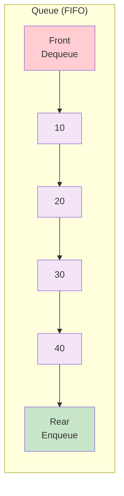
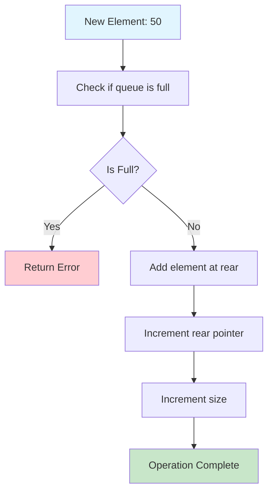
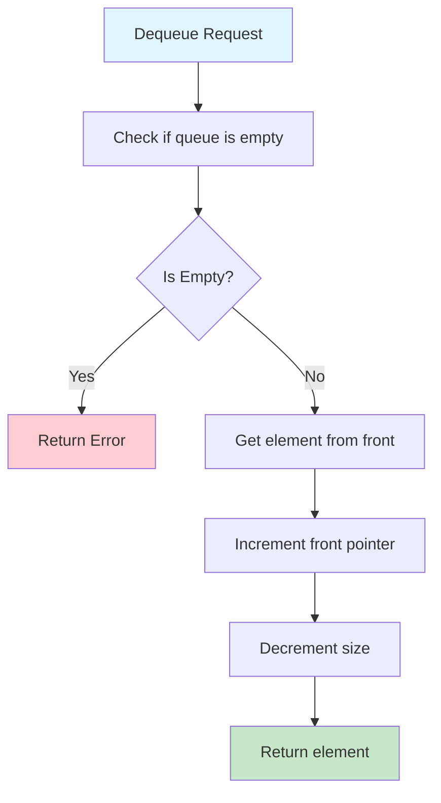
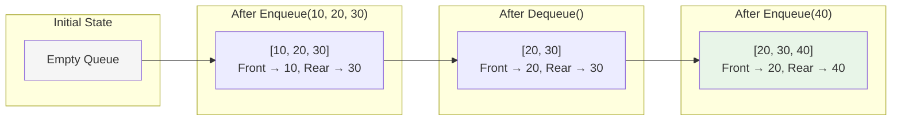
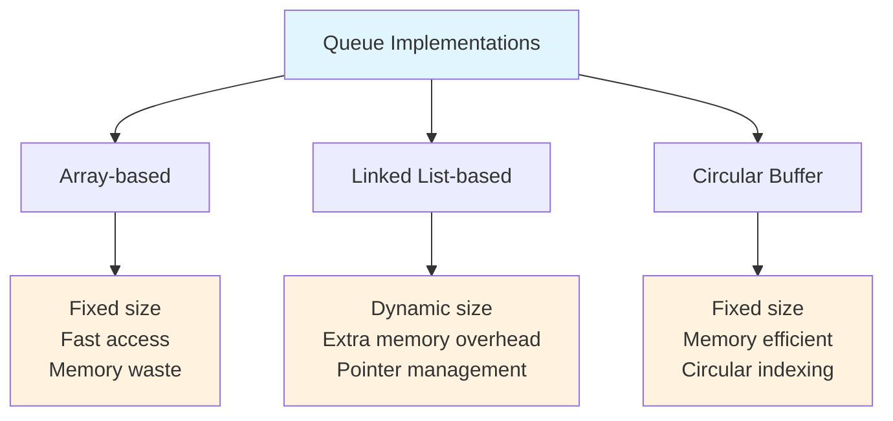

# Queue

## Description

A Queue is a linear data structure that follows the First In, First Out (FIFO) principle. Elements are added (enqueued) at the rear and removed (dequeued) from the front.

## Visual Representation

### Queue Structure



### Enqueue Operation



### Dequeue Operation



### Queue Operations Flow



### Implementation Types



This implementation provides three different queue variants:

1. **LinkedListQueue**: Uses a linked list with separate front and rear pointers
2. **ArrayQueue**: Uses a circular buffer with fixed capacity
3. **DynamicQueue**: Uses Go's slice with dynamic resizing

## Key Operations

- **Enqueue**: Add element to the rear of the queue
- **Dequeue**: Remove and return element from the front of the queue
- **Front**: Get the front element without removing it
- **Rear**: Get the rear element without removing it
- **Size**: Get the number of elements in the queue
- **IsEmpty**: Check if the queue is empty
- **Clear**: Remove all elements from the queue

## Complexity

### LinkedListQueue

- **Enqueue**: O(1) - Constant time insertion at rear
- **Dequeue**: O(1) - Constant time removal from front
- **Front/Rear**: O(1) - Direct access to front/rear pointers
- **Space**: O(n) - Linear space for n elements

### ArrayQueue (Circular Buffer)

- **Enqueue**: O(1) - Constant time insertion (when not full)
- **Dequeue**: O(1) - Constant time removal
- **Front/Rear**: O(1) - Direct array access
- **Space**: O(capacity) - Fixed space based on capacity

### DynamicQueue

- **Enqueue**: O(1) amortized - May require slice expansion
- **Dequeue**: O(n) - Requires shifting all elements
- **Front/Rear**: O(1) - Direct slice access
- **Space**: O(n) - Dynamic space allocation

## Implementation Details

### LinkedListQueue

Uses a doubly-pointed linked list where:

- `front` points to the first node (for dequeue operations)
- `rear` points to the last node (for enqueue operations)
- Maintains a `size` counter for O(1) size queries

### ArrayQueue

Uses a circular buffer approach where:

- `front` and `rear` indices wrap around using modulo arithmetic
- Avoids shifting elements by reusing array positions
- Has a fixed capacity to prevent unbounded growth

### DynamicQueue

Uses Go's built-in slice operations:

- Appends to the end for enqueue (O(1) amortized)
- Uses slice re-slicing for dequeue (O(n) due to shifting)
- Automatically handles memory allocation

## Performance Comparison

| Operation | LinkedList | Array (Circular) | Dynamic  |
| --------- | ---------- | ---------------- | -------- |
| Enqueue   | O(1)       | O(1)             | O(1)\*   |
| Dequeue   | O(1)       | O(1)             | O(n)     |
| Front     | O(1)       | O(1)             | O(1)     |
| Rear      | O(1)       | O(1)             | O(1)     |
| Memory    | Variable   | Fixed            | Variable |

\*Amortized complexity

## Real-World Applications

### Task Scheduling

```go
taskQueue := NewLinkedListQueue()
taskQueue.Enqueue(task1)
taskQueue.Enqueue(task2)
nextTask, _ := taskQueue.Dequeue()
```

### Breadth-First Search (BFS)

```go
bfsQueue := NewLinkedListQueue()
bfsQueue.Enqueue(startNode)
for !bfsQueue.IsEmpty() {
    node, _ := bfsQueue.Dequeue()
    // Process node and add neighbors
}
```

### Print Queue Management

```go
printQueue := NewArrayQueue(100)
printQueue.Enqueue(document1)
printQueue.Enqueue(document2)
nextDoc, _ := printQueue.Dequeue()
```

### Buffer Management

```go
buffer := NewDynamicQueue()
for data := range inputStream {
    buffer.Enqueue(data)
    if buffer.Size() > threshold {
        processedData, _ := buffer.Dequeue()
        // Process data
    }
}
```

## When to Use Each Implementation

### LinkedListQueue

- **Best for**: General-purpose queuing, unlimited size requirements
- **Pros**: No capacity limit, O(1) all operations, memory efficient
- **Cons**: Extra memory overhead for pointers

### ArrayQueue

- **Best for**: High-performance scenarios with known capacity limits
- **Pros**: Cache-friendly, minimal memory overhead, fastest operations
- **Cons**: Fixed capacity, potential for queue full errors

### DynamicQueue

- **Best for**: Simple implementations, variable workloads
- **Pros**: Automatic resizing, simple to understand
- **Cons**: O(n) dequeue operation, potential memory overhead

## Usage

```bash
make run NAME=0007-queue
```

## Testing

```bash
make test NAME=0007-queue
```

## Advanced Features

- **Display**: Visual representation of queue contents
- **ToSlice**: Convert queue to slice for inspection
- **Circular Buffer**: Efficient array utilization in ArrayQueue
- **Error Handling**: Proper error reporting for edge cases
- **Benchmarking**: Performance comparison between implementations
