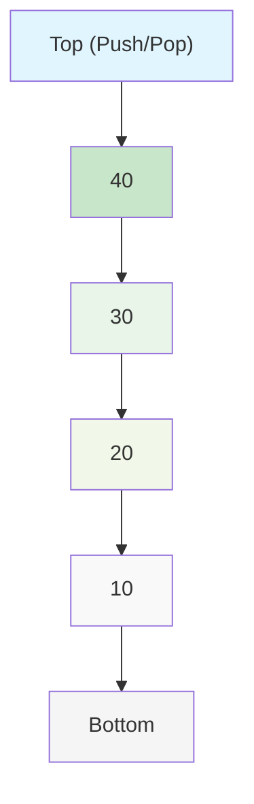
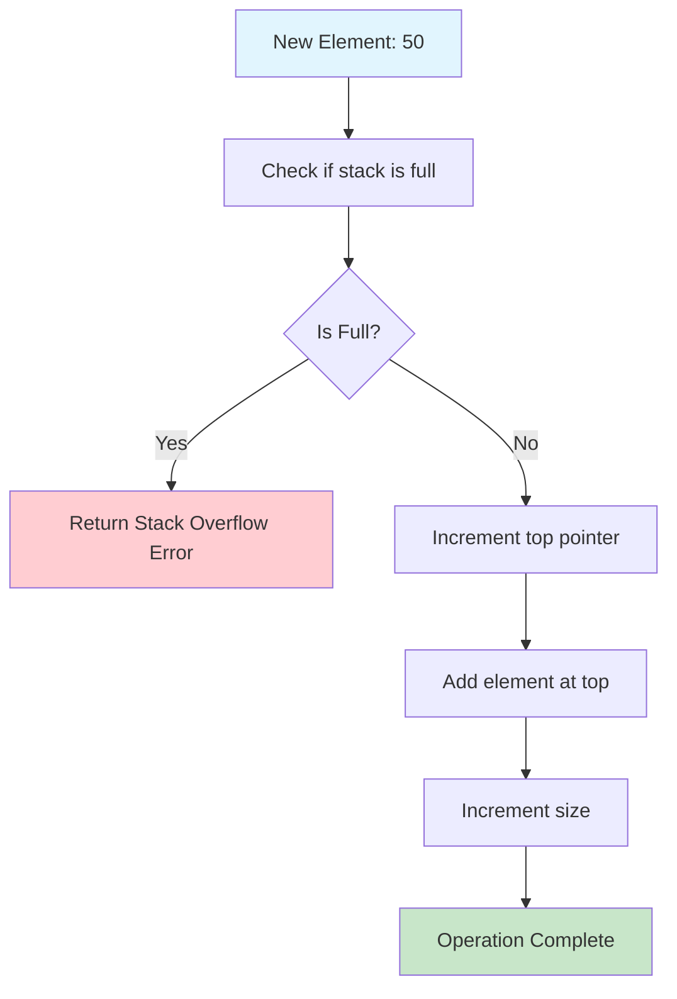
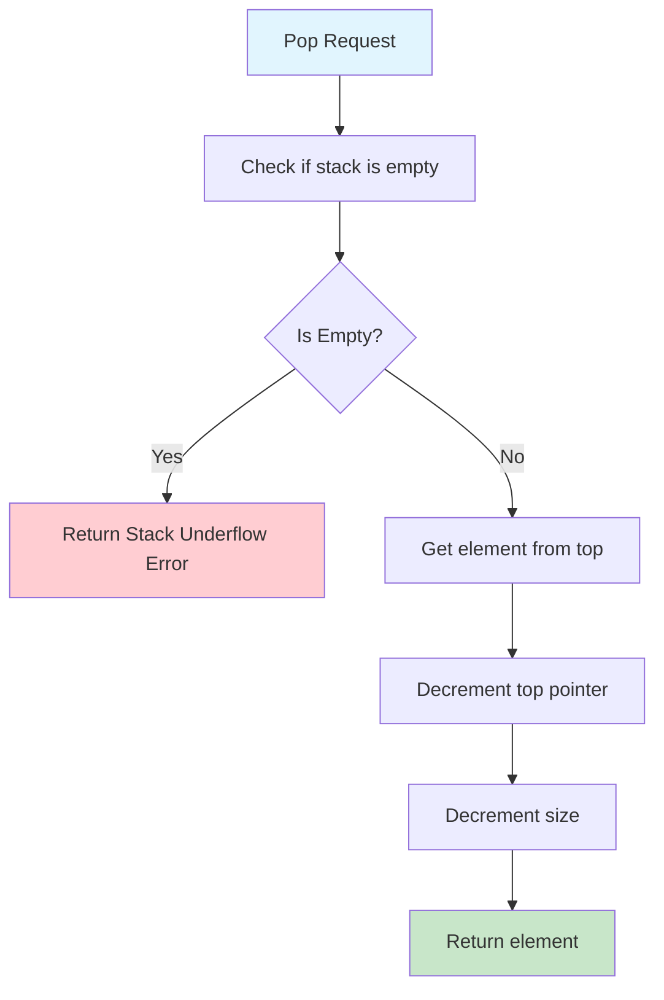
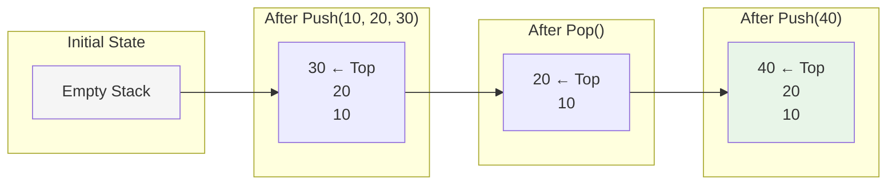
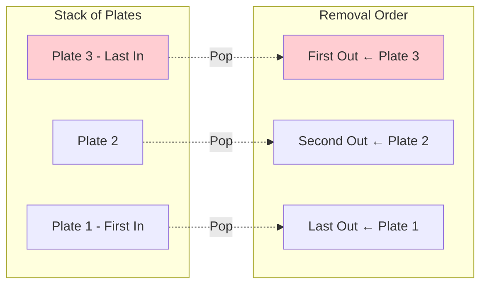
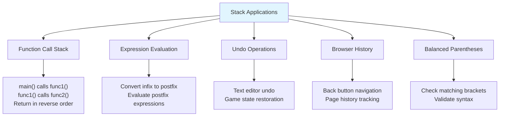

# Stack

## Description

A Stack is a linear data structure that follows the Last In, First Out (LIFO) principle. Elements are added (pushed) and removed (popped) from the same end, called the top of the stack.

## Visual Representation

### Stack Structure



### Push Operation



### Pop Operation



### Stack Operations Flow



### LIFO Principle Visualization



### Applications Visualization



A Stack is a linear data structure that follows the Last In, First Out (LIFO) principle.

This implementation provides three different stack variants:

1. **LinkedListStack**: Uses a linked list with a top pointer
2. **ArrayStack**: Uses a fixed-size array with capacity management
3. **DynamicStack**: Uses Go's slice with automatic resizing

## Key Operations

- **Push**: Add element to the top of the stack
- **Pop**: Remove and return element from the top of the stack
- **Peek**: Get the top element without removing it
- **Size**: Get the number of elements in the stack
- **IsEmpty**: Check if the stack is empty
- **Clear**: Remove all elements from the stack

## Complexity

### LinkedListStack

- **Push**: O(1) - Constant time insertion at top
- **Pop**: O(1) - Constant time removal from top
- **Peek**: O(1) - Direct access to top pointer
- **Space**: O(n) - Linear space for n elements

### ArrayStack (Fixed Size)

- **Push**: O(1) - Constant time insertion (when not full)
- **Pop**: O(1) - Constant time removal
- **Peek**: O(1) - Direct array access
- **Space**: O(capacity) - Fixed space based on capacity

### DynamicStack

- **Push**: O(1) amortized - May require slice expansion
- **Pop**: O(1) - Direct slice modification
- **Peek**: O(1) - Direct slice access
- **Space**: O(n) - Dynamic space allocation

## Implementation Details

### LinkedListStack

Uses a singly-linked list where:

- `top` points to the most recently added node
- New nodes are inserted at the beginning (top)
- Maintains a `size` counter for O(1) size queries

### ArrayStack

Uses a fixed-size array where:

- `top` index tracks the position of the top element (-1 when empty)
- Has a fixed capacity to prevent unbounded growth
- Provides `IsFull()` method to check capacity limits

### DynamicStack

Uses Go's built-in slice operations:

- Appends to the end for push operations
- Uses slice re-slicing for pop operations
- Automatically handles memory allocation and expansion

## Performance Comparison

| Operation | LinkedList | Array (Fixed) | Dynamic  |
| --------- | ---------- | ------------- | -------- |
| Push      | O(1)       | O(1)          | O(1)\*   |
| Pop       | O(1)       | O(1)          | O(1)     |
| Peek      | O(1)       | O(1)          | O(1)     |
| Memory    | Variable   | Fixed         | Variable |

\*Amortized complexity

## Real-World Applications

### Function Call Stack

```go
callStack := NewLinkedListStack()
callStack.Push(functionA)
callStack.Push(functionB)
returnTo, _ := callStack.Pop()
```

### Expression Evaluation

```go
result, err := EvaluatePostfix([]string{"3", "4", "+", "2", "*"})
// result = 14, evaluates (3 + 4) * 2
```

### Balanced Parentheses Checking

```go
isBalanced := IsBalancedParentheses("({[]})")
// isBalanced = true
```

### Undo/Redo Operations

```go
undoStack := NewDynamicStack()
undoStack.Push(lastAction)
if !undoStack.IsEmpty() {
    action, _ := undoStack.Pop()
    // Undo the action
}
```

### Browser History

```go
history := NewArrayStack(50)
history.Push(currentPage)
previousPage, _ := history.Pop()
```

## Advanced Features

### Postfix Expression Evaluation

The implementation includes a complete postfix (Reverse Polish Notation) evaluator:

- Supports +, -, \*, / operations
- Handles division by zero errors
- Validates expression correctness

### Balanced Parentheses Checker

Validates if parentheses, brackets, and braces are properly balanced:

- Supports (), [], {} bracket types
- Handles nested structures
- Ignores non-bracket characters

## Usage Examples

### Basic Stack Operations

```go
stack := NewLinkedListStack()
stack.Push(10)
stack.Push(20)
stack.Push(30)

top, _ := stack.Peek()    // top = 30
popped, _ := stack.Pop()  // popped = 30
fmt.Println(stack.Display()) // Stack: [20 | 10] (top | bottom)
```

### Postfix Evaluation

```go
expression := []string{"15", "7", "1", "1", "+", "-", "/", "3", "*"}
result, err := EvaluatePostfix(expression)
// Evaluates: 15 / (7 - (1 + 1)) * 3 = 9
```

### Parentheses Validation

```go
expressions := []string{
    "({[]})",    // true - balanced
    "({[})",     // false - wrong order
    "(((",       // false - unbalanced
}

for _, expr := range expressions {
    balanced := IsBalancedParentheses(expr)
    fmt.Printf("%s: %v\n", expr, balanced)
}
```

## When to Use Each Implementation

### LinkedListStack

- **Best for**: General-purpose stacking, unlimited size requirements
- **Pros**: No capacity limit, O(1) all operations, memory efficient
- **Cons**: Extra memory overhead for pointers

### ArrayStack

- **Best for**: High-performance scenarios with known capacity limits
- **Pros**: Cache-friendly, minimal memory overhead, fastest operations
- **Cons**: Fixed capacity, potential for stack overflow errors

### DynamicStack

- **Best for**: Variable workloads, simple implementations
- **Pros**: Automatic resizing, simple to understand
- **Cons**: Potential memory overhead from slice expansion

## Usage

```bash
make run NAME=0008-stack
```

## Testing

```bash
make test NAME=0008-stack
```

## Practical Applications

- **Compiler Design**: Function call management, operator precedence
- **Algorithm Implementation**: Depth-First Search, backtracking
- **System Programming**: Memory management, interrupt handling
- **Text Processing**: Parsing, syntax checking, markup validation
- **Mathematical Computing**: Expression evaluation, calculator implementations
