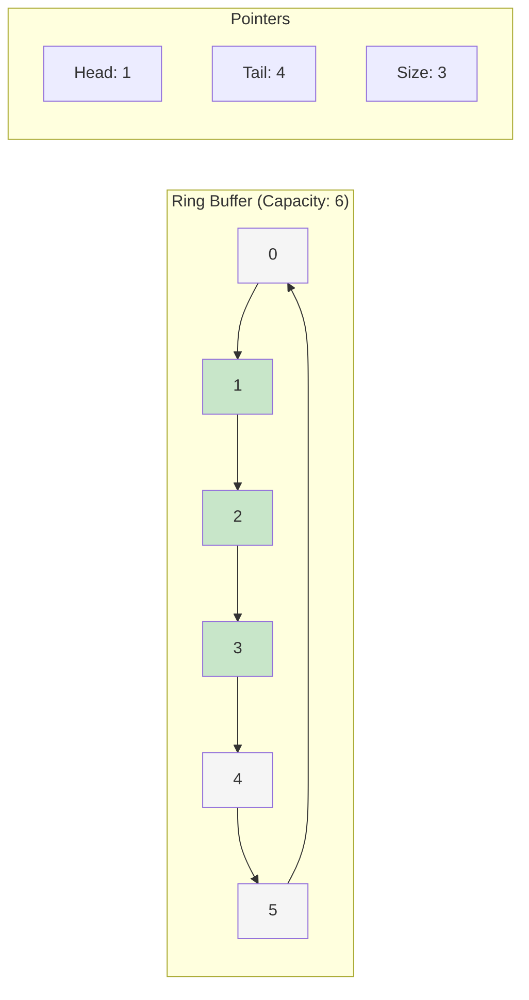
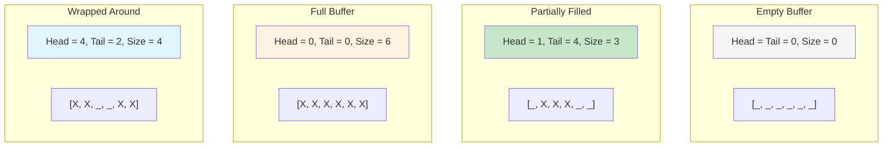
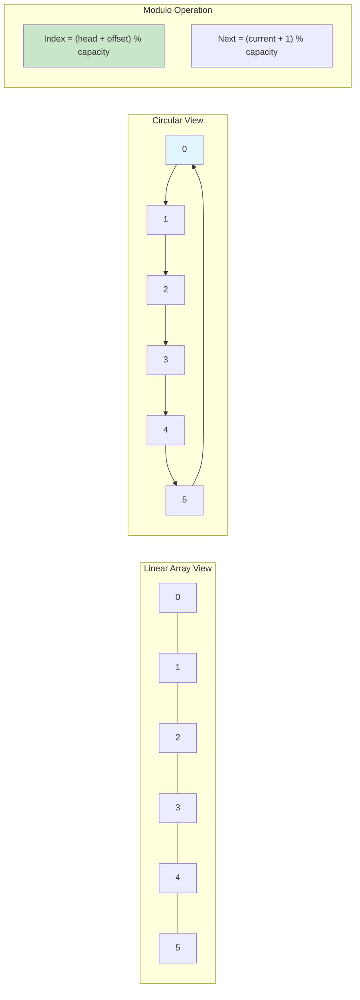
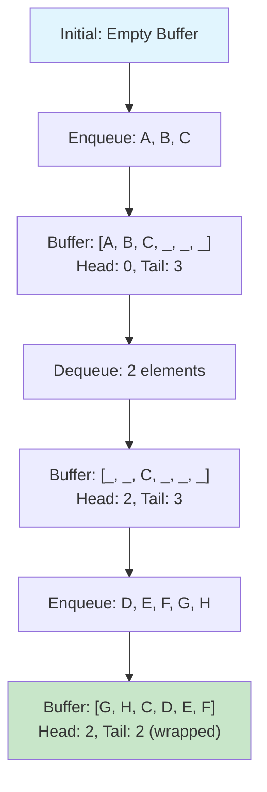
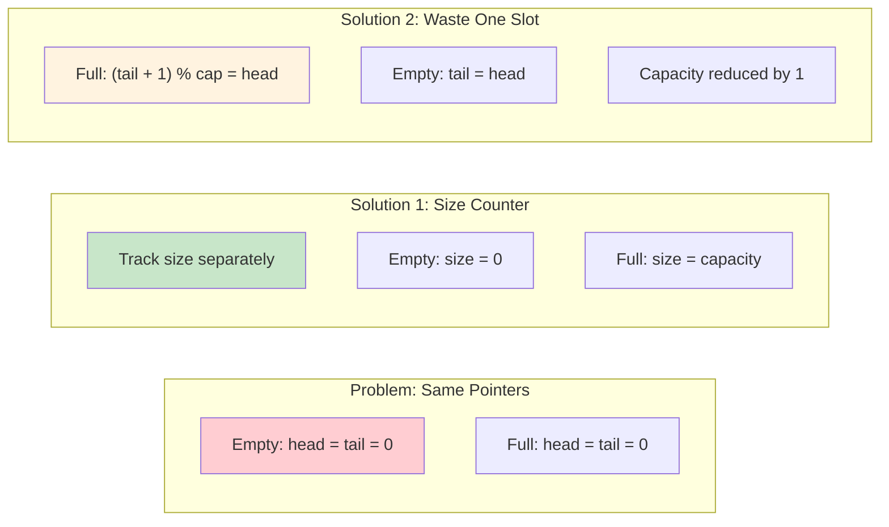
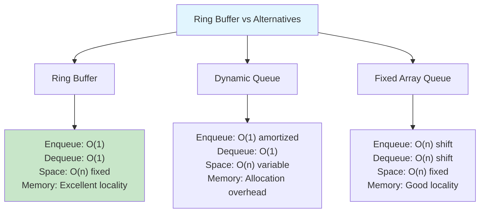
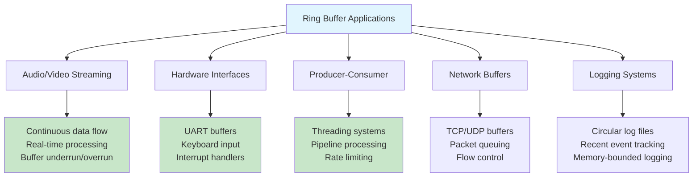
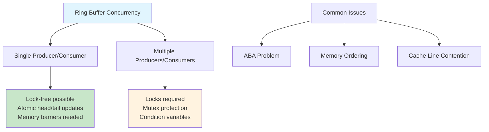

# Ring Buffers (Circular Buffers)

## Description

A ring buffer, also known as a circular buffer, is a fixed-size data structure that efficiently implements a FIFO (First-In-First-Out) queue. The key characteristic is its circular nature - when the buffer reaches its capacity, new elements wrap around to the beginning, overwriting the oldest data if the buffer is full.

This implementation provides:

- **Generic support** for any data type using Go generics
- **Fixed capacity** with automatic wrap-around behavior
- **O(1) operations** for all basic operations
- **Memory efficient** by reusing the same buffer space
- **Thread-unsafe** design for maximum performance (external synchronization required if used concurrently)

## Key Features

- `Enqueue(item)` - Add item to the tail (returns error if full)
- `Dequeue()` - Remove and return item from head (returns error if empty)
- `Peek()` - View head item without removing it
- `IsEmpty()` / `IsFull()` - Check buffer state
- `Size()` / `Capacity()` - Get current size and maximum capacity
- `Clear()` - Reset buffer to empty state
- `ToSlice()` - Convert buffer contents to a slice in FIFO order

## Complexity

- **Time Complexity**: O(1) for all operations (enqueue, dequeue, peek, isEmpty, isFull)
- **Space Complexity**: O(n) where n is the fixed capacity
- **Access Pattern**: Sequential access with circular wrapping

## Algorithm Details

The ring buffer uses two pointers:

- **Head**: Points to the next item to dequeue
- **Tail**: Points to the position for the next enqueue
- **Size counter**: Tracks current number of elements

Circular behavior is achieved using modulo arithmetic: `(index + 1) % capacity`

## Usage

```bash
make run NAME=0009-ring-buffers
make test NAME=0009-ring-buffers
```

### Code Example

```go
// Create ring buffer with capacity 3
rb := NewRingBuffer[int](3)

// Fill the buffer
rb.Enqueue(1) // [1, _, _] head=0, tail=1
rb.Enqueue(2) // [1, 2, _] head=0, tail=2
rb.Enqueue(3) // [1, 2, 3] head=0, tail=0 (wrapped)

// Buffer is now full
rb.IsFull() // true

// Dequeue and add new item (demonstrates circular wrapping)
first, _ := rb.Dequeue() // first=1, [_, 2, 3] head=1, tail=0
rb.Enqueue(4)            // [4, 2, 3] head=1, tail=1

// Current contents in FIFO order: [2, 3, 4]
contents := rb.ToSlice() // [2, 3, 4]
```

## Applications

### 1. **Producer-Consumer Scenarios**

```go
rb := NewRingBuffer[Task](1000)
// Producer adds tasks, consumer processes them
```

### 2. **Streaming Data Buffers**

```go
rb := NewRingBuffer[AudioSample](4096)
// Audio processing with fixed-size circular buffer
```

### 3. **Network Packet Buffers**

```go
rb := NewRingBuffer[Packet](512)
// Network driver buffering incoming packets
```

### 4. **Real-time Systems**

```go
rb := NewRingBuffer[SensorReading](100)
// Keep latest 100 sensor readings, automatically drop oldest
```

### 5. **Rate Limiting / Sliding Window**

```go
rb := NewRingBuffer[time.Time](60)
// Track timestamps for rate limiting (60 requests per minute)
```

## Advantages

- **Constant time operations** - All operations are O(1)
- **Memory efficient** - Fixed memory allocation, no dynamic resizing
- **Cache friendly** - Sequential access pattern with good locality
- **Predictable performance** - No garbage collection pressure from frequent allocations
- **Simple implementation** - Straightforward logic with minimal overhead

## Trade-offs

- **Fixed capacity** - Cannot grow beyond initial size
- **Error handling required** - Operations can fail when full/empty
- **Thread safety** - Requires external synchronization for concurrent access
- **Memory usage** - Always allocates full capacity regardless of current size

## Comparison with Other Structures

| Operation | Ring Buffer | Slice Queue | Linked Queue |
| --------- | ----------- | ----------- | ------------ |
| Enqueue   | O(1)        | O(1)\*      | O(1)         |
| Dequeue   | O(1)        | O(n)        | O(1)         |
| Memory    | Fixed       | Growing     | Dynamic      |
| Cache     | Excellent   | Good        | Poor         |

\*Slice queue enqueue is O(n) when resizing occurs

## Testing

```bash
make test NAME=0009-ring-buffers
```

The test suite covers:

- Basic enqueue/dequeue operations
- Circular wrapping behavior
- Overflow/underflow error conditions
- Edge cases (empty, full, single element)
- Generic type support
- Performance benchmarks

## Visual Representation

### Ring Buffer Structure



### Ring Buffer States



### Enqueue Operation

```mermaid
graph TD
    A[Enqueue Element] --> B{Is buffer full?}
    B -->|Yes| C[Return error/overwrite]
    B -->|No| D[Insert at tail position]
    D --> E[Increment tail pointer]
    E --> F[tail = (tail + 1) % capacity]
    F --> G[Increment size]
    G --> H[Operation complete]

    style A fill:#e1f5fe
    style H fill:#c8e6c9
    style C fill:#ffcdd2
```

### Dequeue Operation

```mermaid
graph TD
    A[Dequeue Element] --> B{Is buffer empty?}
    B -->|Yes| C[Return error]
    B -->|No| D[Get element at head]
    D --> E[Increment head pointer]
    E --> F[head = (head + 1) % capacity]
    F --> G[Decrement size]
    G --> H[Return element]

    style A fill:#e1f5fe
    style H fill:#c8e6c9
    style C fill:#ffcdd2
```

### Circular Indexing Visualization



### Buffer Operations Example



### Full vs Empty Distinction



### Performance Comparison



### Real-World Applications



### Thread Safety Considerations


