# ArrayList (Dynamic Array / Resizable Array)

## Description

An ArrayList is a resizable array implementation that automatically grows and shrinks as elements are added or removed. While Go slices provide similar functionality, this implementation demonstrates the underlying mechanics of how dynamic arrays work in languages that don't have built-in resizable arrays.

This implementation provides:

- **Generic support** for any comparable type using Go generics
- **Dynamic resizing** with automatic growth and shrinking
- **Random access** by index with O(1) access time
- **Amortized O(1) append** operations
- **Comprehensive API** with all standard list operations
- **Memory efficiency** with automatic capacity management

## Key Features

### Core Operations

- `Add(item)` - Append item to end of list
- `Insert(index, item)` - Insert item at specific index
- `Remove(index)` - Remove and return item at index
- `RemoveItem(item)` - Remove first occurrence of item
- `Get(index)` - Get item at index
- `Set(index, item)` - Set item at index

### Utility Operations

- `Size()` / `Capacity()` - Get current size and capacity
- `IsEmpty()` - Check if list is empty
- `Clear()` - Remove all elements
- `IndexOf(item)` - Find index of item (-1 if not found)
- `Contains(item)` - Check if item exists in list
- `First()` / `Last()` - Get first/last element
- `Prepend(item)` - Add item to beginning
- `Pop()` - Remove and return last element
- `ToSlice()` - Convert to Go slice

## Complexity

### Time Complexity

- **Access (Get/Set)**: O(1)
- **Append (Add)**: O(1) amortized, O(n) worst case (during resize)
- **Prepend**: O(n) - requires shifting all elements
- **Insert**: O(n) - requires shifting elements
- **Remove**: O(n) - requires shifting elements after removal
- **Search (IndexOf/Contains)**: O(n) - linear search

### Space Complexity

- **Overall**: O(n) where n is the number of elements
- **Growth**: Doubles capacity when full (2x growth factor)
- **Shrinking**: Halves capacity when utilization < 25%

## Algorithm Details

### Dynamic Resizing Strategy

- **Initial capacity**: 10 elements
- **Growth**: When array is full, create new array with 2x capacity
- **Shrinking**: When utilization falls below 25%, halve the capacity
- **Minimum capacity**: Always maintain at least 10 elements capacity

### Memory Management

- Uses Go's built-in slice as underlying storage
- Copies elements during resize operations
- Zeros out removed elements to prevent memory leaks
- Automatic garbage collection of unused capacity

## Usage

```bash
make run NAME=0010-array-list
make test NAME=0010-array-list
```

### Code Example

```go
// Create new ArrayList
al := NewArrayList[string]()

// Add elements
al.Add("apple")     // ["apple"]
al.Add("banana")    // ["apple", "banana"]
al.Add("cherry")    // ["apple", "banana", "cherry"]

// Insert at specific position
al.Insert(1, "blueberry")  // ["apple", "blueberry", "banana", "cherry"]

// Access elements
first, _ := al.Get(0)      // "apple"
al.Set(0, "apricot")       // ["apricot", "blueberry", "banana", "cherry"]

// Search operations
index := al.IndexOf("banana")  // 2
exists := al.Contains("grape") // false

// Remove elements
removed, _ := al.Remove(2)     // "banana", ["apricot", "blueberry", "cherry"]
al.RemoveItem("cherry")        // ["apricot", "blueberry"]

// Stack-like operations
al.Pop()              // "blueberry", ["apricot"]
al.Prepend("apple")   // ["apple", "apricot"]

// Utility operations
size := al.Size()       // 2
slice := al.ToSlice()   // []string{"apple", "apricot"}
```

## Applications

### 1. **General Purpose Lists**

```go
tasks := NewArrayList[Task]()
// Dynamic task management with random access
```

### 2. **Collections with Frequent Appends**

```go
log := NewArrayList[LogEntry]()
// Efficient log collection with automatic growth
```

### 3. **Cache Implementation**

```go
cache := NewArrayList[CacheItem]()
// LRU cache with indexed access and removal
```

### 4. **Data Processing Pipelines**

```go
buffer := NewArrayList[DataPoint]()
// Collect data points with dynamic sizing
```

### 5. **UI Component Lists**

```go
widgets := NewArrayList[Widget]()
// Dynamic UI component management
```

## Advantages

- **Random access** - O(1) access to any element by index
- **Dynamic sizing** - Automatically grows and shrinks as needed
- **Memory efficient** - Only allocates what's needed (with some overhead)
- **Amortized performance** - Most operations are very fast on average
- **Familiar API** - Similar to arrays/lists in other languages
- **Type safe** - Generic implementation prevents type errors

## Trade-offs

- **Insert/Remove overhead** - O(n) operations due to element shifting
- **Memory overhead** - May have unused capacity for growth efficiency
- **Worst-case performance** - Resize operations can be expensive
- **Not thread-safe** - Requires external synchronization for concurrent access
- **Comparable constraint** - Only works with comparable types (for search operations)

## Comparison with Other Structures

| Operation | ArrayList | Go Slice | Linked List | Ring Buffer |
| --------- | --------- | -------- | ----------- | ----------- |
| Access    | O(1)      | O(1)     | O(n)        | N/A         |
| Append    | O(1)\*    | O(1)\*   | O(1)        | O(1)        |
| Prepend   | O(n)      | O(n)     | O(1)        | N/A         |
| Insert    | O(n)      | O(n)     | O(n)        | N/A         |
| Search    | O(n)      | O(n)     | O(n)        | O(n)        |
| Memory    | Compact   | Compact  | Fragmented  | Fixed       |

\*Amortized time complexity

## Performance Characteristics

- **Best for**: Random access, frequent appends, known size ranges
- **Avoid for**: Frequent insertions/deletions in middle, unknown maximum size
- **Growth pattern**: Exponential growth minimizes resize frequency
- **Shrinking**: Prevents memory waste in long-running applications

## Testing

```bash
make test NAME=0010-array-list
```

The test suite covers:

- Basic CRUD operations (Create, Read, Update, Delete)
- Dynamic resizing (growth and shrinking)
- Edge cases (empty list, out of bounds, single element)
- Search and contains operations
- Stack-like operations (push, pop, peek)
- Error conditions and boundary cases
- Performance benchmarks for different operations

## Implementation Notes

- Uses `comparable` constraint for generic type to support search operations
- Implements proper memory cleanup by zeroing removed elements
- Automatic capacity management with configurable growth factors
- Error handling for all boundary conditions
- Comprehensive string representation for debugging

## Visual Representation

### Dynamic Array Structure


### Dynamic Resizing Process


### Capacity Growth Visualization


### Insert Operation at Index


### Remove Operation Visualization


### Amortized Analysis

```mermaid
graph LR
    subgraph "Append Operations"
        A["Op 1: O(1)"] --> B["Op 2: O(1)"]
        B --> C["Op 3: O(1)"]
        C --> D["Op n: O(n) - Resize"]
        D --> E["Next n ops: O(1) each"]
    end

    subgraph "Cost Analysis"
        F["Total: n + (n-1) operations"]
        G["Cost: n + (n-1) = 2n-1"]
        H["Amortized: (2n-1)/n ≈ O(1)"]
    end

    style D fill:#ffcdd2
    style H fill:#c8e6c9
```



### ArrayList vs Other Data Structures


An Array List (Dynamic Array) is a resizable array data structure that automatically grows and shrinks as elements are added or removed.
