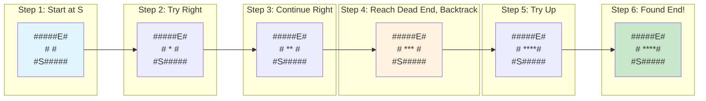
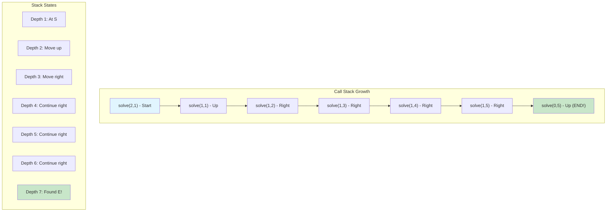
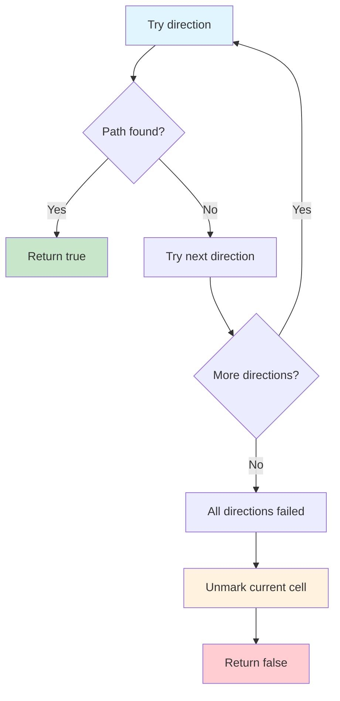
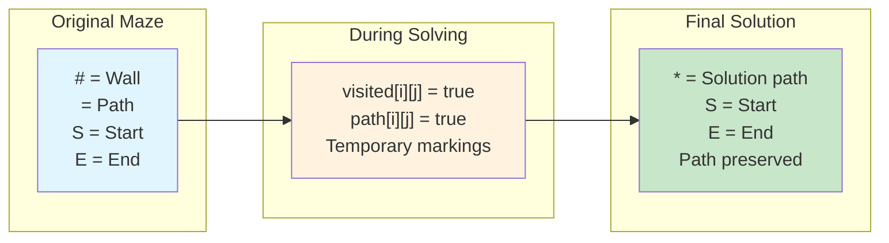
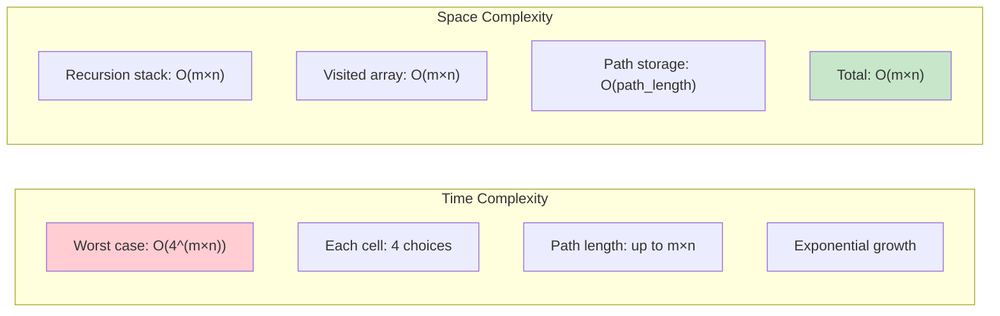

# Maze Solver with Recursion

## Description

A maze solver that uses recursive backtracking to find a path from a start position (S) to an end position (E) in a 2D grid maze. The algorithm explores all possible paths by trying each direction (up, down, left, right) and backtracking when it hits a dead end or previously visited cell.

This implementation demonstrates:

- **Recursive backtracking** - Classic depth-first search with backtracking
- **Path tracking** - Records the complete path from start to end
- **Maze validation** - Handles edge cases and invalid maze configurations
- **Visualization** - Shows the solved path overlaid on the original maze

## Algorithm Details

### Recursive Backtracking Process

1. **Base Cases**: Check if current position is invalid, a wall, or already visited
2. **Mark Current Cell**: Add current position to visited and path
3. **Check Goal**: If reached end position, return success
4. **Try All Directions**: Recursively explore up, down, left, right
5. **Backtrack**: If no direction leads to solution, remove current position from path

### Direction Exploration Order

- Up: (-1, 0)
- Down: (1, 0)
- Left: (0, -1)
- Right: (0, 1)

### Maze Format

- `#` - Wall (impassable)
- ` ` - Open path (passable)
- `S` - Start position
- `E` - End position
- `*` - Solution path (in visualization)

## Complexity

### Time Complexity

- **Worst Case**: O(4^(m×n)) where m×n is the maze size
- **Average Case**: O(m×n) for typical mazes with reasonable connectivity
- **Best Case**: O(path_length) when direct path exists

### Space Complexity

- **Recursion Stack**: O(m×n) in worst case (maximum depth)
- **Visited Array**: O(m×n) for tracking visited cells
- **Path Storage**: O(path_length) for storing solution path
- **Overall**: O(m×n) where m and n are maze dimensions

## Features

### Core Functionality

- `SolveMaze(maze)` - Main function to solve a maze
- `NewMazeSolver(maze)` - Create a solver instance
- `PrintMazeWithPath(path)` - Visualize solution path

### Error Handling

- Empty maze validation
- Missing start/end position detection
- Inconsistent maze row lengths
- Unsolvable maze detection

### Path Visualization

- Original maze preserved
- Solution path marked with `*`
- Start `S` and end `E` positions maintained

## Usage

```bash
make run NAME=0011-maze-with-recursion
make test NAME=0011-maze-with-recursion
make bench NAME=0011-maze-with-recursion
```

### Code Example

```go
// Define a maze
maze := []string{
    "#####E#",
    "#     #",
    "#S#####",
}

// Solve the maze
path, err := SolveMaze(maze)
if err != nil {
    log.Fatal(err)
}

// Print solution
solver := NewMazeSolver(maze)
fmt.Println(solver.PrintMazeWithPath(path))
```

### Example Output

```
Original maze:
#####E#
#     #
#S#####

Solved maze:
#####E#
#**** #
#S#####

Path: [(2,1), (1,1), (1,2), (1,3), (1,4), (1,5), (0,5)]
```

## Applications

### 1. **Pathfinding in Games**

```go
gameMap := []string{
    "########",
    "#S  #  #",
    "# # # ##",
    "# #   E#",
    "########",
}
```

### 2. **Robot Navigation**

```go
robotMaze := []string{
    "##########",
    "#S       #",
    "# ###### #",
    "#       E#",
    "##########",
}
```

### 3. **Puzzle Solving**

```go
puzzleMaze := []string{
    "#####",
    "#S E#",
    "#   #",
    "#####",
}
```

### 4. **Network Routing**

- Find paths through network topologies
- Avoid congested/blocked routes
- Optimize connection paths

## Algorithm Characteristics

### Advantages

- **Completeness**: Will find a solution if one exists
- **Memory Efficient**: Uses recursion stack instead of explicit queue/stack
- **Path Tracking**: Naturally maintains the solution path
- **Simplicity**: Clean, readable recursive implementation
- **Backtracking**: Automatically undoes bad choices

### Trade-offs

- **Stack Overflow Risk**: Deep recursion for large mazes
- **No Path Optimization**: Finds first solution, not necessarily shortest
- **Exponential Worst Case**: Can be slow for complex mazes with many paths
- **DFS Bias**: Explores deeply before broadly

## Comparison with Other Algorithms

| Algorithm              | Time       | Space | Optimal Path | Implementation |
| ---------------------- | ---------- | ----- | ------------ | -------------- |
| Recursive Backtracking | O(4^n)     | O(n)  | No           | Simple         |
| BFS                    | O(n)       | O(n)  | Yes          | Queue-based    |
| DFS (Iterative)        | O(n)       | O(n)  | No           | Stack-based    |
| A\*                    | O(n log n) | O(n)  | Yes          | Complex        |

## Edge Cases Handled

- **Empty maze**: Returns appropriate error
- **No start/end**: Validates maze format
- **Inconsistent dimensions**: Checks row lengths
- **Unsolvable maze**: Detects when no path exists
- **Single cell**: Handles trivial cases
- **Multiple paths**: Finds one valid solution

## Performance Characteristics

- **Best for**: Small to medium mazes, educational purposes
- **Avoid for**: Very large mazes, real-time applications requiring optimal paths
- **Memory usage**: Grows with maze size and path length
- **Recursion depth**: Limited by stack size

## Testing

The test suite covers:

- Simple and complex maze configurations
- Edge cases (empty, no solution, malformed)
- Path validation and correctness
- Error handling for invalid inputs
- Performance benchmarks for various maze sizes
- Maze visualization and formatting

```bash
make test NAME=0011-maze-with-recursion
```

## Implementation Notes

- Uses standard recursive backtracking pattern
- Maintains visited array to prevent cycles
- Tracks complete path during traversal
- Provides both solving and visualization capabilities
- Comprehensive error handling and validation

## Visual Representation

### Recursive Backtracking Algorithm

```mermaid
graph TD
    A[Start: solveMaze(row, col)] --> B{Valid position?}
    B -->|No| C[Return false]
    B -->|Yes| D{Is wall or visited?}
    D -->|Yes| C
    D -->|No| E[Mark as visited]
    E --> F{Reached end?}
    F -->|Yes| G[Return true - FOUND!]
    F -->|No| H[Try all 4 directions]
    H --> I[Try UP: solveMaze(row-1, col)]
    H --> J[Try DOWN: solveMaze(row+1, col)]
    H --> K[Try LEFT: solveMaze(row, col-1)]
    H --> L[Try RIGHT: solveMaze(row, col+1)]
    I --> M{Any direction successful?}
    J --> M
    K --> M
    L --> M
    M -->|Yes| G
    M -->|No| N[Backtrack: unmark visited]
    N --> C

    style A fill:#e1f5fe
    style G fill:#c8e6c9
    style C fill:#ffcdd2
    style N fill:#fff3e0
```

### Maze Exploration Example



### Recursion Call Stack Visualization



### Backtracking Process



### Maze State Tracking



### DFS vs BFS for Maze Solving

```mermaid
graph TD
    A[Maze Solving Comparison] --> B[DFS (Recursive)]
    A --> C[BFS (Queue)]

    B --> B1["Memory: O(depth)"]
    B --> B2["Stack-based recursion"]
    B --> B3["Finds A path (not shortest)"]
    B --> B4["Natural backtracking"]
    B --> B5["Simple implementation"]

    C --> C1["Memory: O(width)"]
    C --> C2["Queue-based iteration"]
    C --> C3["Finds shortest path"]
    C --> C4["No natural backtracking"]
    C --> C5["More complex bookkeeping"]

    style B3 fill:#fff3e0
    style C3 fill:#c8e6c9
    style B4 fill:#c8e6c9
    style B5 fill:#c8e6c9
```

### Algorithm Complexity Analysis



Maze solving with recursion uses a backtracking algorithm to find a path from start to end in a maze.
