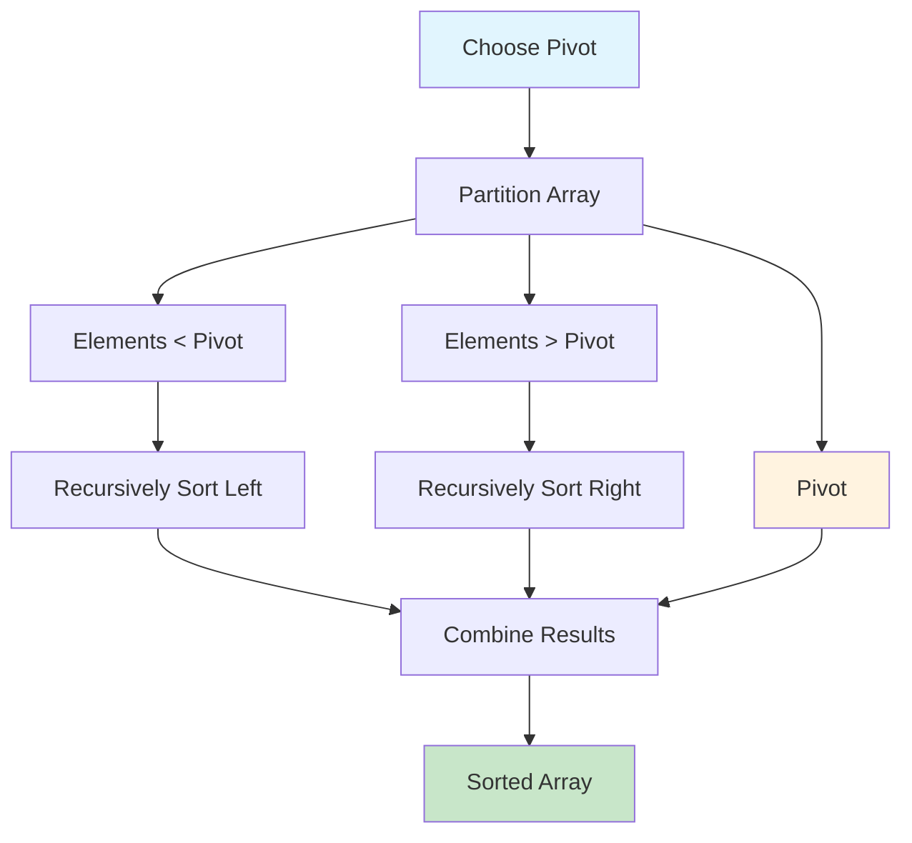
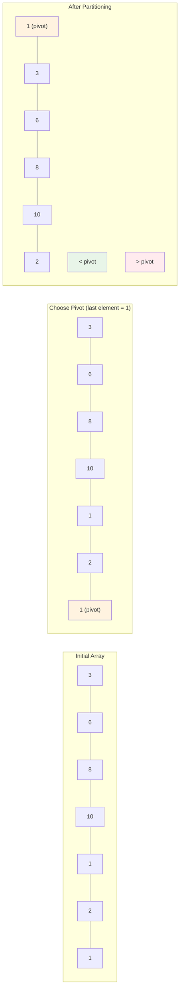
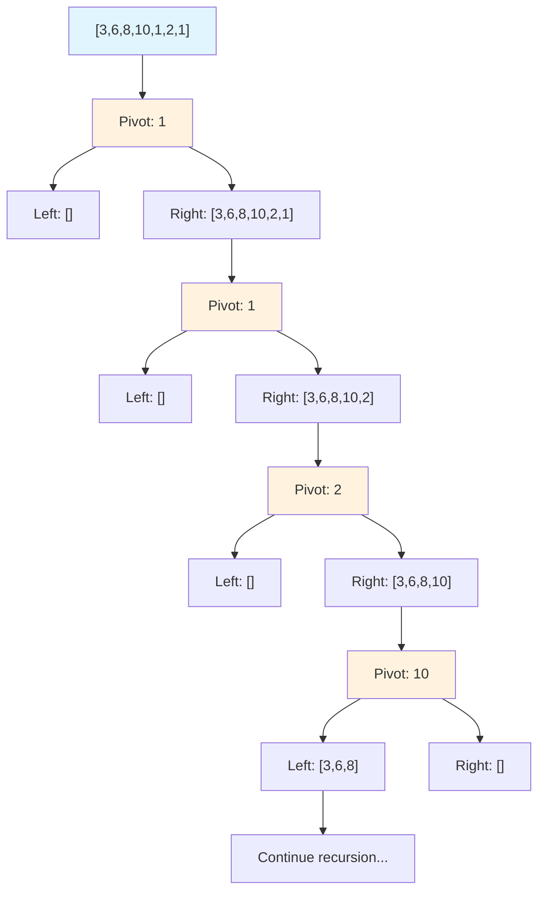
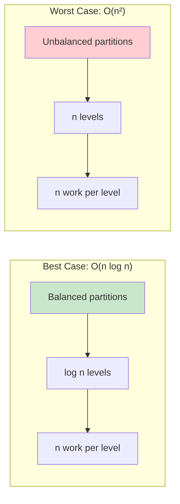

# Quick Sort

## Description

Quick Sort is a highly efficient divide-and-conquer sorting algorithm that works by selecting a 'pivot' element from the array and partitioning the other elements into two sub-arrays according to whether they are less than or greater than the pivot. The sub-arrays are then sorted recursively.

## Visual Representation

### Algorithm Flow



### Partitioning Process



### Divide and Conquer Visualization



### Time Complexity Scenarios



This implementation includes multiple variants:

- **Basic Quick Sort**: Uses the last element as pivot
- **Random Pivot**: Randomly selects a pivot to avoid worst-case performance
- **Median-of-Three**: Uses the median of first, middle, and last elements as pivot
- **In-Place Sorting**: Sorts the array without creating a new array

## Algorithm Steps

1. **Choose a pivot** element from the array
2. **Partition** the array so that:
   - Elements smaller than the pivot come before it
   - Elements greater than the pivot come after it
3. **Recursively apply** the same process to the sub-arrays

## Complexity

- **Time Complexity**:
  - Best/Average Case: O(n log n)
  - Worst Case: O(n²) - occurs when the pivot is always the smallest or largest element
- **Space Complexity**:
  - Average Case: O(log n) - due to recursion stack
  - Worst Case: O(n) - in case of unbalanced partitions

## Key Features

- **Not Stable**: Equal elements may not maintain their relative order
- **In-Place**: Can sort with O(1) extra space (excluding recursion stack)
- **Adaptive**: Performance can be improved with better pivot selection strategies
- **Cache-Efficient**: Good locality of reference

## Pivot Selection Strategies

### 1. Last Element (Basic)

- Simple implementation
- Worst case: O(n²) for already sorted arrays

### 2. Random Pivot

- Reduces probability of worst-case performance
- Expected time complexity: O(n log n)

### 3. Median-of-Three

- Takes median of first, middle, and last elements
- Better performance on partially sorted arrays
- Reduces worst-case scenarios

## Usage

```bash
make run NAME=0012-quick-sort
```

## Testing

```bash
make test NAME=0012-quick-sort
```

## Benchmarking

```bash
go test -bench=. -benchmem
```

## Implementation Details

### Functions Available:

- `QuickSort(arr []int) []int` - Basic quick sort returning new array
- `QuickSortRandomPivot(arr []int) []int` - Quick sort with random pivot
- `QuickSortMedianOfThree(arr []int) []int` - Quick sort with median-of-three pivot
- `QuickSortInPlace(arr []int)` - In-place quick sort
- `IsSorted(arr []int) bool` - Utility to check if array is sorted

### When to Use Quick Sort:

- **Good for**: Large datasets, when average-case performance is important
- **Avoid when**: Stability is required, or when worst-case performance must be guaranteed

### Comparison with Other Sorting Algorithms:

- **vs Merge Sort**: Faster in practice, but not stable and has worse worst-case
- **vs Heap Sort**: Better cache performance, but not stable
- **vs Insertion Sort**: Much faster for large arrays, but slower for very small arrays
