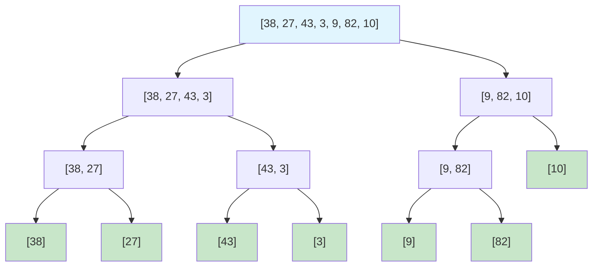
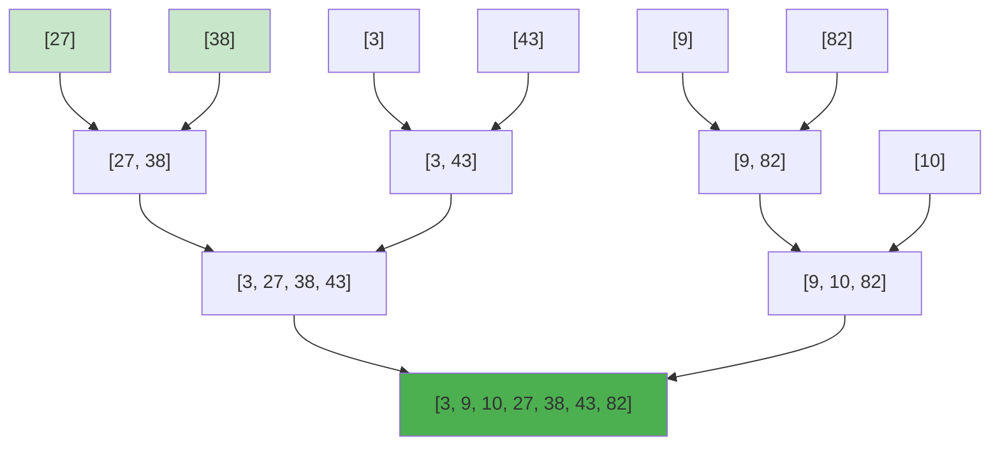
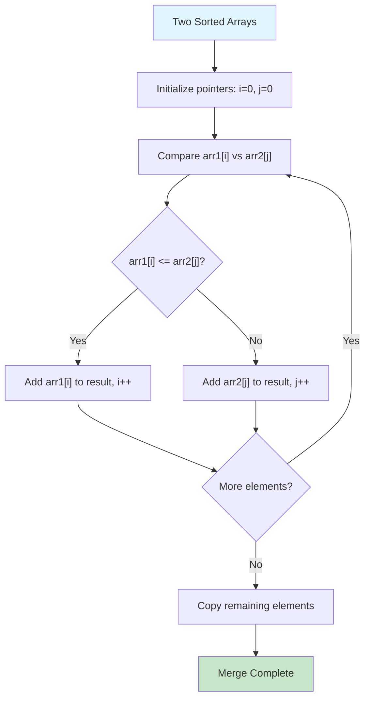
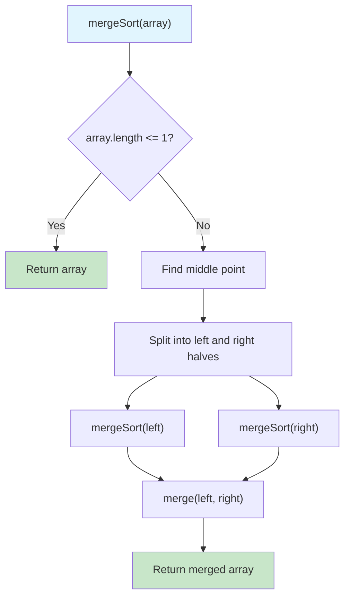
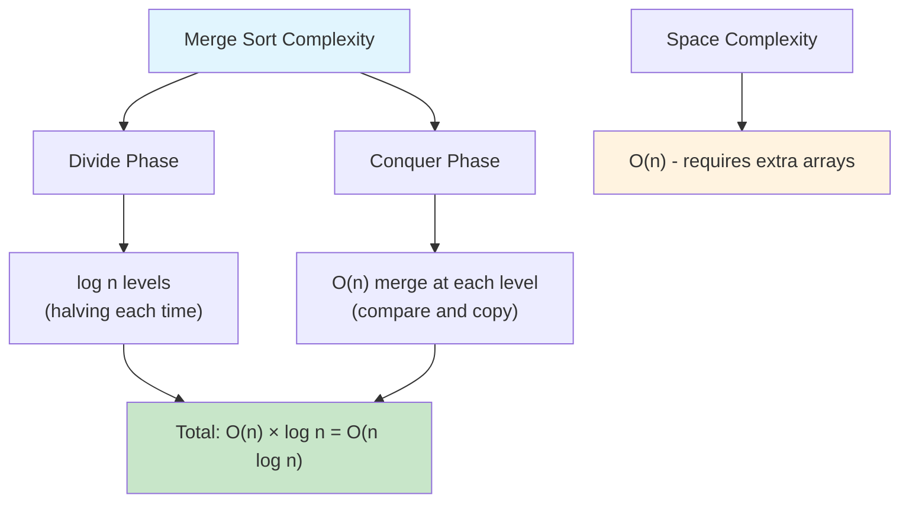
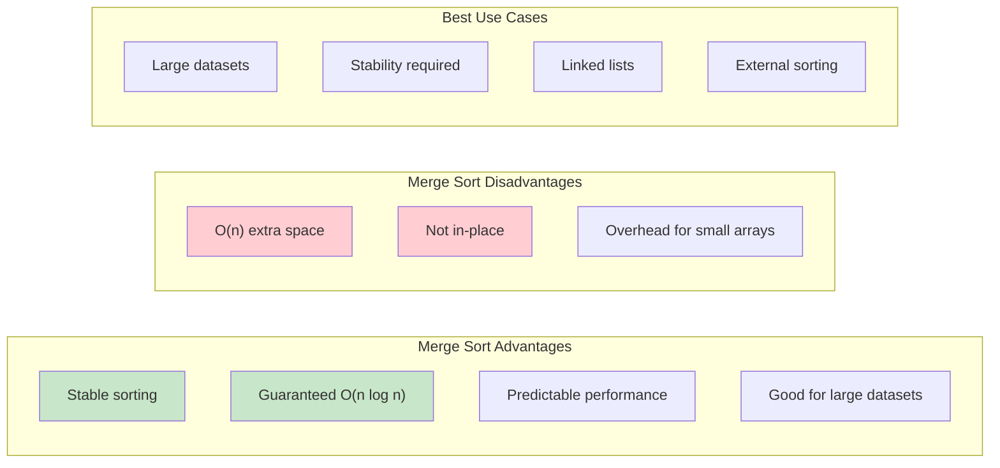
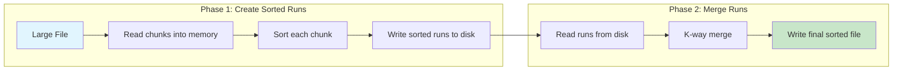

# Merge Sort

## Description

Merge Sort is a stable, divide-and-conquer sorting algorithm that works by recursively dividing the array into halves, sorting each half, and then merging the sorted halves back together. It guarantees O(n log n) time complexity in all cases.

This implementation includes multiple variants:

- **Top-Down Merge Sort**: Classic recursive implementation
- **Bottom-Up Merge Sort**: Iterative implementation that avoids recursion
- **Stable Merge Sort**: Explicitly maintains stability for equal elements
- **Optimized Merge Sort**: Uses insertion sort for small subarrays and skips unnecessary merges
- **In-Place Merge Sort**: Sorts the array without creating a new array

## Visual Representation

### Divide and Conquer Process



### Merge Process (Conquer Phase)



### Merge Algorithm Step-by-Step



### Merge Sort Algorithm Flow



### Time Complexity Analysis



### Comparison with Other Sorts



### External Merge Sort



## Algorithm Steps

1. **Divide**: Split the array into two halves at the middle point
2. **Conquer**: Recursively sort both halves
3. **Combine**: Merge the two sorted halves back together in sorted order

## Complexity

- **Time Complexity**:
  - Best Case: O(n log n)
  - Average Case: O(n log n)
  - Worst Case: O(n log n) - guaranteed!
- **Space Complexity**:
  - Standard: O(n) - for temporary arrays during merging
  - Optimized: O(n) - reuses temporary array

## Key Features

- **Stable**: Equal elements maintain their relative order
- **Predictable**: Always O(n log n) time complexity
- **Parallelizable**: Can be easily parallelized
- **External Sorting**: Suitable for sorting large datasets that don't fit in memory
- **Not In-Place**: Requires additional memory for merging

## Variants Implemented

### 1. Top-Down (Recursive)

- Classic divide-and-conquer approach
- Uses recursion to split and merge
- Most intuitive implementation

### 2. Bottom-Up (Iterative)

- Avoids recursion overhead
- Starts with small subarrays and builds up
- Better for systems with limited stack space

### 3. Stable Merge Sort

- Explicitly preserves stability
- Important when sorting objects with multiple keys
- Same performance as standard merge sort

### 4. Optimized Merge Sort

- Uses insertion sort for small subarrays (≤10 elements)
- Skips merge step if array is already sorted
- Reuses temporary array to reduce allocations
- Better practical performance

### 5. In-Place Merge Sort

- Sorts without creating new arrays
- Uses the same merge logic but modifies original array
- Space-efficient variant

## Usage

```bash
make run NAME=0013-merge-sort
```

## Testing

```bash
make test NAME=0013-merge-sort
```

## Benchmarking

```

```
