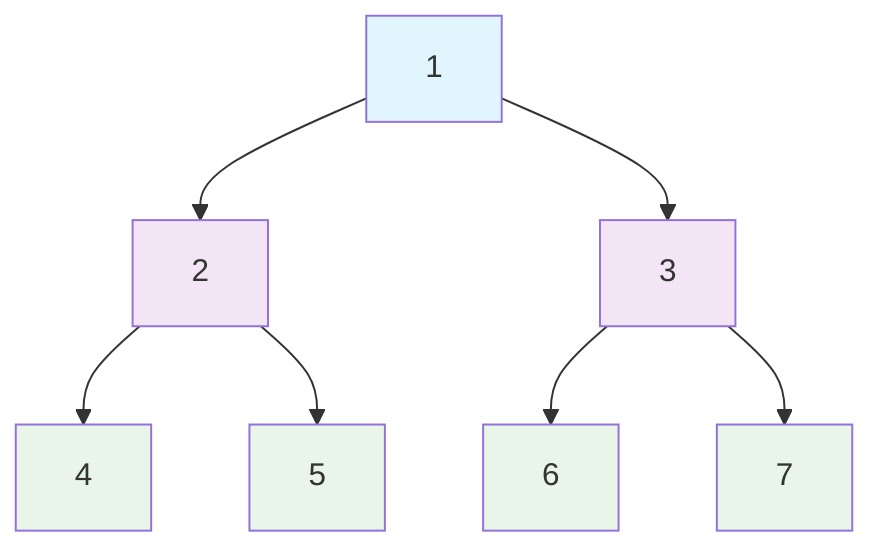
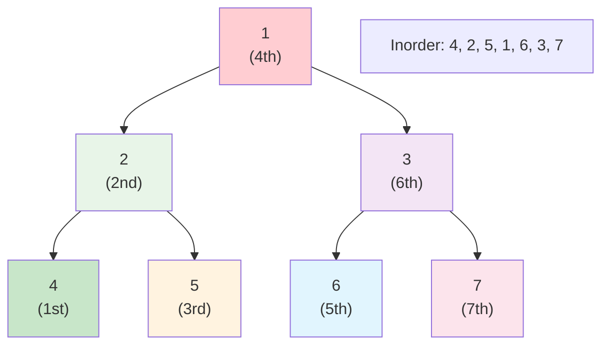
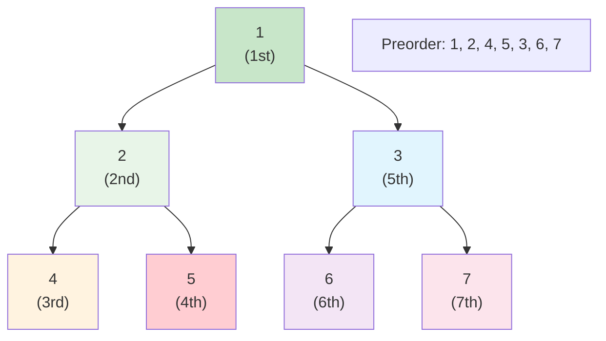
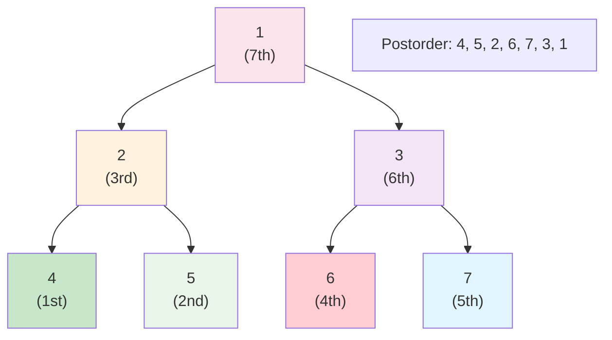
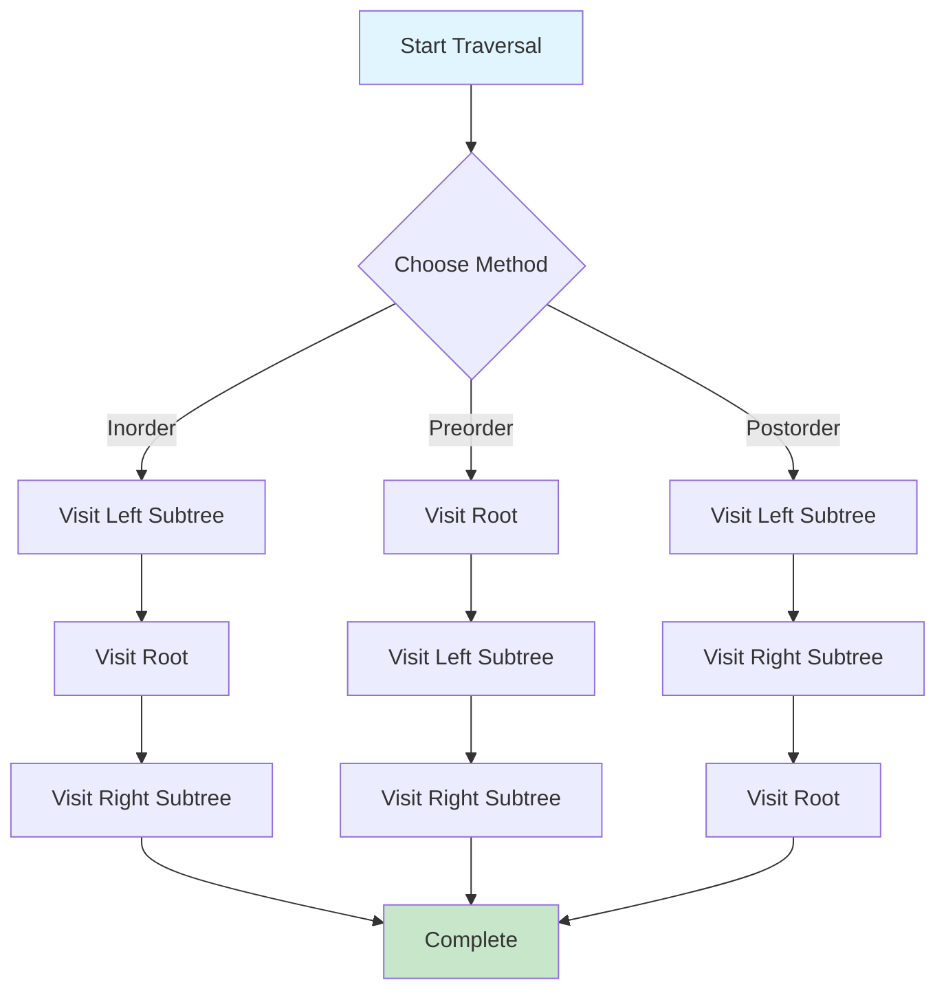
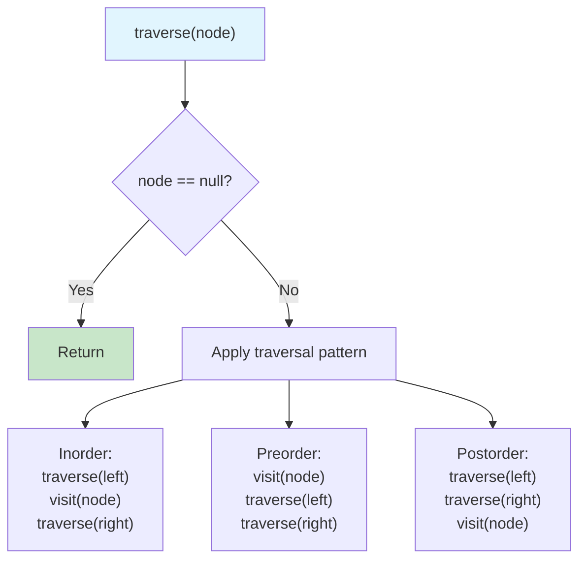
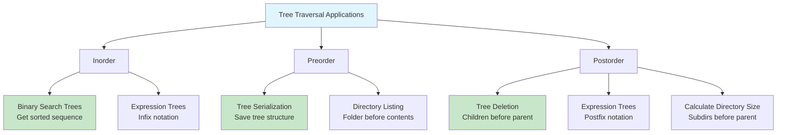

# Tree Traversal

## Description

Tree traversal refers to the process of visiting each node in a tree data structure exactly once in a systematic way. This implementation covers the three main depth-first traversal methods: inorder, preorder, and postorder.

## Visual Representation

### Binary Tree Structure



### Inorder Traversal (Left → Root → Right)



### Preorder Traversal (Root → Left → Right)



### Postorder Traversal (Left → Right → Root)



### Traversal Algorithm Flow



### Recursive Implementation Pattern



### Use Cases for Different Traversals



Tree traversal refers to the process of visiting each node in a tree data structure exactly once in a systematic way.

## Tree Structure

```
      1
     / \
    2   3
   / \ / \
  4  5 6  7
```

**Traversal Results:**

- Pre-order: [1, 2, 4, 5, 3, 6, 7]
- In-order: [4, 2, 5, 1, 6, 3, 7]
- Post-order: [4, 5, 2, 6, 7, 3, 1]

## Complexity

### Recursive Implementations

- **Time Complexity**: O(n) - visits each node exactly once
- **Space Complexity**: O(h) - where h is the height of the tree (call stack)
  - Best case (balanced tree): O(log n)
  - Worst case (skewed tree): O(n)

### Iterative Implementations

- **Time Complexity**: O(n) - visits each node exactly once
- **Space Complexity**: O(h) - explicit stack storage
  - Best case (balanced tree): O(log n)
  - Worst case (skewed tree): O(n)

## Implementation Details

### Recursive Approach

- Natural and intuitive implementation
- Uses system call stack
- Prone to stack overflow for very deep trees
- Generally more readable and easier to understand

### Iterative Approach

- Uses explicit stack data structure
- More memory efficient for deep trees
- Avoids stack overflow issues
- Pre-order is straightforward, post-order is most complex

## Use Cases

### Pre-order Traversal

- Tree serialization and copying
- Prefix expression evaluation
- Directory listing (depth-first)
- Tree validation

### In-order Traversal

- Binary Search Tree (BST) sorted output
- Expression tree evaluation (infix notation)
- Tree flattening to sorted array

### Post-order Traversal

- Tree deletion (children before parent)
- Directory size calculation
- Postfix expression evaluation
- Dependency resolution

## Performance Characteristics

The iterative implementations generally have similar performance to recursive ones but offer better control over memory usage. Post-order iterative traversal is the most complex due to the need to track the last visited node.

## Usage

```bash
make run NAME=0014-tree-traversal
```

## Testing

```bash
make test NAME=0014-tree-traversal
```

## Benchmarking

```bash
go test -bench=. ./0014-tree-traversal/
```
