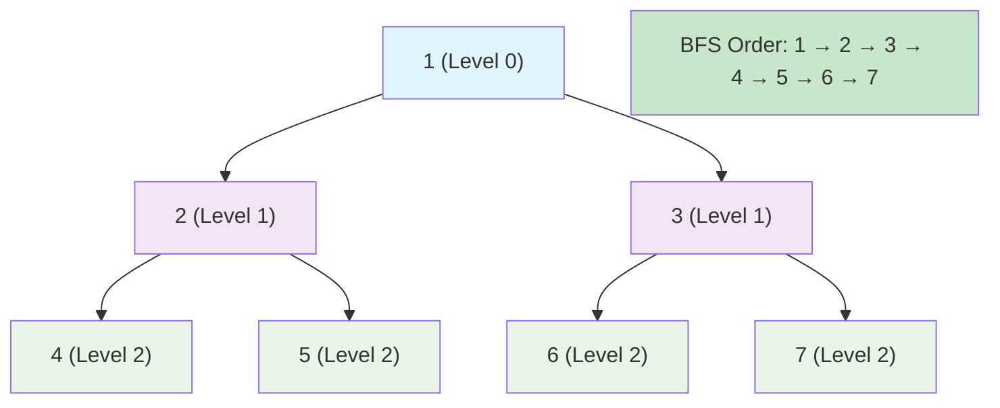
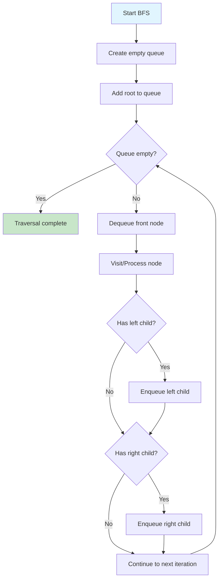
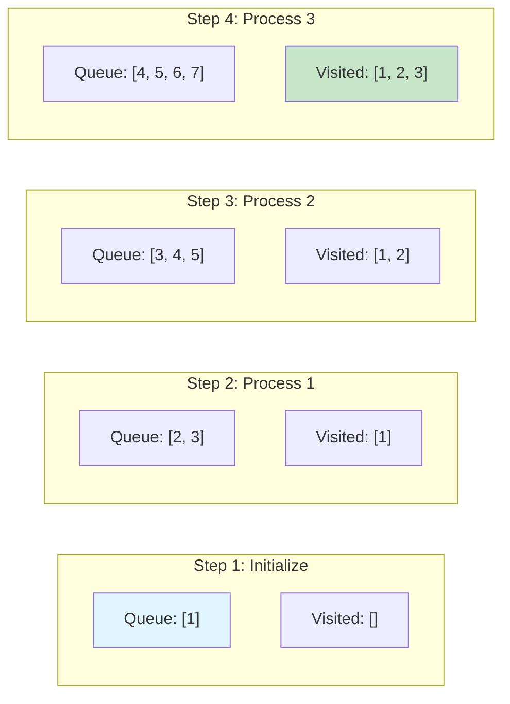
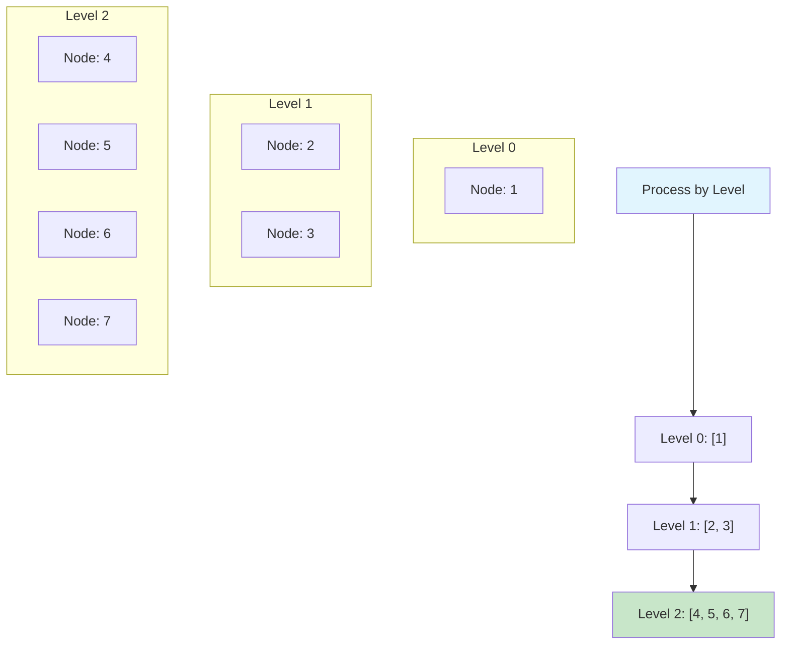
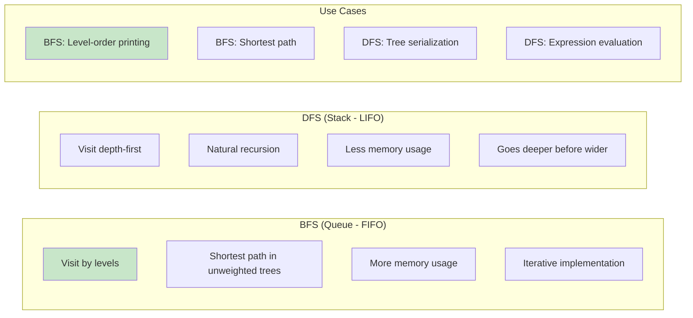
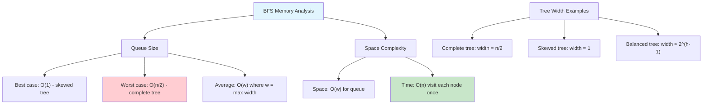
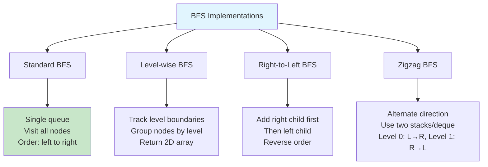
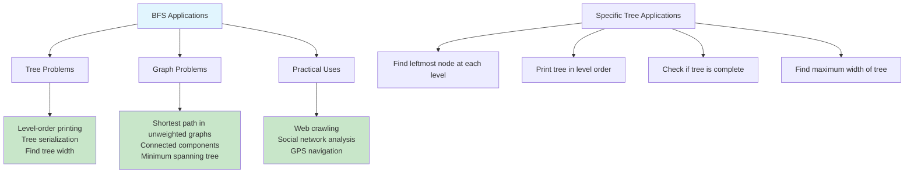
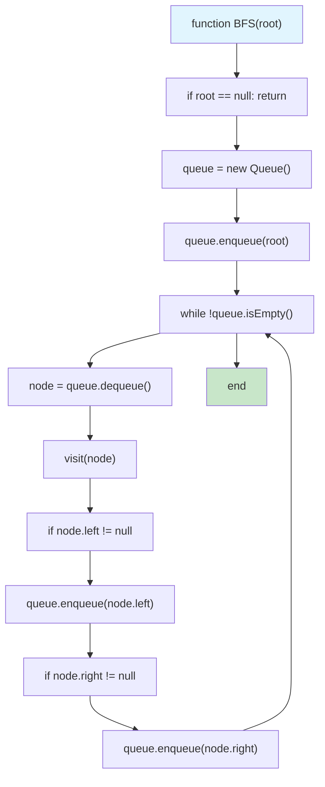
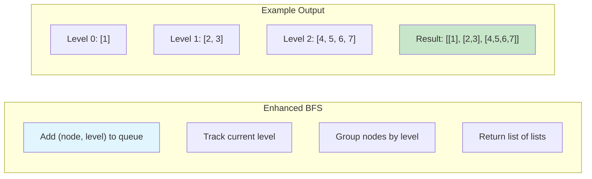

# Binary Tree Breadth-First Search

## Description

Implementation of breadth-first search (BFS) algorithms for binary trees, also known as level-order traversal. This module includes various BFS-based tree algorithms that explore nodes level by level using a queue data structure.

BFS is fundamental for solving many tree problems including:

- **Level-order traversal**: Visit all nodes level by level from left to right
- **Level-by-level processing**: Group nodes by their depth in the tree
- **Tree views**: Get left-side or right-side view of the tree
- **Zigzag traversal**: Alternate direction for each level
- **Depth calculations**: Find minimum and maximum depth efficiently
- **Level-specific operations**: Calculate sums or perform operations on specific levels

## Tree Structure Example

```
      3
     / \
    9   20
   / \  / \
  1   2 15  7
```

**BFS Results:**

- **Traversal**: [3, 9, 20, 1, 2, 15, 7]
- **Levels**: [[3], [9, 20], [1, 2, 15, 7]]
- **Right View**: [3, 20, 7]
- **Left View**: [3, 9, 1]
- **Zigzag**: [[3], [20, 9], [1, 2, 15, 7]]

## Algorithms Implemented

### Core BFS Functions

- `BFS()`: Standard level-order traversal
- `BFSLevels()`: Group nodes by level
- `BFSRightSideView()`: Rightmost node at each level
- `BFSLeftSideView()`: Leftmost node at each level
- `BFSZigzag()`: Alternating left-to-right and right-to-left traversal

### Depth and Level Operations

- `MaxDepth()`: Maximum depth of the tree
- `MinDepth()`: Minimum depth to a leaf node
- `LevelSum()`: Sum of all nodes at a specific level

## Complexity

### Time Complexity

- **All BFS operations**: O(n) - visits each node exactly once
- **Space complexity varies by operation**

### Space Complexity

- **BFS traversal**: O(w) - where w is the maximum width of the tree
- **Level-based operations**: O(w) for queue + O(n) for result storage
- **Best case (balanced tree)**: O(n/2) ≈ O(n)
- **Worst case (complete tree)**: O(n)

## Implementation Details

### Queue-Based Approach

- Uses explicit queue (slice) for level-by-level processing
- FIFO (First In, First Out) ensures proper level ordering
- Level tracking enables grouped operations

### Key Techniques

- **Level size tracking**: Process one complete level at a time
- **Direction alternation**: For zigzag traversal using index manipulation
- **Early termination**: For minimum depth calculation
- **View algorithms**: Track first/last nodes per level

## Use Cases

### Level-Order Traversal

- Tree serialization and deserialization
- Printing tree structure level by level
- Building tree from level-order input

### Tree Views

- **Right Side View**: What you see from the right side
- **Left Side View**: What you see from the left side
- UI rendering and tree visualization

### Zigzag Traversal

- Spiral tree traversal
- Alternative tree printing formats
- Specific algorithmic challenges

### Depth Calculations

- **Max Depth**: Tree height, balancing checks
- **Min Depth**: Shortest path to leaf, optimization problems
- Tree analysis and validation

### Level Operations

- Level-wise processing and aggregation
- Tree statistics and analysis
- Conditional operations based on depth

## Performance Characteristics

BFS is optimal for:

- Finding shortest path to any node (unweighted)
- Level-wise processing requirements
- Tree width and depth analysis
- Problems requiring complete level exploration

BFS uses more memory than DFS but provides level-wise guarantees that DFS cannot offer.

## Usage

```bash
make run NAME=0015-binary-tree-breadth-first-search
```

## Testing

```bash
make test NAME=0015-binary-tree-breadth-first-search
```

## Benchmarking

```bash
go test -bench=. ./0015-binary-tree-breadth-first-search/
```

## Visual Representation

### BFS Traversal Order



### BFS Algorithm Flow



### Queue State During Traversal



### Level-by-Level Processing



### BFS vs DFS Comparison



### Memory Usage Analysis



### Implementation Variations



### Applications and Use Cases



### Pseudocode Visualization



### Level-Order with Level Tracking



Binary Tree Breadth-First Search (BFS), also known as level-order traversal, visits nodes level by level from left to right.
