# Same Tree Problem

## Description

The Same Tree Problem determines if two binary trees are structurally identical and have the same values at corresponding nodes. This fundamental tree problem demonstrates recursive thinking and tree comparison algorithms.

## Visual Representation

### Identical Trees Example

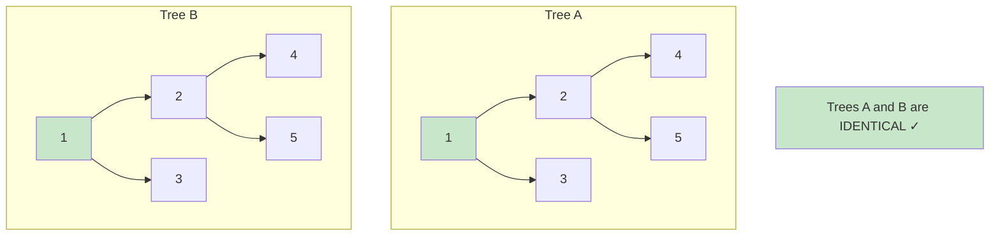

### Different Trees Examples

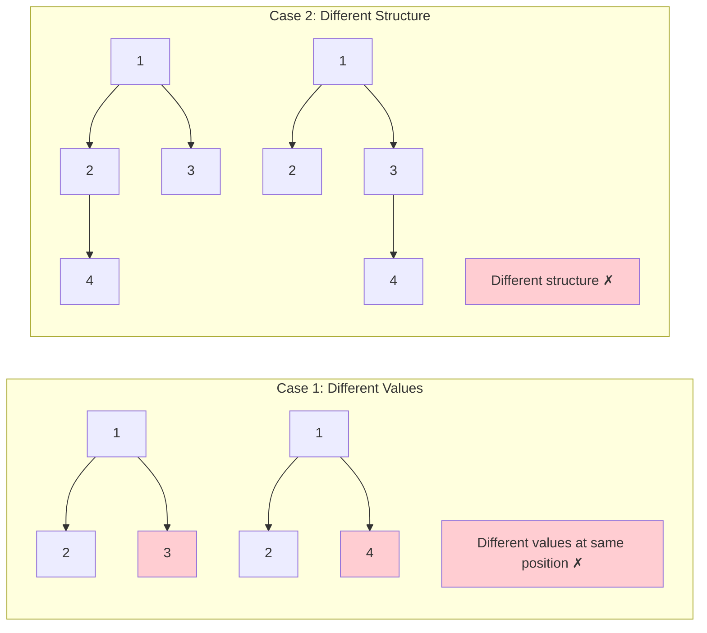

### Recursive Algorithm Flow

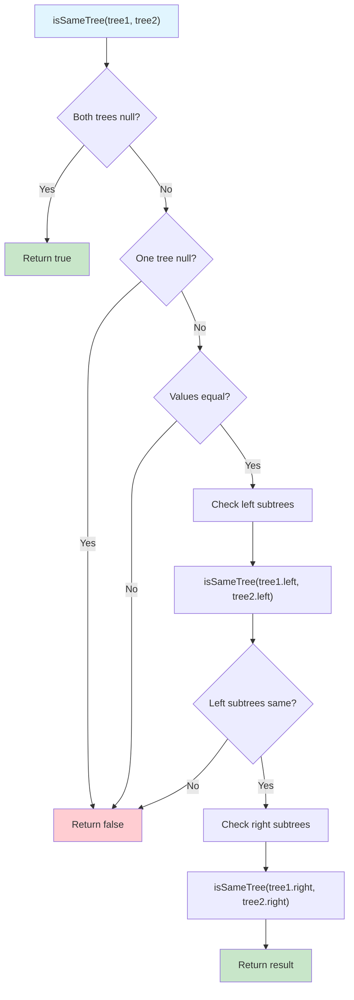

### Step-by-Step Comparison

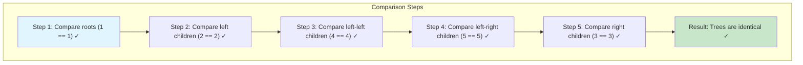

### Base Cases Visualization

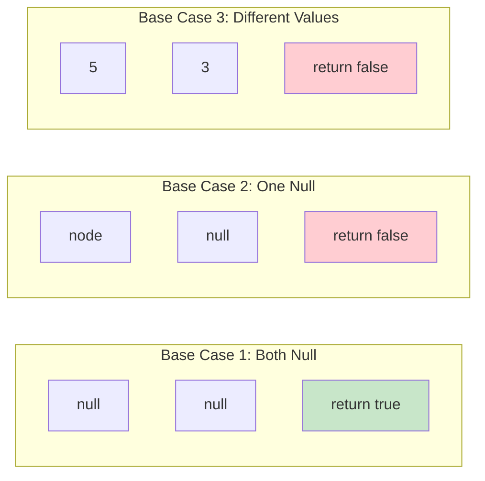

### Iterative Implementation

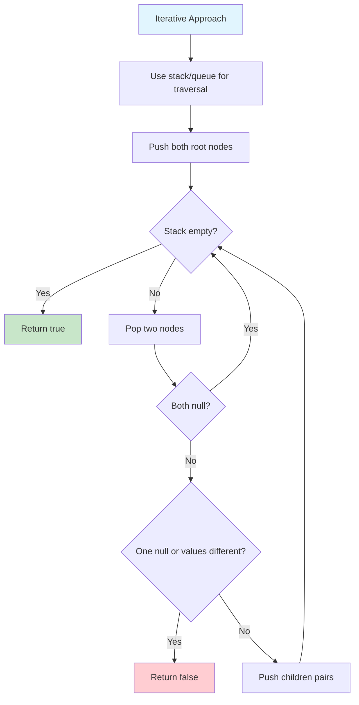

### Complexity Analysis

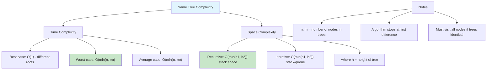

### Variations of the Problem

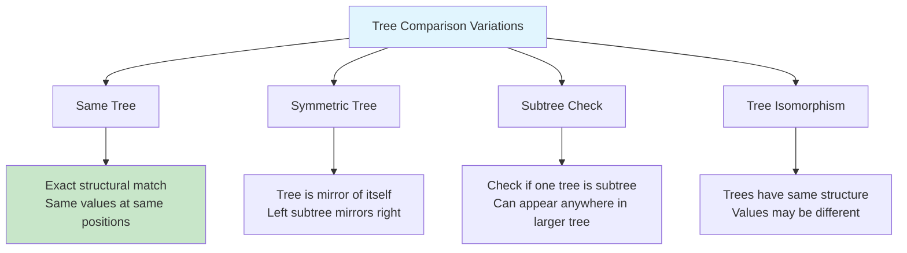

### Edge Cases

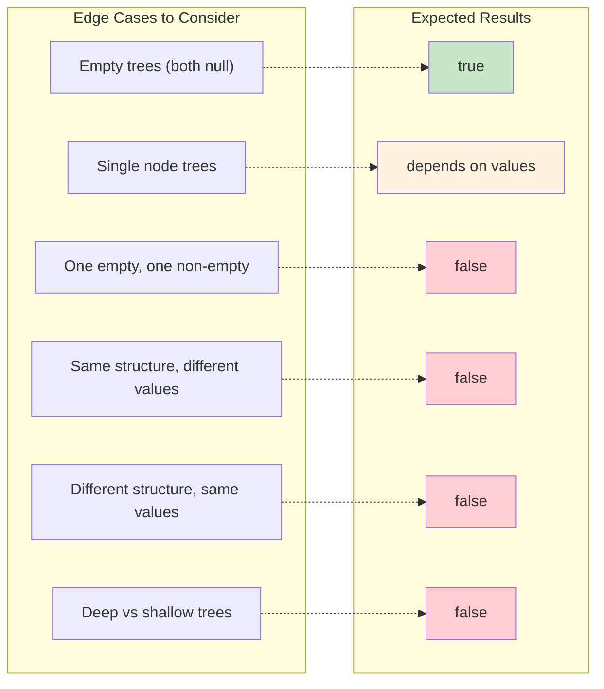

### Application Examples

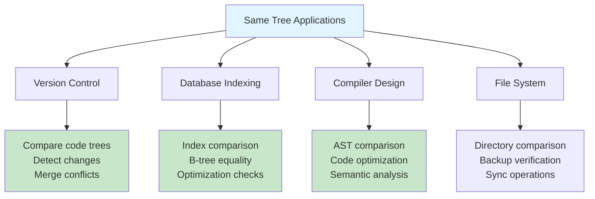

### Optimizations

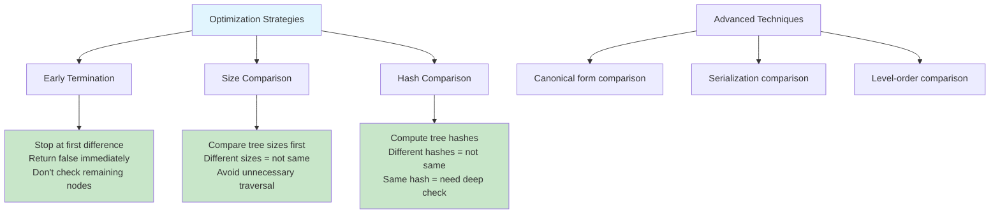

The Same Tree Problem determines if two binary trees are structurally identical and have the same values at corresponding nodes.

## Problem Statement

Given two binary trees, determine if they are the same tree. Two binary trees are considered the same if:

1. They have the same structure
2. Nodes at corresponding positions have the same values

## Tree Examples

### Same Trees

```
Tree 1:    Tree 2:
   1          1
  / \        / \
 2   3      2   3
```

### Different Trees

```
Tree 1:    Tree 2:
   1          1
  / \        / \
 2   3      2   4
```

## Algorithm

The solution uses a simple recursive approach:

1. If both trees are null, they are the same
2. If one tree is null and the other isn't, they are different
3. If the values at current nodes differ, they are different
4. Recursively check left and right subtrees

## Complexity

- **Time Complexity**: O(min(m, n)) where m and n are the number of nodes
- **Space Complexity**: O(h) where h is the height of the tree (recursion stack)

## Usage

```bash
make run NAME=0016-two-binary-trees-comparison
```

## Testing

```bash
make test NAME=0016-two-binary-trees-comparison
```
