# Binary Tree Depth-First Search

## Description

Binary Tree Depth-First Search (DFS) is a tree traversal algorithm that explores as far down each branch as possible before backtracking. It includes three main traversal orders: preorder, inorder, and postorder, each serving different purposes in tree processing.

## Visual Representation

### DFS Traversal Orders

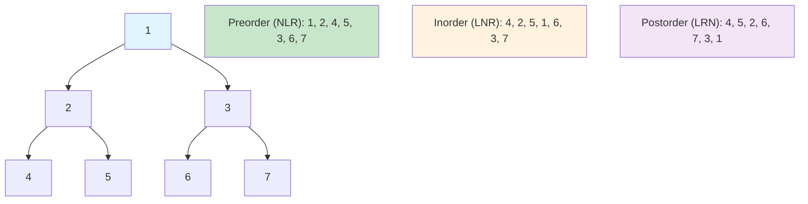

### DFS Algorithm Flow (Recursive)

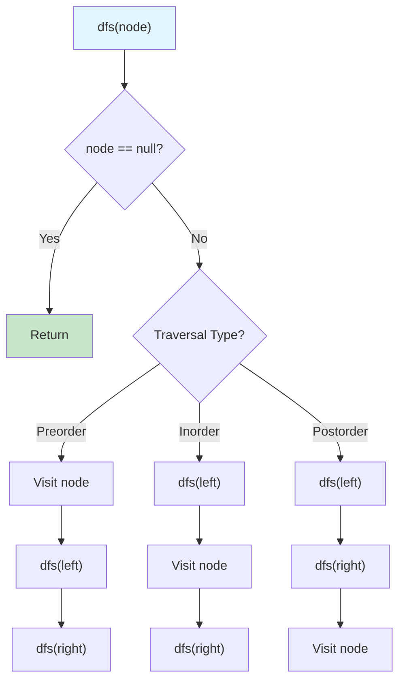

### Recursive Call Stack Visualization

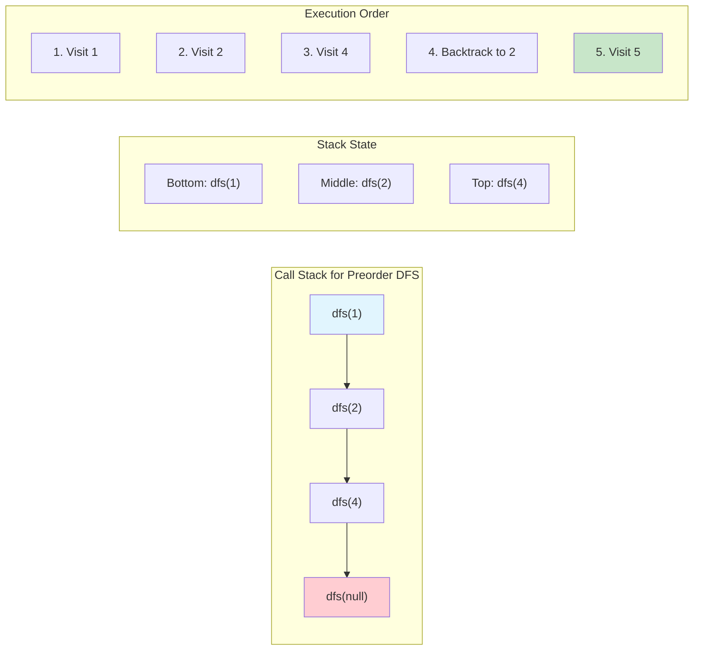

### Iterative DFS Implementation

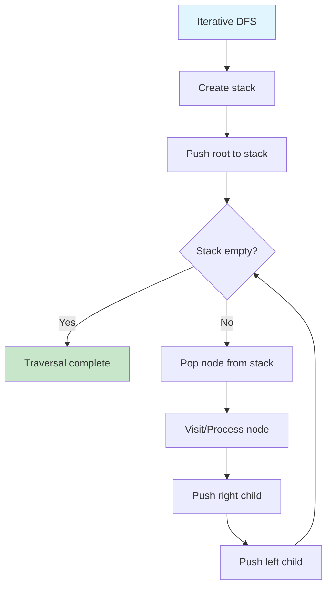

### Stack State During Iterative DFS

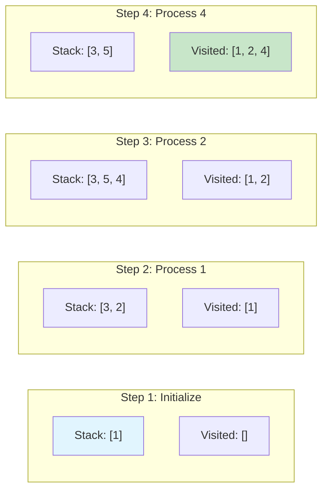

### DFS vs BFS Comparison

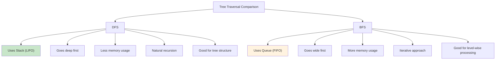

### Memory Usage Analysis

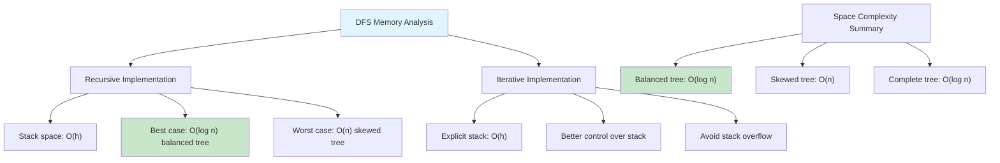

### DFS Applications

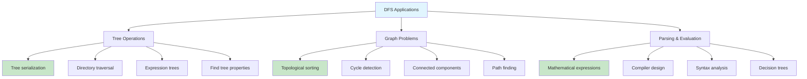

### Search vs Traversal

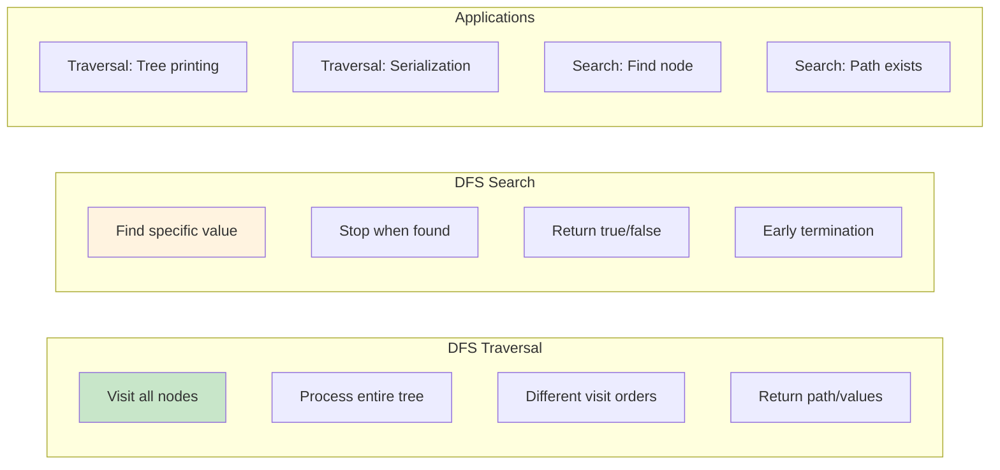

### DFS Path Tracking

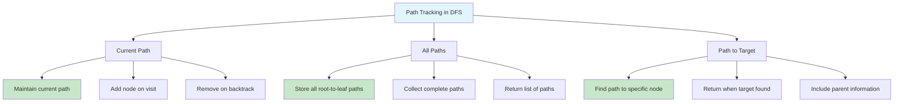

### Implementation Variations

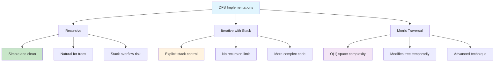

### Time Complexity Analysis

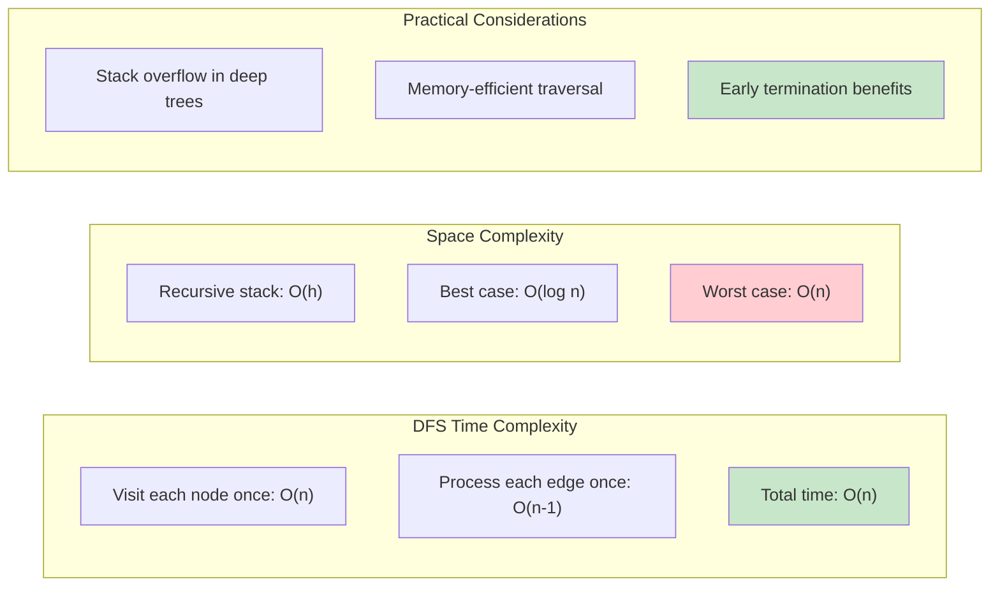

Binary Tree Depth-First Search (DFS) is a tree traversal algorithm that explores as far down each branch as possible before backtracking.

## Features

- **Insert**: Add new values while maintaining BST property
- **Delete**: Remove values with proper tree restructuring
- **Search**: Boolean check for value existence
- **Find**: Return node reference for a given value
- **Traversals**: In-order, pre-order, and post-order depth-first traversals
- **Utility Methods**: Height calculation and size counting

## BST Properties

- Left subtree contains only values less than the parent node
- Right subtree contains only values greater than the parent node
- No duplicate values allowed
- In-order traversal produces sorted sequence

## Tree Structure Example

```
       50
      /  \
    30    70
   / \   / \
  20 40 60 80
```

## Traversal Methods

### In-Order (Left → Root → Right)

Produces sorted sequence: `[20, 30, 40, 50, 60, 70, 80]`

### Pre-Order (Root → Left → Right)

Useful for tree copying: `[50, 30, 20, 40, 70, 60, 80]`

### Post-Order (Left → Right → Root)

Useful for tree deletion: `[20, 40, 30, 60, 80, 70, 50]`

## Operations

### Insert

- **Time**: O(log n) average, O(n) worst case
- **Space**: O(log n) recursion stack
- Maintains BST property by comparing values

### Delete

- **Time**: O(log n) average, O(n) worst case
- **Space**: O(log n) recursion stack
- Handles three cases:
  - Leaf node: Simple removal
  - One child: Replace with child
  - Two children: Replace with in-order successor

### Search/Find

- **Time**: O(log n) average, O(n) worst case
- **Space**: O(log n) recursion stack
- Efficient binary search through tree structure

## Complexity

### Time Complexity

- **Insert**: O(log n) average, O(n) worst case
- **Delete**: O(log n) average, O(n) worst case
- **Search/Find**: O(log n) average, O(n) worst case
- **Traversals**: O(n) - visit each node once
- **Height**: O(n) - may visit all nodes
- **Size**: O(n) - visit each node once

### Space Complexity

- **Storage**: O(n) for n nodes
- **Operations**: O(log n) average recursion depth, O(n) worst case
- **Traversals**: O(n) for result storage + O(log n) recursion

## Use Cases

- **Sorted Data**: Maintaining sorted collections with dynamic updates
- **Range Queries**: Finding values within specific ranges
- **Database Indexing**: B-tree variants for database indexes
- **Expression Trees**: Parsing and evaluating mathematical expressions
- **File Systems**: Directory structure representation

## Usage

```bash
make run NAME=0017-binary-tree-depth-first
```

## Testing

```bash
make test NAME=0017-binary-tree-depth-first
```
