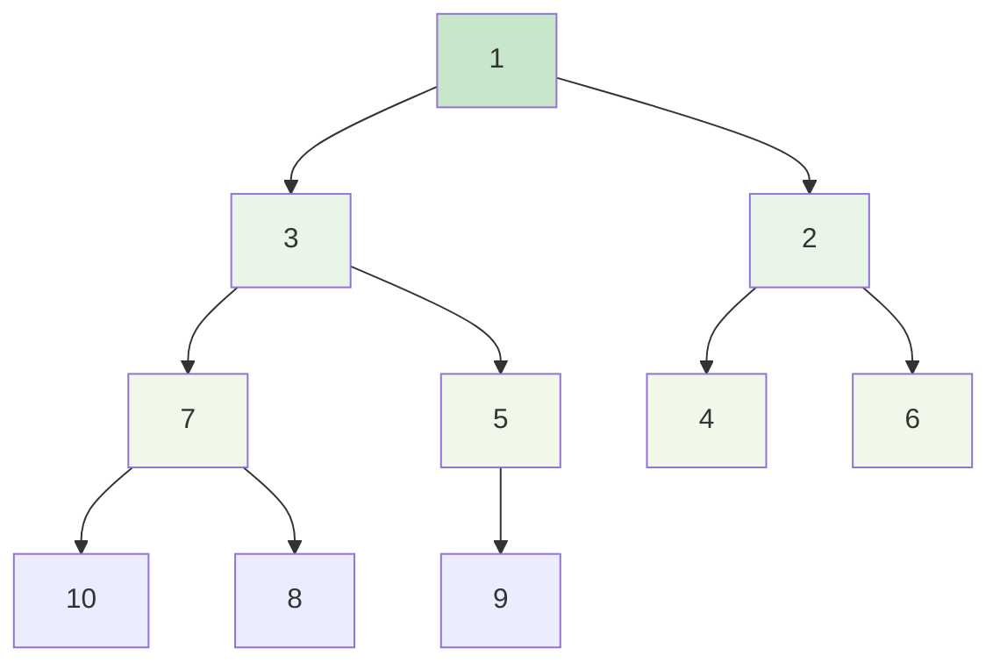
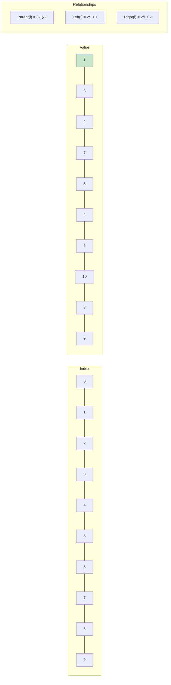
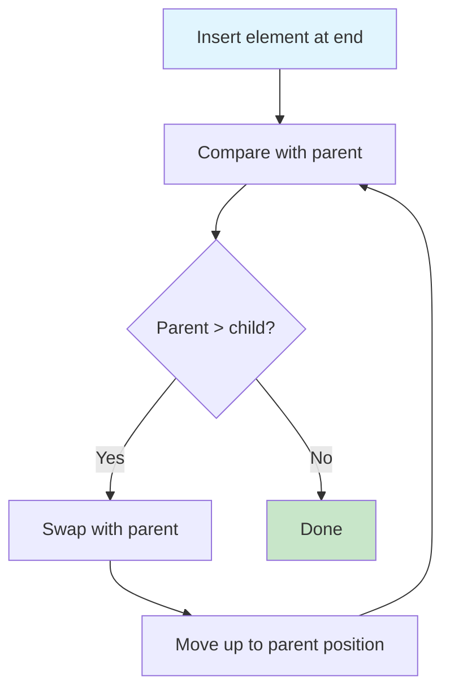
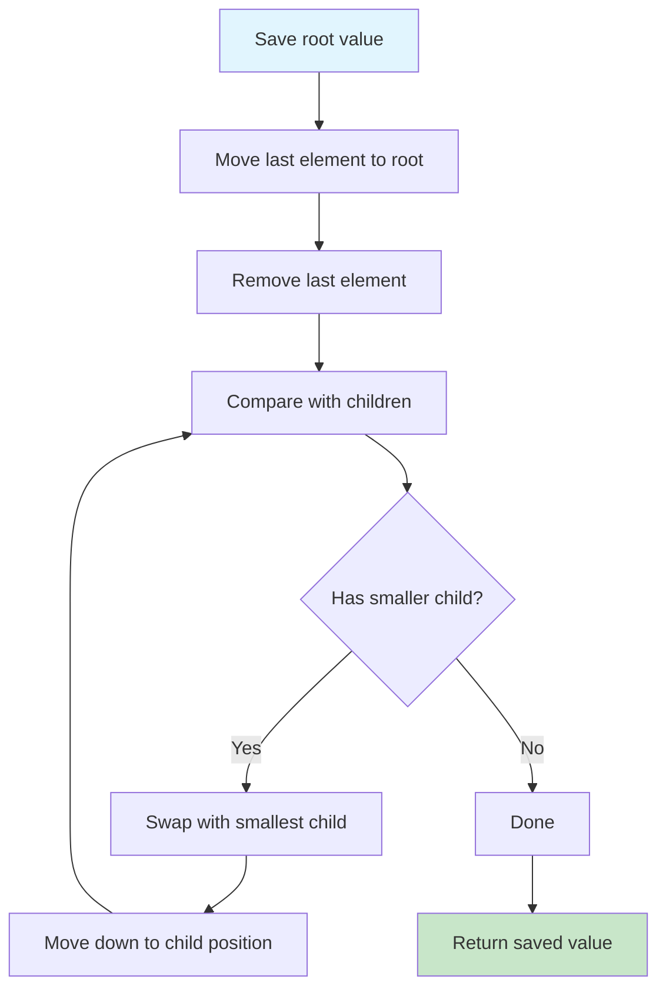
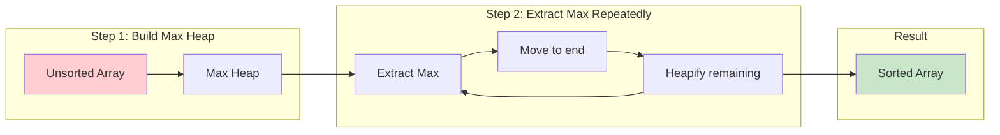
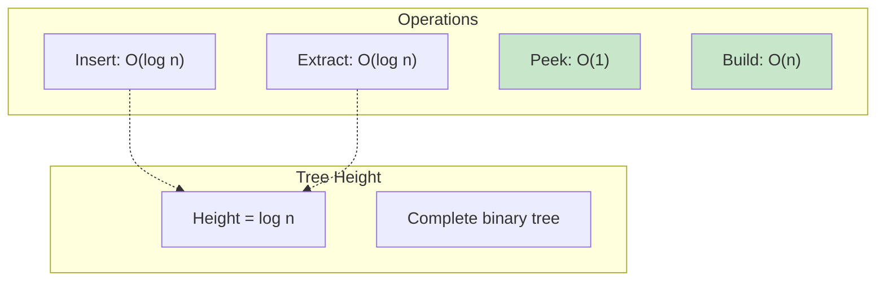

# Heap Data Structure

## Description

Implementation of both Min-Heap and Max-Heap data structures with comparison to Go's built-in `container/heap` package. A heap is a complete binary tree that satisfies the heap property: in a min-heap, each parent node is smaller than or equal to its children; in a max-heap, each parent node is greater than or equal to its children.

## Visual Representation

### Min-Heap Structure



### Array Representation



### Insert Operation (Heapify Up)



### Extract Min Operation (Heapify Down)



### Heap Sort Visualization



### Complexity Comparison



## Features

- **MinHeap**: Extract minimum element efficiently
- **MaxHeap**: Extract maximum element efficiently
- **Priority Queue Operations**: Insert, extract, peek
- **Heap Sort**: Sorting algorithm using heap structure
- **Go Heap Comparison**: Side-by-side comparison with standard library
- **Complete Implementation**: All fundamental heap operations

## Heap Properties

- **Complete Binary Tree**: All levels filled except possibly the last
- **Heap Property**: Parent-child relationship maintains order
- **Array Representation**: Efficient storage using slice/array
- **Index Relationships**: Parent at `(i-1)/2`, children at `2*i+1` and `2*i+2`

## Operations

### Insert (Heapify Up)

- Add element at end of array
- Bubble up to maintain heap property
- **Time**: O(log n), **Space**: O(1)

### Extract Min/Max (Heapify Down)

- Remove root element
- Replace with last element
- Bubble down to maintain heap property
- **Time**: O(log n), **Space**: O(1)

### Peek

- Return root element without removing
- **Time**: O(1), **Space**: O(1)

### Build Heap

- Convert array to heap structure
- **Time**: O(n), **Space**: O(1)

## Complexity

### Time Complexity

- **Insert**: O(log n)
- **Extract Min/Max**: O(log n)
- **Peek**: O(1)
- **Build Heap**: O(n)
- **Heap Sort**: O(n log n)

### Space Complexity

- **Storage**: O(n) for n elements
- **Operations**: O(1) auxiliary space
- **Recursive**: O(log n) if using recursive heapify

## Comparison: Raw vs Go's Heap

### Raw Implementation

```go
minHeap := NewMinHeap()
minHeap.Insert(10)
min, _ := minHeap.ExtractMin()
```

### Go's container/heap

```go
h := &IntHeap{}
heap.Init(h)
heap.Push(h, 10)
min := heap.Pop(h).(int)
```

### Key Differences

- **Raw**: Direct method calls, type-safe
- **Go Heap**: Interface-based, requires type assertions
- **Performance**: Similar O(log n) complexity
- **Flexibility**: Go heap works with any type implementing heap.Interface

## Use Cases

### Priority Queues

- Task scheduling with priorities
- Dijkstra's shortest path algorithm
- A\* pathfinding algorithm

### Sorting

- Heap sort algorithm
- Finding k largest/smallest elements
- Median maintenance

### Real-Time Systems

- Event scheduling
- Resource allocation
- Load balancing

### Graph Algorithms

- Minimum spanning tree (Prim's algorithm)
- Shortest path algorithms
- Network routing protocols

## Heap Sort Algorithm

Uses max-heap to sort in ascending order:

1. Build max-heap from input array
2. Repeatedly extract maximum
3. Result is sorted in descending order

## Usage

```bash
make run NAME=0018-heap
```

## Testing

```bash
make test NAME=0018-heap
```
