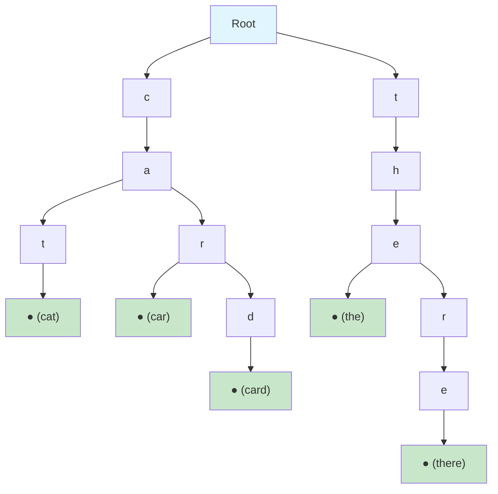
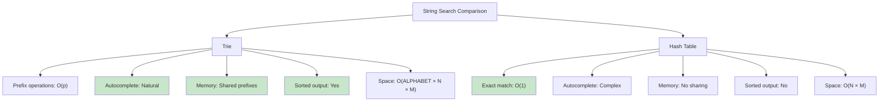
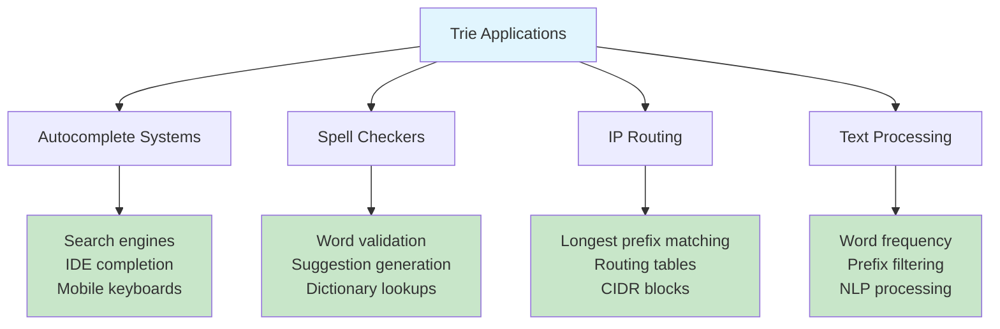
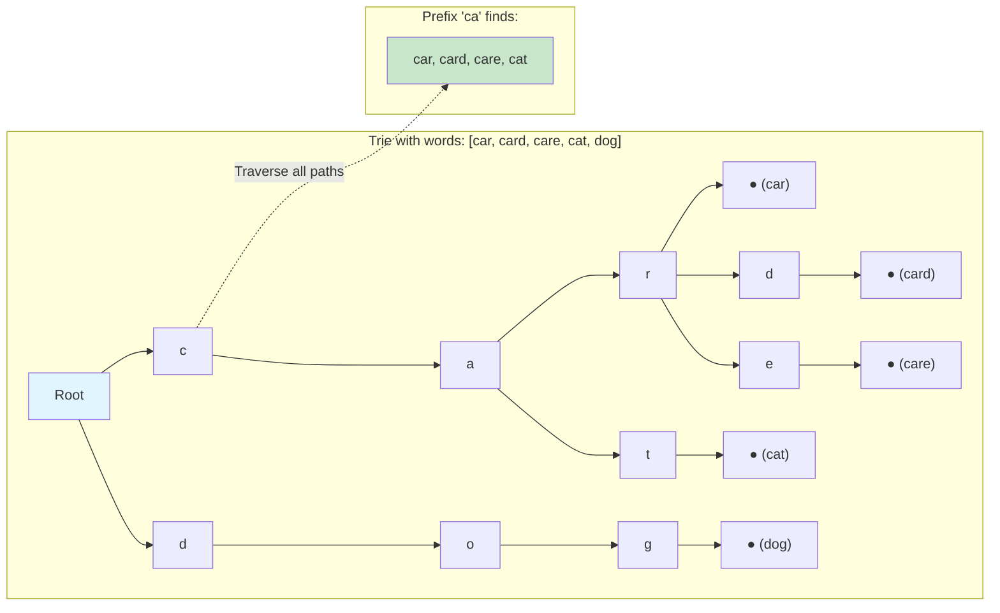
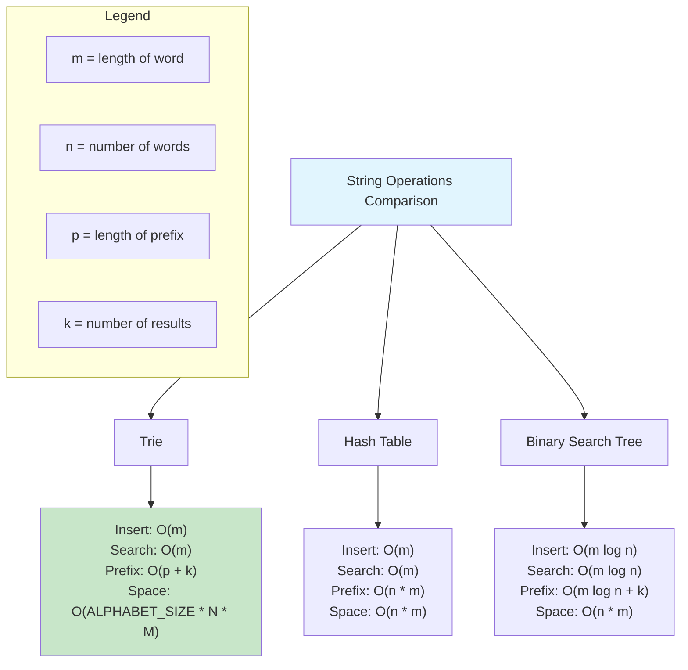
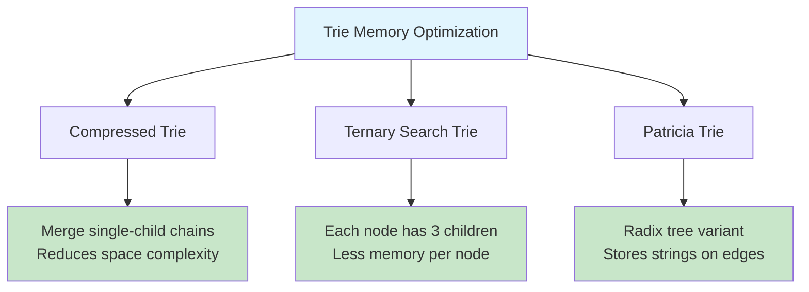

# Trie (Prefix Tree)

## Description

Implementation of a Trie (prefix tree) data structure optimized for autocomplete functionality. A Trie is a tree-like data structure that stores strings in a way that allows for efficient prefix-based operations. Each node represents a character, and paths from root to leaf represent complete words.

## Visual Representation

### Trie Structure Example



### Insert Operation Flow

```mermaid
graph TD
    A[Insert word: "cat"] --> B[Start at root]
    B --> C[Get first char: 'c']
    C --> D{Child 'c' exists?}
    D -->|No| E[Create new node 'c']
    D -->|Yes| F[Go to existing 'c' node]
    E --> G[Move to 'c' node]
    F --> G
    G --> H[Get next char: 'a']
    H --> I{Child 'a' exists?}
    I -->|No| J[Create new node 'a']
    I -->|Yes| K[Go to existing 'a' node]
    J --> L[Move to 'a' node]
    K --> L
    L --> M[Get next char: 't']
    M --> N{Child 't' exists?}
    N -->|No| O[Create new node 't']
    N -->|Yes| P[Go to existing 't' node]
    O --> Q[Move to 't' node]
    P --> Q
    Q --> R[Mark as end of word]

    style A fill:#e1f5fe
    style R fill:#c8e6c9
```

### Search Operation Flow

```mermaid
graph TD
    A[Search word: "car"] --> B[Start at root]
    B --> C[Get first char: 'c']
    C --> D{Child 'c' exists?}
    D -->|No| E[Return false]
    D -->|Yes| F[Move to 'c' node]
    F --> G[Get next char: 'a']
    G --> H{Child 'a' exists?}
    H -->|No| E
    H -->|Yes| I[Move to 'a' node]
    I --> J[Get next char: 'r']
    J --> K{Child 'r' exists?}
    K -->|No| E
    K -->|Yes| L[Move to 'r' node]
    L --> M{Is end of word?}
    M -->|Yes| N[Return true]
    M -->|No| E

    style A fill:#e1f5fe
    style N fill:#c8e6c9
    style E fill:#ffcdd2
```

### Autocomplete Process

```mermaid
graph TD
    A[Autocomplete prefix: "ca"] --> B[Navigate to prefix end]
    B --> C{Prefix exists?}
    C -->|No| D[Return empty list]
    C -->|Yes| E[Start DFS from prefix node]
    E --> F[Collect all words in subtree]
    F --> G[Sort results alphabetically]
    G --> H[Limit to max suggestions]
    H --> I[Return suggestions]

    subgraph "DFS Collection"
        J[Current node] --> K{Is end of word?}
        K -->|Yes| L[Add to results]
        K -->|No| M[Continue to children]
        L --> M
        M --> N[Visit all children recursively]
    end

    E --> J

    style A fill:#e1f5fe
    style I fill:#c8e6c9
    style D fill:#ffcdd2
```

### Prefix vs Hash Table Comparison



### Trie Applications Visualization



### Memory Layout and Node Structure

```mermaid
graph LR
    subgraph "Trie Node Structure"
        A[children: map[rune]*Node]
        B[isEndOfWord: bool]
        C[value: interface{}]
    end

    subgraph "Memory Layout Example"
        D["Root node"]
        E["├─ 'c' → Node"]
        F["│   ├─ 'a' → Node"]
        G["│   │   ├─ 't' → Node (word: 'cat')"]
        H["│   │   └─ 'r' → Node (word: 'car')"]
        I["└─ 't' → Node"]
        J["    └─ 'h' → Node"]
        K["        └─ 'e' → Node (word: 'the')"]
    end

    style A fill:#e1f5fe
    style D fill:#c8e6c9
```

## Features

- **Insert**: Add words to the trie
- **Search**: Check if a complete word exists
- **StartsWith**: Check if any word starts with given prefix
- **AutoComplete**: Get limited suggestions for a prefix
- **GetWordsWithPrefix**: Get all words starting with prefix
- **Delete**: Remove words from the trie
- **Case Insensitive**: Handles mixed case input
- **Utility Methods**: Size, IsEmpty, LongestCommonPrefix

## Trie Structure

```
Example Trie for words: ["app", "apple", "application"]

       root
        |
        a
        |
        p
        |
        p (end: "app")
        |
        l
       / \
      e   i
      |   |
      *   c
         / \
        a   ...
        |
        t
        |
        i
        |
        o
        |
        n (end: "application")
```

## Operations

### Insert

- Traverse character by character
- Create nodes as needed
- Mark end of word
- **Time**: O(m), **Space**: O(m) where m = word length

### Search

- Traverse character by character
- Check if path exists and ends at word
- **Time**: O(m), **Space**: O(1)

### Prefix Operations

- Navigate to prefix end
- Collect all words in subtree
- **Time**: O(p + n) where p = prefix length, n = results
- **Space**: O(n) for results

### AutoComplete

- Find prefix subtree
- Collect words with limit
- Sort results alphabetically
- **Time**: O(p + k log k) where k = suggestions
- **Space**: O(k)

## Complexity

### Time Complexity

- **Insert**: O(m) where m = word length
- **Search**: O(m) where m = word length
- **StartsWith**: O(p) where p = prefix length
- **GetWordsWithPrefix**: O(p + n) where n = number of results
- **AutoComplete**: O(p + k log k) where k = max suggestions
- **Delete**: O(m) where m = word length

### Space Complexity

- **Storage**: O(ALPHABET_SIZE × N × M) worst case
- **Average**: Much better due to shared prefixes
- **Operations**: O(m) recursion depth for word operations

## Use Cases

### Autocomplete Systems

- Search engines (Google, Bing)
- IDE code completion
- Mobile keyboard suggestions
- E-commerce product search

### Spell Checkers

- Word validation
- Suggestion generation
- Dictionary lookups

### IP Routing

- Longest prefix matching
- Network routing tables
- CIDR block management

### Text Processing

- Word frequency analysis
- Prefix-based filtering
- Natural language processing

## Advantages

- **Efficient Prefix Operations**: O(p) for prefix queries
- **Memory Efficient**: Shared prefixes save space
- **Sorted Output**: Natural alphabetical ordering
- **Flexible**: Easy to extend with additional features

## Disadvantages

- **Memory Overhead**: Pointer storage for sparse tries
- **Cache Performance**: Poor locality for large alphabets
- **Implementation Complexity**: More complex than hash tables

## Real-World Applications

### Search Engines

- Query autocompletion
- "Did you mean?" suggestions
- Related search terms

### Mobile Applications

- Contact name search
- App name filtering
- Predictive text input

### Development Tools

- Variable name completion
- API method suggestions
- File path completion

## Usage

```bash
make run NAME=0019-trie
```

## Testing

```bash
make test NAME=0019-trie
```

# Trie Data Structure

## Description

A Trie (pronounced "try") is a tree-like data structure used to store a dynamic set of strings, where the keys are usually strings. It's particularly efficient for prefix-based operations like autocomplete, spell checkers, and IP routing.

## Visual Representation

### Trie Structure Example


### Insert Operation Flow

```mermaid
graph TD
    A[Insert word: "CAR"] --> B[Start at root]
    B --> C[Current char: 'C']
    C --> D{Child 'C' exists?}
    D -->|No| E[Create new node 'C']
    D -->|Yes| F[Move to child 'C']
    E --> F
    F --> G[Current char: 'A']
    G --> H{Child 'A' exists?}
    H -->|No| I[Create new node 'A']
    H -->|Yes| J[Move to child 'A']
    I --> J
    J --> K[Current char: 'R']
    K --> L{Child 'R' exists?}
    L -->|No| M[Create new node 'R']
    L -->|Yes| N[Move to child 'R']
    M --> N
    N --> O[Mark as end of word]
    O --> P[Insert Complete]

    style A fill:#e1f5fe
    style P fill:#c8e6c9
```

### Search Operation Flow

```mermaid
graph TD
    A[Search word: "CAT"] --> B[Start at root]
    B --> C[Current char: 'C']
    C --> D{Child 'C' exists?}
    D -->|No| E[Return false]
    D -->|Yes| F[Move to child 'C']
    F --> G[Current char: 'A']
    G --> H{Child 'A' exists?}
    H -->|No| I[Return false]
    H -->|Yes| J[Move to child 'A']
    J --> K[Current char: 'T']
    K --> L{Child 'T' exists?}
    L -->|No| M[Return false]
    L -->|Yes| N[Move to child 'T']
    N --> O{Is end of word?}
    O -->|Yes| P[Return true]
    O -->|No| Q[Return false]

    style A fill:#e1f5fe
    style P fill:#c8e6c9
    style E fill:#ffcdd2
    style I fill:#ffcdd2
    style M fill:#ffcdd2
    style Q fill:#ffcdd2
```

### Prefix Search Visualization



### AutoComplete Implementation

```mermaid
graph TD
    A[User types: "ca"] --> B[Find prefix node]
    B --> C[DFS from prefix node]
    C --> D[Collect all complete words]
    D --> E[Return suggestions]

    subgraph "Suggestions"
        F[car]
        G[card]
        H[care]
        I[cat]
    end

    E --> F
    E --> G
    E --> H
    E --> I

    style A fill:#e1f5fe
    style E fill:#c8e6c9
```

### Trie vs Other Data Structures



### Memory Optimization Strategies



A Trie (pronounced "try") is a tree-like data structure used to store a dynamic set of strings, where the keys are usually strings.
