# Graph Adjacency Matrix

## Description

A Graph Adjacency Matrix is a 2D array representation of a graph where matrix[i][j] indicates whether there is an edge between vertex i and vertex j. This representation is efficient for dense graphs and provides O(1) edge lookup time.

## Visual Representation

### Basic Graph and Matrix Representation

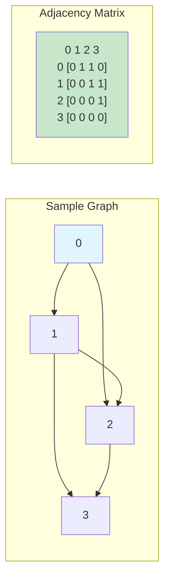

### Directed vs Undirected Graphs

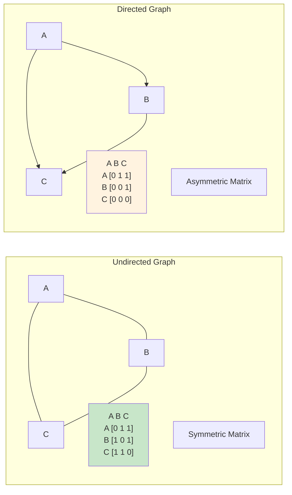

### Weighted Graph Representation

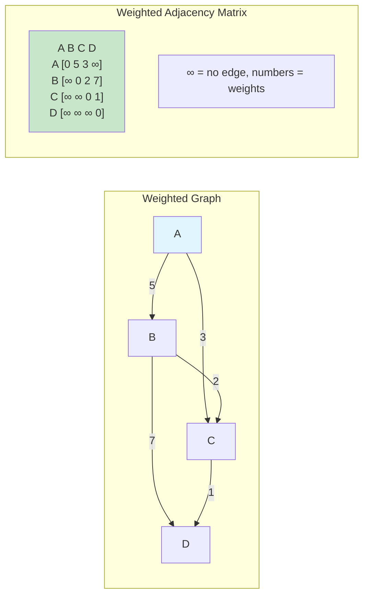

### Matrix Operations

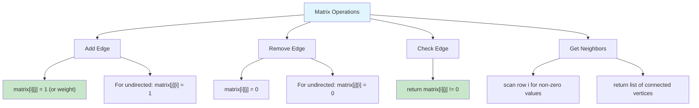

### Space and Time Complexity

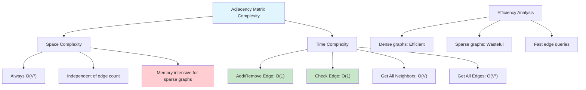

### Matrix Properties

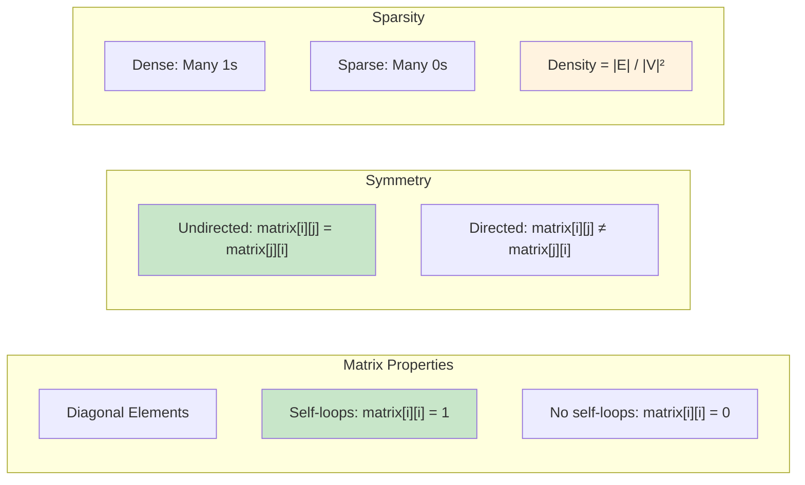

### Common Graph Algorithms with Matrix

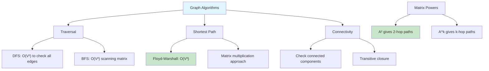

### Matrix vs List Comparison

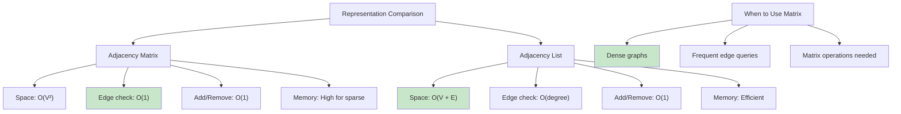

### Implementation Details

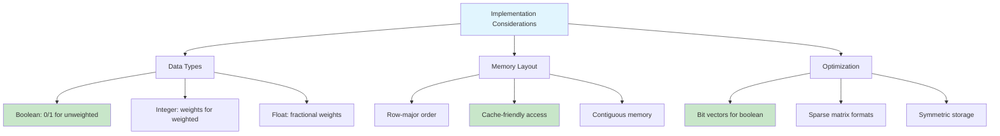

### Real-World Applications

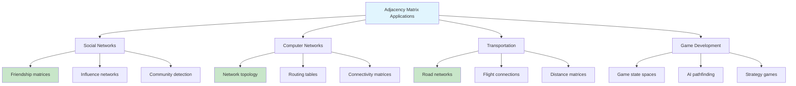

### Matrix Initialization and Updates

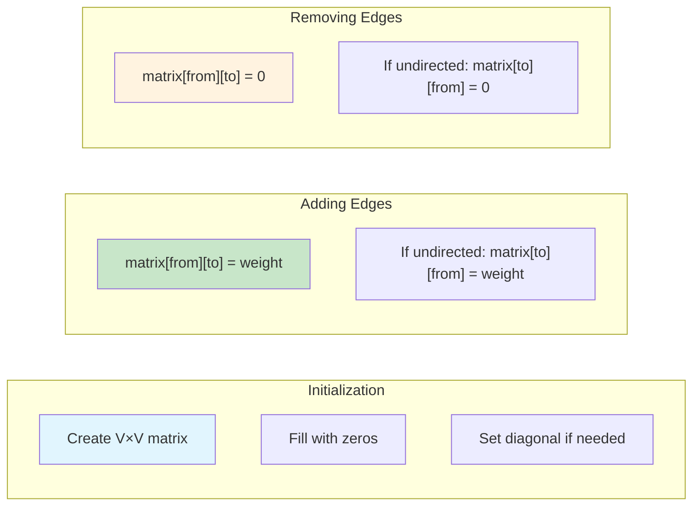

A Graph Adjacency Matrix is a 2D array representation of a graph where matrix[i][j] indicates whether there is an edge between vertex i and vertex j.

### Features

- **Graph Types**: Directed and undirected graphs
- **Core Operations**: Add/remove edges, check edge existence, get neighbors
- **Traversal Algorithms**:
  - Breadth-First Search (BFS) - iterative implementation
  - Depth-First Search (DFS) - recursive implementation
  - DFS Iterative - stack-based implementation
- **Graph Analysis**: Connectivity checking, cycle detection
- **Utility Methods**: Print graph structure, neighbor enumeration

### Data Structure

- **Adjacency Matrix**: 2D array where `matrix[i][j] = 1` indicates an edge from vertex i to vertex j
- **Space Efficient**: For dense graphs (many edges relative to vertices)
- **Fast Edge Lookup**: O(1) time complexity for checking if edge exists

## Complexity

### Time Complexity

- **Add Edge**: O(1)
- **Remove Edge**: O(1)
- **Has Edge**: O(1)
- **Get Neighbors**: O(V) where V is number of vertices
- **BFS Traversal**: O(V²) - visits each vertex once, checks all V neighbors for each
- **DFS Traversal**: O(V²) - visits each vertex once, checks all V neighbors for each
- **Is Connected**: O(V²) - performs BFS traversal
- **Has Cycle**: O(V²) - performs DFS with recursion stack tracking

### Space Complexity

- **Graph Storage**: O(V²) - adjacency matrix requires V×V space
- **BFS**: O(V) - queue and visited array
- **DFS**: O(V) - recursion stack and visited array
- **Overall**: O(V²) - dominated by matrix storage

## Usage

```bash
make run NAME=0020-graph-adjacency-matrix
```

## Testing

```bash
make test NAME=0020-graph-adjacency-matrix
```
