# Graph Adjacency List

## Description

A Graph Adjacency List represents a graph as an array of linked lists or dynamic arrays. Each vertex has a list of its adjacent vertices, making it memory-efficient for sparse graphs and providing fast neighbor iteration.

## Visual Representation

### Basic Graph and List Representation


### Directed vs Undirected Representation


### Weighted Graph Representation


### List Operations


### Memory Layout and Structure


### Space and Time Complexity


### Graph Traversal with Adjacency Lists


### List vs Matrix Comparison

```mermaid
graph TD
    A[Representation Comparison] --> B[Adjacency List]
    A --> C[Adjacency Matrix]

    B --> B1["Space: O(V + E)"]
    B --> B2["Sparse graph friendly"]
    B --> B3["Edge check: O(degree)"]
    B --> B4["Neighbor iteration: O(degree)"]
    B --> B5["Dynamic graph support"]

    C --> C1["Space: O(V²)"]
    C --> C2["Dense graph suitable"]
    C --> C3["Edge check: O(1)"]
    C --> C4["Neighbor iteration: O(V)"]
    C --> C5["Fixed vertex count"]

    D[Best Use Cases] --> E["Lists: Sparse graphs, traversals"]
    D --> F["Matrix: Dense graphs, edge queries"]

    style B1 fill:#c8e6c9
    style B4 fill:#c8e6c9
    style C3 fill:#fff3e0
```



### Implementation Variants


### Real-World Applications


### Memory Optimization Techniques


### Common Algorithms Implementation


A Graph Adjacency List represents a graph as an array of linked lists or dynamic arrays.

### Features

- **Graph Types**: Directed and undirected graphs
- **Core Operations**: Add/remove edges, check edge existence, get neighbors
- **Traversal Algorithms**:
  - Breadth-First Search (BFS) - iterative implementation
  - Depth-First Search (DFS) - recursive implementation
  - DFS Iterative - stack-based implementation
- **Graph Analysis**: Connectivity checking, cycle detection, topological sorting
- **Utility Methods**: Print graph structure, vertex/edge counting, neighbor enumeration
- **Advanced Features**: Topological sort for DAGs (Directed Acyclic Graphs)

### Data Structure

- **Adjacency List**: Map where each vertex maps to a slice of its neighbors
- **Space Efficient**: For sparse graphs (few edges relative to vertices)
- **Dynamic Storage**: Only stores actual edges, no wasted space for non-existent edges

## Complexity

### Time Complexity

- **Add Edge**: O(1) average case
- **Remove Edge**: O(degree) where degree is number of neighbors
- **Has Edge**: O(degree) where degree is number of neighbors
- **Get Neighbors**: O(1) - direct map lookup
- **BFS Traversal**: O(V + E) where V is vertices, E is edges
- **DFS Traversal**: O(V + E) where V is vertices, E is edges
- **Is Connected**: O(V + E) - performs BFS traversal
- **Has Cycle**: O(V + E) - performs DFS with recursion stack tracking
- **Topological Sort**: O(V + E) - DFS-based algorithm

### Space Complexity

- **Graph Storage**: O(V + E) - vertices plus edges
- **BFS**: O(V) - queue and visited array
- **DFS**: O(V) - recursion stack and visited array
- **Topological Sort**: O(V) - visited array and result stack
- **Overall**: O(V + E) - optimal for sparse graphs

## Usage

```bash
make run NAME=0021-graph-adjacency-list
```

## Testing

```bash
make test NAME=0021-graph-adjacency-list
```
