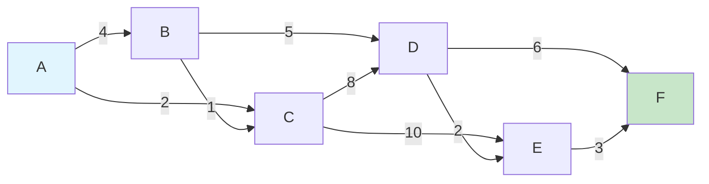
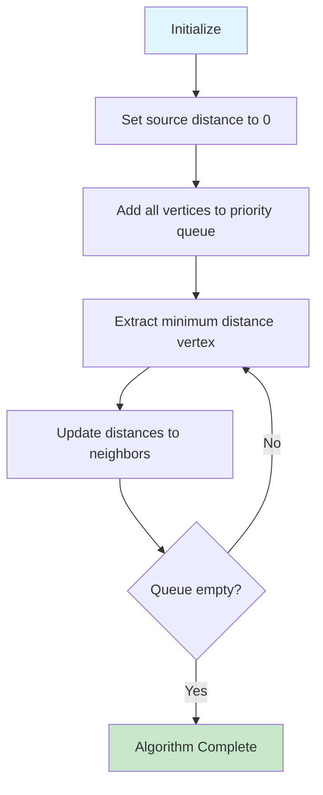
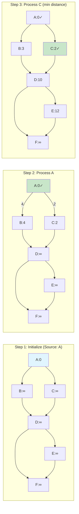
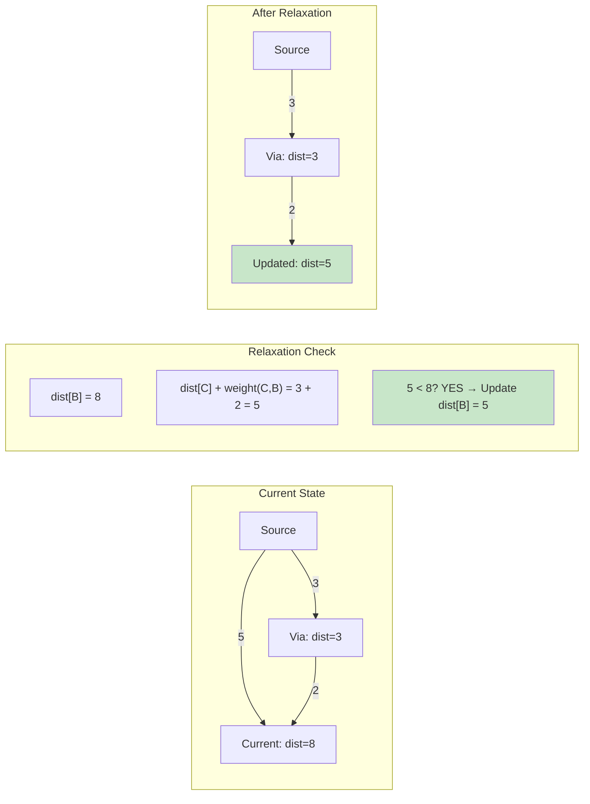
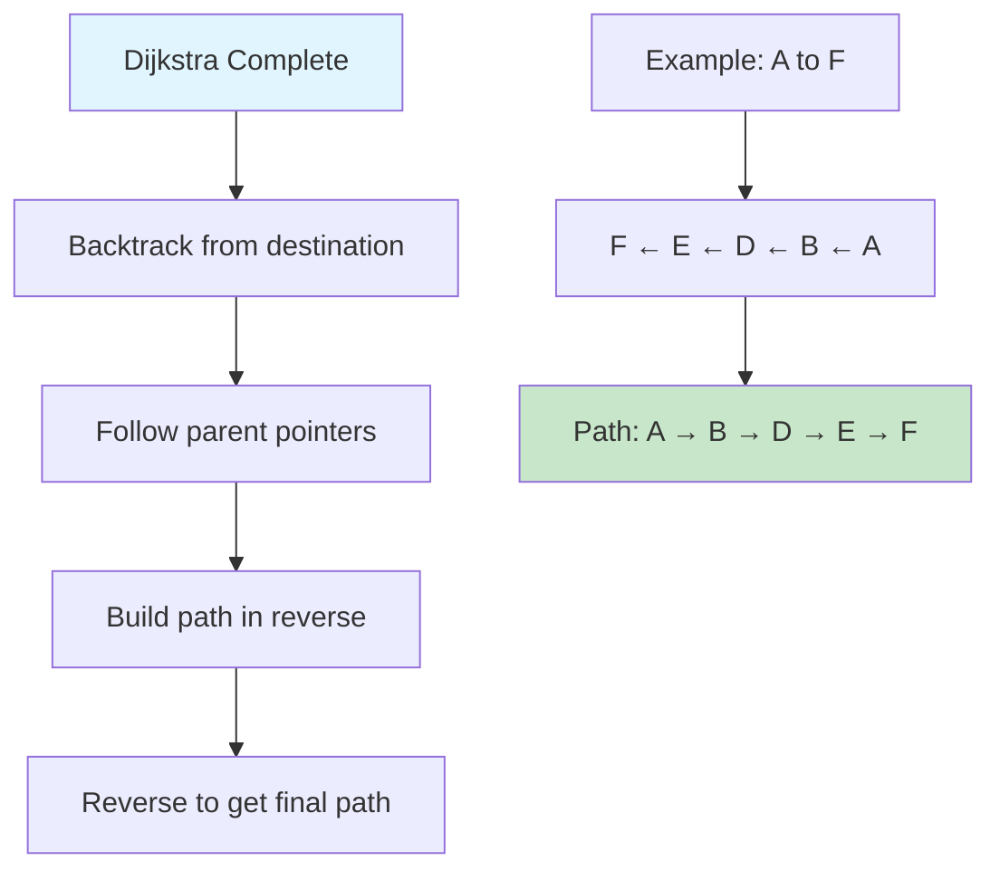
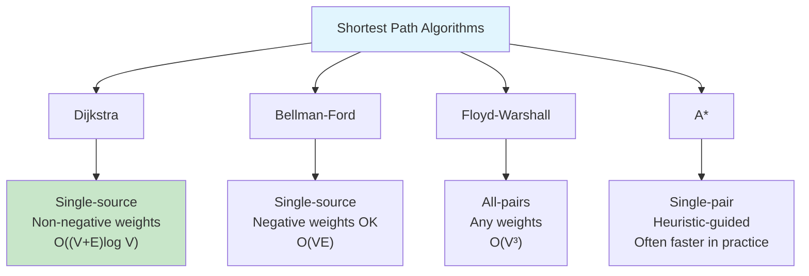
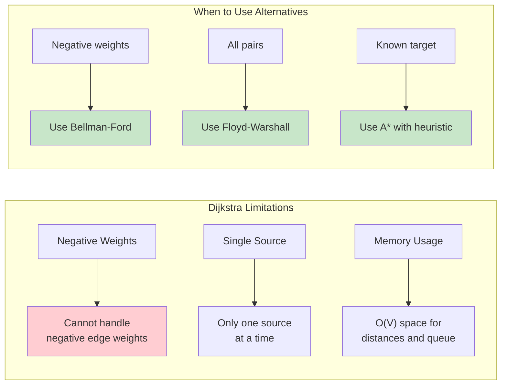
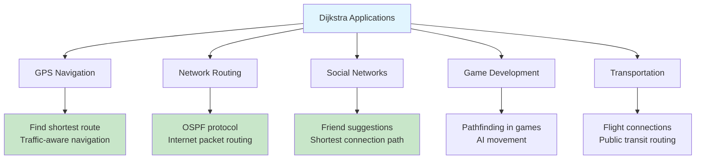
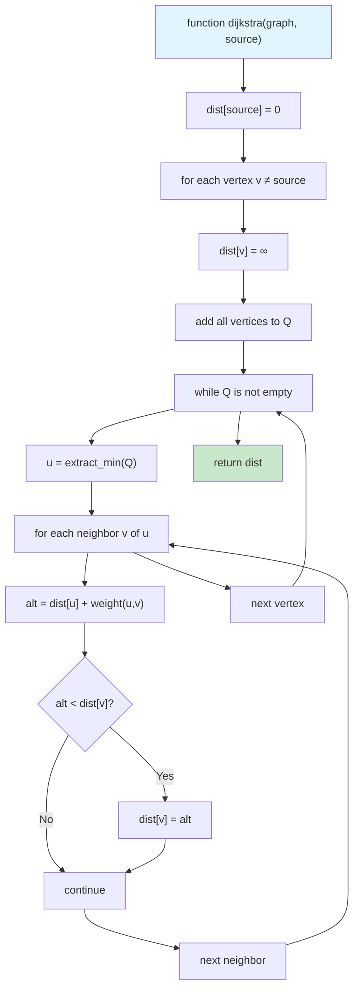

# Dijkstra's Algorithm

## Description

Dijkstra's Algorithm is a graph search algorithm that finds the shortest path between nodes in a weighted graph with non-negative edge weights. It's widely used in network routing protocols, GPS navigation systems, and social networking analysis.

## Visual Representation

### Graph Example



### Algorithm Step-by-Step Execution



### Dijkstra's Execution Example



### Priority Queue Operations

```mermaid
graph TD
    A[Priority Queue in Dijkstra] --> B[Min-Heap Implementation]
    B --> C[Extract-Min: O(log V)]
    B --> D[Decrease-Key: O(log V)]

    E[Alternative: Simple Array] --> F[Extract-Min: O(V)]
    E --> G[Decrease-Key: O(1)]

    H[Total Complexity] --> I["Heap: O((V + E) log V)"]
    H --> J["Array: O(V²)"]

    style A fill:#e1f5fe
    style I fill:#c8e6c9
    style J fill:#fff3e0
```

### Distance Relaxation Process



### Path Reconstruction



### Dijkstra vs Other Algorithms



### Algorithm Limitations



### Real-World Applications



### Pseudocode Visualization



Dijkstra's Algorithm is a graph search algorithm that finds the shortest path between nodes in a weighted graph with non-negative edge weights.

## Implementation Details

### Data Structures

- **Graph**: Adjacency list representation with weighted edges
- **Priority Queue**: Min-heap for efficient minimum distance vertex selection
- **Result**: Contains distances array, predecessor array, and source vertex

### Core Functions

- `NewGraph(vertices)`: Creates a new graph with specified number of vertices
- `AddEdge(from, to, weight)`: Adds a directed weighted edge
- `AddBidirectionalEdge(u, v, weight)`: Adds edges in both directions
- `Dijkstra(source)`: Executes the algorithm from given source
- `GetPath(target)`: Reconstructs shortest path to target vertex
- `GetDistance(target)`: Returns shortest distance to target vertex
- `HasPath(target)`: Checks if target is reachable from source

## Complexity

- **Time Complexity**: O((V + E) log V) where V is vertices and E is edges
  - Each vertex is extracted from priority queue once: O(V log V)
  - Each edge is relaxed at most once: O(E log V)
- **Space Complexity**: O(V + E)
  - Adjacency list: O(V + E)
  - Distance and predecessor arrays: O(V)
  - Priority queue: O(V)

## Algorithm Steps

1. Initialize distances to all vertices as infinite, except source (distance 0)
2. Add source vertex to priority queue with distance 0
3. While priority queue is not empty:
   - Extract vertex with minimum distance
   - Mark as visited
   - For each unvisited neighbor:
     - Calculate new distance through current vertex
     - If new distance is shorter, update distance and predecessor
     - Add neighbor to priority queue with new distance
4. Return distances and predecessor arrays

## Usage

```bash
make run n=dijkstra-algorithm
```

### Example Output

```
Result: map[
  distances:[0 4 3 6 8 14]
  paths:map[
    1:[0 2 1]
    2:[0 2]
    3:[0 2 1 3]
    4:[0 2 1 3 4]
    5:[0 2 1 3 4 5]
  ]
  source:0
]
```

## Testing

```bash
make test n=dijkstra-algorithm
```

### Test Coverage

- Graph construction and edge addition
- Basic shortest path computation
- Disconnected graph handling
- Invalid source vertex handling
- Path reconstruction for reachable and unreachable vertices
- Distance queries and path existence checks
- Complex graph scenarios
- Edge cases (single vertex, linear chains, etc.)

## Benchmarking

```bash
make bench n=dijkstra-algorithm
```

### Benchmark Scenarios

- Small graphs (10 vertices)
- Medium graphs (100 vertices)
- Large graphs (1000 vertices)
- Dense graphs (complete graphs)
- Path reconstruction operations

## Applications

- **GPS Navigation**: Finding shortest routes between locations
- **Network Routing**: Optimal packet routing in computer networks
- **Social Networks**: Finding shortest connections between people
- **Game Development**: Pathfinding for NPCs and game mechanics
- **Airline Routes**: Finding cheapest flight connections
- **Supply Chain**: Optimizing delivery routes and costs

## Limitations

- **Non-negative weights only**: Cannot handle negative edge weights
- **Single source**: Must run multiple times for all-pairs shortest paths
- **Memory intensive**: Requires O(V²) space for dense graphs
- **Not suitable for dynamic graphs**: Recalculation needed when graph changes

## Variations

- **Bidirectional Dijkstra**: Search from both source and target
- **A\* Algorithm**: Uses heuristics for faster pathfinding
- **Johnson's Algorithm**: Handles negative weights by preprocessing
- **Dial's Algorithm**: Optimization for small integer weights
