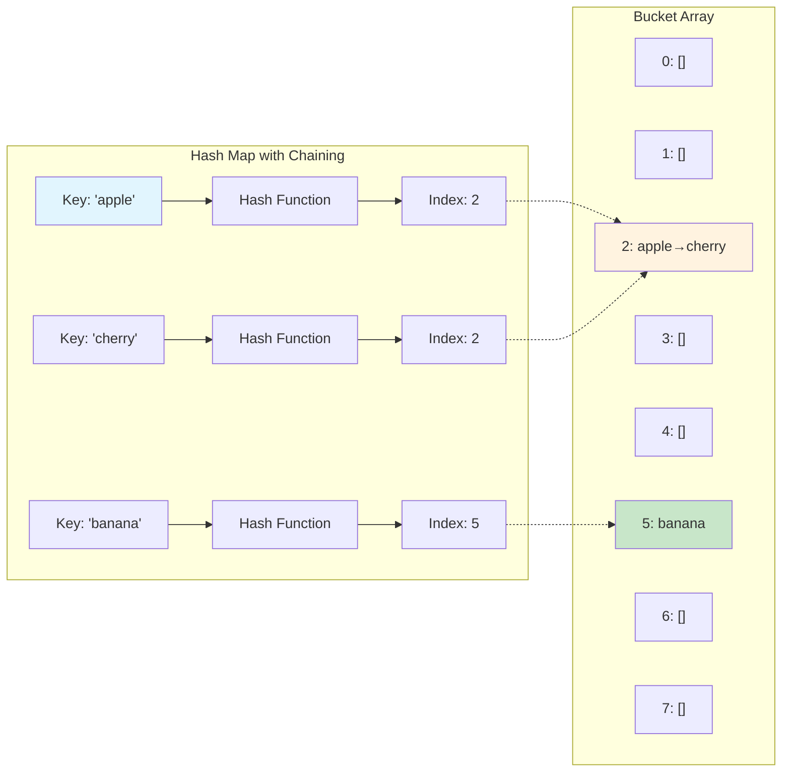
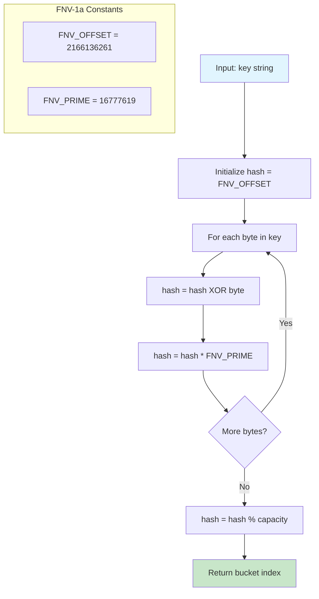
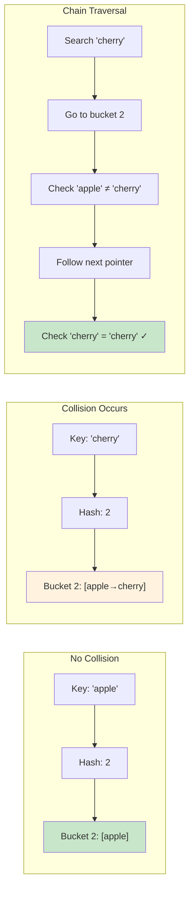
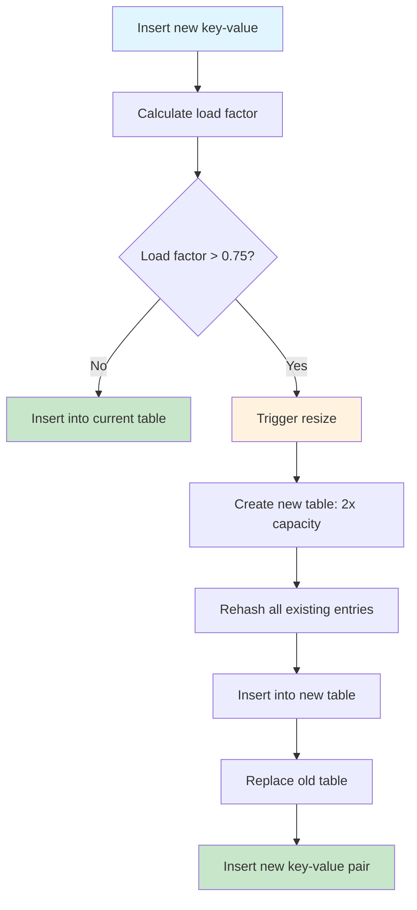
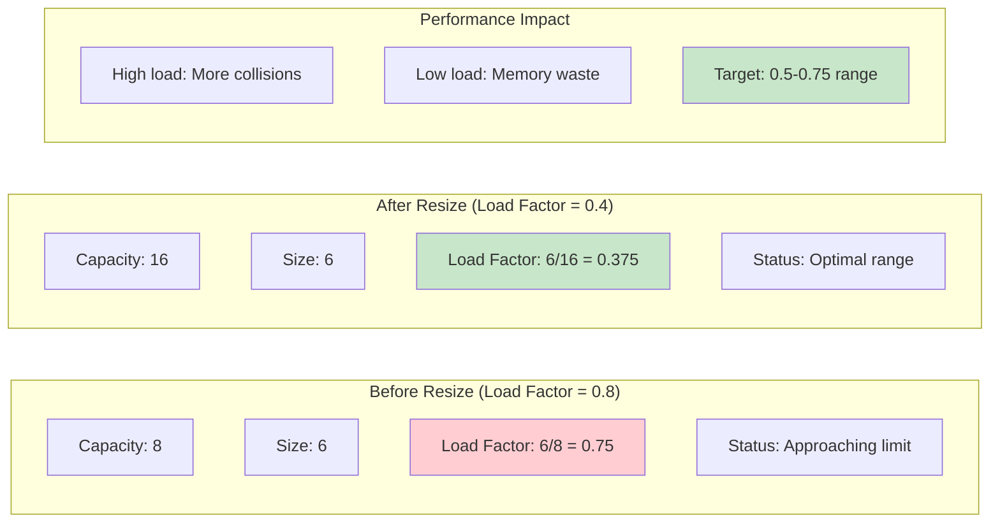
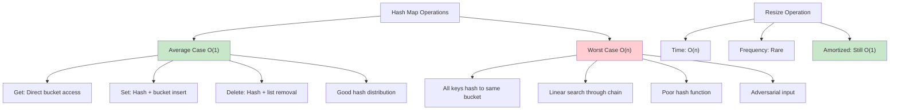
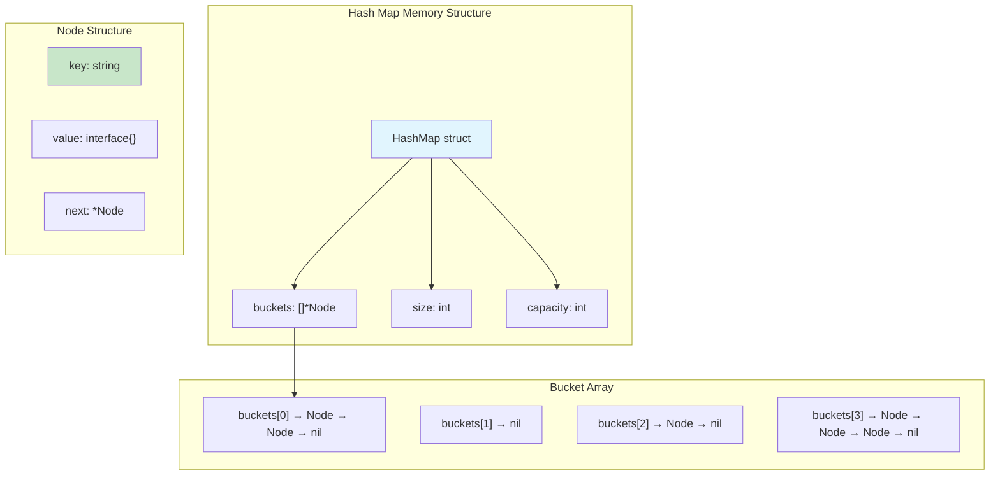
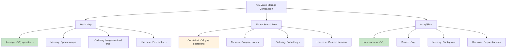

# Hash Map

## Description

A complete hash map (hash table) implementation from scratch using separate chaining for collision resolution. This implementation provides O(1) average-case performance for insertion, lookup, and deletion operations with automatic resizing to maintain optimal load factors.

## Visual Representation

### Hash Map Structure



### Hash Function Process (FNV-1a)



### Collision Resolution: Separate Chaining



### Dynamic Resizing Process



### Load Factor Visualization



### Hash Map Operations Complexity



### Memory Layout



### Comparison with Other Data Structures



## Key Features

- **Separate Chaining**: Uses linked lists to handle hash collisions
- **Dynamic Resizing**: Automatically doubles capacity when load factor exceeds 0.75
- **Generic Values**: Supports any value type with string keys
- **FNV Hash Function**: Uses FNV-1a hash algorithm for good distribution
- **Complete API**: Standard hash map operations plus utility methods

## Implementation Details

- **Hash Function**: FNV-1a (Fowler-Noll-Vo) hash algorithm
- **Collision Resolution**: Separate chaining with linked lists
- **Load Factor**: Maintains load factor below 0.75 via automatic resizing
- **Resize Strategy**: Doubles capacity and rehashes all elements
- **Default Capacity**: 16 buckets initially

## Complexity

- **Time Complexity**:
  - Average case: O(1) for Get, Set, Delete, Has
  - Worst case: O(n) when all keys hash to the same bucket
  - Resize operation: O(n) to rehash all elements
- **Space Complexity**: O(n) where n is the number of key-value pairs

## Core Operations

### Basic Operations

- `Set(key, value)` - Insert or update a key-value pair
- `Get(key)` - Retrieve value by key, returns (value, exists)
- `Delete(key)` - Remove key-value pair, returns success boolean
- `Has(key)` - Check if key exists
- `Size()` - Get number of stored pairs
- `IsEmpty()` - Check if hash map is empty
- `Clear()` - Remove all key-value pairs

### Utility Operations

- `Keys()` - Get slice of all keys
- `Values()` - Get slice of all values
- `Entries()` - Get slice of all key-value pairs
- `ForEach(func)` - Iterate over all pairs with callback
- `LoadFactor()` - Get current load factor
- `Capacity()` - Get current bucket capacity

### Advanced Operations

- `GetBucketDistribution()` - Get distribution of items across buckets (for analysis)

## Usage

```bash
make run n=hash-map
```

## Testing

```bash
make test n=hash-map
```

## Benchmarking

```bash
make bench n=hash-map
```

## Example Usage in Go

```go
// Create a new hash map
hm := NewHashMap()

// Insert key-value pairs
hm.Set("name", "Alice")
hm.Set("age", 30)
hm.Set("city", "New York")

// Retrieve values
name, exists := hm.Get("name")
if exists {
    fmt.Printf("Name: %s\n", name)
}

// Check if key exists
if hm.Has("age") {
    fmt.Println("Age is stored")
}

// Delete a key
deleted := hm.Delete("city")
fmt.Printf("City deleted: %t\n", deleted)

// Get all keys
keys := hm.Keys()
fmt.Printf("Keys: %v\n", keys)

// Iterate over all pairs
hm.ForEach(func(key string, value any) {
    fmt.Printf("%s: %v\n", key, value)
})

// Check statistics
fmt.Printf("Size: %d\n", hm.Size())
fmt.Printf("Load Factor: %.2f\n", hm.LoadFactor())
fmt.Printf("Capacity: %d\n", hm.Capacity())
```

## Performance Characteristics

### Average Case Performance

- **Insertion**: O(1) - Direct bucket access via hash
- **Lookup**: O(1) - Direct bucket access via hash
- **Deletion**: O(1) - Direct bucket access via hash
- **Iteration**: O(n) - Must visit all stored elements

### Worst Case Performance

- **All Operations**: O(n) - When all keys hash to same bucket
- **Resize**: O(n) - Must rehash all existing elements

### Memory Usage

- **Base Memory**: O(capacity) for bucket array
- **Element Memory**: O(n) for stored key-value pairs
- **Overhead**: Minimal - only bucket pointers and size tracking

## Load Factor and Resizing

- **Target Load Factor**: 0.75 (75% of buckets occupied on average)
- **Resize Trigger**: When load factor exceeds 0.75
- **Resize Strategy**: Double the capacity and rehash all elements
- **Benefits**: Maintains good performance by reducing collision chains

## Hash Function

Uses FNV-1a (Fowler-Noll-Vo variant 1a) hash algorithm:

- **Fast**: Simple operations (XOR and multiply)
- **Good Distribution**: Minimizes clustering and collisions
- **Deterministic**: Same key always produces same hash
- **Avalanche Effect**: Small input changes cause large hash changes

## Collision Resolution

Uses separate chaining with linked lists:

- **Pros**: Simple implementation, handles any number of collisions
- **Cons**: Extra memory overhead for pointers, potential cache misses
- **Performance**: Good average case, degrades gracefully under load

## Use Cases

- **Caches**: Fast key-value storage for computed results
- **Indexing**: Map unique identifiers to data records
- **Counting**: Count occurrences of items (frequency tables)
- **Sets**: Implement set operations using keys only
- **Lookup Tables**: Fast translation between different representations
- **Memoization**: Store function results for dynamic programming

## Advantages

- **Fast Operations**: O(1) average case for basic operations
- **Dynamic Sizing**: Grows automatically as needed
- **Simple Interface**: Easy to use standard hash map API
- **Collision Handling**: Robust separate chaining approach
- **Memory Efficient**: Only stores what's needed plus small overhead

## Limitations

- **String Keys Only**: Current implementation limited to string keys
- **Worst Case**: Can degrade to O(n) with poor hash distribution
- **Memory Overhead**: Requires extra space for buckets and pointers
- **No Ordering**: Keys are not stored in any particular order
- **Resize Cost**: Occasional O(n) resize operations

## Comparison with Alternatives

- **vs. Built-in Go map**: Similar performance, educational implementation
- **vs. Open Addressing**: Separate chaining uses more memory but handles collisions better
- **vs. Binary Search Tree**: Hash map is faster for basic operations (O(1) vs O(log n))
- **vs. Linear Search**: Hash map is much faster for large datasets (O(1) vs O(n))
