# LRU Cache

## Description

A complete LRU (Least Recently Used) cache implementation from scratch using a combination of a doubly-linked list and hash map. This provides O(1) time complexity for both get and put operations while maintaining the LRU eviction policy. When the cache reaches its capacity, the least recently used item is automatically evicted to make room for new entries.

## Visual Representation

### LRU Cache Architecture

```mermaid
graph TD
    subgraph "LRU Cache Structure"
        A[Hash Map] --> B[Key → Node Mapping]
        C[Doubly Linked List] --> D[Access Order Tracking]
    end

    subgraph "Memory Layout"
        E["head ↔ Node1 ↔ Node2 ↔ Node3 ↔ tail"]
        F["MRU (Most Recent) ← → LRU (Least Recent)"]
    end

    subgraph "Node Structure"
        G[key: string]
        H[value: interface{}]
        I[prev: *Node]
        J[next: *Node]
    end

    style A fill:#e1f5fe
    style E fill:#c8e6c9
    style G fill:#fff3e0
```

### Get Operation Flow

```mermaid
graph TD
    A[Get(key)] --> B{Key exists in hash map?}
    B -->|No| C[Return nil, false]
    B -->|Yes| D[Get node from hash map]
    D --> E[Remove node from current position]
    E --> F[Move node to head (most recent)]
    F --> G[Return node.value, true]

    subgraph "List Update"
        H[node.prev.next = node.next]
        I[node.next.prev = node.prev]
        J[Insert at head]
    end

    E --> H

    style A fill:#e1f5fe
    style G fill:#c8e6c9
    style C fill:#ffcdd2
```

### Put Operation Flow

```mermaid
graph TD
    A[Put(key, value)] --> B{Key exists?}
    B -->|Yes| C[Update existing node]
    B -->|No| D{Cache at capacity?}

    C --> E[Update value]
    E --> F[Move to head]

    D -->|No| G[Create new node]
    D -->|Yes| H[Remove LRU node]
    H --> I[Remove from hash map]
    I --> G

    G --> J[Add to hash map]
    J --> K[Insert at head]
    K --> L[Update size]

    style A fill:#e1f5fe
    style F fill:#c8e6c9
    style K fill:#c8e6c9
    style H fill:#fff3e0
```

### LRU Eviction Process

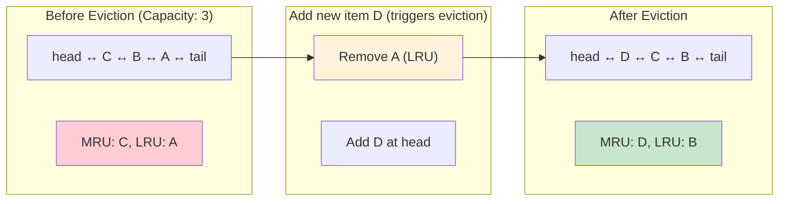

### Access Pattern Visualization

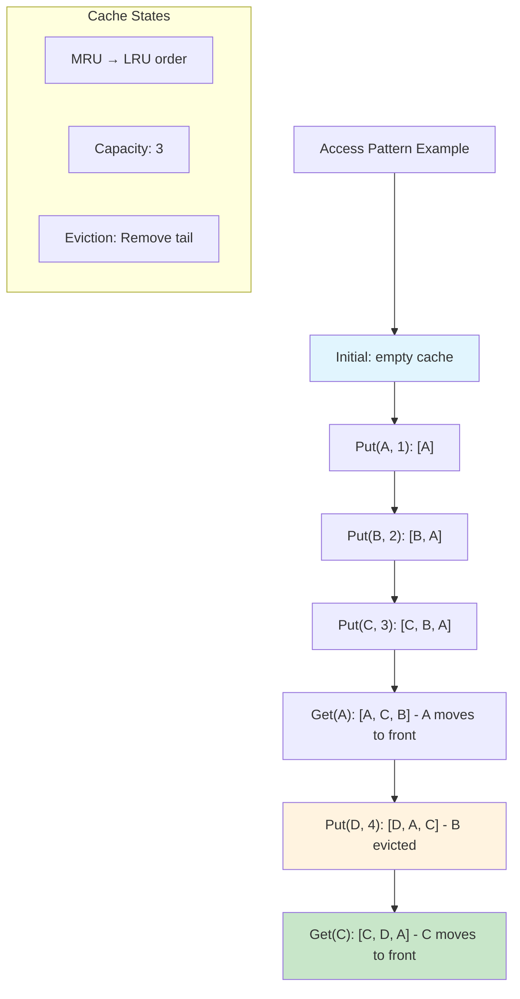

### Hash Map + Doubly Linked List Synergy

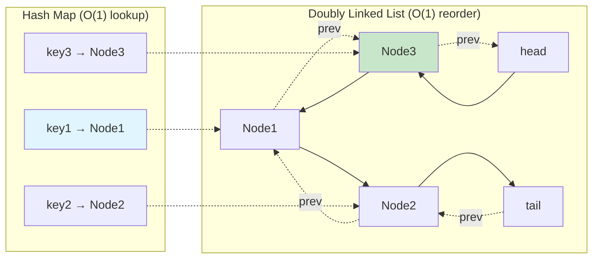

### Cache Hit vs Miss Scenarios

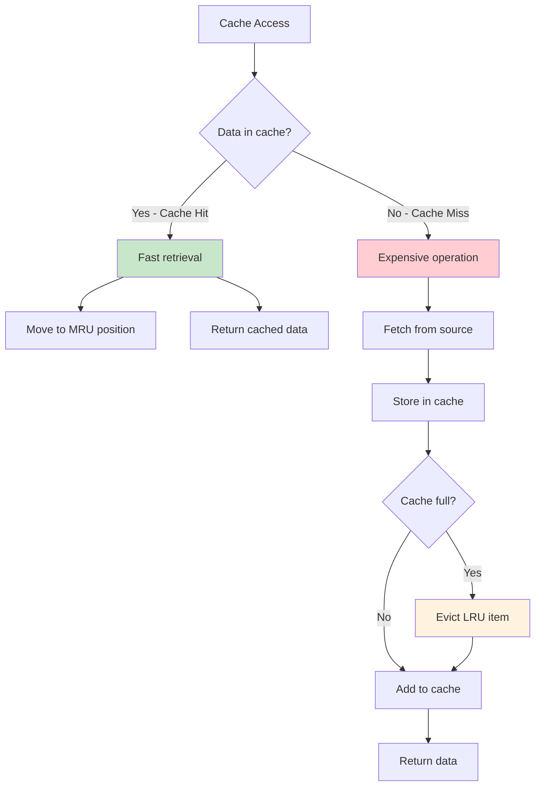

### LRU vs Other Eviction Policies

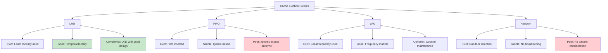

### Performance Analysis

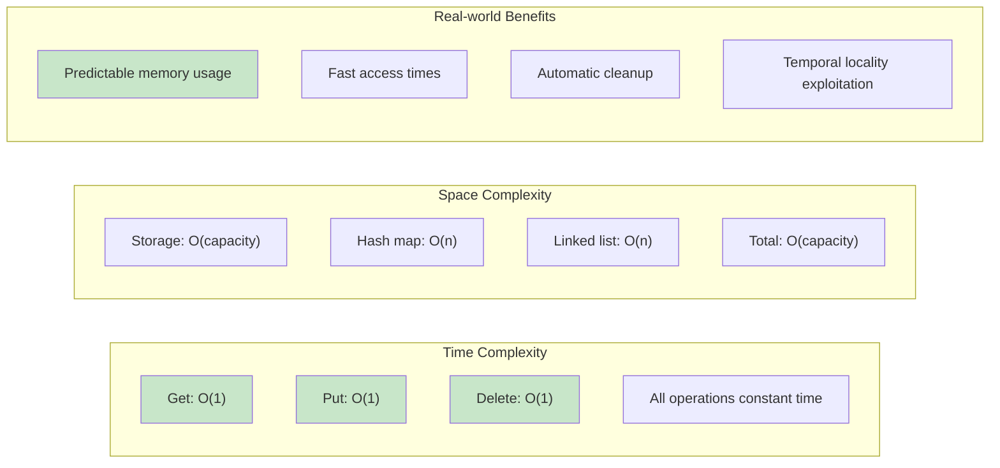

## Key Features

- **O(1) Operations**: Both get and put operations run in constant time
- **Doubly-Linked List**: Maintains access order efficiently
- **Hash Map**: Provides fast key-to-node lookups
- **Automatic Eviction**: Removes least recently used items when capacity is exceeded
- **Generic Values**: Supports any value type with string keys
- **Complete API**: Standard cache operations plus utility methods

## Implementation Details

- **Data Structure**: Combination of hash map and doubly-linked list
- **Eviction Policy**: Least Recently Used (LRU)
- **Capacity Management**: Fixed capacity with automatic eviction
- **Access Order**: Most recent items at head, least recent at tail
- **Sentinel Nodes**: Dummy head and tail nodes simplify list operations

## Complexity

- **Time Complexity**:
  - Get: O(1) - Hash map lookup + list node movement
  - Put: O(1) - Hash map insertion + list operations
  - Delete: O(1) - Hash map removal + list node removal
  - All other operations: O(1) or O(n) for iteration-based methods
- **Space Complexity**: O(capacity) for the cache storage

## Core Operations

### Basic Operations

- `Put(key, value)` - Insert or update a key-value pair (moves to front)
- `Get(key)` - Retrieve value by key and mark as recently used
- `Delete(key)` - Remove key-value pair from cache
- `Has(key)` - Check if key exists (without affecting access order)
- `Size()` - Get number of stored pairs
- `Capacity()` - Get maximum capacity
- `IsEmpty()` - Check if cache is empty
- `IsFull()` - Check if cache is at capacity
- `Clear()` - Remove all key-value pairs

### Utility Operations

- `Keys()` - Get slice of all keys in MRU order
- `Values()` - Get slice of all values in MRU order
- `Entries()` - Get slice of all key-value pairs in MRU order
- `ForEach(func)` - Iterate over all pairs in MRU order
- `Peek(key)` - Get value without affecting access order
- `GetMostRecentKey()` - Get the most recently used key
- `GetLeastRecentKey()` - Get the least recently used key

### Advanced Operations

- `SetCapacity(newCapacity)` - Change cache capacity (evicts items if needed)

## Usage

```bash
make run n=lru-cache
```

## Testing

```bash
make test n=lru-cache
```

## Benchmarking

```bash
make bench n=lru-cache
```

## Example Usage in Go

```go
// Create a new LRU cache with capacity 3
cache := NewLRUCache(3)

// Insert key-value pairs
cache.Put("user1", "Alice")
cache.Put("user2", "Bob")
cache.Put("user3", "Charlie")

// Retrieve values (marks as recently used)
user, exists := cache.Get("user1")
if exists {
    fmt.Printf("User: %s\n", user)
}

// Check if cache is full
if cache.IsFull() {
    fmt.Println("Cache is at capacity")
}

// Add another item (will evict least recently used)
cache.Put("user4", "David")

// user2 will be evicted since user1 was accessed recently
_, exists = cache.Get("user2")
fmt.Printf("User2 exists: %t\n", exists) // false

// Peek at value without affecting order
value, exists := cache.Peek("user3")
fmt.Printf("User3 (peek): %s\n", value)

// Get most and least recently used keys
mostRecent, _ := cache.GetMostRecentKey()
leastRecent, _ := cache.GetLeastRecentKey()
fmt.Printf("Most recent: %s, Least recent: %s\n", mostRecent, leastRecent)

// Iterate over all entries (in MRU order)
cache.ForEach(func(key string, value any) {
    fmt.Printf("%s: %v\n", key, value)
})

// Get cache statistics
fmt.Printf("Size: %d, Capacity: %d\n", cache.Size(), cache.Capacity())
```

## LRU Eviction Policy

The LRU (Least Recently Used) policy works as follows:

1. **Access Order**: Items are ordered by recency of access
2. **Most Recent**: Newly added or accessed items move to the front
3. **Least Recent**: Items not accessed for the longest time move to the back
4. **Eviction**: When capacity is exceeded, the item at the back is removed
5. **Update**: Updating an existing key moves it to the front

## Performance Characteristics

### Time Complexity

- **Get Operation**: O(1) - Hash lookup + list node movement
- **Put Operation**: O(1) - Hash insertion + list operations
- **Delete Operation**: O(1) - Hash removal + list node removal
- **Eviction**: O(1) - Remove tail node and hash entry
- **Iteration**: O(n) - Must visit all stored elements

### Space Complexity

- **Storage**: O(capacity) - Fixed maximum memory usage
- **Overhead**: O(1) per item - Hash entry + list node pointers
- **Total**: O(capacity) - Predictable memory footprint

## Implementation Strategy

### Data Structures

1. **Hash Map**: Maps keys to doubly-linked list nodes for O(1) lookup
2. **Doubly-Linked List**: Maintains access order with O(1) insertion/removal
3. **Sentinel Nodes**: Dummy head and tail simplify edge cases

### Key Operations

1. **Get**: Hash lookup → Move node to head → Return value
2. **Put**: Check if exists → Update or create → Move to head → Evict if needed
3. **Eviction**: Remove tail node → Delete from hash map → Decrement size

## Use Cases

- **Web Caches**: Store frequently accessed web pages or API responses
- **Database Query Caches**: Cache expensive database query results
- **Image/Asset Caches**: Store processed images or static assets
- **Session Storage**: Maintain user session data with automatic cleanup
- **Computation Caches**: Store results of expensive calculations
- **Memory Management**: Implement page replacement in operating systems
- **CDN Systems**: Content delivery network edge caching
- **Application Caches**: General-purpose application-level caching

## Advantages

- **Optimal Performance**: O(1) for all basic operations
- **Memory Efficient**: Fixed memory usage, automatic cleanup
- **Temporal Locality**: Exploits the principle that recently used items are likely to be used again
- **Simple Interface**: Easy to use standard cache API
- **Predictable Behavior**: Clear eviction policy and capacity management
- **Thread-Safe Design**: Can be easily extended with synchronization

## Limitations

- **String Keys Only**: Current implementation limited to string keys
- **Fixed Capacity**: Cannot grow beyond initial capacity (though capacity can be changed)
- **No Persistence**: Data is lost when cache is cleared or program exits
- **Memory Overhead**: Requires additional memory for hash map and list pointers
- **No TTL**: Items don't expire based on time, only on access patterns

## Comparison with Alternatives

### vs. Other Eviction Policies

- **vs. FIFO**: LRU considers access patterns, FIFO only insertion order
- **vs. LFU**: LRU focuses on recency, LFU on frequency of access
- **vs. Random**: LRU is deterministic and exploits temporal locality

### vs. Other Implementations

- **vs. Array-based**: Doubly-linked list provides O(1) reordering vs O(n) for arrays
- **vs. Single Hash Map**: Adding list maintains access order efficiently
- **vs. Built-in Maps**: LRU provides automatic eviction and capacity management

## Real-World Applications

- **Redis**: Uses LRU as one of its eviction policies
- **CPU Caches**: Hardware caches often use LRU or LRU approximations
- **Operating Systems**: Page replacement algorithms (though often use LRU approximations)
- **Web Browsers**: Cache management for web pages and resources
- **Database Systems**: Buffer pool management and query result caching

## Visual Representation

### LRU Cache Architecture

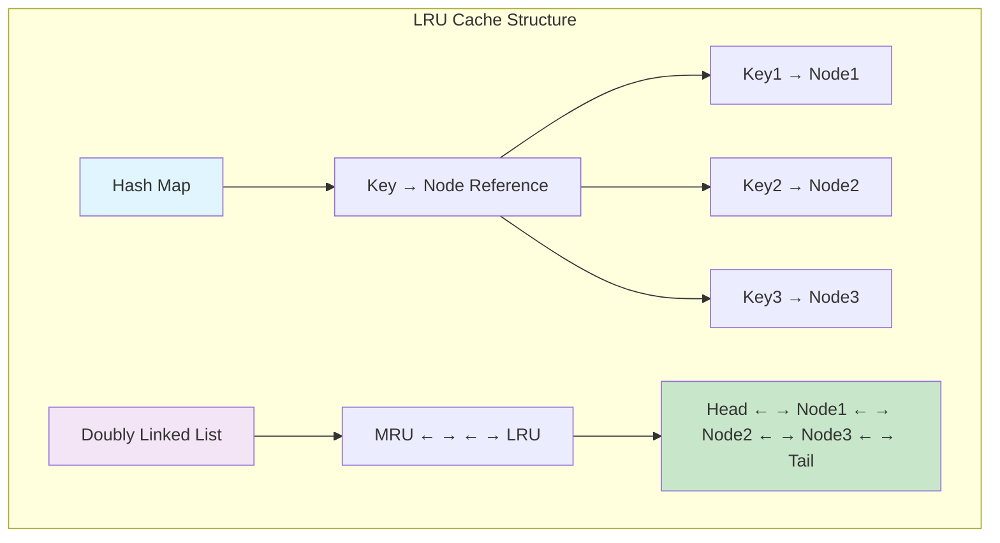

### Detailed Structure Visualization

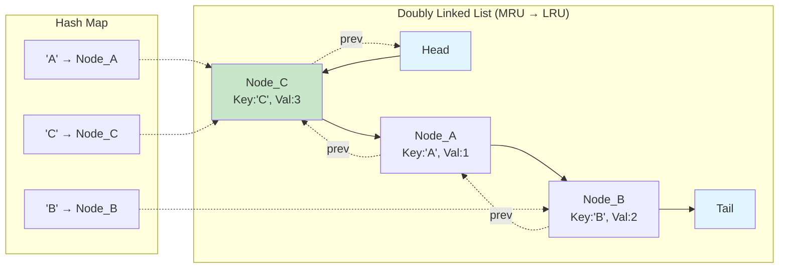

### Get Operation Flow

```mermaid
graph TD
    A[Get(key)] --> B{Key exists in HashMap?}
    B -->|No| C[Return -1]
    B -->|Yes| D[Get node reference]
    D --> E[Remove node from current position]
    E --> F[Move node to head (MRU)]
    F --> G[Return node value]

    style A fill:#e1f5fe
    style G fill:#c8e6c9
    style C fill:#ffcdd2
```

### Put Operation Flow

```mermaid
graph TD
    A[Put(key, value)] --> B{Key exists?}
    B -->|Yes| C[Update value]
    B -->|No| D{Cache at capacity?}

    C --> E[Move to head]
    C --> F[Operation complete]

    D -->|No| G[Create new node]
    D -->|Yes| H[Remove LRU node]

    H --> I[Remove from HashMap]
    I --> G
    G --> J[Add to head]
    J --> K[Add to HashMap]
    K --> L[Operation complete]

    E --> F

    style A fill:#e1f5fe
    style F fill:#c8e6c9
    style L fill:#c8e6c9
```

### LRU Eviction Example

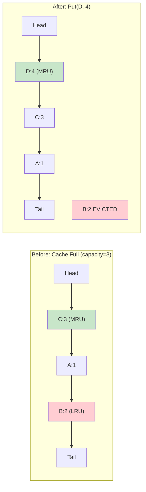

### Access Pattern Example

```mermaid
graph TD
    A[Initial: Put A,B,C] --> B[Cache: C→A→B]
    B --> C[Get(A)] --> D[Cache: A→C→B]
    D --> E[Put(D)] --> F[Cache: D→A→C (B evicted)]
    F --> G[Get(C)] --> H[Cache: C→D→A]
    H --> I[Put(E)] --> J[Cache: E→C→D (A evicted)]

    style A fill:#e1f5fe
    style J fill:#c8e6c9
```

### Node Structure Detail

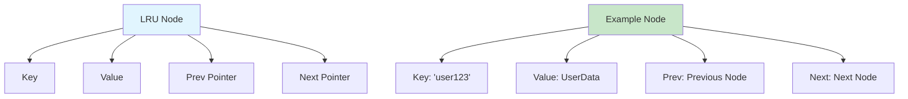

### Time Complexity Analysis

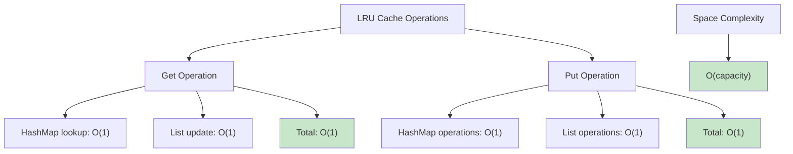

### LRU vs Other Eviction Policies

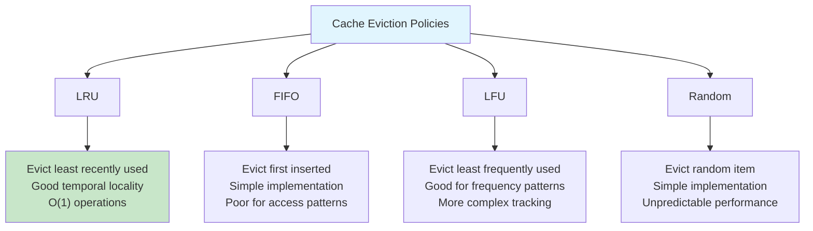

### Real-World Applications

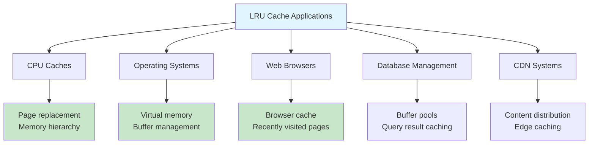
