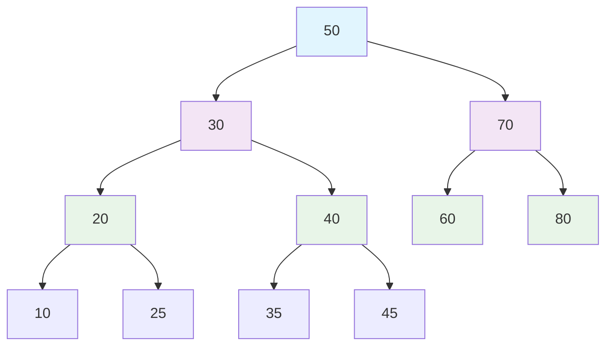
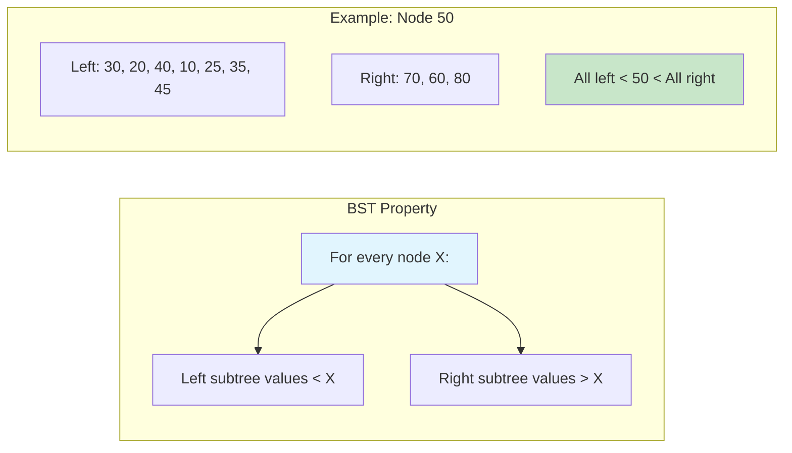
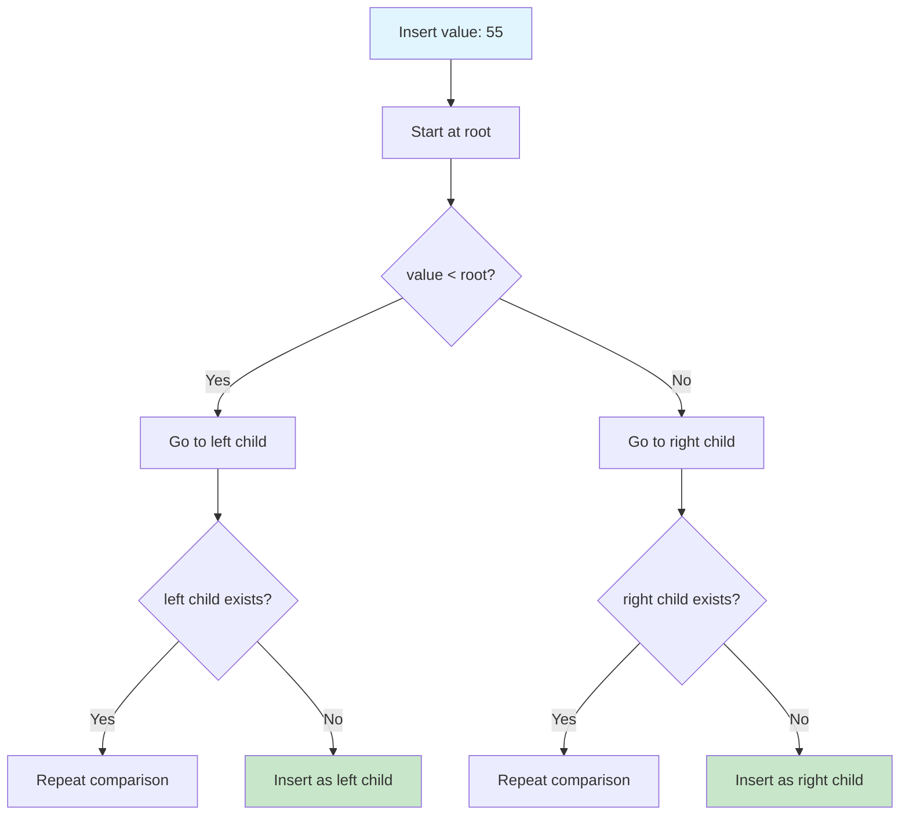
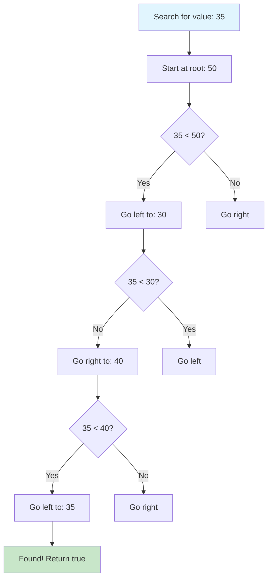
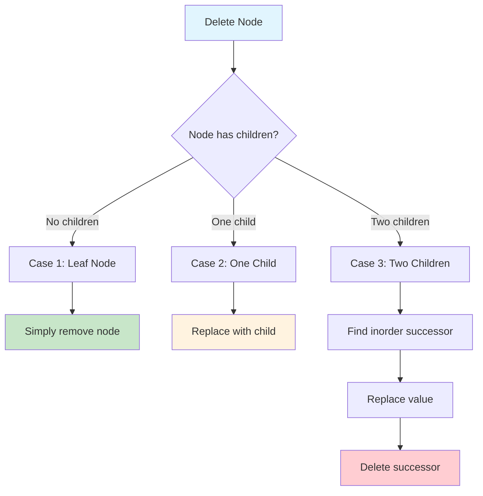
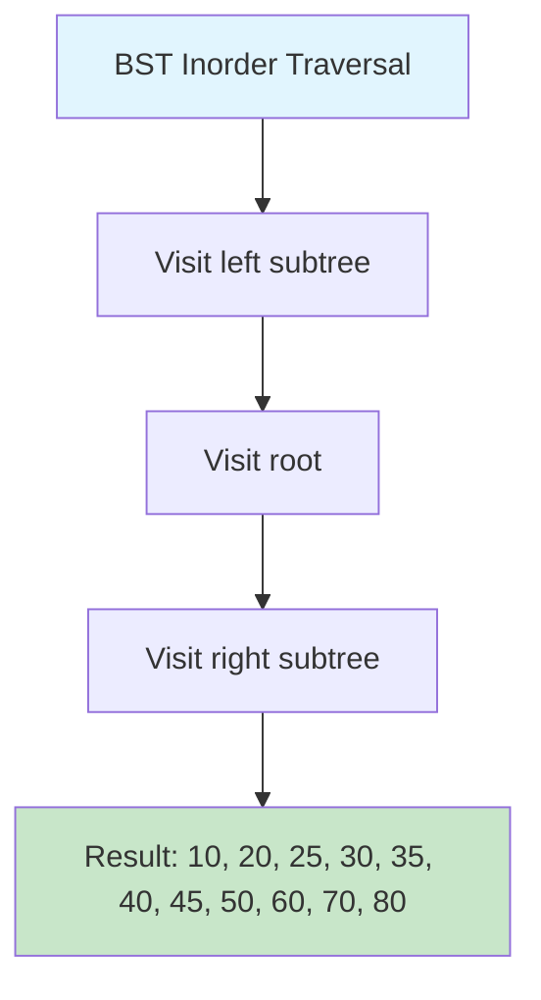
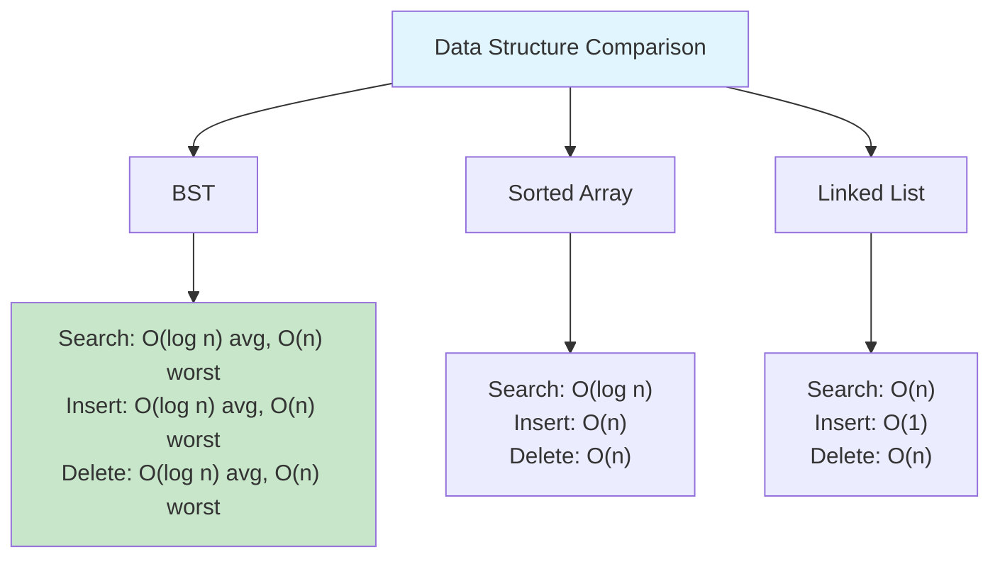
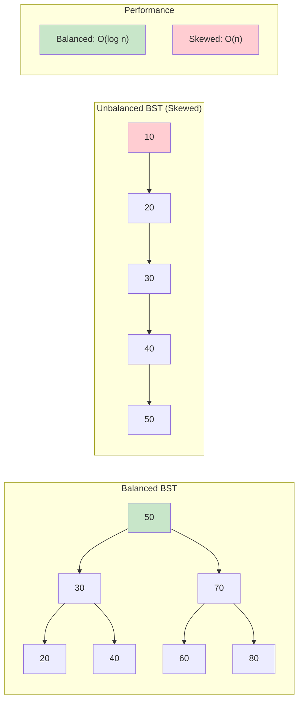
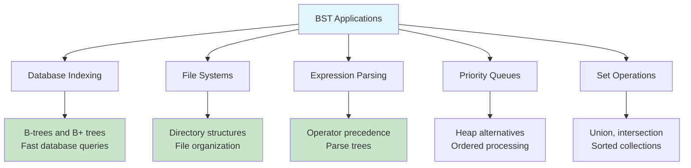

# Binary Search Tree

## Description

A complete binary search tree (BST) implementation from scratch with recursive insertion and deletion operations. The BST maintains the fundamental property that for any node, all values in the left subtree are smaller and all values in the right subtree are larger. This implementation includes all three deletion cases and comprehensive tree operations.

## Key Features

- **Recursive Operations**: All core operations implemented using recursion
- **Complete Deletion**: Handles all three deletion cases properly
- **Tree Traversals**: In-order, pre-order, post-order, and level-order traversals
- **Tree Validation**: Ensures BST property is maintained
- **Successor/Predecessor**: Find next/previous elements in sorted order
- **Comprehensive API**: Standard BST operations plus utility methods

## Implementation Details

- **Node Structure**: Each node contains value, left child, and right child pointers
- **Recursive Design**: Insert, delete, search, and traversal operations use recursion
- **Size Tracking**: Maintains count of nodes for O(1) size queries
- **BST Property**: Left subtree < node < right subtree maintained at all times

## Complexity

- **Time Complexity**:
  - Average case: O(log n) for Insert, Delete, Search
  - Worst case: O(n) for unbalanced tree (degenerates to linked list)
  - Traversals: O(n) to visit all nodes
- **Space Complexity**: O(n) for storage, O(h) for recursion stack where h is height

## Deletion Cases

### Case 1: No Children (Leaf Node)

- **Description**: Node to delete has no left or right child
- **Solution**: Simply remove the node (set parent's pointer to nil)
- **Example**: Deleting leaf nodes like 10, 25, 35, 45 in a tree

### Case 2: One Child

- **Description**: Node to delete has exactly one child (left or right)
- **Solution**: Replace the node with its single child
- **Example**: If deleting node 20 with only left child 10, replace 20 with 10

### Case 3: Two Children

- **Description**: Node to delete has both left and right children
- **Solution**: Replace with in-order successor (smallest node in right subtree)
- **Process**:
  1. Find the in-order successor (leftmost node in right subtree)
  2. Replace the node's value with successor's value
  3. Recursively delete the successor (which has at most one child)

## Core Operations

### Basic Operations

- `Insert(value)` - Add a new value to the BST
- `Delete(value)` - Remove a value from the BST (handles all 3 cases)
- `Search(value)` - Check if a value exists in the BST
- `FindMin()` - Get the minimum value (leftmost node)
- `FindMax()` - Get the maximum value (rightmost node)
- `GetSize()` - Get the number of nodes
- `IsEmpty()` - Check if the tree is empty
- `Clear()` - Remove all nodes

### Traversal Operations

- `InOrderTraversal()` - Returns values in sorted order (left, root, right)
- `PreOrderTraversal()` - Returns values in pre-order (root, left, right)
- `PostOrderTraversal()` - Returns values in post-order (left, right, root)
- `LevelOrderTraversal()` - Returns values level by level (breadth-first)

### Utility Operations

- `Height()` - Get the height of the tree
- `IsValidBST()` - Verify the BST property is maintained
- `CountNodes()` - Count total nodes (alternative to GetSize)
- `CountLeaves()` - Count leaf nodes
- `GetSuccessor(value)` - Find the next larger value
- `GetPredecessor(value)` - Find the next smaller value
- `PrintTree()` - Visual representation of the tree structure

## Usage

```bash
make run n=binary-search-tree
```

## Testing

```bash
make test n=binary-search-tree
```

## Benchmarking

```bash
make bench n=binary-search-tree
```

## Example Usage in Go

```go
// Create a new BST
bst := NewBST()

// Insert values
values := []int{50, 30, 70, 20, 40, 60, 80}
for _, value := range values {
    bst.Insert(value)
}

// Search for values
exists := bst.Search(40)  // true
exists = bst.Search(100) // false

// Find min and max
min, hasMin := bst.FindMin() // 20, true
max, hasMax := bst.FindMax() // 80, true

// Get tree information
size := bst.GetSize()    // 7
height := bst.Height()   // 2
isEmpty := bst.IsEmpty() // false

// Traversals
inOrder := bst.InOrderTraversal()     // [20, 30, 40, 50, 60, 70, 80]
preOrder := bst.PreOrderTraversal()   // [50, 30, 20, 40, 70, 60, 80]
postOrder := bst.PostOrderTraversal() // [20, 40, 30, 60, 80, 70, 50]
levelOrder := bst.LevelOrderTraversal() // [50, 30, 70, 20, 40, 60, 80]

// Deletion examples for all three cases
bst.Delete(20)  // Case 1: No children (leaf)
bst.Delete(30)  // Case 2: One child (if 30 has only one child)
bst.Delete(50)  // Case 3: Two children (root with both children)

// Successor and predecessor
successor, exists := bst.GetSuccessor(40)   // Next larger value
predecessor, exists := bst.GetPredecessor(40) // Next smaller value

// Validation
isValid := bst.IsValidBST() // Verify BST property

// Tree statistics
nodeCount := bst.CountNodes()
leafCount := bst.CountLeaves()

// Clear the tree
bst.Clear()
```

## Deletion Algorithm Details

### Recursive Deletion Process

```
deleteRecursive(node, value):
    if node is null:
        return null

    if value < node.value:
        node.left = deleteRecursive(node.left, value)
    else if value > node.value:
        node.right = deleteRecursive(node.right, value)
    else:  // Found the node to delete
        // Case 1: No children
        if node.left is null and node.right is null:
            return null

        // Case 2: One child
        if node.left is null:
            return node.right
        if node.right is null:
            return node.left

        // Case 3: Two children
        successor = findMin(node.right)
        node.value = successor.value
        node.right = deleteRecursive(node.right, successor.value)

    return node
```

## Performance Characteristics

### Average Case (Balanced Tree)

- **Insert**: O(log n) - Navigate down one path to leaf
- **Delete**: O(log n) - Find node + potential successor lookup
- **Search**: O(log n) - Navigate down one path
- **Traversals**: O(n) - Visit every node once

### Worst Case (Unbalanced Tree)

- **All Operations**: O(n) - Tree degenerates to linked list
- **Space**: O(n) - Recursion stack depth equals tree height

### Best Case

- **Search/Insert/Delete**: O(1) - When target is root (for search/delete)

## Tree Traversal Explanations

### In-Order Traversal (Left, Root, Right)

- **Purpose**: Returns values in sorted order
- **Use Case**: Getting all values in ascending order
- **Property**: For BST, always produces sorted sequence

### Pre-Order Traversal (Root, Left, Right)

- **Purpose**: Visits root before children
- **Use Case**: Tree serialization, creating copy of tree
- **Property**: First element is always the root

### Post-Order Traversal (Left, Right, Root)

- **Purpose**: Visits children before root
- **Use Case**: Tree deletion, calculating tree properties
- **Property**: Last element is always the root

### Level-Order Traversal (Breadth-First)

- **Purpose**: Visits nodes level by level
- **Use Case**: Tree printing, finding nodes at specific depth
- **Implementation**: Uses queue for breadth-first search

## Use Cases

- **Database Indexing**: B-trees and B+ trees are extensions of BSTs
- **Expression Parsing**: Parse and evaluate mathematical expressions
- **File Systems**: Directory structures and file organization
- **Priority Queues**: When balanced (though heaps are more common)
- **Symbol Tables**: Compiler symbol table implementation
- **Range Queries**: Find all values within a range
- **Sorted Data Maintenance**: Keep data sorted with dynamic insertions/deletions

## Advantages

- **Sorted Order**: In-order traversal gives sorted sequence
- **Efficient Operations**: O(log n) average case for basic operations
- **Dynamic**: Supports insertions and deletions efficiently
- **Range Queries**: Easy to find values within a range
- **Memory Efficient**: Only stores data and two pointers per node

## Limitations

- **Unbalanced Performance**: Can degrade to O(n) in worst case
- **No Self-Balancing**: Doesn't automatically maintain balance
- **Memory Overhead**: Requires extra memory for pointers
- **Cache Performance**: Poor cache locality compared to arrays
- **Recursion Depth**: Deep trees can cause stack overflow

## Comparison with Alternatives

- **vs. Array**: BST allows efficient insertion/deletion, array has better cache locality
- **vs. Hash Table**: BST maintains order, hash table has O(1) average operations
- **vs. AVL/Red-Black Trees**: Those are self-balancing, guarantee O(log n) operations
- **vs. Heap**: BST supports range queries, heap is better for priority queue operations
- **vs. Linked List**: BST has much faster search (O(log n) vs O(n))

## Real-World Applications

- **Database Systems**: B-tree indexes in databases like MySQL, PostgreSQL
- **File Systems**: Directory structures in operating systems
- **Compilers**: Symbol tables and syntax tree representation
- **Game Development**: Spatial partitioning and collision detection
- **Network Routing**: Routing table implementations
- **Memory Management**: Free block management in allocators

## Visual Representation

### BST Structure and Property



### BST Property Visualization



### Insert Operation



### Search Operation



### Delete Operation Cases



### Inorder Traversal (Sorted Output)



### BST vs Array vs Linked List



### Balanced vs Unbalanced BST



### Common BST Applications


