# avl-tree

## Description

AVL Tree (Adelson-Velsky and Landis Tree) is a self-balancing binary search tree where the heights of the two child subtrees of any node differ by at most one. This implementation provides both recursive and iterative approaches for key operations.

### Key Features

- **Self-balancing**: Automatically maintains balance through rotations
- **Height-balanced**: Height difference between left and right subtrees ≤ 1
- **Dual implementation**: Both recursive (default) and iterative methods
- **Complete operations**: Insert, delete, search, traversals, and utility functions
- **Rotation support**: Left, right, left-right, and right-left rotations

### AVL Tree Properties

1. **Binary Search Tree Property**: Left child < parent < right child
2. **Balance Factor**: For any node, |height(left) - height(right)| ≤ 1
3. **Height Tracking**: Each node stores its height for efficient balance calculations
4. **Automatic Rebalancing**: Rotations performed during insertion/deletion to maintain balance

### Rotation Types

- **Left Rotation (LL)**: When right subtree is heavier
- **Right Rotation (RR)**: When left subtree is heavier
- **Left-Right Rotation (LR)**: Left child's right subtree is heavier
- **Right-Left Rotation (RL)**: Right child's left subtree is heavier

## Complexity

- **Time Complexity**:

  - Insert: O(log n) - guaranteed due to balanced height
  - Delete: O(log n) - includes rebalancing operations
  - Search: O(log n) - both recursive and iterative
  - Traversals: O(n) - visit each node once
  - Height: O(1) - stored in each node
  - Balance Check: O(n) - validates entire tree

- **Space Complexity**:
  - Storage: O(n) - one node per element
  - Recursive operations: O(log n) - call stack depth
  - Iterative operations: O(log n) - explicit stack for rebalancing

## Implementation Details

### Core Methods

- `Insert(value)` - Recursive insertion with automatic rebalancing
- `InsertIterative(value)` - Iterative insertion alternative
- `Delete(value)` - Recursive deletion with rebalancing
- `Search(value)` - Recursive search
- `SearchIterative(value)` - Iterative search alternative

### Traversal Methods

- `InOrderTraversal()` - Returns sorted array of values
- `PreOrderTraversal()` - Root-first traversal
- `LevelOrderTraversal()` - Breadth-first traversal

### Utility Methods

- `GetHeight()` - Returns tree height
- `IsBalanced()` - Validates AVL properties
- `GetSize()` - Returns number of nodes
- `FindMin()/FindMax()` - Find minimum/maximum values
- `Clear()` - Removes all nodes
- `PrintTree()` - Visual tree representation with heights and balance factors

### Balance Factor Calculation

```
Balance Factor = Height(Left Subtree) - Height(Right Subtree)
```

- Balance Factor > 1: Left-heavy (needs right rotation)
- Balance Factor < -1: Right-heavy (needs left rotation)
- Balance Factor ∈ [-1, 0, 1]: Balanced

## Usage

```bash
make run n=0026-avl-tree
```

### Example Operations

```go
avl := NewAVLTree()

// Insert values (triggers automatic rebalancing)
values := []int{10, 20, 30, 40, 50, 25}
for _, value := range values {
    avl.Insert(value)
}

// Search operations
found := avl.Search(30)              // true
foundIter := avl.SearchIterative(30) // true

// Tree properties
size := avl.GetSize()        // 6
height := avl.GetHeight()    // Balanced height
balanced := avl.IsBalanced() // true

// Traversals
inOrder := avl.InOrderTraversal()    // [10, 20, 25, 30, 40, 50]
preOrder := avl.PreOrderTraversal()  // Root-first order
levelOrder := avl.LevelOrderTraversal() // Level by level

// Min/Max operations
min, hasMin := avl.FindMin() // 10, true
max, hasMax := avl.FindMax() // 50, true

// Deletion (maintains balance)
deleted := avl.Delete(20) // true
newSize := avl.GetSize()  // 5

// Iterative insertion
avl.InsertIterative(15)
```

## Testing

```bash
make test n=0026-avl-tree
```

### Test Coverage

- **Basic Operations**: Insert, delete, search functionality
- **Balance Validation**: All four rotation types tested
- **Edge Cases**: Empty tree, single node, duplicates
- **Traversals**: All traversal methods validated
- **Large Datasets**: 1000+ node stress testing
- **Performance**: Benchmarks for all major operations
- **Iterative Methods**: Alternative implementations tested

## Real-World Applications

- **Database Indexing**: Maintaining sorted indexes with frequent updates
- **Memory Management**: Balanced allocation trees
- **Compiler Design**: Symbol tables requiring fast lookups
- **Graphics**: Spatial partitioning with balanced access
- **File Systems**: Directory structures with balanced access times

## Advantages over Regular BST

- **Guaranteed Performance**: O(log n) operations even with sorted input
- **Predictable Height**: Maximum height is 1.44 \* log₂(n)
- **No Degeneration**: Cannot become a linear chain like unbalanced BST
- **Consistent Performance**: Uniform operation times regardless of insertion order

## Comparison with Other Trees

- **vs Red-Black Tree**: Stricter balancing, faster lookups, slower insertions/deletions
- **vs B-Tree**: Better for in-memory operations, simpler implementation
- **vs Splay Tree**: More predictable performance, no amortized analysis needed

## Visual Representation

### AVL Tree Balance Property

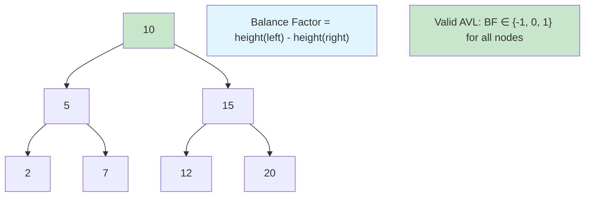

### Balance Factors and Heights

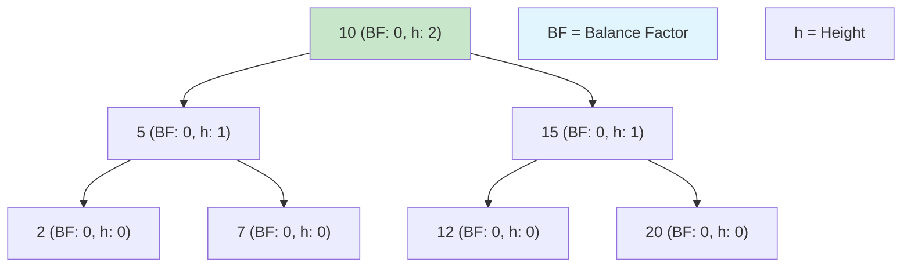

### Unbalanced Tree Example

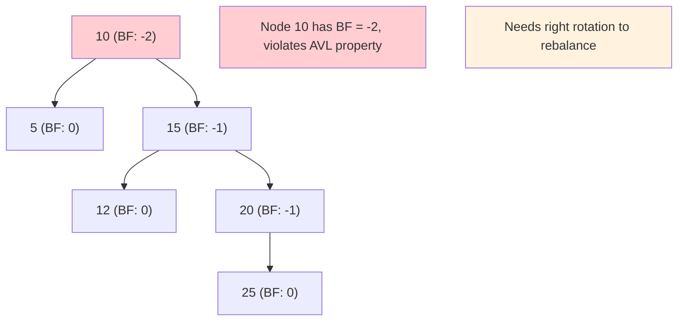

### Four Types of Rotations

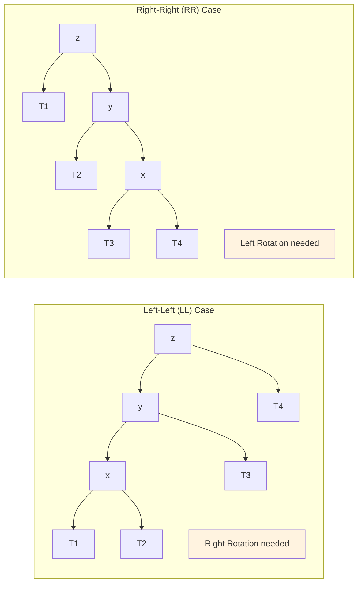

### Left Rotation (RR Case)

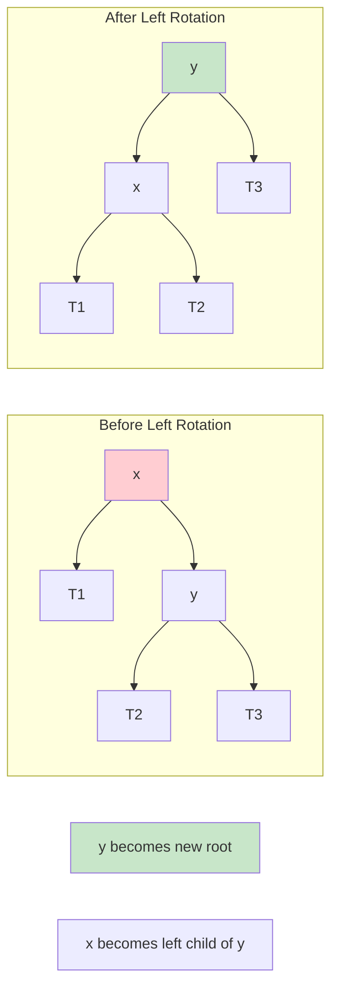

### Right Rotation (LL Case)

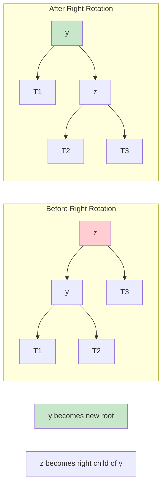

### Left-Right Rotation (LR Case)

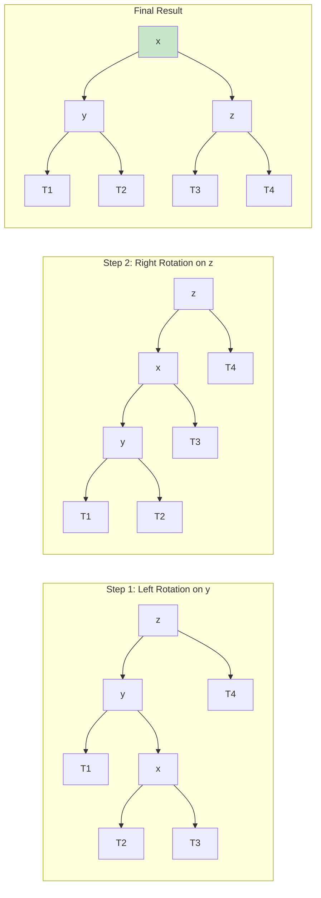

### Right-Left Rotation (RL Case)

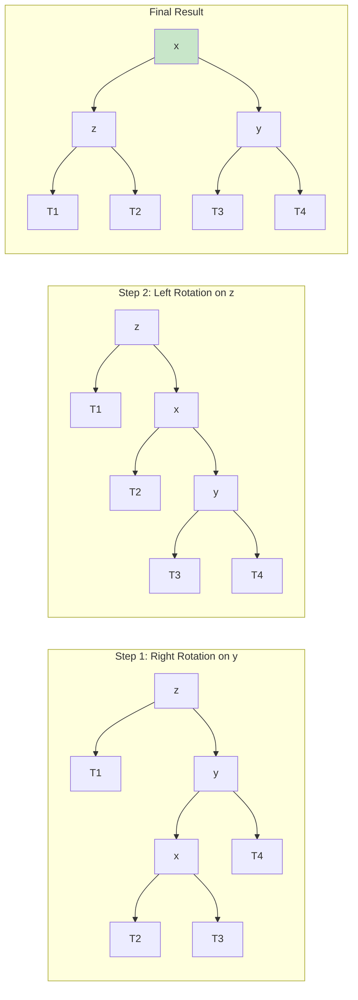

### AVL Insertion Algorithm

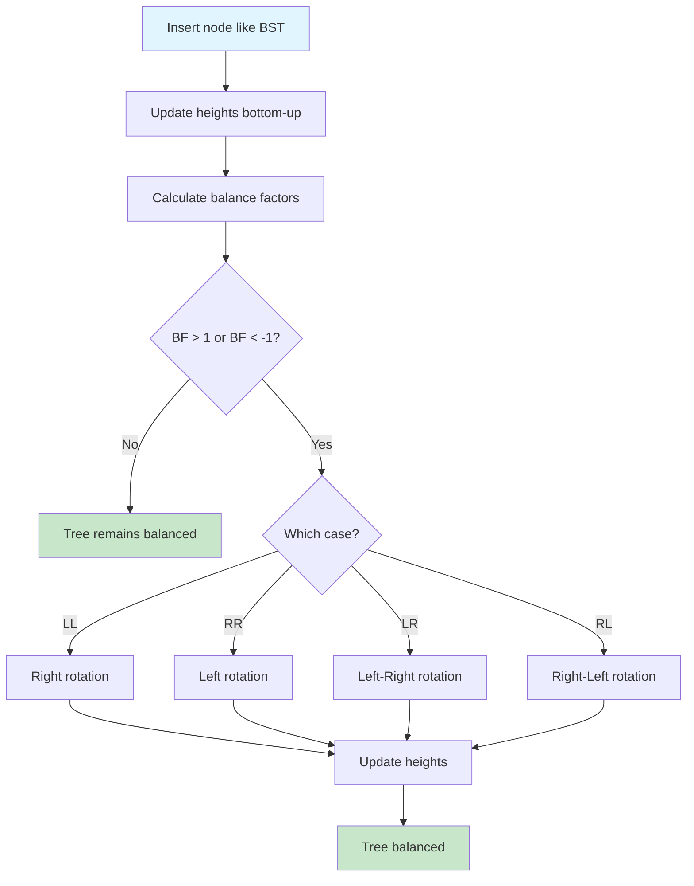

### AVL Deletion Algorithm

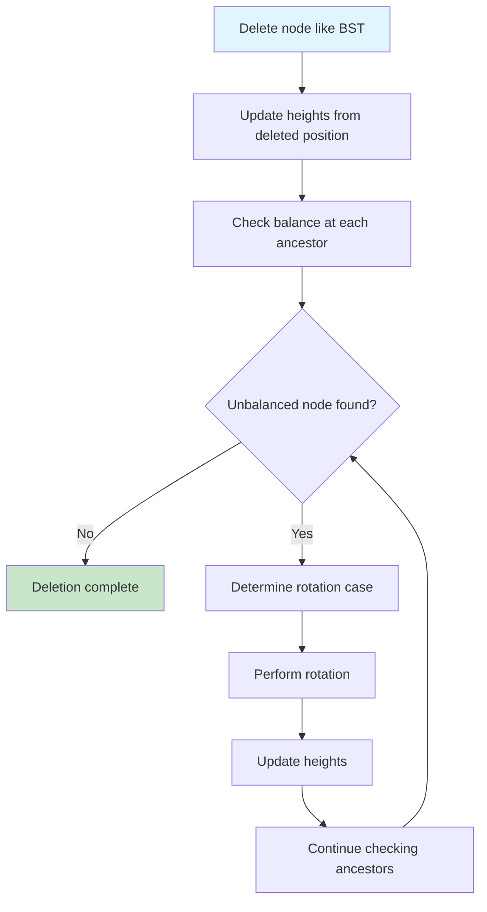

### Complexity Analysis

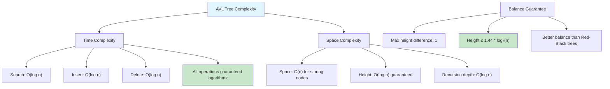

### AVL vs Other Trees

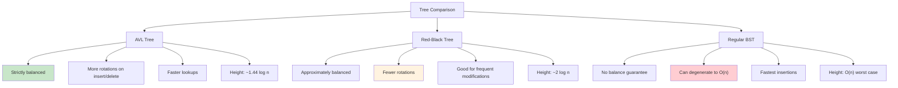

### Height Calculation and Update

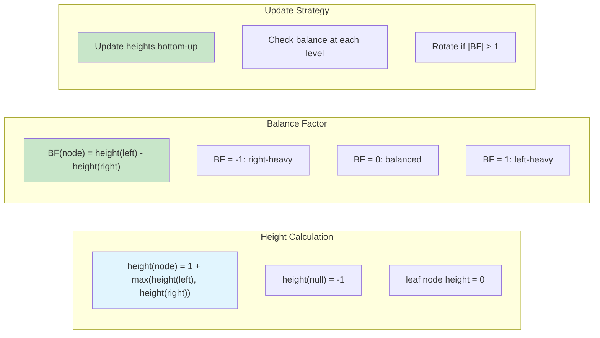

### Real-World Applications

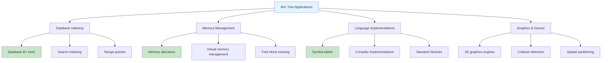

### Implementation Considerations

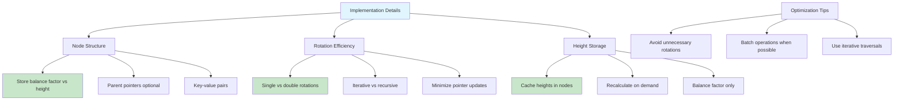

An AVL Tree is a self-balancing binary search tree where the heights of the two child subtrees of any node differ by at most one.
