# red-black-tree

## Description

Red-Black Tree is a self-balancing binary search tree where each node has a color attribute (red or black) and follows specific coloring rules to maintain balance. This implementation provides both recursive and iterative approaches for key operations.

### Key Features

- **Self-balancing**: Maintains balance through color-based rules and rotations
- **Color-coded nodes**: Each node is either red or black
- **Dual implementation**: Both recursive (default) and iterative methods
- **Complete operations**: Insert, delete, search, traversals, and validation
- **NIL sentinel**: Uses sentinel nodes for cleaner implementation

### Red-Black Tree Properties

1. **Binary Search Tree Property**: Left child < parent < right child
2. **Node Coloring**: Every node is either red or black
3. **Root Property**: The root is always black
4. **Red Node Property**: Red nodes cannot have red children (no two red nodes adjacent)
5. **Black Height Property**: All paths from root to NIL nodes contain the same number of black nodes

### Balancing Mechanism

- **Rotations**: Left and right rotations to restructure tree
- **Recoloring**: Changing node colors to maintain properties
- **Fixup Operations**: Post-insertion and post-deletion corrections
- **NIL Nodes**: All leaf nodes point to a shared black NIL sentinel

## Complexity

- **Time Complexity**:

  - Insert: O(log n) - includes fixup operations
  - Delete: O(log n) - includes complex fixup cases
  - Search: O(log n) - both recursive and iterative
  - Traversals: O(n) - visit each node once
  - Height: O(log n) - computed recursively
  - Validation: O(n) - checks all properties

- **Space Complexity**:
  - Storage: O(n) - one node per element plus NIL sentinel
  - Recursive operations: O(log n) - call stack depth
  - Iterative operations: O(1) - constant extra space

## Implementation Details

### Core Methods

- `Insert(value)` - Recursive insertion with fixup
- `InsertIterative(value)` - Iterative insertion alternative
- `Delete(value)` - Complex deletion with multiple fixup cases
- `Search(value)` - Recursive search
- `SearchIterative(value)` - Iterative search alternative

### Fixup Operations

- `insertFixup(node)` - Maintains RB properties after insertion
- `deleteFixup(node)` - Handles complex deletion cases
- `rotateLeft(node)` - Left rotation for rebalancing
- `rotateRight(node)` - Right rotation for rebalancing

### Traversal Methods

- `InOrderTraversal()` - Returns sorted array of values
- `PreOrderTraversal()` - Root-first traversal
- `LevelOrderTraversal()` - Breadth-first traversal

### Utility Methods

- `GetHeight()` - Returns tree height
- `GetBlackHeight()` - Returns black height from root
- `IsValidRBTree()` - Validates all Red-Black properties
- `GetSize()` - Returns number of nodes
- `FindMin()/FindMax()` - Find minimum/maximum values
- `Clear()` - Removes all nodes
- `PrintTree()` - Visual tree representation with colors

### Deletion Cases

Red-Black tree deletion is complex with multiple cases:

1. **Node has no children**: Simple removal with potential fixup
2. **Node has one child**: Replace with child, fixup if needed
3. **Node has two children**: Replace with successor, then handle successor deletion

### Fixup Cases (Insertion)

1. **Uncle is red**: Recolor parent, uncle, and grandparent
2. **Uncle is black, triangle case**: Rotate to make line case
3. **Uncle is black, line case**: Rotate and recolor

### Fixup Cases (Deletion)

Complex with 8 different cases based on sibling color and children colors.

## Usage

```bash
make run n=0027-red-black-tree
```

### Example Operations

```go
rb := NewRBTree()

// Insert values (triggers automatic rebalancing)
values := []int{10, 20, 30, 40, 50, 25, 15, 35}
for _, value := range values {
    rb.Insert(value)
}

// Search operations
found := rb.Search(30)              // true
foundIter := rb.SearchIterative(30) // true

// Tree properties
size := rb.GetSize()           // 8
height := rb.GetHeight()       // Balanced height
blackHeight := rb.GetBlackHeight() // Black height from root
valid := rb.IsValidRBTree()    // true

// Traversals
inOrder := rb.InOrderTraversal()    // [10, 15, 20, 25, 30, 35, 40, 50]
preOrder := rb.PreOrderTraversal()  // Root-first order
levelOrder := rb.LevelOrderTraversal() // Level by level

// Min/Max operations
min, hasMin := rb.FindMin() // 10, true
max, hasMax := rb.FindMax() // 50, true

// Deletion (maintains RB properties)
deleted := rb.Delete(20) // true
stillValid := rb.IsValidRBTree() // true

// Iterative insertion
rb.InsertIterative(12)
```

## Testing

```bash
make test n=0027-red-black-tree
```

### Test Coverage

- **Basic Operations**: Insert, delete, search functionality
- **Color Properties**: Root always black, red node constraints
- **Balance Validation**: Black height consistency across all paths
- **Edge Cases**: Empty tree, single node, duplicates
- **Complex Deletions**: All deletion cases and fixup scenarios
- **Large Datasets**: 1000+ node stress testing with validation
- **Performance**: Benchmarks for all major operations
- **Iterative Methods**: Alternative implementations tested

## Real-World Applications

- **Linux Kernel**: Process scheduling (Completely Fair Scheduler)
- **Java Collections**: TreeMap and TreeSet implementations
- **C++ STL**: std::map and std::set implementations
- **Database Systems**: B+ tree alternatives for in-memory indexes
- **Memory Allocators**: Free block management in some allocators
- **Graphics**: Computational geometry algorithms

## Advantages

- **Relaxed Balancing**: Less strict than AVL, allowing faster insertions/deletions
- **Guaranteed Performance**: O(log n) worst-case for all operations
- **Practical Efficiency**: Good balance between search speed and update speed
- **Industry Standard**: Widely used in production systems
- **Robust Implementation**: Well-studied with proven correctness

## Comparison with Other Trees

- **vs AVL Tree**: Faster insertions/deletions, slightly slower searches
- **vs Binary Search Tree**: Guaranteed balance, no worst-case O(n) operations
- **vs B-Tree**: Better for in-memory operations, simpler than B-tree variants
- **vs Splay Tree**: More predictable performance, no amortized analysis

## Color Invariants

The Red-Black tree maintains these critical invariants:

1. **Root is black**: Ensures consistent black height calculation
2. **NIL nodes are black**: Simplifies property checking
3. **Red nodes have black children**: Prevents consecutive red nodes
4. **Equal black paths**: All root-to-NIL paths have same black node count
5. **Binary search property**: Maintained throughout all operations

## Performance Characteristics

- **Height bound**: Maximum height is 2 \* log₂(n + 1)
- **Search performance**: Excellent due to balanced structure
- **Insert performance**: Good with efficient fixup operations
- **Delete performance**: More complex but still O(log n)
- **Memory overhead**: One color bit per node plus parent pointers

## Visual Representation

### Red-Black Tree Properties

```mermaid
graph TD
    A["13 (B)"] --> B["8 (R)"]
    A --> C["17 (B)"]
    B --> D["1 (B)"]
    B --> E["11 (B)"]
    C --> F["15 (R)"]
    C --> G["25 (R)"]
    F --> H["NIL (B)"]
    F --> I["NIL (B)"]
    G --> J["22 (B)"]
    G --> K["27 (B)"]

    L["Properties:"]
    M["1. Every node is red or black"]
    N["2. Root is black"]
    O["3. All leaves (NIL) are black"]
    P["4. Red nodes have black children"]
    Q["5. All paths have same black height"]

    style A fill:#333
    style B fill:#ffcdd2
    style C fill:#333
    style D fill:#333
    style E fill:#333
    style F fill:#ffcdd2
    style G fill:#ffcdd2
    style J fill:#333
    style K fill:#333
```

### Black Height Concept

```mermaid
graph TD
    A["Root (B)<br/>bh=3"] --> B["Node (R)<br/>bh=3"]
    A --> C["Node (B)<br/>bh=2"]
    B --> D["Node (B)<br/>bh=2"]
    B --> E["Node (B)<br/>bh=2"]
    D --> F["NIL (B)<br/>bh=1"]
    D --> G["NIL (B)<br/>bh=1"]
    E --> H["NIL (B)<br/>bh=1"]
    E --> I["NIL (B)<br/>bh=1"]

    J["Black Height (bh) = number of black nodes<br/>from node to any leaf (excluding node itself)"]
    K["All paths from node to leaves have same black height"]

    style A fill:#333
    style B fill:#ffcdd2
    style C fill:#333
    style D fill:#333
    style E fill:#333
    style J fill:#e1f5fe
    style K fill:#c8e6c9
```

### Red-Black Tree vs AVL Tree

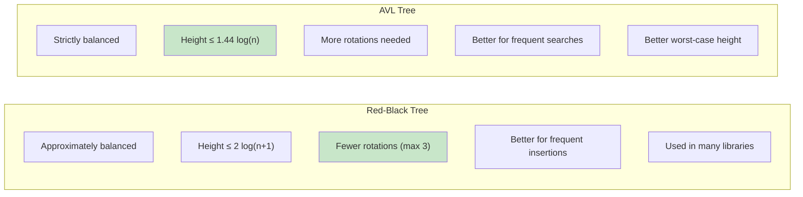

### Insertion Algorithm Flow

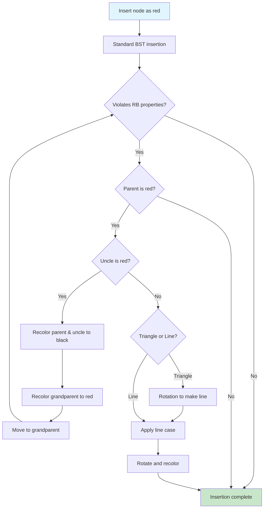

### Insertion Cases

```mermaid
graph LR
    subgraph "Case 1: Uncle is Red"
        A1["G (B)"] --> B1["P (R)"]
        A1 --> C1["U (R)"]
        B1 --> D1["N (R)"]

        E1["Recolor: P→B, U→B, G→R"]
    end

    subgraph "Case 2: Uncle Black, Triangle"
        A2["G (B)"] --> B2["P (R)"]
        A2 --> C2["U (B)"]
        B2 --> D2["N (R)"]

        E2["Rotate to make line"]
    end

    subgraph "Case 3: Uncle Black, Line"
        A3["G (B)"] --> B3["P (R)"]
        A3 --> C3["U (B)"]
        B3 --> D3["N (R)"]

        E3["Rotate G, swap colors P↔G"]
    end

    style A1 fill:#333
    style B1 fill:#ffcdd2
    style C1 fill:#ffcdd2
    style D1 fill:#ffcdd2
    style E1 fill:#c8e6c9
```

### Deletion Algorithm Overview

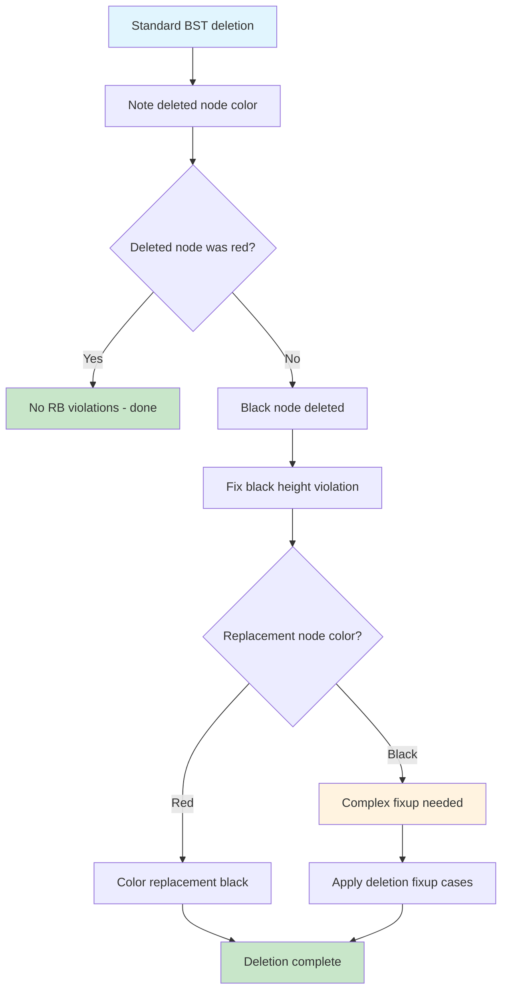

### Deletion Fixup Cases

```mermaid
graph LR
    subgraph "Case 1: Sibling is Red"
        A1["P (B)"] --> B1["X (B)"]
        A1 --> C1["S (R)"]

        D1["Rotate P, swap P↔S colors"]
        E1["Converts to Case 2, 3, or 4"]
    end

    subgraph "Case 2: Sibling and Children Black"
        A2["P (?)"] --> B2["X (B)"]
        A2 --> C2["S (B)"]
        C2 --> D2["NIL (B)"]
        C2 --> E2["NIL (B)"]

        F2["Color S red, move problem up"]
    end

    style A1 fill:#333
    style B1 fill:#333
    style C1 fill:#ffcdd2
    style D1 fill:#c8e6c9
    style F2 fill:#fff3e0
```

### Rotation Operations

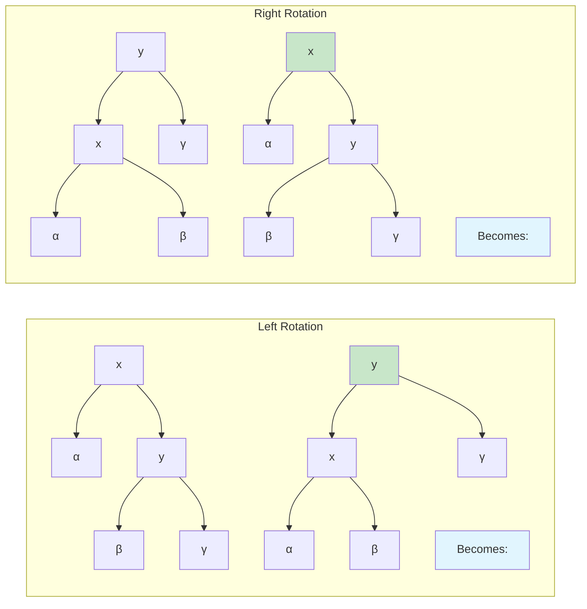

### Time Complexity Analysis

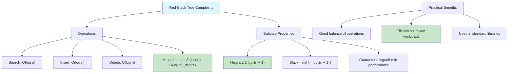

### Real-World Applications

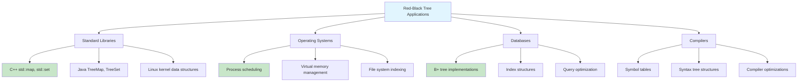

### Color Representation and NIL Nodes

```mermaid
graph LR
    subgraph "Color Encoding"
        A["Red = 0 or false"]
        B["Black = 1 or true"]
        C["Enum: {RED, BLACK}"]
    end

    subgraph "NIL Node Handling"
        D["Sentinel NIL node"]
        E["All leaves point to same NIL"]
        F["NIL is always black"]
        G["Simplifies implementation"]
    end

    subgraph "Memory Optimization"
        H["Share single NIL instance"]
        I["Reduce memory usage"]
        J["Simplify boundary checks"]
    end

    style A fill:#ffcdd2
    style B fill:#333
    style G fill:#c8e6c9
    style I fill:#c8e6c9
```

### Implementation Strategy

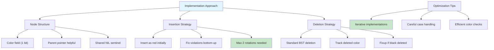

### Verification and Testing

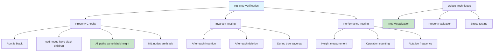

A Red-Black Tree is a self-balancing binary search tree where each node has a color (red or black) and follows specific rules to maintain balance.
