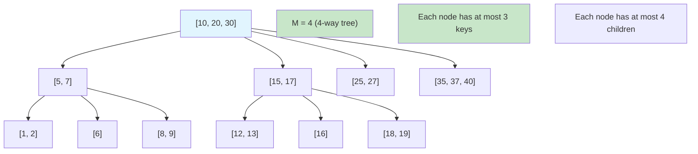
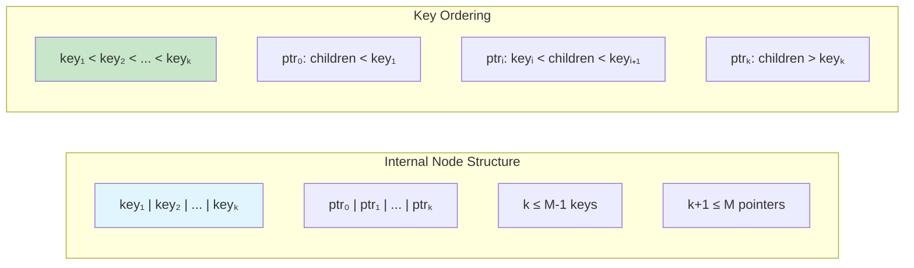
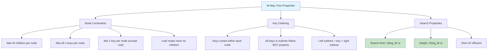
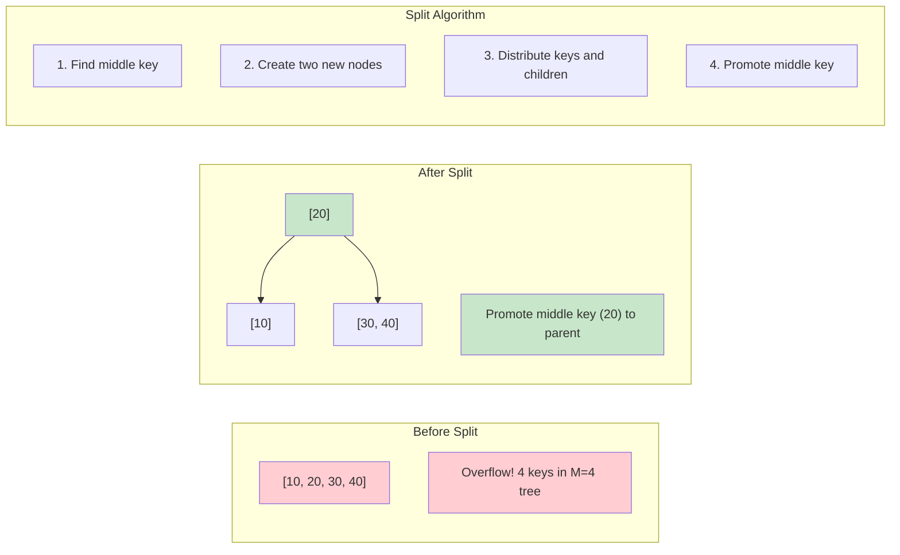
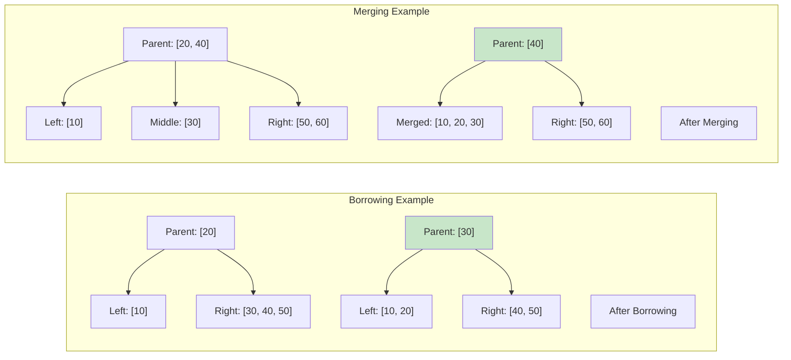
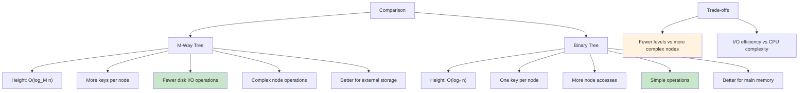
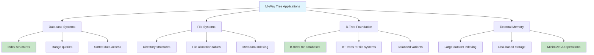
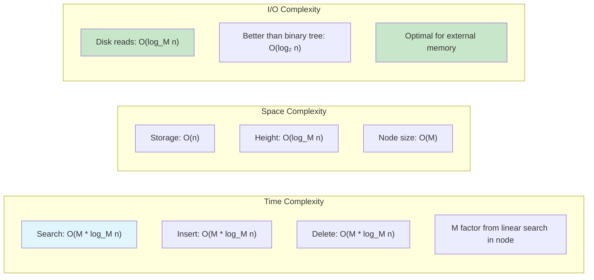
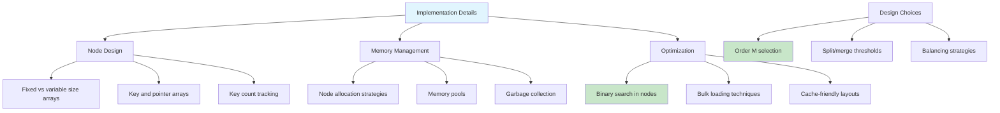
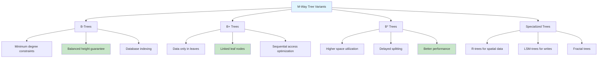

# m-way-tree

## Description

M-way Tree (also known as Multiway Tree or General Tree) is a tree data structure where each node can have up to M children. This implementation provides a configurable branching factor and supports automatic node splitting when nodes exceed capacity, similar to B-tree behavior.

### Key Features

- **Configurable branching factor**: Set maximum number of children per node (M)
- **Automatic node splitting**: Nodes split when they exceed M-1 keys
- **Sorted keys**: Keys within each node are maintained in sorted order
- **Dual search methods**: Both recursive and iterative search implementations
- **Complete operations**: Insert, delete, search, traversals, and validation
- **Tree validation**: Ensures structural integrity and ordering properties

### M-way Tree Properties

1. **Branching Factor**: Each node can have at most M children
2. **Key Capacity**: Each node can store at most M-1 keys
3. **Sorted Order**: Keys within each node are sorted in ascending order
4. **Leaf Identification**: Leaf nodes have no children
5. **Parent-Child Relationships**: Maintained for efficient operations

### Node Structure

- **Keys**: Array of sorted integer values (max M-1)
- **Children**: Array of child node pointers (max M)
- **IsLeaf**: Boolean flag indicating if node is a leaf
- **Parent**: Pointer to parent node for upward traversal

## Complexity

- **Time Complexity**:

  - Insert: O(log_M n) - logarithmic with base M
  - Delete: O(log_M n) - includes predecessor finding
  - Search: O(log_M n) - both recursive and iterative
  - Traversals: O(n) - visit each key once
  - Height: O(log_M n) - computed recursively
  - Validation: O(n) - checks all nodes and relationships

- **Space Complexity**:
  - Storage: O(n) - one key per element plus node overhead
  - Recursive operations: O(log_M n) - call stack depth
  - Node capacity: O(M) - keys and children arrays per node

## Implementation Details

### Core Methods

- `NewMWayTree(m)` - Creates tree with branching factor M (minimum 3)
- `Insert(key)` - Inserts key with automatic node splitting
- `Delete(key)` - Removes key with predecessor replacement for internal nodes
- `Search(key)` - Recursive search through tree
- `SearchIterative(key)` - Iterative search alternative

### Node Management

- `splitNode(node)` - Splits overfull nodes, promotes middle key
- `findKeyPosition(keys, key)` - Binary search within node keys
- `findPredecessor(node, pos)` - Finds in-order predecessor for deletion

### Traversal Methods

- `InOrderTraversal()` - Returns keys in sorted order
- `PreOrderTraversal()` - Node-first traversal
- `PostOrderTraversal()` - Children-first traversal
- `LevelOrderTraversal()` - Breadth-first traversal

### Utility Methods

- `GetHeight()` - Returns tree height
- `GetBranchingFactor()` - Returns M value
- `GetSize()` - Returns total number of keys
- `GetNodeCount()` - Returns total number of nodes
- `GetLeafCount()` - Returns number of leaf nodes
- `FindMin()/FindMax()` - Find minimum/maximum values
- `GetAllKeys()` - Returns all keys in sorted order
- `Validate()` - Validates tree structure and properties
- `Clear()` - Removes all nodes
- `PrintTree()` - Visual tree representation

### Splitting Algorithm

When a node reaches M keys:

1. Find middle key (index M/2)
2. Create new right node with keys after middle
3. Keep left keys in original node
4. Promote middle key to parent
5. If no parent exists, create new root

## Usage

```bash
make run n=0028-m-way-tree
```

### Example Operations

```go
// Create M-way tree with branching factor 4
tree := NewMWayTree(4)

// Insert values (triggers automatic splitting)
values := []int{10, 20, 5, 6, 12, 30, 7, 17}
for _, value := range values {
    tree.Insert(value)
}

// Search operations
found := tree.Search(20)              // true
foundIter := tree.SearchIterative(20) // true

// Tree properties
size := tree.GetSize()               // 8
height := tree.GetHeight()           // Depends on splits
branchingFactor := tree.GetBranchingFactor() // 4
nodeCount := tree.GetNodeCount()     // Number of internal nodes
leafCount := tree.GetLeafCount()     // Number of leaf nodes
valid := tree.Validate()             // true

// Traversals
inOrder := tree.InOrderTraversal()    // [5, 6, 7, 10, 12, 17, 20, 30]
preOrder := tree.PreOrderTraversal()  // Node-first order
postOrder := tree.PostOrderTraversal() // Children-first order
levelOrder := tree.LevelOrderTraversal() // Level by level
allKeys := tree.GetAllKeys()          // Sorted array of all keys

// Min/Max operations
min, hasMin := tree.FindMin() // 5, true
max, hasMax := tree.FindMax() // 30, true

// Deletion
deleted := tree.Delete(12) // true
newSize := tree.GetSize()  // 7
stillValid := tree.Validate() // true

// Different branching factors
tree3 := NewMWayTree(3)  // Ternary tree
tree10 := NewMWayTree(10) // Wider tree
```

## Testing

```bash
make test n=0028-m-way-tree
```

### Test Coverage

- **Basic Operations**: Insert, delete, search functionality
- **Node Splitting**: Automatic splitting when nodes exceed capacity
- **Different Branching Factors**: Testing with M = 3, 4, 5, 10
- **Edge Cases**: Empty tree, single node, duplicates
- **Traversals**: All traversal methods validated
- **Large Datasets**: 1000+ key stress testing
- **Validation**: Tree structure and property checking
- **Performance**: Benchmarks for all major operations

## Real-World Applications

- **Database Indexing**: Foundation for B-tree and B+ tree implementations
- **File Systems**: Directory structures with configurable fanout
- **Decision Trees**: Multi-way decision nodes in machine learning
- **Parsing**: Abstract syntax trees with variable children
- **Network Routing**: Routing tables with multiple next-hop options
- **Memory Management**: Allocation trees with configurable branching

## Advantages

- **Configurable Performance**: Adjust branching factor for specific use cases
- **Reduced Height**: Higher branching factor means shorter trees
- **Cache Efficiency**: Fewer levels mean fewer memory accesses
- **Flexible Structure**: Adapts to different data distributions
- **Foundation for B-trees**: Core concepts apply to database indexing

## Comparison with Other Trees

- **vs Binary Trees**: Reduced height, more complex node management
- **vs B-Trees**: Simpler implementation, no minimum fill requirements
- **vs Trie**: More general purpose, not limited to string prefixes
- **vs Heap**: Maintains sorted order, supports range queries

## Performance Characteristics

- **Height**: O(log_M n) - decreases as M increases
- **Node Utilization**: Variable, depends on insertion order
- **Split Frequency**: Decreases with higher M values
- **Search Efficiency**: Fewer comparisons per level, more comparisons per node
- **Memory Overhead**: Increases with M due to larger node arrays

## Branching Factor Selection

- **M = 3**: Similar to binary tree, frequent splits
- **M = 4-8**: Good balance for most applications
- **M = 16-64**: Suitable for disk-based storage (B-tree territory)
- **M > 64**: Diminishing returns, increased node search time

## Tree Validation Rules

1. **Key Count**: Each node has at most M-1 keys
2. **Child Count**: Internal nodes have exactly (keys + 1) children
3. **Key Ordering**: Keys within nodes are sorted
4. **Leaf Property**: Leaf nodes have no children
5. **Parent Consistency**: All parent-child relationships are bidirectional

## Visual Representation

### Basic M-Way Tree Structure (M=4)



### Node Structure and Properties



### M-Way Tree Properties



### Search Algorithm

```mermaid
graph TD
    A[Search(key, node)] --> B{node is null?}
    B -->|Yes| C[Key not found]
    B -->|No| D[Search keys in node]
    D --> E{Key found?}
    E -->|Yes| F[Return success]
    E -->|No| G[Find appropriate child pointer]
    G --> H[Recursively search child]
    H --> I[Return result]

    J[Linear Search in Node] --> K["for i = 0 to node.keyCount-1"]
    K --> L["  if key == node.keys[i]: return found"]
    L --> M["  if key < node.keys[i]: child = node.children[i]"]
    M --> N["child = node.children[node.keyCount] // rightmost"]

    style A fill:#e1f5fe
    style F fill:#c8e6c9
    style C fill:#ffcdd2
```

### Insertion Process

```mermaid
graph TD
    A[Insert(key)] --> B[Find leaf node position]
    B --> C[Insert key in sorted order]
    C --> D{Node overflow? (keys > M-1)}
    D -->|No| E[Insertion complete]
    D -->|Yes| F[Split node]
    F --> G[Promote middle key to parent]
    G --> H{Parent overflow?}
    H -->|No| I[Insertion complete]
    H -->|Yes| J[Split parent recursively]
    J --> K{Reached root?}
    K -->|No| H
    K -->|Yes| L[Create new root]
    L --> I

    style A fill:#e1f5fe
    style E fill:#c8e6c9
    style I fill:#c8e6c9
```

### Node Splitting Example (M=4)



### Deletion Algorithm

```mermaid
graph TD
    A[Delete(key)] --> B[Find key location]
    B --> C{Key in leaf node?}
    C -->|Yes| D[Remove key directly]
    C -->|No| E[Find inorder successor/predecessor]
    E --> F[Replace key with successor]
    F --> G[Delete successor from leaf]

    D --> H{Node underflow?}
    G --> H
    H -->|No| I[Deletion complete]
    H -->|Yes| J[Try borrowing from sibling]
    J --> K{Sibling has extra keys?}
    K -->|Yes| L[Borrow key through parent]
    K -->|No| M[Merge with sibling]
    L --> I
    M --> N{Parent underflow?}
    N -->|No| I
    N -->|Yes| O[Fix parent recursively]
    O --> N

    style A fill:#e1f5fe
    style I fill:#c8e6c9
```

### Borrowing and Merging



### M-Way Tree vs Binary Tree



### Applications and Use Cases



### Performance Analysis



### Implementation Considerations



### Variants and Extensions



An M-Way Tree is a tree data structure where each internal node can have at most M children and M-1 keys.
