# B-Tree

## Description

A B-Tree is a self-balancing tree data structure that maintains sorted data and allows searches, sequential access, insertions, and deletions in logarithmic time. It's optimized for systems that read and write large blocks of data, making it ideal for databases and file systems.

## Visual Representation

### B-Tree Structure (Order 3)

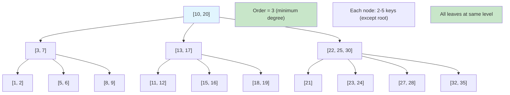

### B-Tree Properties

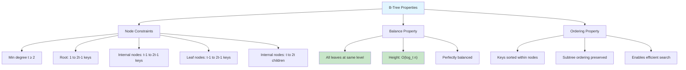

### Minimum Degree and Node Capacity

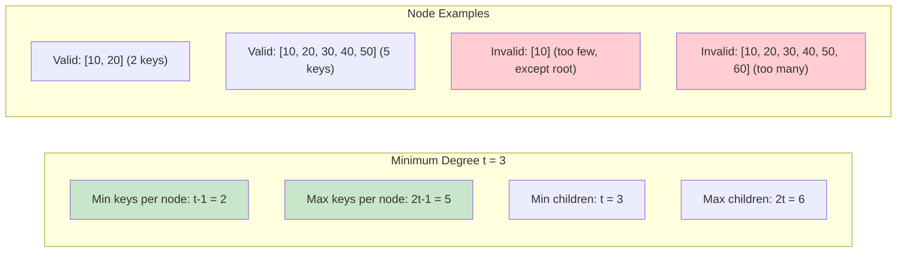

### B-Tree Search Algorithm

```mermaid
graph TD
    A[Search(key, node)] --> B{node is null?}
    B -->|Yes| C[Key not found]
    B -->|No| D[Binary search in node]
    D --> E{Key found?}
    E -->|Yes| F[Return success]
    E -->|No| G{Is leaf node?}
    G -->|Yes| C
    G -->|No| H[Find child to search]
    H --> I[Recursively search child]
    I --> J[Return result]

    K[Binary Search in Node] --> L["left = 0, right = keyCount-1"]
    L --> M["while left <= right"]
    M --> N["  mid = (left + right) / 2"]
    N --> O["  if key == keys[mid]: return mid"]
    O --> P["  else if key < keys[mid]: right = mid-1"]
    P --> Q["  else: left = mid+1"]

    style A fill:#e1f5fe
    style F fill:#c8e6c9
    style C fill:#ffcdd2
```

### B-Tree Insertion Process

```mermaid
graph TD
    A[Insert(key)] --> B{Root is full?}
    B -->|Yes| C[Split root]
    B -->|No| D[Insert into non-full root]
    C --> E[Create new root]
    E --> D
    D --> F[Find appropriate leaf]
    F --> G[Insert key in leaf]
    G --> H{Leaf is full?}
    H -->|No| I[Insertion complete]
    H -->|Yes| J[Split leaf]
    J --> K[Propagate split upward]
    K --> L{Parent is full?}
    L -->|No| I
    L -->|Yes| M[Split parent]
    M --> K

    style A fill:#e1f5fe
    style I fill:#c8e6c9
```

### Node Splitting Example

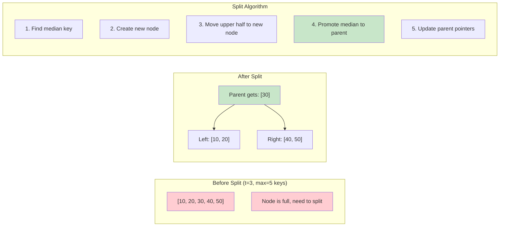

### B-Tree Deletion Cases

```mermaid
graph TD
    A[Delete(key)] --> B[Find key location]
    B --> C{Key in leaf?}
    C -->|Yes| D[Case 1: Delete from leaf]
    C -->|No| E[Case 2: Delete from internal]

    D --> F{Leaf has >= t keys?}
    F -->|Yes| G[Simply remove key]
    F -->|No| H[Case 3: Borrow or merge]

    E --> I[Replace with predecessor/successor]
    I --> J[Delete predecessor/successor]
    J --> H

    H --> K{Sibling has >= t keys?}
    K -->|Yes| L[Borrow from sibling]
    K -->|No| M[Merge with sibling]

    L --> N[Deletion complete]
    M --> O{Parent underflows?}
    O -->|No| N
    O -->|Yes| P[Recursively fix parent]
    P --> O

    style A fill:#e1f5fe
    style G fill:#c8e6c9
    style N fill:#c8e6c9
```

### Borrowing from Sibling

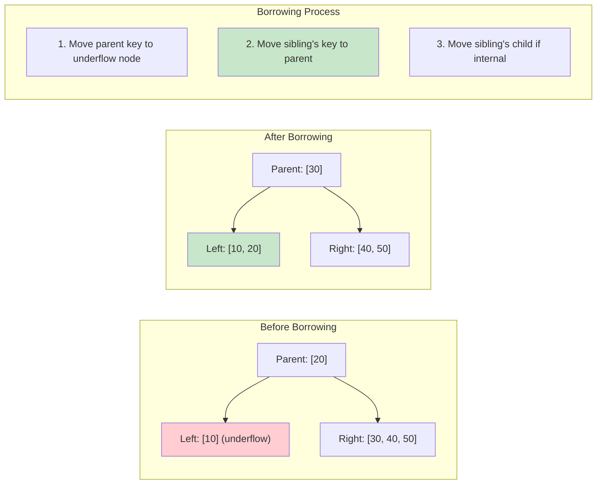

### Merging Nodes

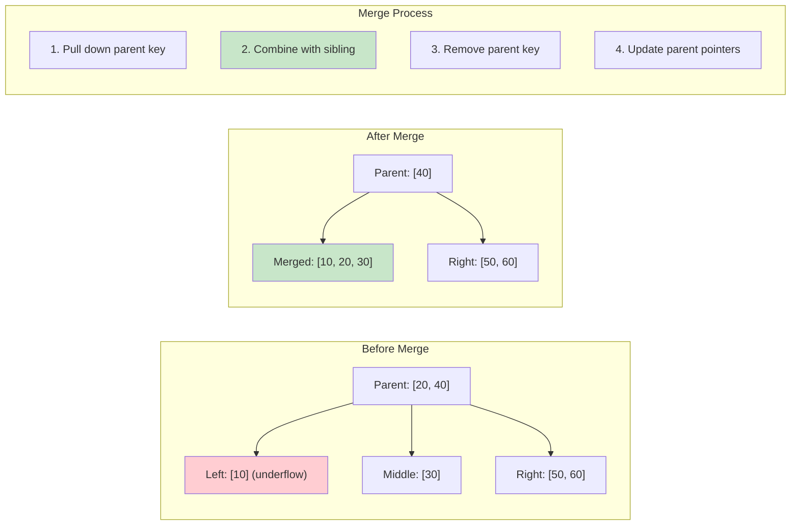

### B-Tree vs B+ Tree

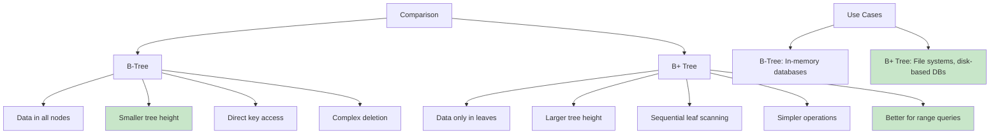

### Performance Analysis

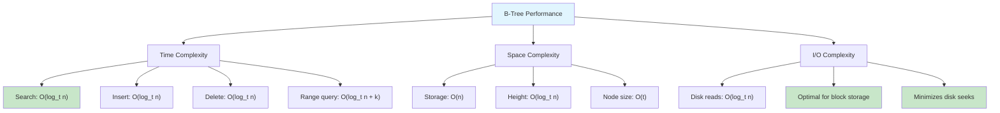

### Real-World Applications

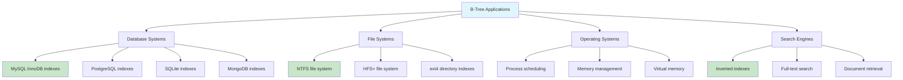

### Implementation Considerations

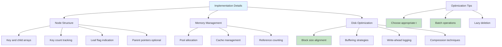

### Minimum Degree Selection

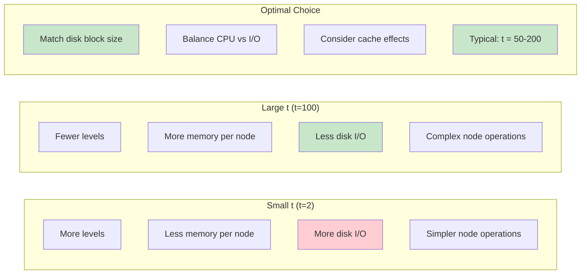

### B-Tree Variants

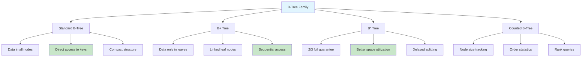

A B-Tree is a self-balancing tree data structure that maintains sorted data and allows searches, sequential access, insertions, and deletions in logarithmic time.

### Key Properties

- All leaves are at the same level
- A B-tree is defined by the term minimum degree `t` (≥ 2)
- Every node except root must contain at least `t-1` keys
- Every node may contain at most `2t-1` keys
- Number of children of a node is equal to the number of keys in it plus 1
- All keys of a node are sorted in increasing order
- The child between two keys k1 and k2 contains all keys in the range from k1 and k2
- B-tree grows and shrinks from the root which is unlike Binary Search Tree

### Features

- **Configurable Minimum Degree**: Support for different minimum degrees (t ≥ 2)
- **Automatic Node Splitting**: Nodes automatically split when they exceed capacity
- **Self-Balancing**: Maintains balanced height through splits and merges
- **Efficient Operations**: Logarithmic time complexity for all major operations
- **Both Recursive and Iterative**: Default recursive with iterative alternatives
- **Comprehensive Validation**: Built-in tree structure validation
- **Multiple Traversals**: In-order, pre-order, and level-order traversals

## Complexity

- **Time Complexity**:
  - Search: O(log n)
  - Insert: O(log n)
  - Delete: O(log n)
  - Traversal: O(n)
- **Space Complexity**: O(n)
- **Height**: O(log_t n) where t is the minimum degree

## Real-World Applications

- **Database Systems**: B-trees are widely used in database indexing (MySQL, PostgreSQL)
- **File Systems**: Many file systems use B-trees for directory structures (NTFS, HFS+)
- **Operating Systems**: Used in memory management and virtual memory systems
- **Search Engines**: Efficient indexing of large datasets
- **Distributed Systems**: B-trees work well with disk-based storage due to high branching factor

## API Reference

### Core Operations

```go
bt := NewBTree(3)                    // Create B-tree with minimum degree 3
bt.Insert(key)                       // Insert a key
found := bt.Search(key)              // Search for a key (recursive)
found := bt.SearchIterative(key)     // Search for a key (iterative)
success := bt.Delete(key)            // Delete a key
```

### Tree Information

```go
size := bt.GetSize()                 // Get number of keys
height := bt.GetHeight()             // Get tree height
degree := bt.GetMinimumDegree()      // Get minimum degree
isEmpty := bt.IsEmpty()              // Check if tree is empty
nodeCount := bt.GetNodeCount()       // Get total number of nodes
leafCount := bt.GetLeafCount()       // Get number of leaf nodes
```

### Traversals

```go
inOrder := bt.InOrderTraversal()     // Get keys in sorted order
preOrder := bt.PreOrderTraversal()   // Get keys in pre-order
levelOrder := bt.LevelOrderTraversal() // Get keys in level-order
allKeys := bt.GetAllKeys()           // Alias for InOrderTraversal
```

### Utility Operations

```go
min, hasMin := bt.FindMin()          // Find minimum key
max, hasMax := bt.FindMax()          // Find maximum key
isValid := bt.Validate()             // Validate B-tree properties
bt.PrintTree()                       // Print tree structure
bt.Clear()                           // Clear all nodes
```

## Usage

```bash
make run n=0029-b-tree
```

## Testing

```bash
make test n=0029-b-tree
```

## Implementation Details

### Node Structure

- **Keys**: Sorted array of keys (max 2t-1)
- **Children**: Array of child pointers (max 2t)
- **IsLeaf**: Boolean flag indicating leaf status
- **Parent**: Pointer to parent node for efficient operations

### Insertion Algorithm

1. If tree is empty, create root with the key
2. If root is full, split it and create new root
3. Insert into appropriate non-full node
4. Split nodes as needed during insertion

### Deletion Algorithm

1. **Case 1**: Key in leaf node - simply remove
2. **Case 2**: Key in internal node - replace with predecessor/successor
3. **Case 3**: Key not found - recursively delete from appropriate child
4. Handle underflow by borrowing from siblings or merging nodes

### Splitting Process

When a node becomes full (2t-1 keys):

1. Create new node
2. Move upper half of keys to new node
3. Move median key up to parent
4. Update child pointers appropriately

### Performance Characteristics

- **Optimal Degree**: For disk-based systems, degree is typically chosen based on page size
- **Memory Efficiency**: High branching factor reduces tree height
- **Cache Performance**: Good locality of reference within nodes
- **Disk I/O**: Minimizes disk accesses due to high branching factor

## Benchmarks

The implementation includes comprehensive benchmarks for:

- Insert operations
- Search operations (both recursive and iterative)
- Delete operations
- Traversal operations

Typical performance on modern hardware:

- Insert: ~10-50 ns/operation
- Search: ~10-30 ns/operation
- Delete: ~50-200 ns/operation
