# Topological Sort

## Description

Topological Sort is a linear ordering of vertices in a directed acyclic graph (DAG) such that for every directed edge (u, v), vertex u comes before vertex v in the ordering. It's used to solve dependency problems and scheduling tasks with prerequisites.

## Visual Representation

### Sample DAG and Topological Ordering

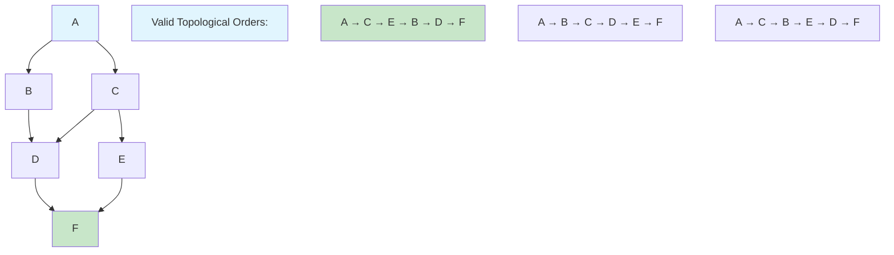

### Kahn's Algorithm (BFS-based)

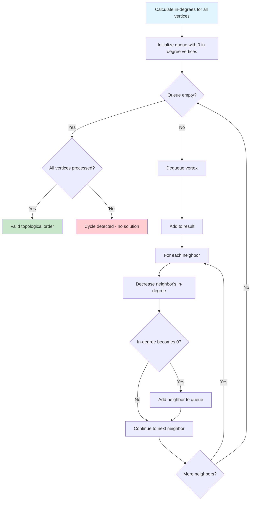

### DFS-based Approach

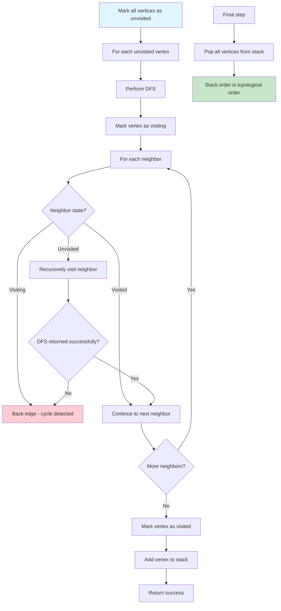

### In-Degree Calculation

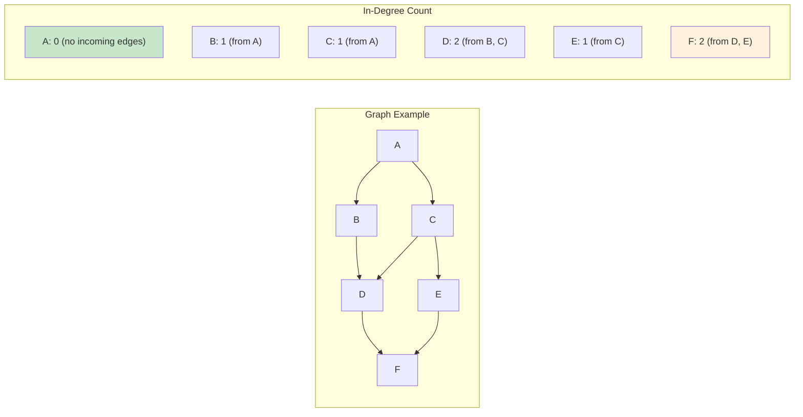

### Kahn's Algorithm Step by Step

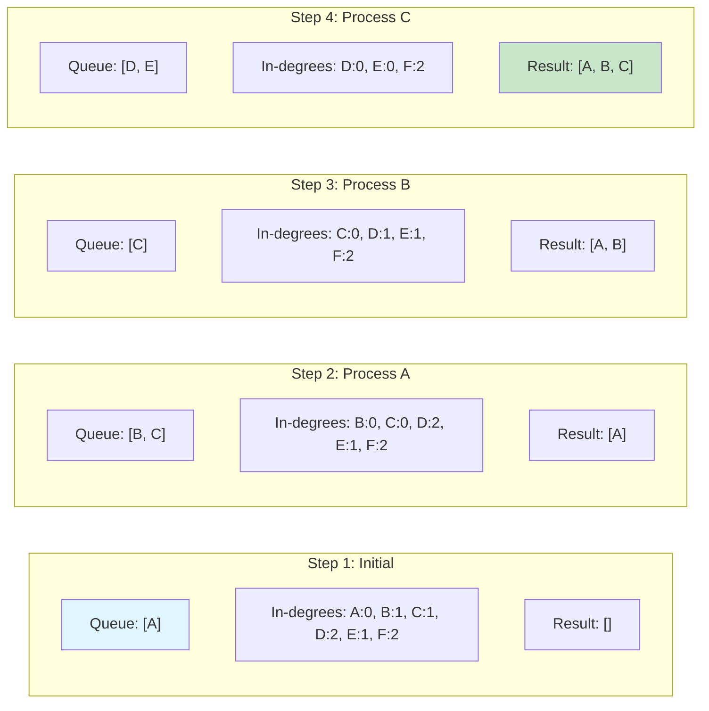

### DFS-based Implementation

```mermaid
graph LR
    subgraph "DFS States"
        A["WHITE: Unvisited"]
        B["GRAY: Currently visiting"]
        C["BLACK: Completely visited"]
    end

    subgraph "Algorithm Flow"
        D["Start DFS from any vertex"]
        E["Mark as GRAY"]
        F["Visit all neighbors"]
        G["Mark as BLACK"]
        H["Push to stack"]
    end

    subgraph "Cycle Detection"
        I["GRAY → GRAY edge = Back edge"]
        J["Back edge indicates cycle"]
        K["No topological order exists"]
    end

    style A fill:#f5f5f5
    style B fill:#fff3e0
    style C fill:#333
    style J fill:#ffcdd2
```

### Applications and Use Cases

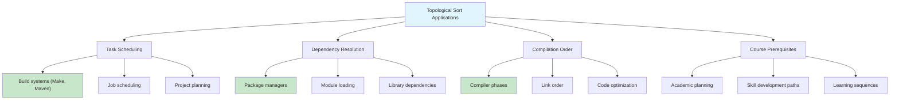

### Cycle Detection in Topological Sort

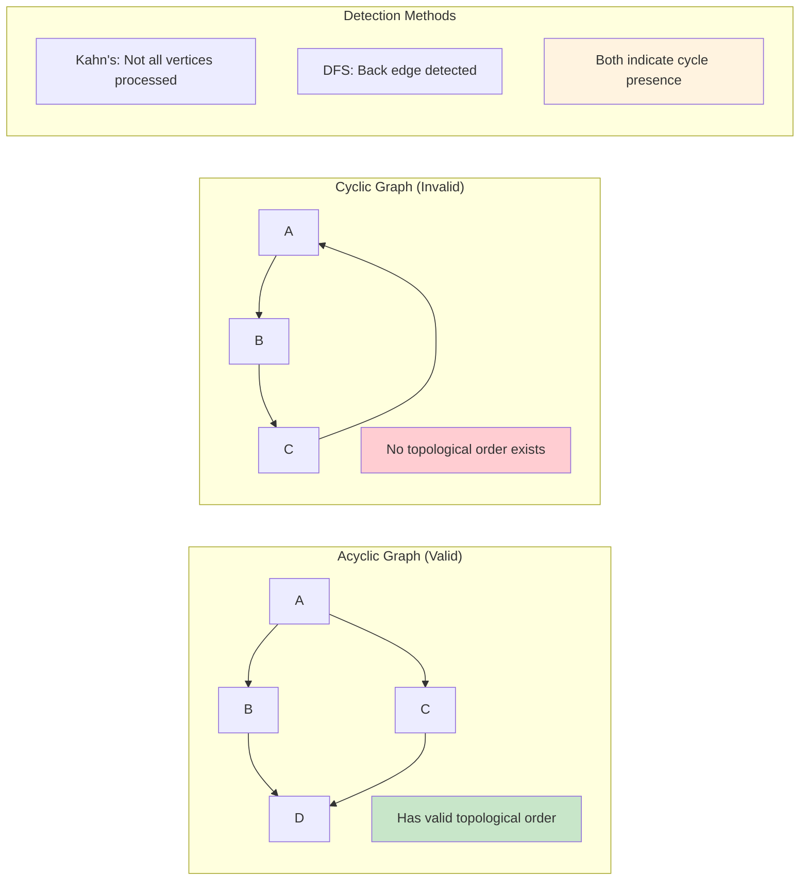

### Complexity Analysis

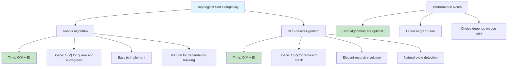

### Multiple Valid Orderings

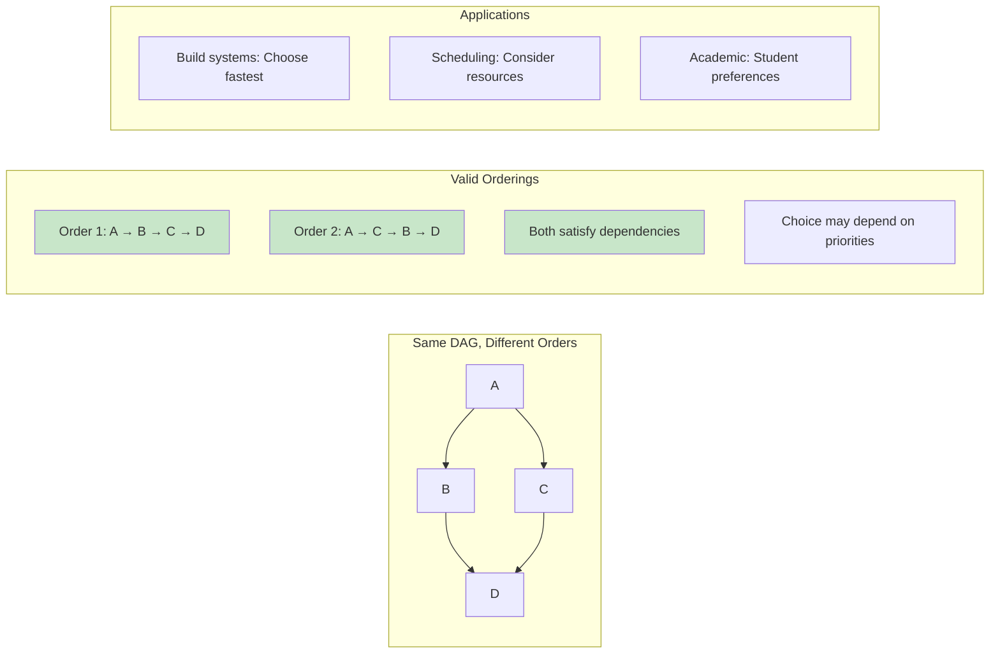

### Implementation Comparison

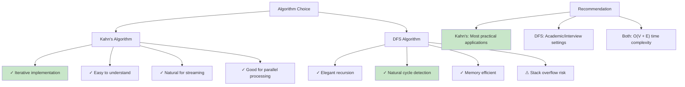

### Real-World Example: Build System

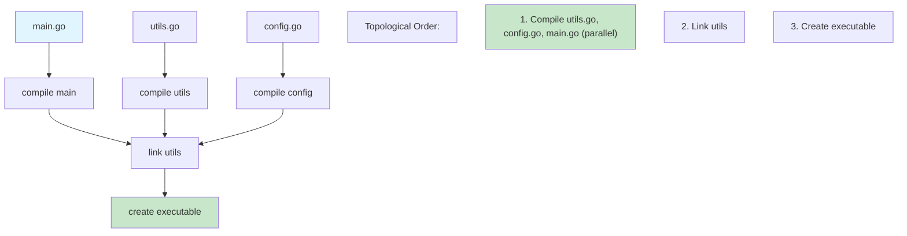

### Error Handling and Edge Cases

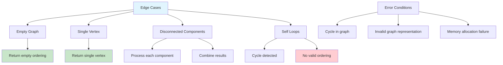

Topological Sort is a linear ordering of vertices in a directed acyclic graph (DAG) such that for every directed edge (u, v), vertex u comes before vertex v in the ordering.

### Key Properties

- Only applicable to Directed Acyclic Graphs (DAGs)
- Multiple valid topological orderings may exist for the same graph
- If a graph has a cycle, no topological ordering is possible
- Every DAG has at least one topological ordering
- Vertices with no incoming edges can appear first in any valid ordering

### Features

- **Dual Graph Representations**: Support for both adjacency list and adjacency matrix
- **Multiple Algorithms**: Kahn's algorithm (BFS-based) and DFS-based approaches
- **Cycle Detection**: Efficient cycle detection with detailed error reporting
- **Complete Graph Operations**: Add/remove edges, vertex naming, degree calculations
- **Advanced Features**: Find all possible topological sorts, longest path in DAG
- **Comprehensive Validation**: Built-in DAG validation and topological order verification

## Algorithms

### 1. Kahn's Algorithm (BFS-based)

- Uses in-degree calculation and queue processing
- Processes vertices with zero in-degree first
- Detects cycles when not all vertices are processed
- Time: O(V + E), Space: O(V)

### 2. DFS-based Algorithm

- Uses depth-first search with recursion stack tracking
- Detects cycles using recursion stack (back edges)
- Builds result in reverse post-order
- Time: O(V + E), Space: O(V)

## Complexity

- **Time Complexity**:
  - Kahn's Algorithm: O(V + E)
  - DFS Algorithm: O(V + E)
  - Cycle Detection: O(V + E)
  - All Topological Sorts: O(V! × (V + E)) - exponential
- **Space Complexity**: O(V + E) for graph storage, O(V) for algorithms

## Real-World Applications

- **Task Scheduling**: Ordering tasks with dependencies (project management)
- **Course Prerequisites**: Determining valid course sequences in academic programs
- **Build Systems**: Resolving compilation dependencies (Makefiles, build tools)
- **Package Management**: Installing software packages with dependencies
- **Spreadsheet Calculations**: Evaluating formulas with cell dependencies
- **Database Query Optimization**: Ordering operations in query execution plans
- **Version Control**: Linearizing commit history in distributed systems

## API Reference

### Graph Creation and Management

```go
g := NewGraph(vertices, useMatrix)     // Create graph (adjacency list or matrix)
g.AddEdge(from, to)                   // Add directed edge
g.RemoveEdge(from, to)                // Remove edge
g.HasEdge(from, to)                   // Check if edge exists
g.SetVertexName(vertex, name)         // Set vertex name
g.GetVertexName(vertex)               // Get vertex name
```

### Graph Information

```go
g.GetVertexCount()                    // Get number of vertices
g.GetEdgeCount()                      // Get number of edges
g.GetNeighbors(vertex)                // Get adjacent vertices
g.GetInDegree(vertex)                 // Get incoming edge count
g.GetOutDegree(vertex)                // Get outgoing edge count
g.IsDAG()                             // Check if graph is a DAG
g.PrintGraph()                        // Print graph structure
```

### Topological Sorting

```go
sorter := NewTopologicalSorter(graph)
result, err := sorter.KahnSort()      // Kahn's algorithm
result, err := sorter.DFSSort()       // DFS-based algorithm
allSorts, err := sorter.AllTopologicalSorts() // Find all possible sorts
```

### Advanced Operations

```go
hasCycle := sorter.HasCycle()         // Detect cycles
path, length, err := sorter.FindLongestPath() // Find longest path in DAG
```

## Usage

```bash
make run n=0030-topological-sort
```

## Testing

```bash
make test n=0030-topological-sort
```

## Implementation Details

### Graph Representations

- **Adjacency List**: Efficient for sparse graphs, faster edge iteration
- **Adjacency Matrix**: Efficient for dense graphs, O(1) edge lookup
- **Automatic Selection**: Choose based on graph density and use case

### Kahn's Algorithm Steps

1. Calculate in-degree for all vertices
2. Initialize queue with vertices having zero in-degree
3. Process queue: remove vertex, decrease neighbors' in-degrees
4. Add vertices with zero in-degree to queue
5. If all vertices processed, return topological order; otherwise, cycle detected

### DFS Algorithm Steps

1. Perform DFS traversal with recursion stack tracking
2. Detect cycles using back edges (recursion stack)
3. Add vertices to result in reverse post-order
4. Return topological order or cycle error

### Cycle Detection

- **Kahn's Method**: Cycle exists if not all vertices are processed
- **DFS Method**: Cycle exists if back edge found (vertex in recursion stack)
- **Self-loops**: Automatically detected as cycles

### Performance Characteristics

- **Sparse Graphs**: Adjacency list representation preferred
- **Dense Graphs**: Adjacency matrix may be more efficient
- **Large Graphs**: Both algorithms scale linearly with vertices and edges
- **Memory Usage**: Adjacency list: O(V + E), Matrix: O(V²)

## Example Use Cases

### 1. Course Prerequisites

```go
g := NewGraph(6, false)
g.SetVertexName(0, "Math101")
g.SetVertexName(1, "Math201")
g.SetVertexName(2, "CS101")
g.SetVertexName(3, "CS201")
g.SetVertexName(4, "CS301")
g.SetVertexName(5, "CS401")

g.AddEdge(0, 1) // Math101 -> Math201
g.AddEdge(2, 3) // CS101 -> CS201
g.AddEdge(3, 4) // CS201 -> CS301
g.AddEdge(4, 5) // CS301 -> CS401
g.AddEdge(1, 4) // Math201 -> CS301
```

### 2. Build Dependencies

```go
g := NewGraph(5, false)
g.SetVertexName(0, "utils.o")
g.SetVertexName(1, "parser.o")
g.SetVertexName(2, "compiler.o")
g.SetVertexName(3, "linker.o")
g.SetVertexName(4, "executable")

g.AddEdge(0, 1) // utils -> parser
g.AddEdge(1, 2) // parser -> compiler
g.AddEdge(2, 3) // compiler -> linker
g.AddEdge(3, 4) // linker -> executable
```

## Benchmarks

The implementation includes comprehensive benchmarks for:

- Kahn's algorithm performance
- DFS algorithm performance
- Cycle detection efficiency
- Graph operations (add edge, degree calculations)

Typical performance on modern hardware:

- Kahn's Sort: ~1-10 μs for 1000 vertices
- DFS Sort: ~1-10 μs for 1000 vertices
- Cycle Detection: ~1-5 μs for 1000 vertices
- Add Edge: ~10-50 ns per operation
