# prim-algorithm

## Description

Prim's algorithm is a greedy algorithm that finds a minimum spanning tree (MST) for a weighted undirected graph. It builds the MST by starting from an arbitrary vertex and repeatedly adding the minimum-weight edge that connects a vertex in the MST to a vertex outside the MST.

This implementation provides two approaches:

- **Priority Queue Approach**: Uses a min-heap for efficient edge selection (O(E log V))
- **Simple Approach**: Uses linear search for minimum edge selection (O(V²))

## Key Features

- Weighted undirected graph support
- Two algorithm implementations for different performance characteristics
- Comprehensive connectivity checking
- Support for floating-point and negative weights
- Detailed MST properties and validation
- Step-by-step algorithm visualization support

## Complexity

- **Priority Queue Approach**:
  - Time Complexity: O(E log V) where E = edges, V = vertices
  - Space Complexity: O(V + E)
- **Simple Approach**:
  - Time Complexity: O(V²)
  - Space Complexity: O(V + E)

## Algorithm Steps

1. Start with an arbitrary vertex (typically vertex 0)
2. Mark the starting vertex as visited
3. Add all edges from visited vertices to the priority queue/candidate set
4. Repeat until MST is complete:
   - Select the minimum-weight edge connecting visited to unvisited vertex
   - Add the edge to MST and mark the destination vertex as visited
   - Add all edges from the newly visited vertex to candidates
5. Return the MST with total cost

## Real-World Applications

- **Network Design**: Designing minimum-cost communication networks
- **Circuit Design**: Connecting components with minimum wire length
- **Transportation**: Building road/railway networks with minimum cost
- **Clustering**: Creating hierarchical clusters in data analysis
- **Approximation Algorithms**: TSP approximation and other optimization problems

## API Reference

### Graph Operations

```go
g := NewGraph(vertices)           // Create graph with n vertices
g.AddEdge(from, to, weight)       // Add weighted edge
g.GetVertexCount()                // Get number of vertices
g.GetEdgeCount()                  // Get number of edges
g.GetNeighbors(vertex)            // Get adjacent edges
g.IsConnected()                   // Check if graph is connected
```

### MST Algorithms

```go
mst, err := g.PrimMST()           // Priority queue approach
mst, err := g.PrimMSTSimple()     // Simple O(V²) approach
```

### MST Properties

```go
mst.GetEdges()                    // Get MST edges
mst.GetTotalCost()                // Get total weight
mst.GetVertexCount()              // Get vertex count
mst.GetEdgeCount()                // Get edge count
mst.IsComplete()                  // Check if MST is complete
```

### Utility Functions

```go
g.PrintGraph()                    // Print graph structure
mst.PrintMST()                    // Print MST details
```

## Usage

```bash
make run n=0031-prim-algorithm
```

## Testing

```bash
make test n=0031-prim-algorithm
```

## Implementation Details

- Uses adjacency list representation for efficient neighbor access
- Priority queue implemented with Go's container/heap package
- Supports disconnected graph detection with appropriate error handling
- Handles edge cases: empty graphs, single vertices, negative weights
- Comprehensive test coverage including large graphs and performance benchmarks

## Visual Representation

### Sample Graph for MST

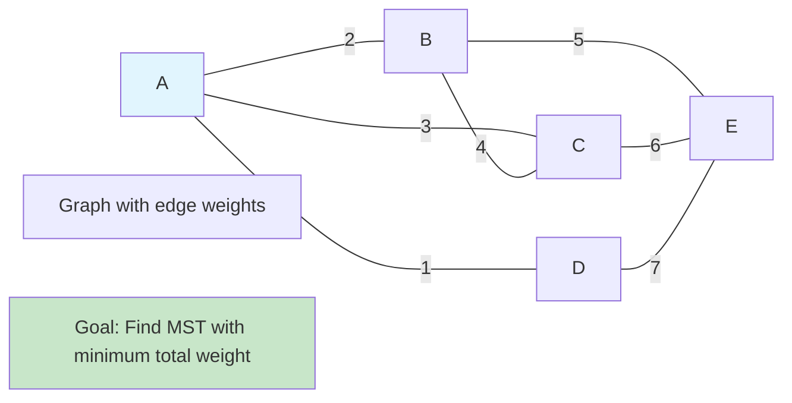

### Prim's Algorithm Steps

```mermaid
graph TD
    A[Start with arbitrary vertex] --> B[Add to MST set]
    B --> C[Initialize priority queue with adjacent edges]
    C --> D{Queue empty?}
    D -->|Yes| E[MST Complete]
    D -->|No| F[Extract minimum weight edge]
    F --> G{Both vertices in MST?}
    G -->|Yes| H[Skip edge (would create cycle)]
    G -->|No| I[Add edge to MST]
    I --> J[Add new vertex to MST set]
    J --> K[Add new adjacent edges to queue]
    K --> L[Update priorities if needed]
    L --> D
    H --> D

    style A fill:#e1f5fe
    style E fill:#c8e6c9
```

### Step-by-Step MST Construction

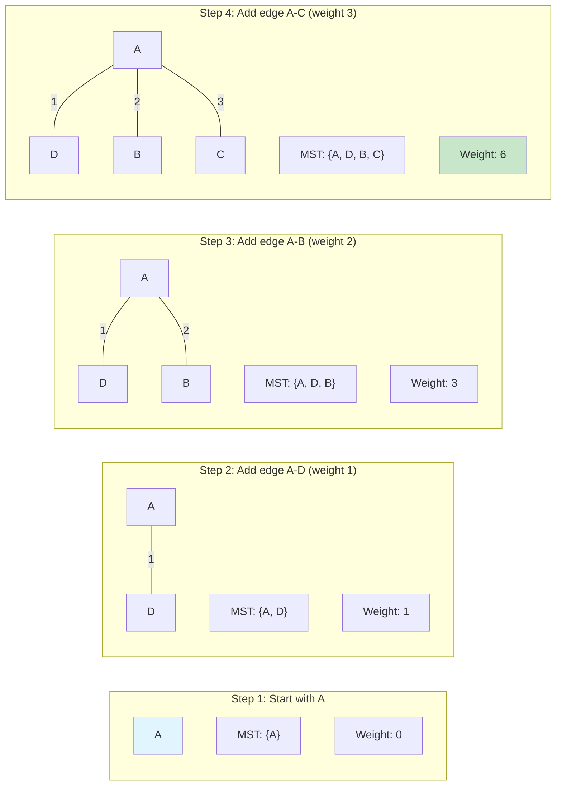

### Priority Queue Operations

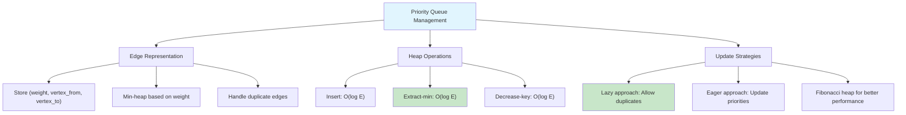

### Lazy vs Eager Implementation

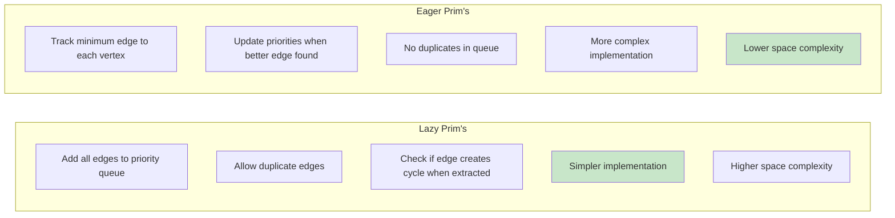

### MST Properties and Invariants

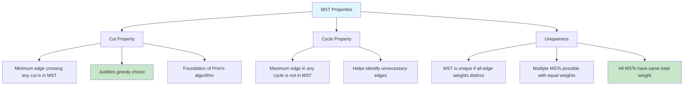

### Algorithm Complexity Analysis

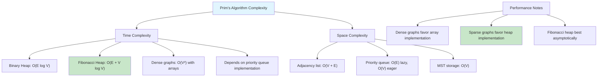

### Prim's vs Kruskal's Algorithm

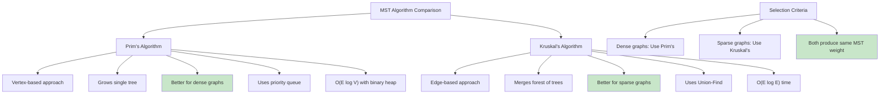

### Cut Property Visualization

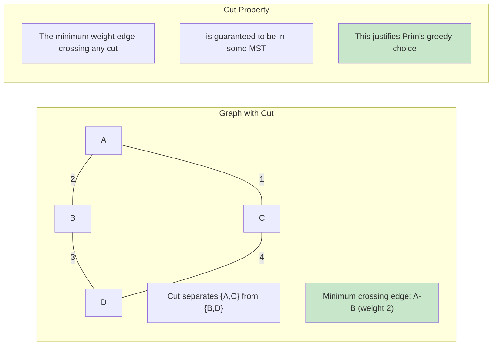

### Implementation Variants

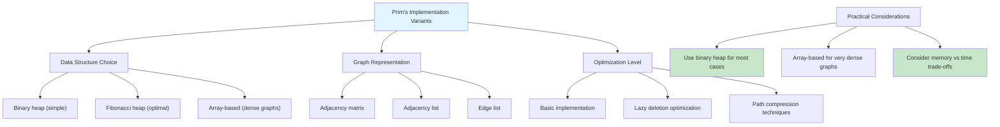

### Real-World Applications

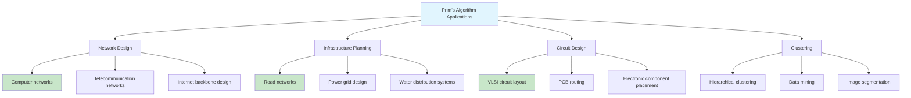

### Detailed Algorithm Trace

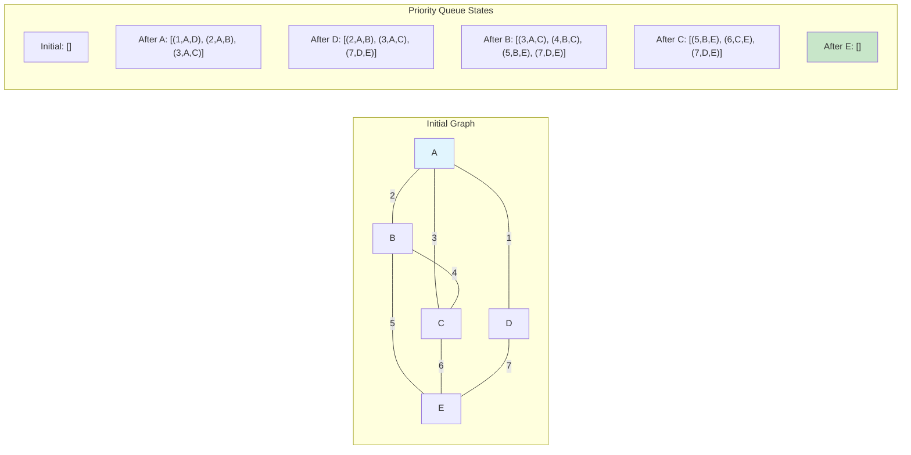

### Error Handling and Edge Cases

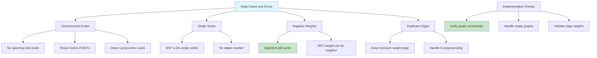

### Optimization Techniques

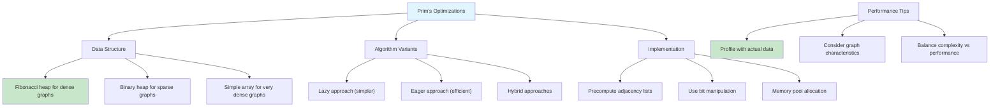

Prim's Algorithm is a greedy algorithm that finds a minimum spanning tree (MST) for a weighted undirected graph.
