# kruskal-algorithm

## Description

Kruskal's algorithm is a greedy algorithm that finds a minimum spanning tree (MST) for a weighted undirected graph. It works by sorting all edges by weight and then adding edges to the MST in order of increasing weight, using a Union-Find data structure to detect and avoid cycles.

This implementation features:

- **Union-Find with Path Compression**: Optimized disjoint set operations
- **Union by Rank**: Balanced tree structure for efficient operations
- **Step-by-Step Visualization**: Track algorithm decisions and cycle detection
- **Comprehensive Edge Sorting**: Handles duplicate weights correctly

## Key Features

- Weighted undirected graph support
- Efficient Union-Find data structure with path compression and union by rank
- Cycle detection during MST construction
- Algorithm step tracking for educational purposes
- Support for floating-point and negative weights
- Comprehensive connectivity analysis

## Complexity

- **Time Complexity**: O(E log E) where E = edges (dominated by edge sorting)
- **Space Complexity**: O(V + E) where V = vertices
- **Union-Find Operations**: Nearly O(1) amortized with path compression and union by rank

## Algorithm Steps

1. Sort all edges in the graph by weight in ascending order
2. Initialize Union-Find data structure with all vertices as separate components
3. For each edge in sorted order:
   - Check if adding the edge would create a cycle (using Union-Find)
   - If no cycle: add edge to MST and union the components
   - If cycle: reject the edge
4. Continue until MST has V-1 edges (for V vertices)
5. Return the MST with total cost

## Real-World Applications

- **Network Design**: Building minimum-cost communication networks
- **Circuit Design**: Connecting electronic components with minimum wire
- **Transportation**: Designing efficient road/railway networks
- **Clustering**: Creating hierarchical data clusters
- **Image Segmentation**: Computer vision and image processing
- **Social Networks**: Finding minimum connection costs between groups

## API Reference

### Graph Operations

```go
g := NewGraph(vertices)           // Create graph with n vertices
g.AddEdge(from, to, weight)       // Add weighted edge
g.GetVertexCount()                // Get number of vertices
g.GetEdgeCount()                  // Get number of edges
g.GetEdges()                      // Get all edges
g.IsConnected()                   // Check if graph is connected
```

### MST Algorithms

```go
mst, err := g.KruskalMST()                    // Standard Kruskal's algorithm
mst, steps, err := g.KruskalMSTWithSteps()    // With step-by-step tracking
```

### Union-Find Operations

```go
uf := NewUnionFind(n)             // Create Union-Find for n elements
uf.Find(x)                        // Find root with path compression
uf.Union(x, y)                    // Union two components
uf.Connected(x, y)                // Check if two elements are connected
uf.ComponentCount()               // Get number of separate components
```

### MST Properties

```go
mst.GetEdges()                    // Get MST edges
mst.GetTotalCost()                // Get total weight
mst.GetVertexCount()              // Get vertex count
mst.GetEdgeCount()                // Get edge count
mst.IsComplete()                  // Check if MST is complete
```

### Algorithm Steps

```go
type KruskalStep struct {
    Edge     Edge    // The edge being considered
    Accepted bool    // Whether edge was added to MST
    Reason   string  // Explanation of decision
}
```

### Utility Functions

```go
g.PrintGraph()                    // Print graph structure
mst.PrintMST()                    // Print MST details
PrintKruskalSteps(steps)          // Print algorithm steps
```

## Usage

```bash
make run n=0032-kruskal-algorithm
```

## Testing

```bash
make test n=0032-kruskal-algorithm
```

## Implementation Details

- **Edge Sorting**: Uses Go's sort.Slice for stable sorting of edges by weight
- **Union-Find Optimization**: Path compression flattens trees during Find operations
- **Union by Rank**: Attaches smaller trees under larger trees to maintain balance
- **Cycle Detection**: Efficiently detects cycles using Union-Find connectivity checks
- **Memory Efficient**: Stores only necessary edge information, no adjacency matrix
- **Error Handling**: Comprehensive validation for disconnected graphs and invalid inputs

## Performance Characteristics

- **Best Case**: O(E log E) for any connected graph
- **Average Case**: O(E log E) with nearly O(1) Union-Find operations
- **Worst Case**: O(E log E) - Union-Find operations remain efficient
- **Space Usage**: Linear in vertices and edges, no additional data structures needed

## Comparison with Prim's Algorithm

- **Kruskal's**: Better for sparse graphs, global edge perspective
- **Prim's**: Better for dense graphs, local vertex perspective
- **Both**: Produce optimal MST with same total weight
- **Edge Selection**: Kruskal sorts all edges first, Prim grows incrementally

## Visual Representation

### Sample Graph for MST

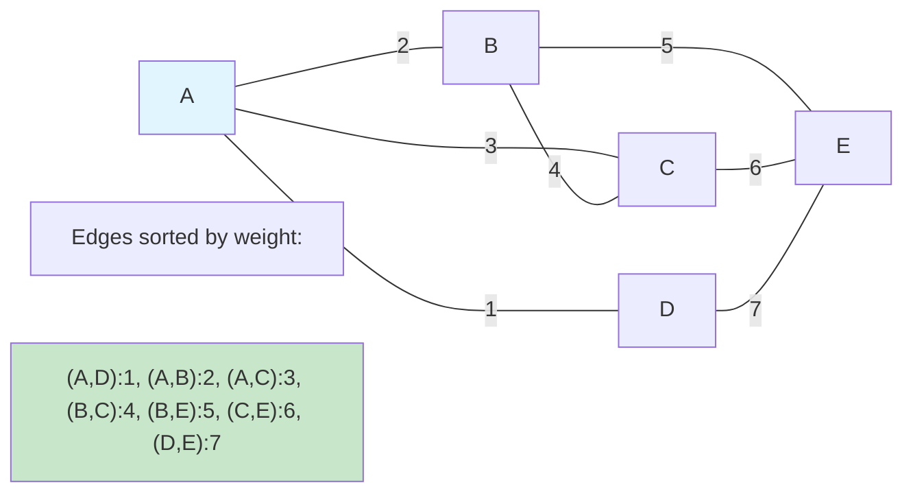

### Kruskal's Algorithm Steps

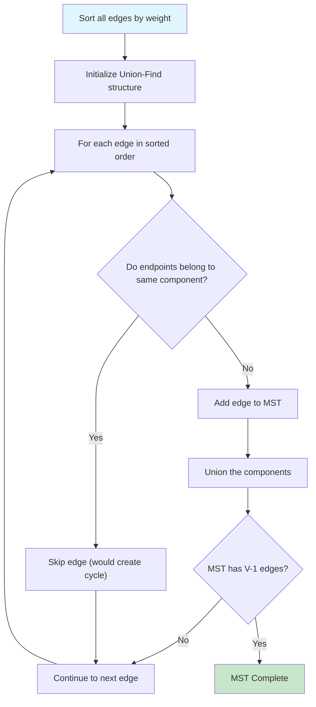

### Step-by-Step MST Construction

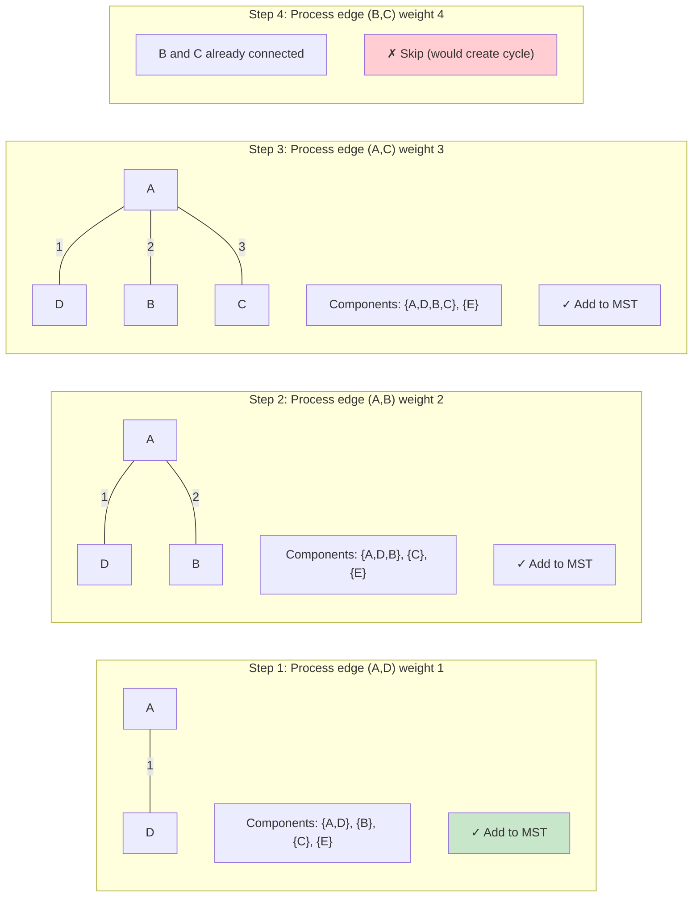

### Union-Find Data Structure

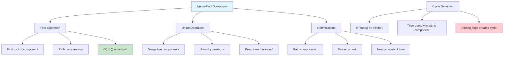

### Union-Find Tree Evolution

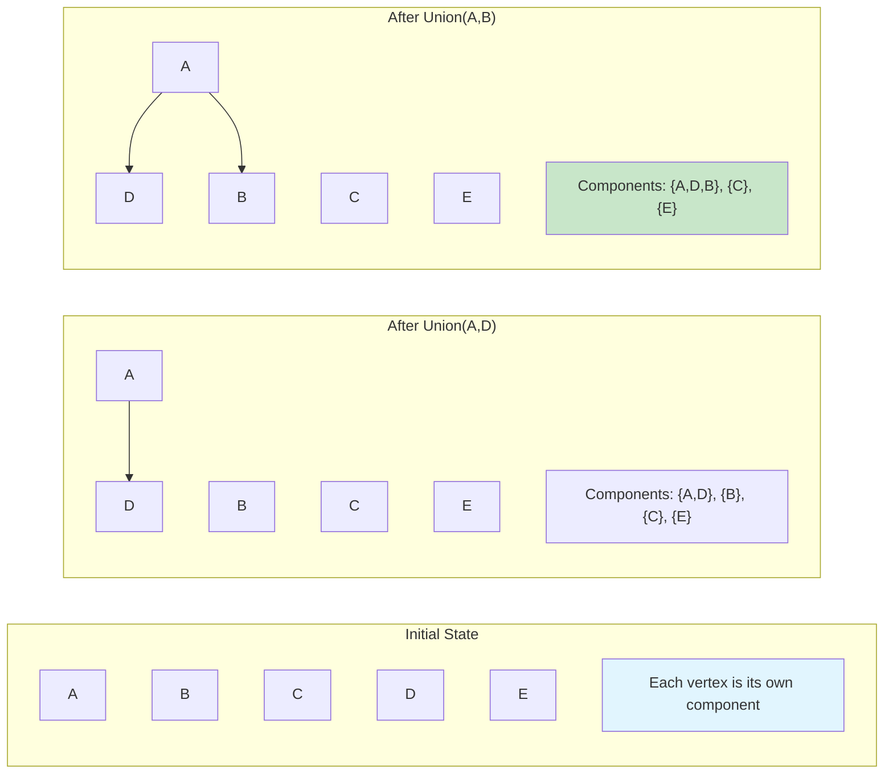

### Path Compression Visualization

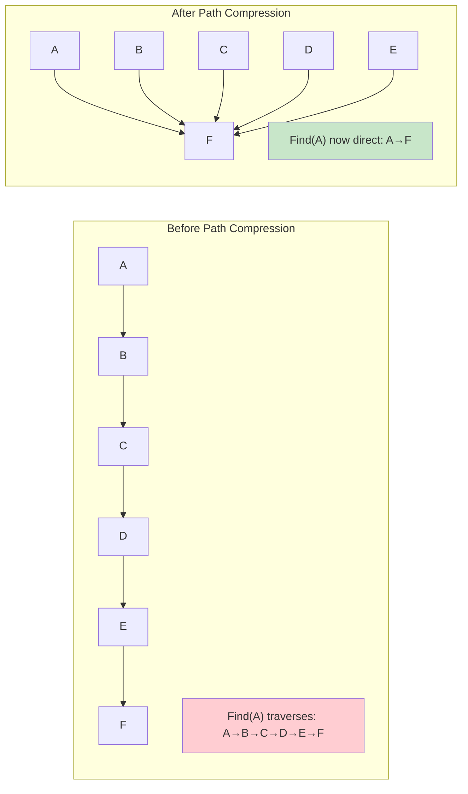

### Complexity Analysis

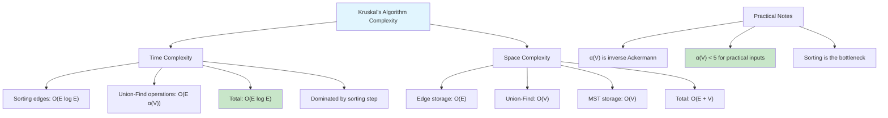

### Kruskal's vs Prim's Algorithm

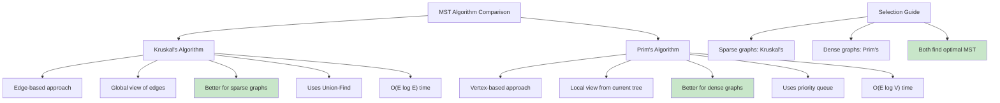

### Edge Sorting and Processing

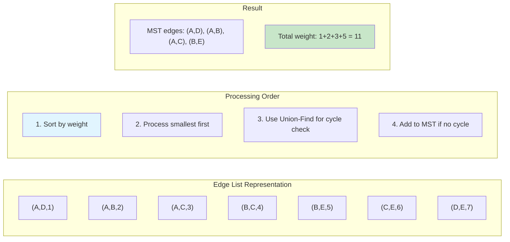

### Cycle Detection Example

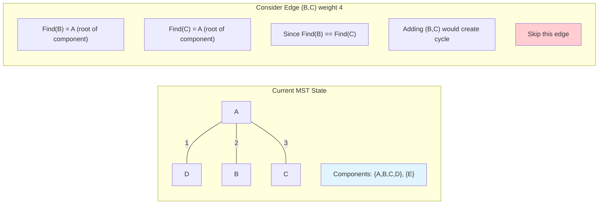

### Union by Rank Optimization

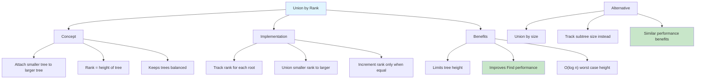

### Real-World Applications

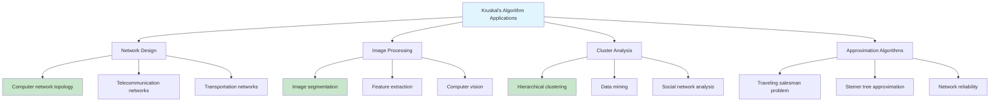

### Algorithm Variants and Optimizations

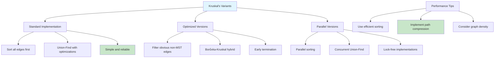

### Error Handling and Edge Cases

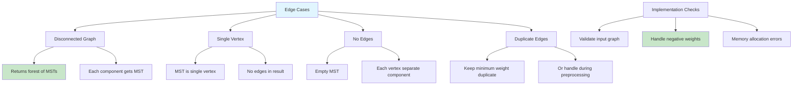

### Comparison with Other MST Algorithms

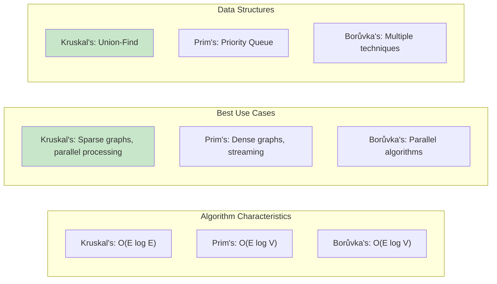

### Detailed Implementation Example

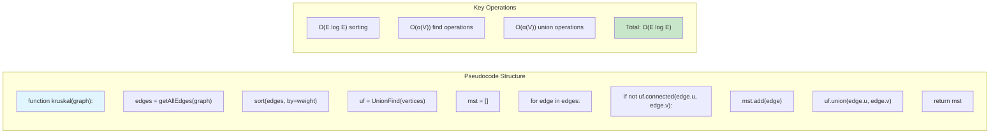

Kruskal's Algorithm is a greedy algorithm that finds a minimum spanning tree (MST) for a weighted undirected graph.
