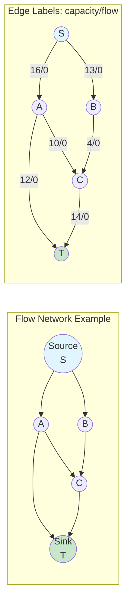
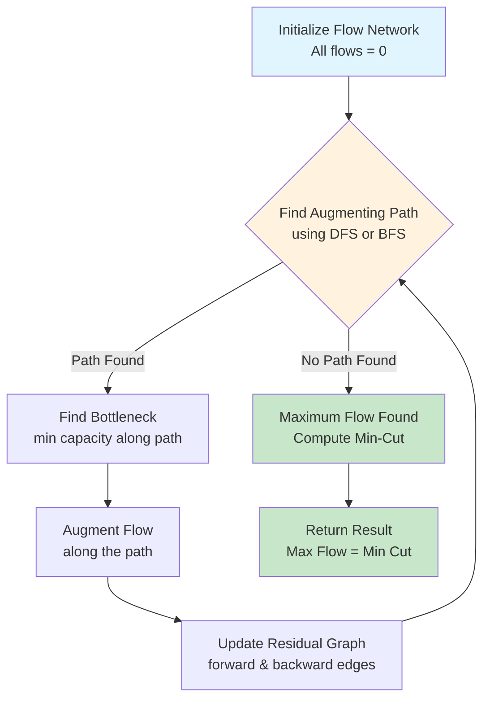
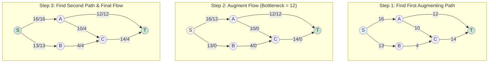
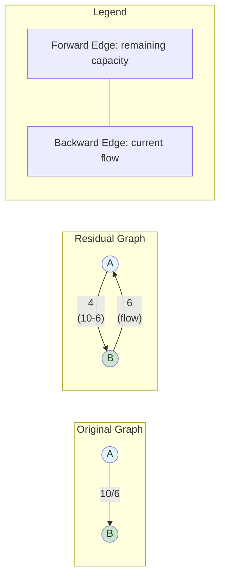
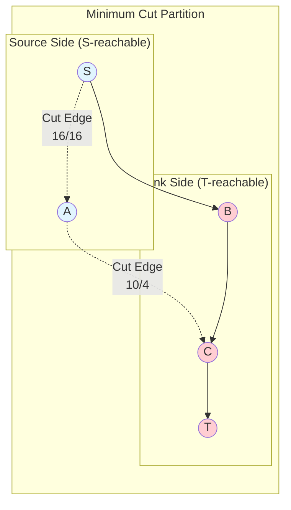
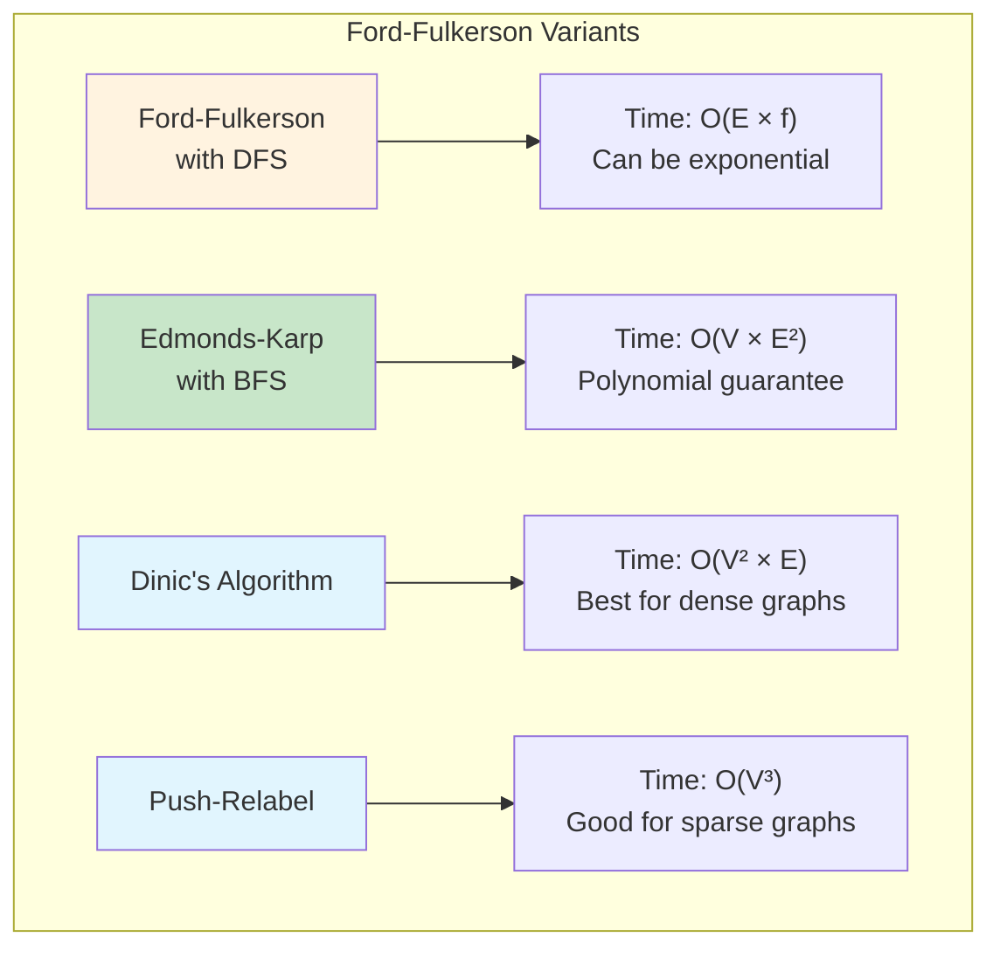

# ford-fulkerson-algorithm

## Description

The Ford-Fulkerson algorithm is a method for computing the maximum flow in a flow network. It uses the concept of augmenting paths to iteratively increase the flow until no more augmenting paths can be found. The algorithm also finds the minimum cut of the network, which by the Max-Flow Min-Cut theorem has the same value as the maximum flow.

## Flow Network Visualization



## Algorithm Flow



## Step-by-Step Execution



## Residual Graph Concept



## Min-Cut Visualization



## Algorithm Comparison



This implementation provides:

- **DFS-based Path Finding**: Uses depth-first search to find augmenting paths
- **BFS-based Path Finding**: Uses breadth-first search (Edmonds-Karp) for better performance
- **Residual Graph Management**: Automatically handles forward and backward edges
- **Min-Cut Computation**: Finds the minimum cut that separates source from sink

## Key Features

- Directed weighted flow networks with capacity constraints
- Automatic residual graph construction with reverse edges
- Both DFS and BFS implementations for path finding
- Maximum flow and minimum cut computation
- Flow conservation validation
- Support for floating-point capacities
- Comprehensive edge case handling

## Complexity

- **Ford-Fulkerson (DFS)**: O(E × f) where E = edges, f = maximum flow value
- **Edmonds-Karp (BFS)**: O(V × E²) where V = vertices, E = edges
- **Space Complexity**: O(V + E) for graph representation and auxiliary structures

## Algorithm Steps

1. **Initialize**: Set all edge flows to 0, create residual graph with reverse edges
2. **Find Augmenting Path**: Use DFS or BFS to find path from source to sink with positive residual capacity
3. **Compute Bottleneck**: Find minimum residual capacity along the augmenting path
4. **Augment Flow**: Increase flow along forward edges, decrease along backward edges
5. **Repeat**: Continue until no augmenting path exists
6. **Compute Min-Cut**: Find all vertices reachable from source in residual graph

## Real-World Applications

- **Network Routing**: Internet traffic optimization and bandwidth allocation
- **Transportation**: Railway/airline capacity planning and scheduling
- **Supply Chain**: Distribution network optimization and bottleneck analysis
- **Bipartite Matching**: Maximum matching in bipartite graphs
- **Image Segmentation**: Computer vision and medical imaging
- **Project Scheduling**: Resource allocation and critical path analysis

## API Reference

### Flow Network Operations

```go
fn := NewFlowNetwork(vertices)     // Create flow network with n vertices
fn.AddEdge(from, to, capacity)     // Add directed edge with capacity
fn.GetVertexCount()                // Get number of vertices
fn.GetEdgeCount()                  // Get number of edges (including reverse)
fn.GetEdges()                      // Get all edges in network
fn.GetTotalCapacity()              // Get sum of all edge capacities
```

### Maximum Flow Algorithms

```go
result, err := fn.FordFulkersonDFS(source, sink)    // DFS-based Ford-Fulkerson
result, err := fn.FordFulkersonBFS(source, sink)    // BFS-based Edmonds-Karp
```

### Augmenting Path Finding

```go
path := fn.FindAugmentingPathDFS(source, sink)      // DFS path finding
path := fn.FindAugmentingPathBFS(source, sink)      // BFS path finding
```

### Result Analysis

```go
result.GetMaxFlow()                // Get maximum flow value
result.GetMinCut()                 // Get minimum cut edges
result.GetMinCutCapacity()         // Get minimum cut capacity
result.GetFlowEdges()              // Get edges with positive flow
```

### Flow Network Properties

```go
fn.GetResidualCapacity(edgeIdx)    // Get residual capacity of edge
fn.IsValidFlow()                   // Validate flow conservation
fn.FindMinCut(source)              // Find minimum cut from source
```

### Data Structures

```go
type Edge struct {
    From     int     // Source vertex
    To       int     // Destination vertex
    Capacity float64 // Maximum capacity
    Flow     float64 // Current flow
}

type AugmentingPath struct {
    Path       []int     // Vertex sequence
    Bottleneck float64   // Minimum capacity along path
    Edges      []int     // Edge indices in path
}

type MaxFlowResult struct {
    MaxFlow   float64   // Maximum flow value
    MinCut    []Edge    // Minimum cut edges
    FlowEdges []Edge    // Edges with positive flow
    Source    int       // Source vertex
    Sink      int       // Sink vertex
}
```

### Utility Functions

```go
fn.PrintNetwork()                  // Print network structure
result.PrintResult()               // Print flow and cut results
```

## Usage

```bash
make run n=0033-ford-fulkerson-algorithm
```

## Testing

```bash
make test n=0033-ford-fulkerson-algorithm
```

## Implementation Details

- **Residual Graph**: Automatically creates reverse edges with 0 capacity for flow cancellation
- **Edge Management**: Uses edge mapping to handle parallel edges and capacity aggregation
- **Flow Augmentation**: Updates both forward and backward edge flows simultaneously
- **Min-Cut Finding**: Uses DFS on residual graph to identify reachable vertices from source
- **Error Handling**: Comprehensive validation for invalid vertices, negative capacities, and edge cases

## Performance Characteristics

- **DFS Approach**: Faster per iteration but may find longer paths
- **BFS Approach**: Finds shortest augmenting paths, guaranteeing polynomial time
- **Memory Usage**: Linear in vertices and edges with efficient adjacency list representation
- **Numerical Stability**: Handles floating-point capacities with appropriate precision

## Max-Flow Min-Cut Theorem

The algorithm demonstrates the fundamental theorem that in any flow network:

- **Maximum Flow Value** = **Minimum Cut Capacity**
- The minimum cut represents the bottleneck that limits the maximum flow
- Removing min-cut edges disconnects source from sink with minimum capacity loss

## Comparison with Other Algorithms

- **vs. Dinic's Algorithm**: Simpler implementation but potentially slower on dense graphs
- **vs. Push-Relabel**: More intuitive flow augmentation approach
- **vs. Capacity Scaling**: Better for networks with large capacity ranges
- **DFS vs. BFS**: BFS (Edmonds-Karp) guarantees O(VE²) while DFS can be exponential in worst case
