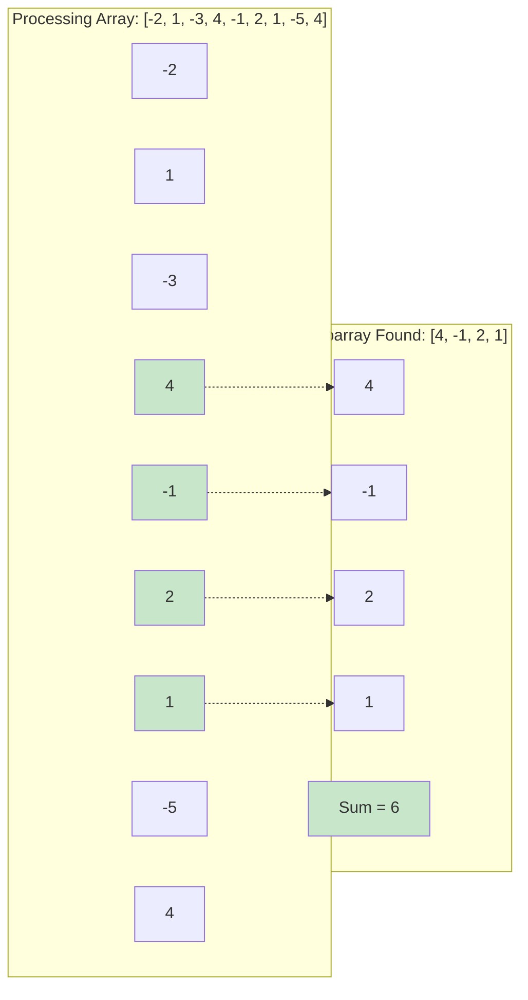
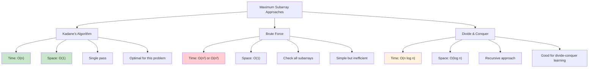
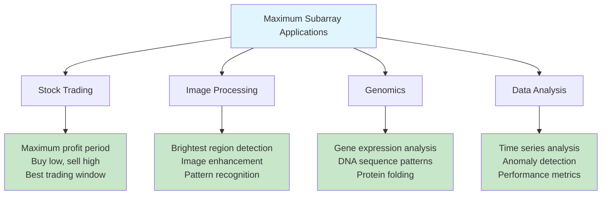

# Maximum Subarray Problem (Kadane's Algorithm)

## Description

Implementation of the Maximum Subarray Problem using Kadane's Algorithm (Dynamic Programming approach).

Given an integer array, finds the contiguous subarray with the largest sum and returns both the maximum sum and the subarray itself along with its indices.

## Visual Representation

### Kadane's Algorithm Flow

```mermaid
graph TD
    A[Start: array, n] --> B[Initialize maxSum = arr[0]]
    B --> C[Initialize currentSum = arr[0]]
    C --> D[Set start = 0, end = 0, tempStart = 0]
    D --> E[For i = 1 to n-1]
    E --> F{currentSum < 0?}
    F -->|Yes| G[currentSum = arr[i]]
    F -->|No| H[currentSum += arr[i]]
    G --> I[tempStart = i]
    H --> J{currentSum > maxSum?}
    I --> J
    J -->|Yes| K[maxSum = currentSum]
    J -->|No| L[Continue to next iteration]
    K --> M[start = tempStart, end = i]
    M --> L
    L --> N{More elements?}
    N -->|Yes| E
    N -->|No| O[Return maxSum, start, end]

    style A fill:#e1f5fe
    style O fill:#c8e6c9
    style G fill:#fff3e0
```

### Algorithm Example: Step-by-Step

```mermaid
graph TD
    subgraph "Array: [-2, 1, -3, 4, -1, 2, 1, -5, 4]"
        A["Step 1: i=0, curr=-2, max=-2"]
        B["Step 2: i=1, curr=1, max=1"]
        C["Step 3: i=2, curr=-2, max=1"]
        D["Step 4: i=3, curr=4, max=4"]
        E["Step 5: i=4, curr=3, max=4"]
        F["Step 6: i=5, curr=5, max=5"]
        G["Step 7: i=6, curr=6, max=6"]
        H["Step 8: i=7, curr=1, max=6"]
        I["Step 9: i=8, curr=5, max=6"]
    end

    A --> B --> C --> D --> E --> F --> G --> H --> I

    style A fill:#e1f5fe
    style G fill:#c8e6c9
    style C fill:#fff3e0
    style H fill:#fff3e0
```



### Current Sum vs Maximum Sum Tracking

```mermaid
graph LR
    subgraph "Key Decision at Each Step"
        A[Current element: arr[i]]
        B{currentSum + arr[i] vs arr[i]}
        C[Extend existing subarray]
        D[Start new subarray]
    end

    subgraph "Conditions"
        E["If currentSum > 0: Extend"]
        F["If currentSum ≤ 0: Start new"]
    end

    A --> B
    B -->|currentSum + arr[i] > arr[i]| C
    B -->|currentSum + arr[i] ≤ arr[i]| D

    style A fill:#e1f5fe
    style C fill:#c8e6c9
    style D fill:#fff3e0
```

### Visual Array Processing



### Comparison with Brute Force



### Dynamic Programming Insight

```mermaid
graph TD
    A[DP State Definition] --> B["dp[i] = maximum sum ending at index i"]
    B --> C[Recurrence Relation]
    C --> D["dp[i] = max(arr[i], dp[i-1] + arr[i])"]
    D --> E[Optimization]
    E --> F["Only need previous value, not entire array"]
    F --> G[Space Optimized to O(1)]

    subgraph "State Transition"
        H["If dp[i-1] > 0: Add to current"]
        I["If dp[i-1] ≤ 0: Start fresh"]
    end

    D --> H

    style A fill:#e1f5fe
    style G fill:#c8e6c9
```

### Real-World Applications



The algorithm works by maintaining two variables:

- `currentSum`: maximum sum ending at the current position
- `maxSum`: overall maximum sum found so far

At each position, we decide whether to extend the existing subarray or start a new one based on whether the current sum is positive.

## Complexity

- Time Complexity: O(n) - single pass through the array
- Space Complexity: O(1) for the algorithm itself, O(k) for storing the result subarray where k is the length of the maximum subarray

## Usage

```bash
make run n=0036-max-subarray
```

## Testing

```bash
make test n=0036-max-subarray
```
