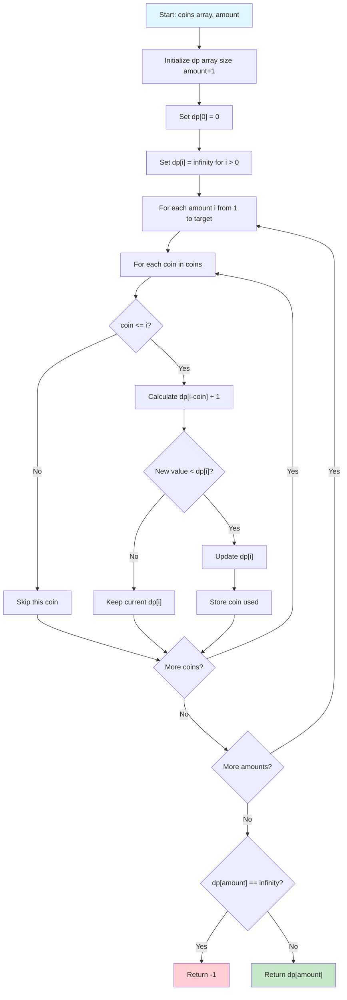
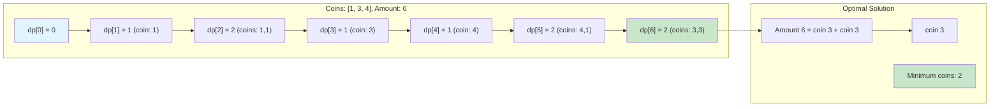
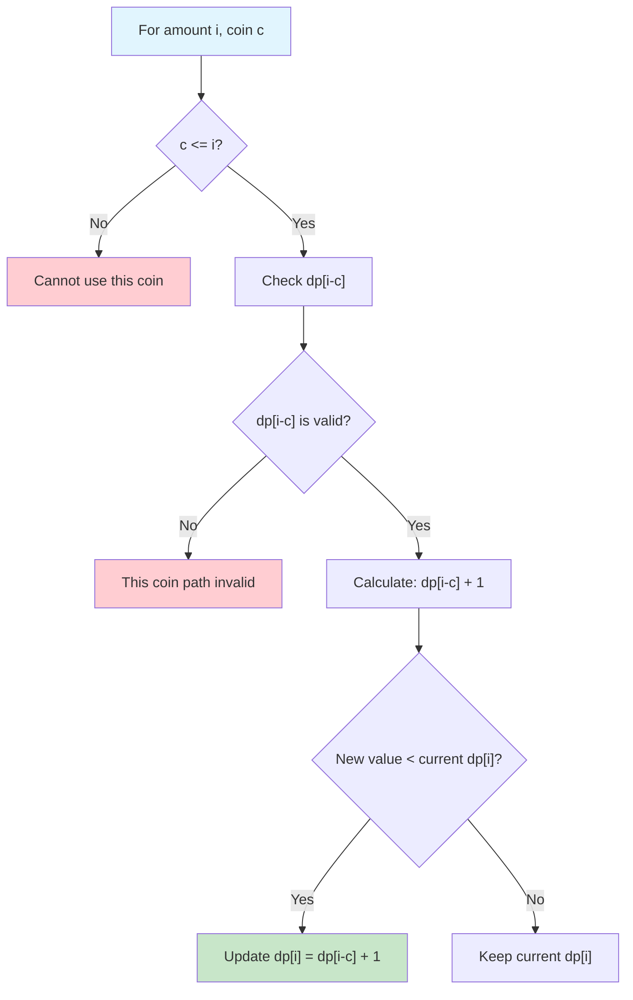
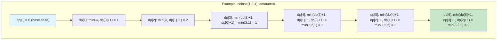
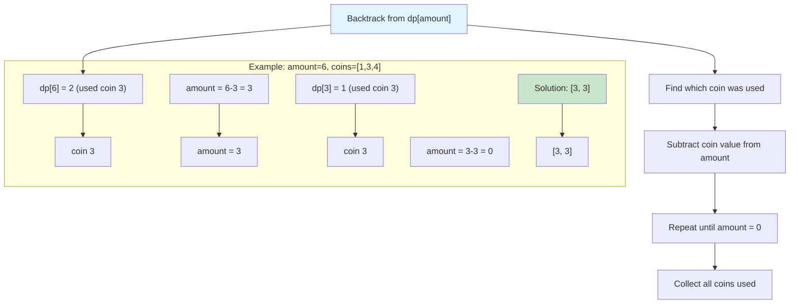
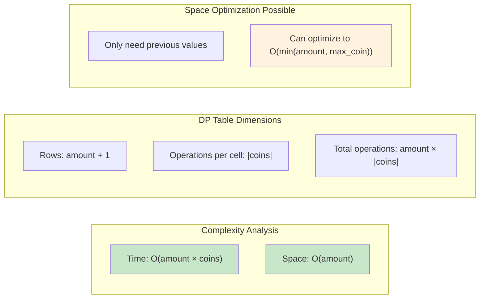
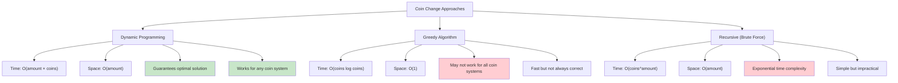
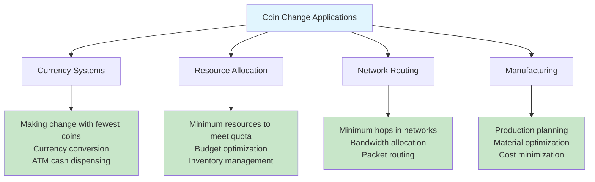

# Coin Change Problem

## Description

Implementation of the Coin Change Problem using Dynamic Programming.

Given an integer array of coin denominations and a target amount, finds the minimum number of coins needed to make up that amount. Returns -1 if the amount cannot be made with the given coins.

## Visual Representation

### Dynamic Programming Algorithm Flow



### DP Table Construction Example



### Decision Making Process



### Step-by-Step Example



### Solution Reconstruction



### Time and Space Complexity



### Comparison with Other Approaches



### Real-World Applications



The algorithm uses bottom-up dynamic programming:

- `dp[i]` represents the minimum number of coins needed to make amount `i`
- For each amount from 1 to target, tries all coin denominations
- Takes the minimum of all possible combinations
- Also tracks the actual coins used in the optimal solution

Key insight: To make amount `i`, we can use any coin `c` (where `c <= i`) and add it to the optimal solution for amount `i - c`.

## Complexity

- Time Complexity: O(amount × number of coins) - for each amount, we check all coin denominations
- Space Complexity: O(amount) for the DP array, plus O(amount) for tracking the solution path

## Usage

```bash
make run n=0037-coin-change-problem
```

## Testing

```bash
make test n=0037-coin-change-problem
```
