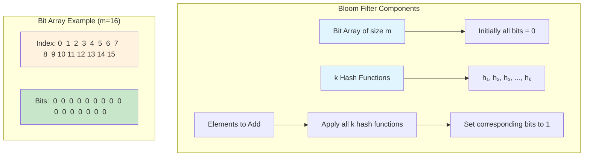
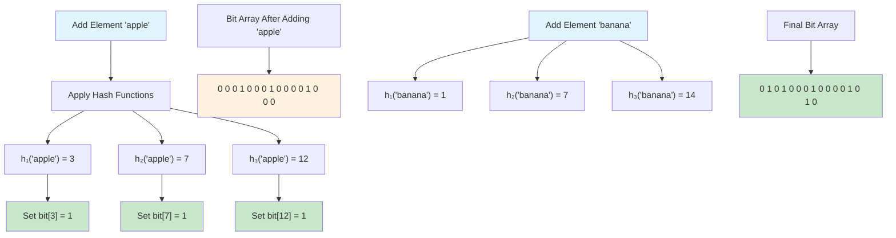
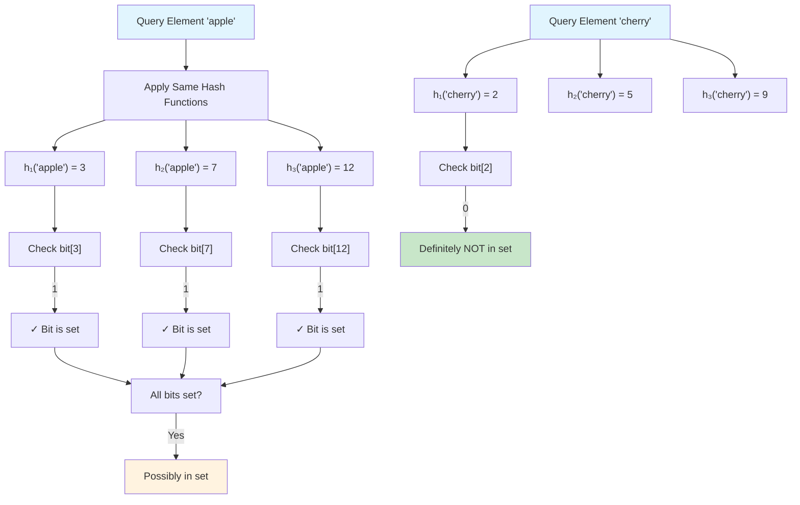
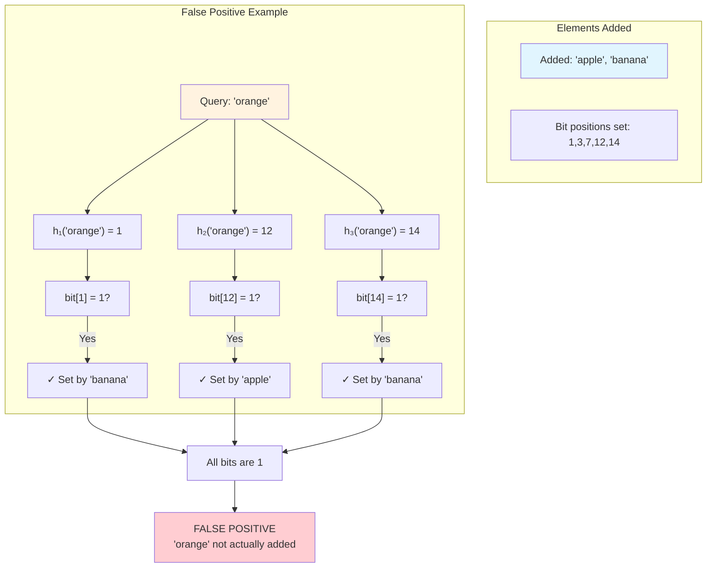
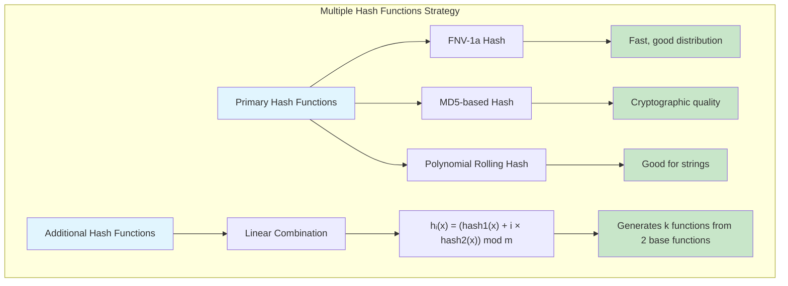
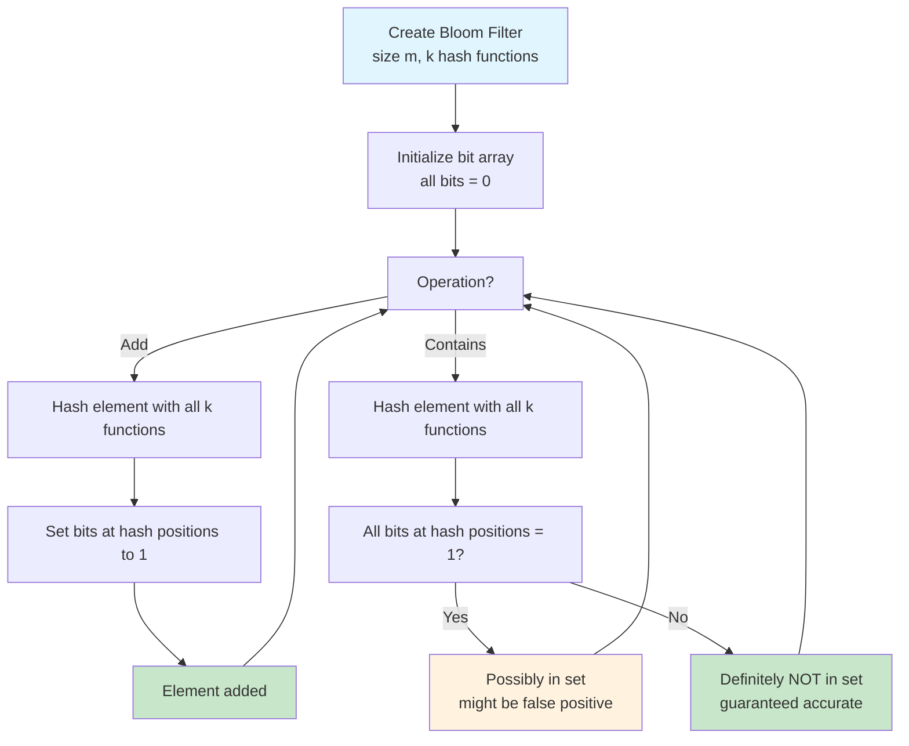
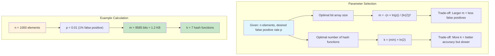
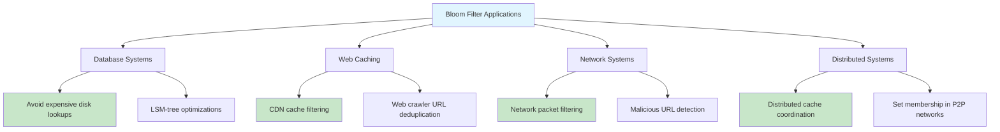

# bloom-filter

## Description

Implementation of a Bloom Filter - a space-efficient probabilistic data structure used to test whether an element is a member of a set.

Key characteristics:

- **False positives possible**: May return "possibly in set" for items not actually added
- **No false negatives**: If it says "not in set", the item is definitely not in the set
- **Space efficient**: Uses a bit array much smaller than storing all elements
- **Fast operations**: O(k) time for both insertion and lookup, where k is the number of hash functions

## Bloom Filter Structure



## Adding Elements Process



## Lookup Process



## False Positive Scenario



## Hash Functions Implementation



## Algorithm Flow



## Optimal Parameters



## Use Cases and Applications



The implementation uses multiple hash functions (FNV-1a, MD5-based, and polynomial rolling hash) to distribute elements across the bit array. Additional hash functions are generated using linear combinations of the base hashes.

## How it works

1. **Initialization**: Create a bit array of size m and choose k hash functions
2. **Adding elements**: Hash the element with all k functions, set corresponding bits to 1
3. **Testing membership**: Hash the element with all k functions, check if all bits are 1
4. **Result interpretation**:
   - All bits set → "possibly in set" (could be false positive)
   - Any bit unset → "definitely not in set" (guaranteed accurate)

## Complexity

- Time Complexity: O(k) for both Add and Contains operations, where k is the number of hash functions
- Space Complexity: O(m) where m is the size of the bit array

## Usage

```bash
make run n=0038-bloom-filter
```

## Testing

```bash
make test n=0038-bloom-filter
```
