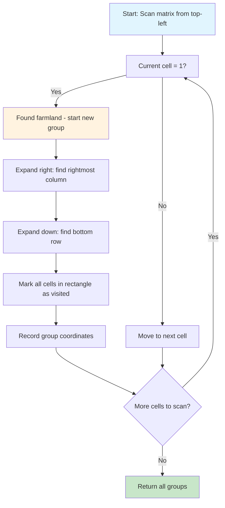
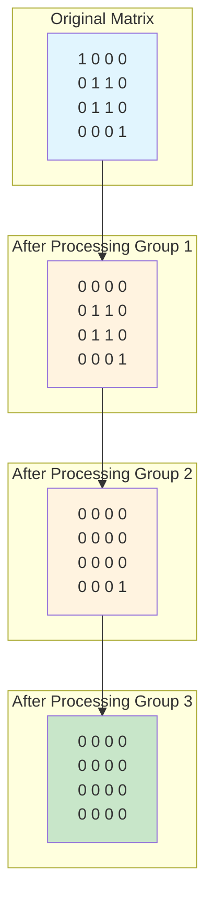

# find-all-groups-of-farmland

## Description

Implementation of the "Find All Groups of Farmland" problem using a greedy rectangular expansion algorithm.

Given a binary matrix where 1 represents farmland and 0 represents forest, finds all rectangular groups of connected farmland. Each group is guaranteed to be rectangular and non-adjacent to other groups.

## Problem Visualization

```mermaid
graph TD
    subgraph "Input Matrix Example"
        M["Matrix:<br/>[[1,0,0,0,0,0,0,0]<br/> [0,1,1,0,0,1,1,0]<br/> [0,1,1,0,0,1,1,0]<br/> [0,0,0,1,0,0,0,0]<br/> [0,0,0,1,0,0,0,0]]"]
    end

    subgraph "Expected Groups"
        G1[Group 1: [0,0,0,0] - Single cell]
        G2[Group 2: [1,1,2,2] - 2×2 rectangle]
        G3[Group 3: [1,5,2,6] - 2×2 rectangle]
        G4[Group 4: [3,3,4,3] - 2×1 rectangle]
    end

    style M fill:#e1f5fe
    style G1 fill:#c8e6c9
    style G2 fill:#c8e6c9
    style G3 fill:#c8e6c9
    style G4 fill:#c8e6c9
```

## Algorithm Flow



## Step-by-Step Execution

```mermaid
graph TD
    subgraph "Step 1: Find First Group at (0,0)"
        S1["Matrix:<br/>[[1,0,0,0]<br/> [0,1,1,0]<br/> [0,1,1,0]<br/> [0,0,0,1]]"]
        S1 --> A1[Scan finds 1 at (0,0)]
        A1 --> B1[Expand right: only (0,0)]
        B1 --> C1[Expand down: only (0,0)]
        C1 --> D1[Group: [0,0,0,0]]
    end

    subgraph "Step 2: Find Second Group at (1,1)"
        S2["Matrix after marking (0,0):<br/>[[0,0,0,0]<br/> [0,1,1,0]<br/> [0,1,1,0]<br/> [0,0,0,1]]"]
        S2 --> A2[Scan finds 1 at (1,1)]
        A2 --> B2[Expand right: (1,1) to (1,2)]
        B2 --> C2[Expand down: (1,1) to (2,2)]
        C2 --> D2[Group: [1,1,2,2]]
    end

    subgraph "Step 3: Find Third Group at (3,3)"
        S3["Matrix after marking (1,1)-(2,2):<br/>[[0,0,0,0]<br/> [0,0,0,0]<br/> [0,0,0,0]<br/> [0,0,0,1]]"]
        S3 --> A3[Scan finds 1 at (3,3)]
        A3 --> B3[Expand right: only (3,3)]
        B3 --> C3[Expand down: only (3,3)]
        C3 --> D3[Group: [3,3,3,3]]
    end

    style S1 fill:#e1f5fe
    style S2 fill:#fff3e0
    style S3 fill:#ffcdd2
    style D1 fill:#c8e6c9
    style D2 fill:#c8e6c9
    style D3 fill:#c8e6c9
```

## Rectangular Expansion Process

```mermaid
graph LR
    subgraph "Right Expansion"
        A1[Start at (r,c)] --> B1[Check (r,c+1)]
        B1 --> C1{Value = 1?}
        C1 -->|Yes| D1[Extend right boundary]
        C1 -->|No| E1[Stop expansion]
        D1 --> F1[Check (r,c+2)]
        F1 --> C1
    end

    subgraph "Down Expansion"
        A2[Right boundary found] --> B2[Check entire next row]
        B2 --> C2{All cells in row = 1?}
        C2 -->|Yes| D2[Extend down boundary]
        C2 -->|No| E2[Stop expansion]
        D2 --> F2[Check next row]
        F2 --> C2
    end

    style A1 fill:#e1f5fe
    style A2 fill:#e1f5fe
    style E1 fill:#c8e6c9
    style E2 fill:#c8e6c9
```

## Matrix State Tracking



## Greedy Strategy Benefits

```mermaid
graph TD
    A[Greedy Rectangular Expansion] --> B[Advantages]
    A --> C[Guarantees]

    B --> B1[Single pass O(m×n) time]
    B --> B2[Constant space O(1) extra]
    B --> B3[Simple implementation]
    B --> B4[No backtracking needed]

    C --> C1[Finds optimal rectangles]
    C --> C2[No overlapping groups]
    C --> C3[Handles all valid inputs]
    C --> C4[Preserves rectangular property]

    style A fill:#e1f5fe
    style B1 fill:#c8e6c9
    style B2 fill:#c8e6c9
    style C1 fill:#c8e6c9
    style C2 fill:#c8e6c9
```

**Algorithm approach**:

1. **Scan the matrix** from top-left to bottom-right
2. **When farmland found** (value 1), start a new rectangular group
3. **Expand the rectangle** by moving right and down to find the complete boundaries
4. **Mark cells as visited** by setting them to 0 during expansion
5. **Record coordinates** as [top-left-row, top-left-col, bottom-right-row, bottom-right-col]

**Key insight**: Since groups are guaranteed to be rectangular and non-adjacent, we can use a greedy approach to expand each rectangle to its maximum size without worrying about complex connectivity patterns.

## Complexity

- Time Complexity: O(m × n) where m and n are the matrix dimensions - each cell is visited exactly once
- Space Complexity: O(m × n) for the matrix copy, plus O(k) for storing k groups in the result

## Usage

```bash
make run n=0039-find-all-groups-of-farmland
```

## Testing

```bash
make test n=0039-find-all-groups-of-farmland
```
