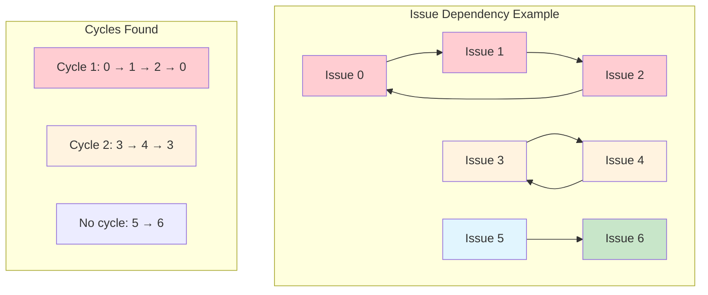
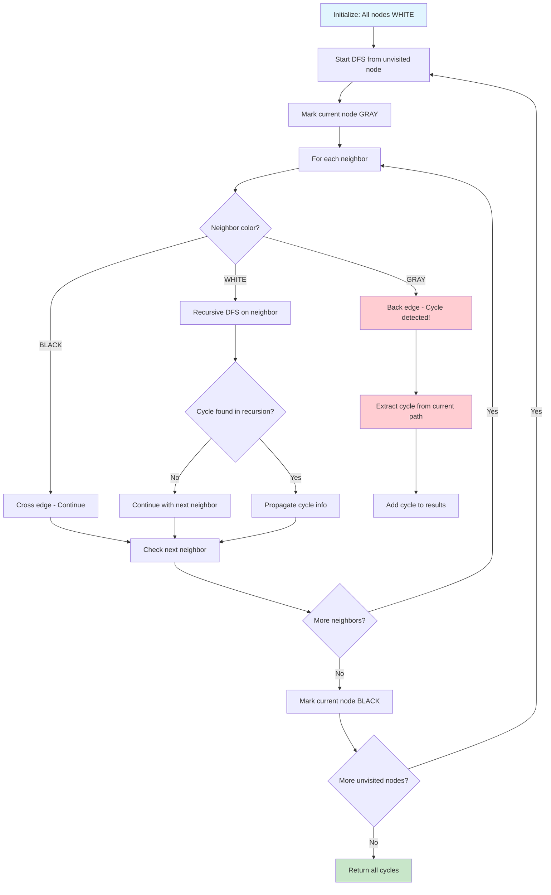
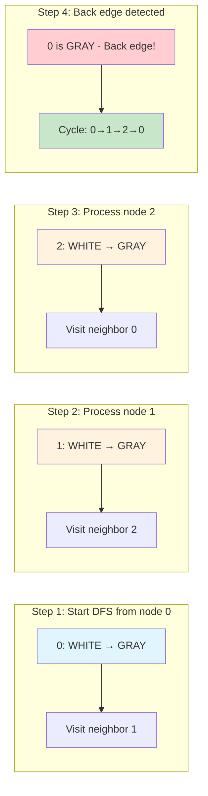
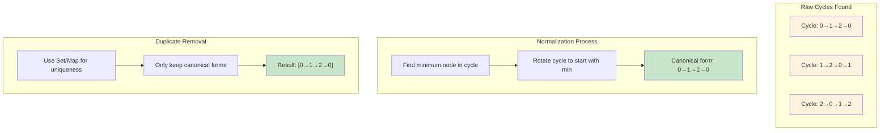
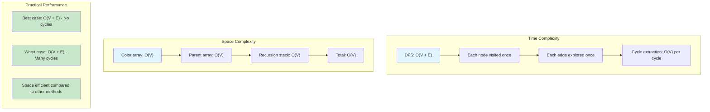

# detect-cycles

## Description

Implementation of cycle detection in directed graphs using Depth-First Search (DFS) with three-color marking.

This solves the issue tracking circular dependency problem where:

- Each issue is a node in a directed graph
- If issue i is blocked by issue j, there's a directed edge from j to i
- We need to find all circular dependency loops

## Graph Representation



## Three-Color DFS Algorithm

```mermaid
graph TD
    subgraph "Color States"
        W["WHITE: Unvisited"] --> G["GRAY: In current path"]
        G --> B["BLACK: Completely processed"]

        W2[Color = 0] --> G2[Color = 1]
        G2 --> B2[Color = 2]
    end

    subgraph "Cycle Detection Logic"
        A["Visit node"] --> B["Mark as GRAY"]
        B --> C["Explore neighbors"]
        C --> D{"Neighbor color?"}
        D -->|WHITE| E["Recursive DFS"]
        D -->|GRAY| F["Back edge found - CYCLE!"]
        D -->|BLACK| G["Cross edge - continue"]
        E --> H["Mark as BLACK"]
        F --> I["Extract cycle path"]
        G --> J["Check next neighbor"]
        H --> J
    end

    style W fill:#ffffff
    style G fill:#e0e0e0
    style B fill:#000000
    style B2 fill:#000000
    style F fill:#ffcdd2
    style I fill:#ffcdd2
```



## Algorithm Flow



## Cycle Extraction Process

```mermaid
graph TD
    subgraph "DFS Stack When Cycle Found"
        S1[Node 0: GRAY] --> S2[Node 1: GRAY]
        S2 --> S3[Node 2: GRAY]
        S3 --> S4[Back edge to Node 0]
    end

    subgraph "Cycle Extraction"
        A["Back edge: 2 → 0"] --> B["Find 0 in current path"]
        B --> C["Extract path from 0 to 2"]
        C --> D["Cycle: 0 → 1 → 2 → 0"]
    end

    subgraph "Parent Tracking"
        E["parent[1] = 0"] --> F["parent[2] = 1"]
        F --> G["Use parent array to rebuild path"]
    end

    style S4 fill:#ffcdd2
    style A fill:#ffcdd2
    style D fill:#c8e6c9
```



## Step-by-Step Execution Example



## Cycle Normalization



## Complexity Analysis



**Algorithm approach**:

1. **Build graph** from blockers matrix - if blockers[i][j] is true, add edge j→i
2. **Three-color DFS** - WHITE (unvisited), GRAY (in current path), BLACK (finished)
3. **Cycle detection** - when we find a back edge to a GRAY node, extract the cycle
4. **Duplicate removal** - normalize cycles and remove duplicates

**Key insight**: Uses the classical DFS cycle detection algorithm where a back edge (edge to an ancestor in the DFS tree) indicates a cycle. The three-color approach ensures we can distinguish between cross edges and back edges.

## Complexity

- Time Complexity: O(V + E) where V is the number of nodes and E is the number of edges
- Space Complexity: O(V) for the color array, parent array, and recursion stack

## Usage

```bash
make run n=0040-detect-cycles
```

## Testing

```bash
make test n=0040-detect-cycles
```
