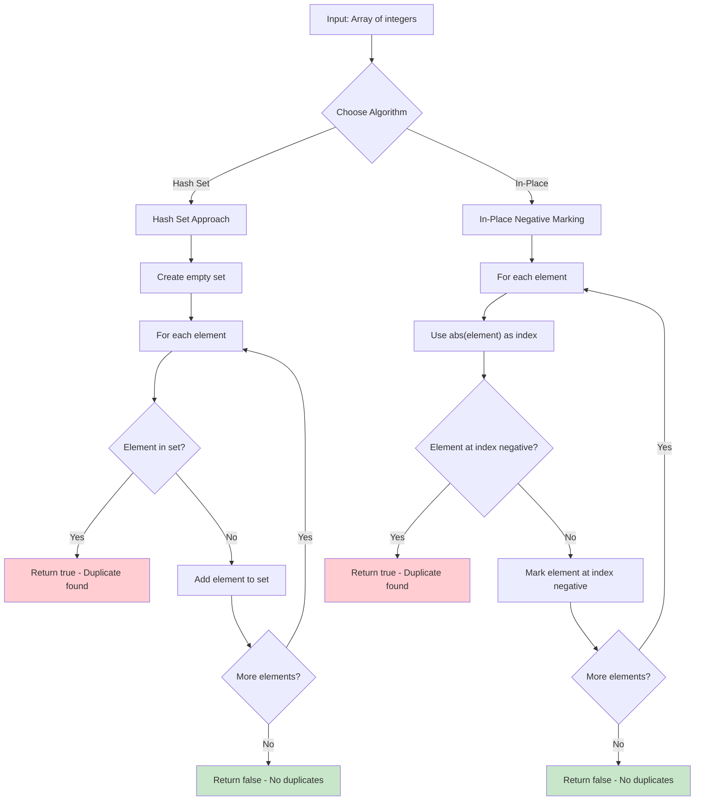
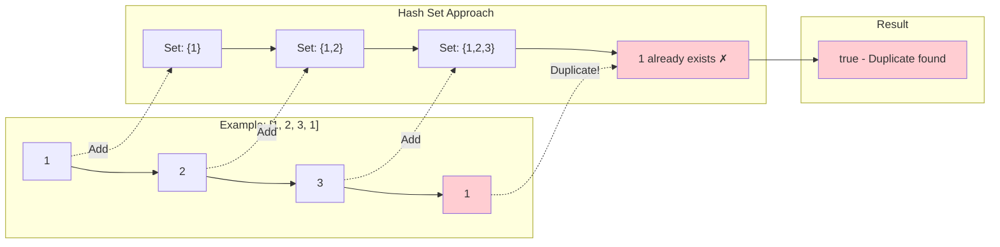

# [Contains Duplicate](https://leetcode.com/problems/contains-duplicate/)

## Description

Implementation of the "Contains Duplicate" problem (LeetCode 217) using two different approaches. Given an integer array, determine if any value appears at least twice in the array, returning true if duplicates exist and false if all elements are distinct.

## Visual Representation





## Algorithms

### 1. Hash Set Approach (Set Length Comparison)

```go
func ContainsDuplicate(nums []int) bool {
    seen := make(map[int]bool)
    for _, num := range nums {
        seen[num] = true
    }
    return len(seen) != len(nums)
}
```

### 2. In-Place Negative Marking (Space Optimized)

```go
func ContainsDuplicateInPlace(nums []int) bool {
    for _, num := range nums {
        index := abs(num)
        if index > 0 && index <= len(nums) {
            if nums[index-1] < 0 {
                return true  // Already marked negative
            }
            nums[index-1] = -nums[index-1]  // Mark as seen
        }
    }
    return false
}
```

## Complexity

### Hash Set Approach

- **Time Complexity**: O(n) - single pass through array
- **Space Complexity**: O(n) - hash set storage

### In-Place Negative Marking

- **Time Complexity**: O(n) - single pass through array
- **Space Complexity**: O(1) - constant extra space
- **Constraint**: Only works when array elements are positive integers ≤ array length

## Usage

```bash
make run n=0041-contains-duplicate
```

```bash
make check n=0041-contains-duplicate
```

## Testing

```bash
make test n=0041-contains-duplicate
```

The test suite includes:

- Problem examples: [1,2,3,1], [1,2,3,4], [1,1,1,3,3,4,3,2,4,2]
- Edge cases: empty arrays, single elements, immediate duplicates
- Both algorithm implementations tested with identical test cases
- Performance benchmarks for both approaches

## When to Use

**Hash Set Approach:**

- ✅ Works with any integer values (negative, zero, large numbers)
- ✅ Clear and intuitive logic
- ✅ No constraints on input values
- ❌ Requires O(n) extra space

**In-Place Negative Marking:**

- ✅ O(1) space complexity
- ✅ No additional data structures needed
- ❌ Limited to positive integers ≤ array length
- ❌ Mutates the input array

**Choose Hash Set when:** Input has negative numbers, large numbers, or space isn't critical
**Choose In-Place when:** Memory is constrained and input meets the positive integer constraint
