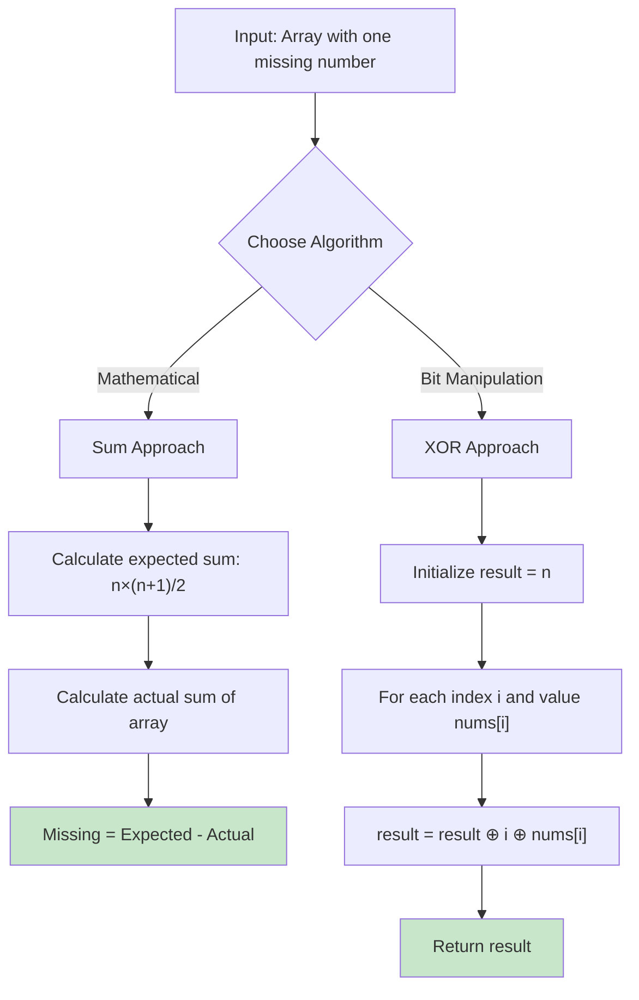
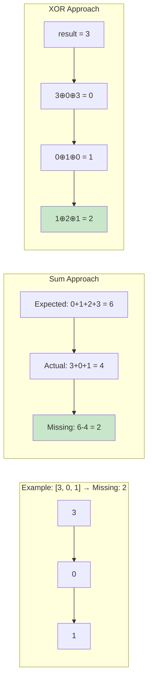
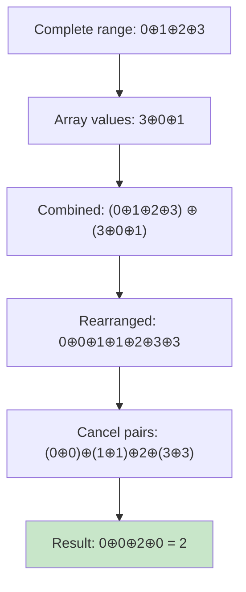

# [Missing Number](https://leetcode.com/problems/missing-number/)

## Description

Implementation of the "Missing Number" problem (LeetCode 268) using two optimal O(1) space approaches. Given an array containing n distinct numbers in the range [0, n], find the only number in the range that is missing from the array.

## Visual Representation





## XOR Mathematical Proof



## Algorithms

### 1. Sum Approach (Mathematical)

```go
func MissingNumberSum(nums []int) int {
    n := len(nums)
    expectedSum := n * (n + 1) / 2  // Sum formula for [0,n]
    actualSum := 0
    for _, num := range nums {
        actualSum += num
    }
    return expectedSum - actualSum
}
```

### 2. XOR Approach (Bit Manipulation)

```go
func MissingNumberXOR(nums []int) int {
    n := len(nums)
    result := n  // Initialize with n to complete [0,n] range
    for i, num := range nums {
        result ^= i ^ num  // XOR with index and value
    }
    return result
}
```

## XOR Properties Used

- **Identity**: `x ⊕ 0 = x`
- **Self-Inverse**: `x ⊕ x = 0`
- **Commutative**: `x ⊕ y = y ⊕ x`
- **Associative**: `(x ⊕ y) ⊕ z = x ⊕ (y ⊕ z)`

## Step-by-Step XOR Example

For array `[3, 0, 1]` (missing 2):

```
Initial: result = 3

i=0, num=3: result = 3 ⊕ 0 ⊕ 3 = 0
i=1, num=0: result = 0 ⊕ 1 ⊕ 0 = 1
i=2, num=1: result = 1 ⊕ 2 ⊕ 1 = 2

Missing number: 2 ✓
```

## Complexity

### Both Approaches

- **Time Complexity**: O(n) - single pass through array
- **Space Complexity**: O(1) - constant extra space

### Trade-offs

**Sum Approach:**

- ✅ Intuitive mathematical approach
- ❌ Potential integer overflow for very large arrays
- ✅ Easy to understand and explain

**XOR Approach:**

- ✅ No risk of integer overflow
- ✅ Elegant bit manipulation
- ❌ Less intuitive for beginners
- ✅ Works with any integer size

## Usage

```bash
make run n=0042-missing-number
```

```bash
make check n=0042-missing-number
```

## Testing

```bash
make test n=0042-missing-number
```

The test suite includes:

- Problem examples: [3,0,1]→2, [0,1]→2, [9,6,4,2,3,5,7,0,1]→8
- Edge cases: single element arrays, missing at boundaries
- Both algorithm implementations tested with identical test cases
- Performance benchmarks comparing both approaches

## When to Use

**Sum Approach:**

- ✅ Straightforward mathematical solution
- ✅ Easy to implement and understand
- ✅ Good for interviews (shows mathematical thinking)
- ⚠️ Watch for integer overflow in very large arrays

**XOR Approach:**

- ✅ Overflow-safe for any array size
- ✅ Demonstrates bit manipulation skills
- ✅ More robust for production systems
- ✅ Shows advanced algorithmic knowledge

**Recommendation:** Use XOR approach for production code, Sum approach for learning and interviews.
