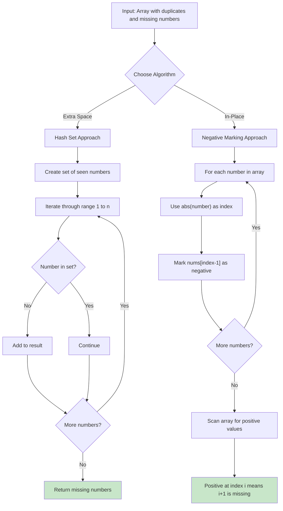
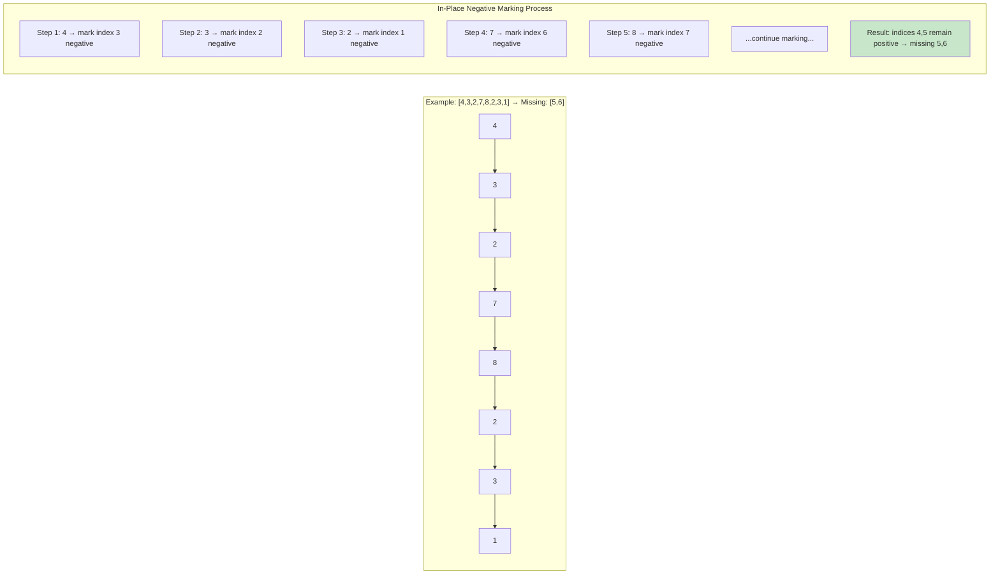
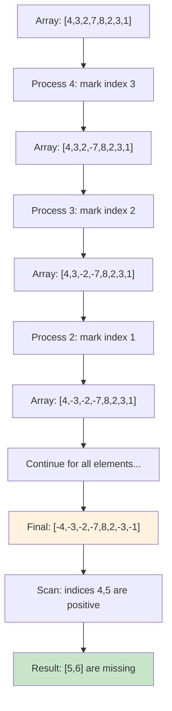

# [Find All Numbers Disappeared in an Array](https://leetcode.com/problems/find-all-numbers-disappeared-in-an-array/)

## Description

Implementation of the "Find All Numbers Disappeared in an Array" problem (LeetCode 448) using two approaches. Given an array nums of n integers where nums[i] is in the range [1, n], return an array of all the integers in the range [1, n] that do not appear in nums.

## Visual Representation





## In-Place Algorithm Step-by-Step



## Algorithms

### 1. Hash Set Approach (Clear and Simple)

```go
func FindDisappearedNumbersHashSet(nums []int) []int {
    seen := make(map[int]bool)
    for _, num := range nums {
        seen[num] = true
    }

    result := []int{}
    for i := 1; i <= len(nums); i++ {
        if !seen[i] {
            result = append(result, i)
        }
    }

    return result
}
```

### 2. In-Place Negative Marking (Space Optimized)

```go
func FindDisappearedNumbersInPlace(nums []int) []int {
    // Mark seen numbers by negating values at corresponding indices
    for _, num := range nums {
        index := abs(num) - 1  // Convert to 0-based index
        if index >= 0 && index < len(nums) && nums[index] > 0 {
            nums[index] = -nums[index]  // Mark as seen
        }
    }

    // Collect indices with positive values (missing numbers)
    result := []int{}
    for i := 0; i < len(nums); i++ {
        if nums[i] > 0 {
            result = append(result, i+1)  // Convert back to 1-based
        }
    }

    return result
}
```

## How In-Place Algorithm Works

1. **Marking Phase**: For each number `num` in the array:

   - Use `abs(num) - 1` as an index (convert 1-based to 0-based)
   - Mark `nums[index]` as negative to indicate the number is present

2. **Collection Phase**: Scan the array:
   - If `nums[i]` is positive, then `i+1` is missing from the original array
   - Add `i+1` to the result

**Key Insight**: We use the array itself as a hash table where the sign indicates presence/absence.

## Complexity

### Hash Set Approach

- **Time Complexity**: O(n) - two passes through the data
- **Space Complexity**: O(n) - hash set storage

### In-Place Negative Marking

- **Time Complexity**: O(n) - two passes through array
- **Space Complexity**: O(1) - only modifies input array (result doesn't count)
- **Constraint**: Input array is modified during processing

## Usage

```bash
make run n=0043-find-all-numbers-disappeared-in-an-array
```

```bash
make check n=0043-find-all-numbers-disappeared-in-an-array
```

## Testing

```bash
make test n=0043-find-all-numbers-disappeared-in-an-array
```

The test suite includes:

- Problem examples: [4,3,2,7,8,2,3,1]→[5,6], [1,1]→[2]
- Edge cases: no missing numbers, all missing except one, single element
- Both algorithm implementations tested with identical test cases
- Performance benchmarks comparing both approaches

## When to Use

**Hash Set Approach:**

- ✅ Input array remains unchanged
- ✅ Clear and intuitive logic
- ✅ Easy to understand and maintain
- ❌ Requires O(n) extra space

**In-Place Negative Marking:**

- ✅ Meets O(1) space requirement (follow-up)
- ✅ Optimal space complexity
- ✅ Clever use of array as hash table
- ❌ Modifies input array
- ❌ More complex logic

**Choose Hash Set when:** You need to preserve the input array or want simpler code
**Choose In-Place when:** Space is critical and you can modify the input (follow-up requirement)
